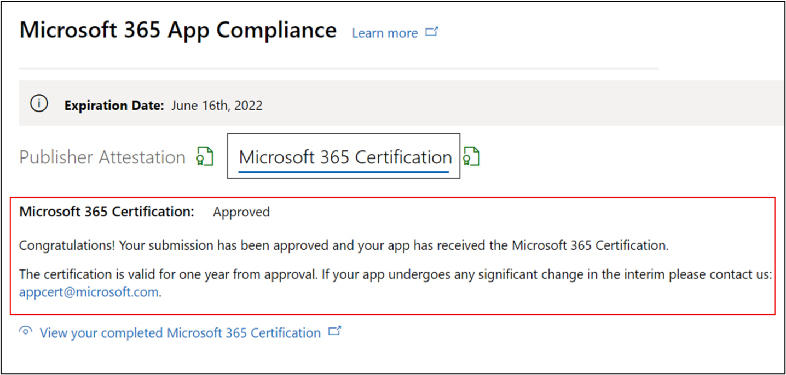

# Guide de l’utilisateur du partenaire pour Microsoft 365 conformité des applications - SaaSPartner's User Guide for Microsoft 365 App Compliance Program - SaaS

|PhasePhase|TitreTitle|
|---|---|
|Étape 1Phase 1| Attestation de l’éditeurPublisher Attestation|
|Étape 2Phase 2| Certification Microsoft 365Microsoft 365 Certification|

## 1. Vue d’ensemble1. Overview 

Ce document agit comme un guide utilisateur pas à pas pour nos partenaires, inscrit au programme de conformité des applications Microsoft 365 visant à faire l’objet d’une attestation et d’une certification Publisher pour leurs applications SaaS, à l’aide du portail de l’Centre partenaires.This document acts as a step-by-step user guide for our partners, enrolled for Microsoft 365 App Compliance program aiming to undergo Publisher Attestation and Certification for their SaaS apps, though the Partner Center portal.

## 2. Acronymes & définitions2. Acronyms & Definitions
|AcronymeAcronym | DéfinitionDefinition |
|----|----|
|[PC (Partner Center)PC (Partner Center)](https://partner.microsoft.com/)|Portail pour tous les partenaires Microsoft.A portal for all Microsoft partners. Un partenaire se connecte à l’Partner Center et soumet un questionnaire d’auto-évaluation.A partner logs in to Partner Center and submits self-assessment questionnaire. Partner Center for [Microsoft 365 App Compliance](https://partner.microsoft.com/dashboard/home)Partner Center for [Microsoft 365 App Compliance](https://partner.microsoft.com/dashboard/home)|
|ISVISV | Independent Software Vendor a.k.a.Independent Software Vendor a.k.a. Partenaire ou développeurPartner or Developer |
|Source de l’applicationApp Source | Catalogue d’applicationsCatalog of apps |
|ExempleExample |[Agent virtuel désormaisNow virtual agent](https://appsource.microsoft.com/product/office/WA104381816)|

## 3. Flux Publisher attestation d’attestation3. Publisher Attestation Workflow

**Page d’accueil**: il s’agit de la page d’accueil une fois qu’un partenaire se connecte à l’Partner Center.**Home Page**: This is the landing page once a partner logs in to Partner Center.

  
**Étape 1 :** sur le côté gauche de la page, dans la barre de navigation :**Step 1** : On the left side of the page, on the navigation bar:

- Sélectionner Commercial MarketplaceSelect Commercial Marketplace
- Sélection d’une vue d’ensembleSelect Overview

  
Lorsque vous sélectionnez « Vue d’ensemble », le partenaire peut voir la liste des applications disponibles pour démarrer le programme Microsoft 365 conformité.Upon selecting ‘Overview’, partner can see list of apps available to start the Microsoft 365 Compliance program.
  
**Étape 2**: sélectionnez une application dans la liste pour commencer le processus Publisher attestation.**Step 2**: Select an app from the list to begin the Publisher Attestation process.

Lors de la sélection d’une application, une autre barre de navigation apparaît avec l’option « Conformité des applications ».On selecting an app, another navigation bar will pop up with option ‘App Compliance’.
  
**Étape 3 :** sélectionnez « Conformité des applications »**Step 3**: Select 'App Compliance’
  

  
**Étape 4 :** remplissez le questionnaire d’auto-évaluation pour obtenir Publisher attestation.**Step 4**: Fill out the self-assessment questionnaire for Publisher Attestation.

  
**REMARQUE Si vous revenir pour mettre à jour/soumettre à nouveau votre application, cliquez sur la liste de listes pour « Choisir le produit » et sélectionnez l’application, puis cliquez sur « Cloner ».****NOTE If you are coming back to update/re-submit your application, click dropdown for ‘Choose the product’, select the app and click ‘Clone’.**

**Vous pouvez également tirer parti de la Import/Export pour terminer le formulaire hors connexion et l’importer une fois terminé.****You can also leverage the Import/Export feature to complete the form offline and import it once completed.**

 
**Étape 5 :** une fois terminée, cliquez sur « Envoyer ». L’évaluation sera désormais « En cours de révision ».**Step 5**: Once completed, click on ‘Submit’, the assessment will now be ‘Under Review’.
 
  soumission  
  
**Scénarios d’approbation/de rejet :****Approve/Reject Scenarios:**
  
R :A. Publisher Refus d’attestationPublisher Attestation Rejection
- En cas de rejet, un partenaire peut :In case of rejection, a partner can:
     - Afficher le rapport d’échecView failure report
          - Le partenaire sera averti par courrier électronique et pourra afficher le rapport d’échec dans l’Partner CenterPartner will be notified via email, and they can view the failure report in Partner Center
     - Mettez à jour et soumettez de nouvelles réponses au questionnaire d’auto-évaluation.Update and re-submit self-assessment questionnaire.
        

B.B.  Publisher Approbation de l’attestationPublisher Attestation Approval
- Lors de l’approbation, le partenaire peut :Upon approval, the partner can:
     - Mettre à jour et resoumettre l’attestationUpdate and resubmit attestation
     - Afficher l’attestation d’Publisher terminéeView completed Publisher Attestation
     - Démarrer le processus Microsoft 365 certificationStart the Microsoft 365 Certification process
        
        
  
 
  
**Publier Publisher approbation d’attestation : exemple de lien dans AppSource pour les applications avec attestation d’éditeur.****Post Publisher Attestation Approval: Example of link in AppSource for publisher attested apps.**
  

   
## 4. Flux de Microsoft 365 certification4.   Microsoft 365 Certification Workflow
  
Un partenaire peut commencer le processus de certification en cocher la case et en cliquant sur « Envoyer »A partner can begin the Certification process by selecting the checkbox and clicking ‘Submit’
  
 
  
**Étape 1 :** Envoi initial du document**Step 1** : Initial Document Submission

Remplissez tous les détails, téléchargez les documents pertinents et cliquez sur « Envoyer »Fill out all the details, upload relevant documents and click ‘Submit’
  
 
  

  
En cliquant sur Envoyer, l’envoi initial du document est en cours d’examen.On clicking submit, the initial document submission will be under review.

  
Un analyste demande une révision au cas où les documents initiaux ne sont pas suffisants ou pertinents.An analyst requests a revision in case the initial documents are not sufficient or relevant. L’analyste travaillera avec le partenaire pour obtenir les documents nécessaires pour approbation.The analyst will work with the partner to help get the right documents for approval.

Une fois que l’analyste a approuvé la soumission initiale du document, le partenaire doit soumettre les exigences de contrôle.Once the analyst approves the initial document submission, the partner needs to submit the control requirements.
  
**Étape 2 :** Contrôler l’envoi des conditions requises**Step 2**: Control Requirement Submission
  
Remplissez tous les détails, téléchargez les documents pertinents et cliquez sur « Envoyer »Fill out all the details, upload relevant documents and Click ‘Submit’

  

 
En cliquant sur Envoyer, la soumission initiale du document est en cours d’examen.On clicking Submit, the initial document submission will be under review.

  
Un analyste demande une révision au cas où les documents requis pour le contrôle ne sont pas suffisants ou pertinents.An analyst requests a revision in case the control requirement documents are not sufficient or relevant. L’analyste travaillera avec le partenaire pour obtenir les documents nécessaires pour approbation.The analyst will work with the partner to help get the right documents for approval.

  
 
 
Si la soumission ne répond pas aux normes d’approbation, l’analyste rejettera la soumission.In case the submission does not satisfy the approval standards, the analyst will reject the submission.
  
Le partenaire peut travailler avec l’analyste pour fournir les informations et les documents pertinents.The partner can work with the analyst to provide the relevant information and documents.

  
Une fois toutes les normes de sécurité respectées, l’analyste approuve la soumission et le partenaire Microsoft 365 certifié.Once all the security standards have been met, the analyst will approve the submission and the partner will be Microsoft 365 Certified.

  
**Approbation après certification : exemple d’Microsoft 365 de certification dans AppSource.****Post Certification Approval: Example of Microsoft 365 certification badge in AppSource.** 

 
## 5. Flux Microsoft 365 de renouvellement :5.   Microsoft 365 Renewal Workflow:
  
**Microsoft 365Publisher de renouvellement de l’attestation et de la certification :****Microsoft 365 Publisher Attestation and Certification Renewal Workflow:**  

Microsoft 365 Le programme de conformité des applications propose désormais un processus de renouvellement annuel.Microsoft 365 App Compliance program now offers an annual renewal process. Au cours de ce processus, les développeurs d’applications peuvent mettre à jour Publisher questionnaire d’attestation et les documents requis pour Microsoft 365 certification.During this process, app developers can update their existing Publisher Attestation questionnaire and documents required for Microsoft 365 Certification. 
 
**Avantages :****Benefits:** 

- Conservez votre badge de certification dans AppSource, le Office Store, Teams Store et différents portails d’administration pour différencier votre application des autres.Maintain your certification badge in AppSource, the Office Store, the Teams Store and various admin portals to differentiate your app from others. 
- Augmentez la confiance des clients à l’aide de votre application certifiée.Increase customer confidence in using your certified app. 
- Aidez les administrateurs informatiques à prendre des décisions éclairées avec des informations de certification mises à jour.Help IT admins make informed decisions with updated certification information.

Le nouveau processus de renouvellement est disponible dans [l’Partner Center](https://partner.microsoft.com/dashboard/home) pour offrir une expérience transparente.The new renewal process is available in [Partner Center](https://partner.microsoft.com/dashboard/home) to provide a seamless experience. Un rappel de renouvellement s’affiche dans l’Partner Center à partir de 90 jours avant la date d’expiration.A renewal reminder will be shown in Partner Center starting 90 days before the expiration date. Les rappels périodiques sont également envoyés par courrier électronique à 90, 60 et 30 jours avant l’expiration.Periodic reminders will also be sent via email at 90, 60 and 30 days before expiration. 
 
**Phase 1 : renouvellement Publisher attestation d’attestation :****Phase 1: Publisher Attestation Renewal:**
  
Les réponses de l’attestation Publisher de l’application doivent être resoumises sur une base annuelle.The app’s Publisher Attestation answers will need to be resubmitted on an annual basis. Lorsque l’attestation approche de la marque d’un an, un rappel par courrier électronique vous encourage à la resoumission de l’attestation.When the attestation nears the 1-year mark, an email reminder will be sent encouraging a resubmission of the attestation. 
 
**Étape 1 :** **sélectionnez Renouveler** pour renouveler l Publisher attestation.**Step 1**: Select **Renew** to renew the Publisher Attestation.
  

  
**Étape 2 :** examinez les réponses de l’attestation Publisher précédente et mettez à jour les dernières informations selon vos besoins.**Step 2**: Review the previous Publisher Attestation answers and update with the latest information as needed. 
  
Soumettez Publisher attestation de renouvellement lorsque vous êtes prêt.Submit Publisher Attestation for renewal when ready. Il sera examiné par un analyste de conformité des applications M365.It will be reviewed by an M365 App Compliance analyst.

  
**Publisher Renouvellement de l’attestation approuvé :****Publisher Attestation Renewal Approved:**
  

  
**Publisher Attestation expirée :****Publisher Attestation Expired:**
  
Les informations de l’application doivent être renouvelés avant la date d’expiration pour conserver la page d’attestation Publisher de l’application dans les documents Microsoft. Le renouvellement opportun garantit également la poursuite du badging et des icônes pour l’application dans différentes boutiques.The app’s information needs to be renewed before the expiration date to maintain the app’s Publisher Attestation page on the Microsoft docs. Timely renewal will also ensure continued badging and icons for the app in various storefronts. 
 

**Remarque**: une fois expiré, Publisher processus de renouvellement de l’attestation d’attestation peuvent être démarrés à tout moment en cliquant sur « Renouveler ».**Note**: Once expired, Publisher Attestation renewal process can be started anytime by clicking ‘Renew’.
 
**Phase 2 : renouvellement Microsoft 365 certification****Phase 2: Microsoft 365 Certification Renewal**
  
Les informations de certification de l’application doivent être resoumises sur une base annuelle.The app’s certification information needs to be resubmitted on an annual basis. Cela nécessitera la revalidation des contrôles dans l’étendue de votre environnement actuel.This will require revalidation of the in-scope controls of your current environment. Lorsque la certification approche de la marque d’un an, une notification par courrier électronique est envoyée pour encourager la resoumission des documents et des preuves.When the Certification nears 1-year mark an email notification will be sent encouraging a resubmission of the documents and evidence.
 
 

**Scénarios d’approbation/de rejet du renouvellement de certification :****Certification Renewal Approve/Reject Scenarios:**

**Scénario 1 :****Scenario 1:** 

Le renouvellement de la certification a démarré et est en cours d’examen.Certification renewal has started and is under review.
 
 

Scénario 1A :Scenario 1A: 

Rejet du renouvellement de certification :Certification renewal rejection: 
- La certification peut être rejetée si :Certification may be rejected if: 
     - L’application n’a pas les outils, processus ou configurations requis en place et ne peut pas implémenter les modifications requises dans la fenêtre de certification.The app does not have the required tooling, processes, or configurations in place and will not be able to implement required changes within the certification window. 
     - L’application présente des vulnérabilités en suspens et ne peut pas être corrigée dans la fenêtre de certification.The app has outstanding vulnerabilities in place and cannot be fixed within the certification window. 
 

Scénario 1B :Scenario 1B: 

Le renouvellement de la certification est approuvéCertification renewal is approved

**Expiration de la certification :****Certification Expiration:**

Les informations de l’application doivent être renouvelés avant la date d’expiration pour conserver la page certification de l’application dans les documents Microsoft. Le renouvellement opportun garantit également la poursuite du badging et des icônes pour l’application dans AppSource et Team Store.The app’s information needs to be renewed before the expiration date to maintain app’s Certification page on the Microsoft docs. Timely renewal will also ensure continued badging and icons for the app in AppSource and Team Store.

  
Remarque : une fois expiré, Publisher processus d’attestation et de certification peut être démarré à tout moment en cliquant sur « Renouveler ».Note: Once expired, Publisher Attestation and Certification process can be started anytime by clicking ‘Renew’. 
