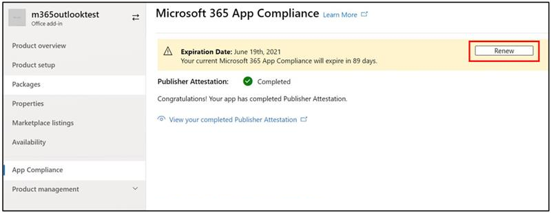

# Guide d’utilisation du partenaire pour le programme Microsoft 365 conformité aux applicationsPartner's User Guide for Microsoft 365 App Compliance Program

|||
|---|---|
|Niveau 1Tier 1| Attestation de l’éditeurPublisher Attestation|
|Niveau 2Tier 2| Certification Microsoft 365Microsoft 365 Certification|

## 1. Vue d’ensemble1. Overview
Ce document agit comme un guide d’utilisation étape par étape pour nos partenaires, inscrits au programme de conformité des applications Microsoft 365 visant à subir une attestation et une certification Publisher par l’œil du portail du Centre partenaire.This document acts as a step-by-step user guide for our Partners, enrolled for Microsoft 365 App Compliance Program aiming to undergo Publisher Attestation and Certification though Partner Center portal.

## 2. Acronymes & définitions2. Acronyms & Definitions
| | |
|---|----|
|AcronymeAcronym | DéfinitionDefinition |
|PC (Centre partenaire)PC (Partner Center)|Un portail pour tous les partenaires Microsoft.A portal for all Microsoft Partners. Un partenaire se connecte au Partner Center et soumet Self-Assessment questionnaire https://partner.microsoft.com/A Partner logs in to Partner Center and submits Self-Assessment Questionnaire https://partner.microsoft.com/|
|ISVISV|Fournisseur de logiciels indépendant aliasIndependent Software Vendor A.k.a. Partenaire ou développeurPartner or Developer|
|Source de l’applicationApp Source| Catalogue d’applications (https://appsource.microsoft.com/)Catalog of apps (https://appsource.microsoft.com/)
||Exemple: Maintenant agent virtuel (https://appsource.microsoft.com/en-us/product/office/WA104381816)Example: Now virtual agent (https://appsource.microsoft.com/en-us/product/office/WA104381816)|

## 3. Flux de travail Publisher attestation de l’attestation3.   Publisher Attestation Workflow

Page d’accueil : Il s’agit de la page de destination une fois qu’un partenaire se connecte au Centre partenaire.Home Page: This is the landing page once a partner logs in to Partner Center.

**Étape 1**   : Sur le côté gauche de la page, dans la barre de navigation :**Step 1**   : On the left side of the page, in the navigation bar:
1. Sélectionnez Office magasinSelect Office store
1. Sélectionnez Vue d’ensembleSelect Overview

Lors de la sélection de « Aperçu », le partenaire peut voir la liste des applications soumises par l’intermédiaire du Partner Center et disponibles pour le Microsoft 365 de conformité.Upon selecting ‘Overview’, partner can see list of apps submitted through Partner Center and available for the Microsoft 365 Compliance program.

**Étape 2** : Sélectionnez une application de la liste pour commencer le processus Publisher’attestation.**Step 2** : Select an app from the list to begin the Publisher Attestation process.

Lors de la sélection d’une application, une autre barre de navigation apparaîtra avec l’option « Conformité app »On selecting an app, another navigation bar will pop up with option ‘App Compliance’

**Étape 3 :** Sélectionnez « Conformité aux applications »**Step 3**: Select ‘App Compliance’

**Étape 4**: Remplir le questionnaire Self-Assessment pour l’attestation Publisher’attestation**Step 4**: Fill out the Self-Assessment Questionnaire for Publisher Attestation

**Remarque**: Si vous revenez pour mettre à jour/soumettre à nouveau votre demande, cliquez sur dropdown pour 'Choisissez le produit', sélectionnez l’application et cliquez sur 'clone'.**Note**:If you are coming back to update/re-submit your application, click dropdown for ‘Choose the product’, select the app and click ‘clone’.

 

Vous pouvez également tirer parti de la Import/Export pour remplir le formulaire hors ligne et l’importer une fois terminé.You can also leverage the Import/Export feature to complete the form offline and import it once completed. 

**Étape 5**: Une fois terminée, cliquez sur « Soumettre », l’évaluation sera maintenant « à l’étude ».**Step 5**: Once completed, click on ‘Submit’, the assessment will now be ‘under review’.

### Approuver/rejeter les scénarios :Approve/Reject Scenarios:

**Rejet de l’attestation Publisher A.Publisher****A.Publisher Attestation Rejection**

En cas de rejet à ce stade, un partenaire peut :In case of rejection at this stage, an partner can:
-   Afficher le rapport d’échec.View failure report.
    - Le partenaire sera informé au Partner Center et par e-mail.Partner will be notified in Partner Center and via email.
-   Mise à Self-Assessment réponses.Update Self-Assessment responses.
-   Soumettre à nouveau l’auto-évaluation.Re-submit Self-Assessment.

**B.Publisher attestation De nouveau soumission****B.Publisher Attestation Re-submission**

**Approbation de l’attestation Publisher C.Publisher****C.Publisher Attestation Approval**

-   Dès l’approbation, le partenaire peut :Upon approval partner can:
    - Mise à jour et attestation de nouveauUpdate and resubmit attestation
    - Afficher et partager les Publisher attestationView and share completed Publisher Attestation
    - Démarrer le processus de certification M365Start M365 Certification Process

**Approbation de Publisher post-vérification : exemple de lien dans AppSource pour les applications attestées par l’éditeur****Post Publisher Verification Approval: Example of link in AppSource for publisher attested apps**

## 4. Flux de travail Microsoft 365 certification de l’eau4. Microsoft 365 Certification Workflow

Une fois que le partenaire clique sur « Soumettre » et soumet tous les documents et preuves pour examen:Once partner clicks on ‘Submit’ and submits all documents and evidence for review: 

### Microsoft 365 Certification - SoumisMicrosoft 365 Certification - Submitted

**Microsoft 365 certification - Rejeté****Microsoft 365 certification - Rejected**

**Microsoft 365 Certification - Approuvée****Microsoft 365 Certification - Approved**

**Approbation de certification post: Exemple de badge Microsoft 365 certification dans AppSource****Post Certification Approval: Example of Microsoft 365 certification badge in AppSource**

## 5. Flux de travail pour les ISV existants5. Workflow for Existing ISVs

Si vous êtes un ISV existant et que vous souhaitez mettre à jour Publisher attestation.If you are an existing ISV and want to Update Publisher Attestation.

**Étape 1**: Cliquez sur le lien « Mise à jour et Publisher attestation » de votre formulaire.**Step 1**: Click on ‘Update and re-submit your Publisher Attestation’ link.

**Remarque :** Si vous revenez pour mettre à jour/soumettre à nouveau votre demande, cliquez sur dropdown pour 'Choisissez le produit', sélectionnez l’application et cliquez sur 'Import'.**Note:**: If you are coming back to update/re-submit your application, click dropdown for ‘Choose the product’, select the app and click ‘Import’.

**Étape 2 :** Faites des mises à jour de votre formulaire et cliquez sur Enregistrer/Soumettre.**Step 2**: Make updates to your form and click Save/Submit.

Une fois soumis, il sera à l’étude.Once submitted, it will be under review.

## 6. Microsoft 365 Publisher attestation et renouvellement de certification :6.   Microsoft 365 Publisher Attestation and Certification Renewal Workflow:

Microsoft 365 Le Programme de conformité aux applications offre maintenant un processus de renouvellement annuel.Microsoft 365 App Compliance Program now offers an annual renewal process. Au cours de ce processus, les développeurs d’applications peuvent mettre à jour leur questionnaire Publisher’attestation et les documents nécessaires à Microsoft 365 certification.During this process, app developers can update their existing Publisher Attestation questionnaire and documents required for Microsoft 365 Certification. 

**Avantages:****Benefits:**

- Maintenez votre badge de certification dans AppSource et Team Store pour différencier votre application des autres.Maintain your certification badge in AppSource and Team Store to differentiate your app from others. 
- Augmentez la confiance des clients dans l’utilisation de votre application certifiée.Increase customer confidence in using your certified app. 
- Aidez les administrateurs informatique à prendre des décisions éclairées avec des informations de certification mises à jour.Help IT admins make informed decisions with updated certification information. 

Le nouveau processus de renouvellement est disponible au [Partner Center](https://partner.microsoft.com/en-us/dashboard/home) pour offrir une expérience transparente.The new renewal process is available in [Partner Center](https://partner.microsoft.com/en-us/dashboard/home) to provide a seamless experience. Un rappel de renouvellement sera affiché dans le Centre partenaire à partir de 90 jours avant la date d’expiration.A renewal reminder will be shown in Partner Center starting 90 days before the expiration date. Des rappels périodiques seront également envoyés par courriel à 90, 60 et 30 jours avant l’expiration.Periodic reminders will also be sent via email at 90, 60 and 30 days before expiration.

**Niveau 1 : Renouvellement Publisher attestation des enfants :****Tier 1: Publisher Attestation Renewal:** 

Les réponses d’Publisher’attestation de l’application devront être soumettre à nouveau sur une base annuelle.The app’s Publisher Attestation answers will need to be resubmitted on an annual basis. Lorsque l’attestation approche de la marque d’un an, un rappel par courriel sera envoyé pour encourager une nouvelle sous-demande d’attestation.When the attestation nears 1-year mark, an email reminder will be sent encouraging a resubmission of the attestation. 

**Étape 1**: Sélectionnez **Renouveler** pour renouveler l’attestation Publisher’attestation.**Step 1**: Select **Renew** to renew the Publisher Attestation. 

**Étape 2 :** Passez en revue les réponses Publisher attestation et mettez à jour les dernières informations au besoin.**Step 2**: Review the previous Publisher Attestation answers and update with the latest information as needed. Soumettez Publisher attestation pour renouvellement lorsque vous êtes prêt.Submit Publisher Attestation for renewal when ready. Il sera examiné par un analyste de la conformité des applications M365.It will be reviewed by an M365 App Compliance Analyst.

**Publisher attestation expire :** Les informations de l’application doivent être renouvelées avant la date d’expiration pour maintenir la page d’attestation Publisher’application sur les documents Microsoft. Le renouvellement en temps opportun assurera également la poursuite des badgings et des icônes pour l’application dans AppSource et Team Store.**Publisher Attestation Expired:** The app’s information needs to be renewed before the expiration date to maintain the app’s Publisher Attestation page on the Microsoft docs. Timely renewal will also ensure continued badging and icons for the app in AppSource and Team Store.

Remarque : Une fois expiré, le processus Publisher de renouvellement de l’attestation peut être démarré à tout moment en cliquant sur « Renouveler ».Note: Once expired, Publisher Attestation renewal process can be started anytime by clicking ‘Renew’. 

**Niveau 2 : Renouvellement Microsoft 365 certification des véhicules****Tier 2: Microsoft 365 Certification Renewal** 

Les informations de certification de l’application doivent être soumettre à nouveau sur une base annuelle.The app’s certification information needs to be resubmitted on an annual basis. Cela nécessitera une revalidation des contrôles dans la portée de votre environnement actuel.This will require revalidation of the in-scope controls of your current environment. Lorsque la certification approche d’un an, un avis par courriel sera envoyé encourageant une nouvelle sous-demande des documents et des éléments de preuve.When the Certification nears 1-year mark an email notification will be sent encouraging a resubmission of the documents and evidence. 

**Renouvellement de la certification Approuver/rejeter les scénarios :****Certification Renewal Approve/Reject Scenarios:**

**Scénario 1 :****Scenario 1:** 

Publisher L’attestation est complète.Publisher Attestation  is complete. Le renouvellement de la certification a commencé et fait l’objet d’un examen.Certification renewal has started and under review. 

**Scénario 1A:****Scenario 1A:**

Rejet du renouvellement de certification : La certification peut être rejetée si :Certification renewal rejection: Certification may be rejected if: 

 - L’application n’a pas mis en place les outils, processus ou configurations requis et ne sera pas en mesure d’implémenter les modifications requises dans la fenêtre de certification.The app does not have the required tooling, processes, or configurations in place and will not be able to implement required changes within the certification window. 
 - L’application a des vulnérabilités exceptionnelles en place et ne peut pas être corrigée dans la fenêtre de certification.The app has outstanding vulnerabilities in place and cannot be fixed within the certification window. 

    
**Scénario 1B:****Scenario 1B:** 

Le renouvellement de la certification est approuvéCertification renewal is approved  

**Expiration de la certification:****Certification Expiration:**

Les informations de l’application doivent être renouvelées avant la date d’expiration pour maintenir la page certification de l’application sur les documents Microsoft. Le renouvellement en temps opportun assurera également la poursuite des badgings et des icônes pour l’application dans AppSource et Team Store.The app’s information needs to be renewed before the expiration date to maintain app’s Certification page on the Microsoft docs. Timely renewal will also ensure continued badging and icons for the app in AppSource and Team Store. 

    
**Remarque**: Une fois expiré, le Publisher attestation et de certification peut être démarré à tout moment en cliquant sur « Renouveler ».**Note**: Once expired, Publisher Attestation and Certification process can be started anytime by clicking ‘Renew’. 

