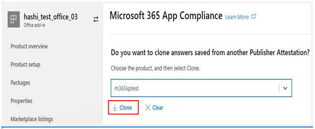
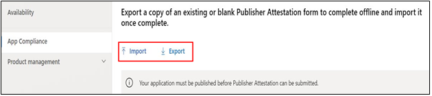

# Guide d’utilisation du partenaire pour le programme Microsoft 365 conformité aux applications

|||
|---|---|
|Niveau 1| Attestation de l’éditeur|
|Niveau 2| Certification Microsoft 365|

## 1. Vue d’ensemble
Ce document agit comme un guide d’utilisation étape par étape pour nos partenaires, inscrits au programme de conformité des applications Microsoft 365 visant à subir une attestation et une certification Publisher par l’œil du portail du Centre partenaire.

## 2. Acronymes & définitions
| | |
|---|----|
|Acronyme | Définition |
|PC (Centre partenaire)|Un portail pour tous les partenaires Microsoft. Un partenaire se connecte au Partner Center et soumet Self-Assessment questionnaire https://partner.microsoft.com/|
|ISV|Fournisseur de logiciels indépendant alias Partenaire ou développeur|
|Source de l’application| Catalogue d’applications (https://appsource.microsoft.com/)
||Exemple: Maintenant agent virtuel (https://appsource.microsoft.com/en-us/product/office/WA104381816)|

## 3. Flux de travail Publisher attestation de l’attestation

Page d’accueil : Il s’agit de la page de destination une fois qu’un partenaire se connecte au Centre partenaire.

**Étape 1**   : Sur le côté gauche de la page, dans la barre de navigation :
1. Sélectionnez Office magasin
1. Sélectionnez Vue d’ensemble

Lors de la sélection de « Aperçu », le partenaire peut voir la liste des applications soumises par l’intermédiaire du Partner Center et disponibles pour le Microsoft 365 de conformité.

**Étape 2** : Sélectionnez une application de la liste pour commencer le processus Publisher’attestation.

Lors de la sélection d’une application, une autre barre de navigation apparaîtra avec l’option « Conformité app »

**Étape 3 :** Sélectionnez « Conformité aux applications »

**Étape 4**: Remplir le questionnaire Self-Assessment pour l’attestation Publisher’attestation

**Remarque**: Si vous revenez pour mettre à jour/soumettre à nouveau votre demande, cliquez sur dropdown pour 'Choisissez le produit', sélectionnez l’application et cliquez sur 'clone'.

 

Vous pouvez également tirer parti de la Import/Export pour remplir le formulaire hors ligne et l’importer une fois terminé. 

**Étape 5**: Une fois terminée, cliquez sur « Soumettre », l’évaluation sera maintenant « à l’étude ».

### Approuver/rejeter les scénarios :

**Rejet de l’attestation Publisher A.Publisher**

En cas de rejet à ce stade, un partenaire peut :
-   Afficher le rapport d’échec.
    - Le partenaire sera informé au Partner Center et par e-mail.
-   Mise à Self-Assessment réponses.
-   Soumettre à nouveau l’auto-évaluation.

**B.Publisher attestation De nouveau soumission**

**Approbation de l’attestation Publisher C.Publisher**

-   Dès l’approbation, le partenaire peut :
    - Mise à jour et attestation de nouveau
    - Afficher et partager les Publisher attestation
    - Démarrer le processus de certification M365

**Approbation de Publisher post-vérification : exemple de lien dans AppSource pour les applications attestées par l’éditeur**

## 4. Flux de travail Microsoft 365 certification de l’eau

Une fois que le partenaire clique sur « Soumettre » et soumet tous les documents et preuves pour examen: 

### Microsoft 365 Certification - Soumis

**Microsoft 365 certification - Rejeté**

**Microsoft 365 Certification - Approuvée**

**Approbation de certification post: Exemple de badge Microsoft 365 certification dans AppSource**

## 5. Flux de travail pour les ISV existants

Si vous êtes un ISV existant et que vous souhaitez mettre à jour Publisher attestation.

**Étape 1**: Cliquez sur le lien « Mise à jour et Publisher attestation » de votre formulaire.

**Remarque :** Si vous revenez pour mettre à jour/soumettre à nouveau votre demande, cliquez sur dropdown pour 'Choisissez le produit', sélectionnez l’application et cliquez sur 'Import'.

**Étape 2 :** Faites des mises à jour de votre formulaire et cliquez sur Enregistrer/Soumettre.

Une fois soumis, il sera à l’étude.

## 6. Microsoft 365 Publisher attestation et renouvellement de certification :

Microsoft 365 Le Programme de conformité aux applications offre maintenant un processus de renouvellement annuel. Au cours de ce processus, les développeurs d’applications peuvent mettre à jour leur questionnaire Publisher’attestation et les documents nécessaires à Microsoft 365 certification. 

**Avantages:**

- Maintenez votre badge de certification dans AppSource et Team Store pour différencier votre application des autres. 
- Augmentez la confiance des clients dans l’utilisation de votre application certifiée. 
- Aidez les administrateurs informatique à prendre des décisions éclairées avec des informations de certification mises à jour. 

Le nouveau processus de renouvellement est disponible au [Partner Center](https://partner.microsoft.com/en-us/dashboard/home) pour offrir une expérience transparente. Un rappel de renouvellement sera affiché dans le Centre partenaire à partir de 90 jours avant la date d’expiration. Des rappels périodiques seront également envoyés par courriel à 90, 60 et 30 jours avant l’expiration.

**Niveau 1 : Renouvellement Publisher attestation des enfants :** 

Les réponses d’Publisher’attestation de l’application devront être soumettre à nouveau sur une base annuelle. Lorsque l’attestation approche de la marque d’un an, un rappel par courriel sera envoyé pour encourager une nouvelle sous-demande d’attestation. 

**Étape 1**: Sélectionnez **Renouveler** pour renouveler l’attestation Publisher’attestation. 

**Étape 2 :** Passez en revue les réponses Publisher attestation et mettez à jour les dernières informations au besoin. Soumettez Publisher attestation pour renouvellement lorsque vous êtes prêt. Il sera examiné par un analyste de la conformité des applications M365.

**Publisher attestation expire :** Les informations de l’application doivent être renouvelées avant la date d’expiration pour maintenir la page d’attestation Publisher’application sur les documents Microsoft. Le renouvellement en temps opportun assurera également la poursuite des badgings et des icônes pour l’application dans AppSource et Team Store.

Remarque : Une fois expiré, le processus Publisher de renouvellement de l’attestation peut être démarré à tout moment en cliquant sur « Renouveler ». 

**Niveau 2 : Renouvellement Microsoft 365 certification des véhicules** 

Les informations de certification de l’application doivent être soumettre à nouveau sur une base annuelle. Cela nécessitera une revalidation des contrôles dans la portée de votre environnement actuel. Lorsque la certification approche d’un an, un avis par courriel sera envoyé encourageant une nouvelle sous-demande des documents et des éléments de preuve. 

**Renouvellement de la certification Approuver/rejeter les scénarios :**

**Scénario 1 :** 

Publisher L’attestation est complète. Le renouvellement de la certification a commencé et fait l’objet d’un examen. 

**Scénario 1A:**

Rejet du renouvellement de certification : La certification peut être rejetée si : 

 - L’application n’a pas mis en place les outils, processus ou configurations requis et ne sera pas en mesure d’implémenter les modifications requises dans la fenêtre de certification. 
 - L’application a des vulnérabilités exceptionnelles en place et ne peut pas être corrigée dans la fenêtre de certification. 

    
**Scénario 1B:** 

Le renouvellement de la certification est approuvé  

**Expiration de la certification:**

Les informations de l’application doivent être renouvelées avant la date d’expiration pour maintenir la page certification de l’application sur les documents Microsoft. Le renouvellement en temps opportun assurera également la poursuite des badgings et des icônes pour l’application dans AppSource et Team Store. 

    
**Remarque**: Une fois expiré, le Publisher attestation et de certification peut être démarré à tout moment en cliquant sur « Renouveler ». 

