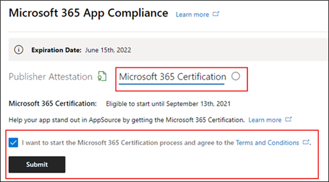
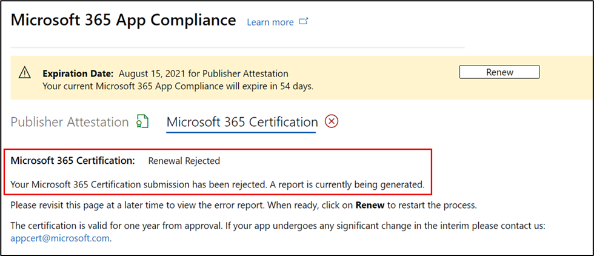

# Guide de l’utilisateur du partenaire pour Microsoft 365 programme de conformité des applications

|Phase|Titre|
|---|---|
|Étape 1| Attestation de l’éditeur|
|Étape 2| Certification Microsoft 365|

## 1. Vue d’ensemble
Ce document fait office de guide pas à pas pour nos partenaires inscrits au programme de conformité des applications Microsoft 365 visant à subir Publisher attestation et certification via le portail de l’Espace partenaires.

## 2. Acronymes & Definitions
| Acronyme |Définition |
|---|----|
|PC [(Espace partenaires)](https://partner.microsoft.com/)|Portail pour tous les partenaires Microsoft. Un partenaire se connecte à l’Espace partenaires et soumet un questionnaire d’auto-évaluation. [Espace partenaires](https://partner.microsoft.com/dashboard/home) pour la conformité des applications Microsoft 365|
|ISV|Fournisseur de logiciels indépendant. Alias. partenaire ou développeur|
|Source de l’application| [Catalogue d’applications](https://appsource.microsoft.com/)
|Exemple|[Maintenant, agent virtuel](https://appsource.microsoft.com/product/office/WA104381816)|

## 3. flux de travail d’attestation Publisher

**Page d’accueil** : il s’agit de la page d’accueil une fois qu’un partenaire se connecte à l’Espace partenaires.

**Étape 1** : Sélectionner les offres de la Place de marché. 

  
**Étape 2** : Après avoir sélectionné « Offres de la Place de marché », basculez sur « Office Store ». Sélectionnez une application dans la liste pour commencer le processus d’attestation Publisher.

Lors de la sélection d’une application, une autre barre de navigation s’affiche avec l’option « Informations de certification supplémentaires », puis cliquez sur « Conformité des applications ».
  
**Étape 3** : Sélectionner « Conformité des applications »

**Étape 4** : Remplir le questionnaire d’auto-évaluation pour Publisher Attestation

**Remarque Si vous revenez mettre à jour/soumettre à nouveau votre application, cliquez sur la liste déroulante « Choisir le produit », sélectionnez l’application, puis cliquez sur « Cloner ».**

Vous pouvez également tirer parti de la fonctionnalité Import/Export pour terminer le formulaire hors connexion et l’importer une fois terminé.

**Étape 5** : Une fois l’opération terminée, cliquez sur « Envoyer », l’évaluation est maintenant « En cours d’examen ».

### Approuver/rejeter des scénarios :

**A. Publisher rejet de l’attestation**

- En cas de rejet à ce stade, un partenaire peut :
    - Afficher le rapport d’échec
         - Le partenaire est averti par e-mail et peut afficher le rapport d’échec dans l’Espace partenaires
    - Mettre à jour et soumettre à nouveau Publisher Attestation

**B. Publisher l’approbation de l’attestation**

- Lors de l’approbation, le partenaire peut :
    - Mettre à jour et soumettre à nouveau l’attestation
    - Afficher et partager l’attestation Publisher terminée
    - Démarrer Microsoft 365 processus de certification

**Publier Publisher approbation d’attestation : exemple de lien dans AppSource pour les applications attestées par l’éditeur**

## 4. flux de travail de certification Microsoft 365

Un partenaire peut commencer le processus de certification en cochant la case et en cliquant sur « Envoyer ». 

**Étape 1 :** Envoi de document initial Remplir tous les détails, charger les documents pertinents et cliquer sur « Envoyer »

Lorsque vous cliquez sur Envoyer, la soumission d’attestation est en cours d’examen. 

Un analyste demande une révision si les documents initiaux ne sont pas suffisants ou pertinents. L’analyste collaborera avec le partenaire pour obtenir les documents appropriés pour approbation. 

Une fois que l’analyste approuve la soumission initiale du document, le partenaire doit soumettre les exigences de contrôle. 

**Étape 2 :** Soumission de l’exigence de contrôle Remplissez tous les détails, chargez les documents pertinents et cliquez sur « Envoyer ». 

Lorsque vous cliquez sur Envoyer, la soumission de certification est en cours d’examen. 

Un analyste demande une révision si les documents d’exigence de contrôle ne sont pas suffisants ou pertinents. L’analyste collaborera avec le partenaire pour obtenir les documents appropriés pour approbation. 

Si la soumission ne satisfait pas aux normes d’approbation, l’analyste rejette la soumission. Le partenaire peut collaborer avec l’analyste pour fournir les informations et documents pertinents. 

Une fois que toutes les normes de sécurité ont été respectées, l’analyste approuve la soumission et le partenaire est Microsoft 365 certifié. 

**Approbation post-certification : exemple de badge de certification Microsoft 365 dans AppSource**

## 5. flux de travail de renouvellement Microsoft 365 :
  
**Microsoft 365 Publisher flux de travail d’attestation et de renouvellement de certification :** Microsoft 365 programme de conformité des applications offre désormais un processus de renouvellement annuel. Au cours de ce processus, les développeurs d’applications peuvent mettre à jour leur questionnaire et documents d’attestation Publisher existants requis pour Microsoft 365 Certification. 
 
**Avantages:** 

- Conservez votre badge de certification dans AppSource, le Teams Store, le Office Store et d’autres vitrines pour différencier l’application. 
- Augmentez la confiance des clients dans l’utilisation de votre application certifiée. 
- Aidez les administrateurs informatiques à prendre des décisions éclairées avec des informations de certification mises à jour. 

Le processus de renouvellement est disponible dans [l’Espace partenaires](https://partner.microsoft.com/dashboard/home) pour offrir une expérience transparente. Un rappel de renouvellement s’affiche dans l’Espace partenaires à compter de 90 jours avant la date d’expiration. Les rappels périodiques seront également envoyés par e-mail à 90, 60 et 30 jours avant l’expiration.

**Phase 1 : renouvellement de l’attestation Publisher :** 

Le nouveau processus de renouvellement est disponible dans [l’Espace partenaires](https://partner.microsoft.com/dashboard/home) pour offrir une expérience transparente. Un rappel de renouvellement s’affiche dans l’Espace partenaires à compter de 90 jours avant la date d’expiration. Les rappels périodiques seront également envoyés par e-mail à 90, 60 et 30 jours avant l’expiration. 

**Étape 1** : Sélectionnez **Renouveler** pour renouveler l’attestation Publisher. 

**Étape 2** : Passez en revue les réponses Publisher Attestation précédentes et mettez à jour avec les informations les plus récentes si nécessaire. Envoyez Publisher Attestation pour renouvellement quand vous êtes prêt. Il sera examiné par un analyste de conformité d’application Microsoft 365.

**Publisher renouvellement d’attestation approuvé**

**Publisher Attestation a expiré :** les informations de l’application doivent être renouvelées avant la date d’expiration pour conserver la page d’attestation Publisher de l’application dans la documentation Microsoft. Le renouvellement en temps opportun garantira également la persistance des erreurs et des icônes pour l’application dans AppSource, Teams Store, Office Store et d’autres vitrines.

Remarque : une fois expiré, Publisher processus de renouvellement d’attestation peut être démarré à tout moment en cliquant sur « Renouveler ». 

**Phase 2 : renouvellement de la certification Microsoft 365** 

Les informations de certification de l’application doivent être soumises à nouveau sur une base annuelle. Cela nécessite une revalidation des contrôles dans l’étendue de votre environnement actuel. Lorsque la certification approche d’un an, une notification par e-mail est envoyée pour encourager la résiliation des documents et des preuves. 

**Scénarios d’approbation/rejet du renouvellement de la certification :**
 
**Scénario 1 :** 

Le renouvellement de la certification a commencé et est en cours d’examen.

**Scénario 1A :**

Rejet du renouvellement de la certification : la certification peut être rejetée si : 
- L’application ne dispose pas des outils, processus ou configurations requis et ne peut pas implémenter les modifications requises dans la fenêtre de certification. 
- L’application présente des vulnérabilités en suspens et ne peut pas être corrigée dans la fenêtre de certification. 
 

    
**Scénario 1B :** 

Le renouvellement de la certification est approuvé  

**Expiration de la certification :**
 
Les informations de l’application doivent être renouvelées avant la date d’expiration pour conserver la page de certification de l’application dans la documentation Microsoft. Le renouvellement en temps opportun garantit également la persistance des problèmes et des icônes pour l’application dans AppSource et Team Store.

Les informations de l’application doivent être renouvelées avant la date d’expiration pour conserver la page de certification de l’application dans la documentation Microsoft. Le renouvellement en temps opportun garantira également la persistance des erreurs et des icônes pour l’application dans AppSource, Teams Store, Office Store et d’autres vitrines. 

    
**Remarque** : Une fois expiré, Publisher processus d’attestation et de certification peut être démarré à tout moment en cliquant sur « Renouveler ». 

