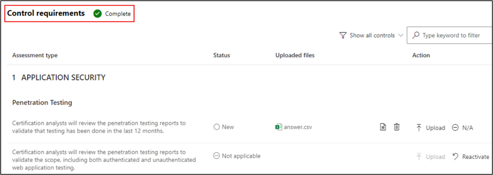

# Guide de l’utilisateur du partenaire pour Microsoft 365 conformité des applications

|Phase|Titre|
|---|---|
|Étape 1| Attestation de l’éditeur|
|Étape 2| Certification Microsoft 365|

## 1. Vue d’ensemble
Ce document agit comme un guide utilisateur pas à pas pour nos partenaires inscrits au programme de conformité des applications Microsoft 365 visant à faire l’objet d’une attestation et d’une certification Publisher à l’aide du portail de l’Centre partenaires.

## 2. Acronymes & définitions
| Acronyme |Définition |
|---|----|
|PC [(Partner Center)](https://partner.microsoft.com/)|Portail pour tous les partenaires Microsoft. Un partenaire se connecte à l’Partner Center et soumet un questionnaire d’auto-évaluation. [Partner Center](https://partner.microsoft.com/dashboard/home) for Microsoft 365 App Compliance|
|ISV|Fournisseur de logiciels indépendant. A.k.a. partenaire ou développeur|
|Source de l’application| [Catalogue d’applications](https://appsource.microsoft.com/)
|Exemple|[Agent virtuel désormais](https://appsource.microsoft.com/product/office/WA104381816)|

## 3. Flux Publisher attestation d’attestation

**Page d’accueil** : il s’agit de la page d’accueil une fois qu’un partenaire se connecte à l’Partner Center.

**Étape 1**   : sur le côté gauche de la page, dans la barre de navigation :
- Sélectionnez Office store
- Sélection d’une vue d’ensemble

Lorsque vous sélectionnez « Vue d’ensemble », le partenaire peut voir la liste des applications envoyées par le biais de l’Centre partenaires et disponibles pour le programme Microsoft 365 conformité.

**Étape 2** : sélectionnez une application dans la liste pour commencer le processus Publisher attestation.

Lors de la sélection d’une application, une autre barre de navigation apparaît avec l’option « Conformité des applications ».

**Étape 3 :** sélectionnez « Conformité des applications »

**Étape 4 :** Remplir le questionnaire d’auto-évaluation pour l’attestation Publisher de sécurité

**Remarque : si vous revenir pour mettre à jour/soumettre à nouveau votre application, cliquez sur la liste de listes pour « Choisir le produit » et sélectionnez l’application, puis cliquez sur « Cloner ».**

Vous pouvez également tirer parti de la Import/Export pour terminer le formulaire hors connexion et l’importer une fois terminé.

**Étape 5 :** une fois terminée, cliquez sur « Envoyer ». L’évaluation sera désormais « En cours de révision ».

### Scénarios d’approbation/de rejet :

**R. Refus Publisher attestation**

- En cas de rejet à ce stade, un partenaire peut :
    - Afficher le rapport d’échec
         - Le partenaire sera averti par courrier électronique et pourra afficher le rapport d’échec dans l’Partner Center
    - Mettre à jour et soumettre de Publisher attestation

**B. Approbation Publisher attestation d’attestation**

- Lors de l’approbation, le partenaire peut :
    - Mettre à jour et resoumettre l’attestation
    - Afficher et partager une attestation d’Publisher terminée
    - Démarrer le Microsoft 365 certification

**Approbation de l Publisher de publication : exemple de lien dans AppSource pour les applications d’attestation d’éditeur**

## 4. Flux de Microsoft 365 de certification

Un partenaire peut commencer le processus de certification en cocher la case et en cliquant sur « Envoyer » 

**Étape 1 :** Envoi initial du document : remplissez tous les détails, téléchargez les documents pertinents et cliquez sur « Envoyer »

 

Lorsque vous cliquez sur Envoyer, l’envoi de l’attestation est en cours d’examen. 

Un analyste demande une révision au cas où les documents initiaux ne sont pas suffisants ou pertinents. L’analyste travaillera avec le partenaire pour obtenir les documents nécessaires pour approbation. 

Une fois que l’analyste a approuvé la soumission initiale du document, le partenaire doit soumettre les exigences de contrôle. 

**Étape 2 :** Contrôler l’envoi des conditions requises: remplissez tous les détails, téléchargez les documents pertinents et cliquez sur « Envoyer » 

 
 

En cliquant sur Envoyer, la soumission de certification est en cours d’examen. 

Un analyste demande une révision au cas où les documents requis pour le contrôle ne sont pas suffisants ou pertinents. L’analyste travaillera avec le partenaire pour obtenir les documents nécessaires pour approbation. 

 
 

Dans le cas où la soumission ne répond pas aux normes d’approbation, l’analyste rejettera la soumission. Le partenaire peut travailler avec l’analyste pour fournir les informations et documents pertinents. 

Une fois toutes les normes de sécurité respectées, l’analyste approuve la soumission et le partenaire Microsoft 365 certifié. 

**Approbation après certification : exemple de badge Microsoft 365 certification dans AppSource**

## 5. Flux Microsoft 365 de renouvellement :
  
**Microsoft 365 Publisher de renouvellement de l’attestation** et de la certification : Microsoft 365 conformité des applications offre désormais un processus de renouvellement annuel. Au cours de ce processus, les développeurs d’applications peuvent mettre à jour Publisher questionnaire d’attestation et les documents requis pour Microsoft 365 certification. 
 
**Avantages :** 

- Maintenez votre badge de certification dans AppSource, Teams Store, le Office Store et d’autres boutiques pour différencier l’application. 
- Augmentez la confiance des clients à l’aide de votre application certifiée. 
- Aidez les administrateurs informatiques à prendre des décisions éclairées avec des informations de certification mises à jour. 

Le processus de renouvellement est disponible dans [l’Partner Center](https://partner.microsoft.com/dashboard/home) pour offrir une expérience transparente. Un rappel de renouvellement s’affiche dans l’Partner Center à partir de 90 jours avant la date d’expiration. Les rappels périodiques sont également envoyés par courrier électronique à 90, 60 et 30 jours avant l’expiration.

**Phase 1 : renouvellement Publisher attestation d’attestation :** 

Le nouveau processus de renouvellement est disponible dans [l’Partner Center](https://partner.microsoft.com/dashboard/home) pour offrir une expérience transparente. Un rappel de renouvellement s’affiche dans l’Partner Center à partir de 90 jours avant la date d’expiration. Les rappels périodiques sont également envoyés par courrier électronique à 90, 60 et 30 jours avant l’expiration. 

**Étape 1 :** **sélectionnez Renouveler** pour renouveler l Publisher attestation. 

**Étape 2 :** examinez les réponses de l’attestation Publisher précédente et mettez à jour les dernières informations selon vos besoins. Soumettez Publisher attestation de renouvellement lorsque vous êtes prêt. Il sera examiné par un analyste de conformité Microsoft 365 application.

**Publisher Renouvellement de l’attestation approuvé**

**Publisher attestation expirée :** Les informations de l’application doivent être renouvelés avant la date d’expiration pour conserver la page d’attestation Publisher de l’application sur les documents Microsoft. Le renouvellement opportun garantit également la poursuite du badging et des icônes pour l’application dans AppSource, Teams Store, Office Store et d’autres boutiques.

Remarque : une fois expirée, Publisher processus de renouvellement de l’attestation d’attestation peut être démarré à tout moment en cliquant sur « Renouveler ». 

**Phase 2 : renouvellement Microsoft 365 certification** 

Les informations de certification de l’application doivent être resoumises sur une base annuelle. Cela nécessitera la revalidation des contrôles dans l’étendue de votre environnement actuel. Lorsque la certification approche de la marque d’un an, une notification par courrier électronique est envoyée pour encourager la resoumission des documents et des preuves. 

**Scénarios d’approbation/de rejet du renouvellement de certification :**
 
**Scénario 1 :** 

Le renouvellement de la certification a démarré et est en cours d’examen.

**Scénario 1A :**

Rejet du renouvellement de certification : la certification peut être rejetée si : 
- L’application ne comprend pas les outils, processus ou configurations requis et ne peut pas implémenter les modifications requises dans la fenêtre de certification. 
- L’application présente des vulnérabilités en suspens et ne peut pas être corrigée dans la fenêtre de certification. 
 

    
**Scénario 1B :** 

Le renouvellement de la certification est approuvé  

**Expiration de la certification :**
 
Les informations de l’application doivent être renouvelés avant la date d’expiration pour conserver la page certification de l’application dans les documents Microsoft. Le renouvellement opportun garantit également la poursuite du badging et des icônes pour l’application dans AppSource et Team Store.

Les informations de l’application doivent être renouvelés avant la date d’expiration pour conserver la page certification de l’application dans les documents Microsoft. Le renouvellement opportun garantit également la poursuite du badging et des icônes pour l’application dans AppSource, Teams Store, Office Store et d’autres boutiques. 

    
**Remarque**: une fois expiré, Publisher processus d’attestation et de certification peuvent être démarrés à tout moment en cliquant sur « Renouveler ». 

