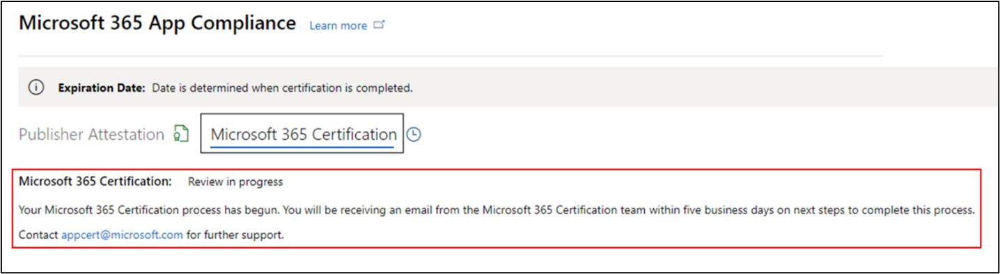

# Guide de l’utilisateur du partenaire pour le Microsoft 365 conformité des applicationsPartner's User Guide for Microsoft 365 App Compliance Program

|PhasePhase|TitreTitle|
|---|---|
|Étape 1Phase 1| Attestation de l’éditeurPublisher Attestation|
|Étape 2Phase 2| Certification Microsoft 365Microsoft 365 Certification|

## 1. Vue d’ensemble1. Overview
Ce document agit comme un guide utilisateur pas à pas pour nos partenaires inscrits au programme de conformité des applications Microsoft 365 visant à faire l’objet d’une attestation et d’une certification Publisher à l’aide du portail de l’Centre partenaires.This document acts as a step-by-step user guide for our partners enrolled in the Microsoft 365 App Compliance program aiming to undergo Publisher Attestation and Certification though the Partner Center portal.

## 2. Acronymes & définitions2. Acronyms & Definitions
| AcronymeAcronym |DéfinitionDefinition |
|---|----|
|PC [(Partner Center)](https://partner.microsoft.com/)PC [(Partner Center)](https://partner.microsoft.com/)|Portail pour tous les partenaires Microsoft.A portal for all Microsoft partners. Un partenaire se connecte à l’Partner Center et soumet un questionnaire d’auto-évaluation.A partner logs in to Partner Center and submits self-assessment questionnaire. [Partner Center](https://partner.microsoft.com/dashboard/home) for Microsoft 365 App Compliance[Partner Center](https://partner.microsoft.com/dashboard/home) for Microsoft 365 App Compliance|
|ISVISV|Fournisseur de logiciels indépendant.Independent Software Vendor. A.k.a.A.k.a. partenaire ou développeurpartner or developer|
|Source de l’applicationApp Source| [Catalogue d’applicationsCatalog of apps](https://appsource.microsoft.com/)
|ExempleExample|[Agent virtuel désormaisNow virtual agent](https://appsource.microsoft.com/product/office/WA104381816)|

## 3. Flux Publisher attestation d’attestation3.   Publisher Attestation Workflow

**Page d’accueil** : il s’agit de la page d’accueil une fois qu’un partenaire se connecte à l’Partner Center.**Home Page** : This is the landing page once a partner logs in to Partner Center.

**Étape 1**   : sur le côté gauche de la page, dans la barre de navigation :**Step 1**   : On the left side of the page, in the navigation bar:
- Sélectionnez Office storeSelect Office store
- Sélection d’une vue d’ensembleSelect Overview

Lorsque vous sélectionnez « Vue d’ensemble » , le partenaire peut voir la liste des applications envoyées par le biais de l’Partner Center et disponibles pour le programme Microsoft 365 conformité.Upon selecting ‘Overview’, partner can see list of apps submitted through Partner Center and available for the Microsoft 365 Compliance program.

**Étape 2** : sélectionnez une application dans la liste pour commencer le processus Publisher attestation.**Step 2** : Select an app from the list to begin the Publisher Attestation process.

Lors de la sélection d’une application, une autre barre de navigation apparaît avec l’option « Conformité des applications ».On selecting an app, another navigation bar will pop up with option ‘App Compliance.’

**Étape 3 :** sélectionnez « Conformité des applications »**Step 3**: Select ‘App Compliance’

**Étape 4 :** Remplir le questionnaire d’auto-évaluation pour l’attestation Publisher de sécurité**Step 4**: Fill out the self-assessment questionnaire for Publisher Attestation

**Remarque : si vous revenir pour mettre à jour/soumettre à nouveau votre application, cliquez sur la liste de listes pour « Choisir le produit » et sélectionnez l’application, puis cliquez sur « Cloner ».****Note If you are coming back to update/re-submit your application, click dropdown for ‘Choose the product’, select the app and click ‘Clone.’**

Vous pouvez également tirer parti de la Import/Export pour terminer le formulaire hors connexion et l’importer une fois terminé.You can also leverage the Import/Export feature to complete the form offline and import it once completed.

**Étape 5 :** une fois terminée, cliquez sur « Envoyer ». L’évaluation sera désormais « En cours de révision ».**Step 5**: Once completed, click on ‘Submit’, the assessment will now be ‘Under Review.'

### Scénarios d’approbation/de rejet :Approve/Reject Scenarios:

**R. Refus Publisher attestation****A. Publisher Attestation Rejection**

- En cas de rejet à ce stade, un partenaire peut :In case of rejection at this stage, an partner can:
    - Afficher le rapport d’échecView failure report
         - Le partenaire sera averti par courrier électronique et pourra afficher le rapport d’échec dans l’Partner CenterPartner will be notified via email, and they can view the failure report in Partner Center
    - Mettre à jour et soumettre de Publisher attestationUpdate and re-submit Publisher Attestation

**B. Approbation Publisher attestation d’attestation****B. Publisher Attestation Approval**

- Lors de l’approbation, le partenaire peut :Upon approval partner can:
    - Mettre à jour et resoumettre l’attestationUpdate and resubmit attestation
    - Afficher et partager une attestation d’Publisher terminéeView and share completed Publisher Attestation
    - Démarrer le Microsoft 365 certificationStart Microsoft 365 Certification process

**Approbation de l’attestation Publisher publication : exemple de lien dans AppSource pour les applications avec attestation d’éditeur****Post Publisher Attestation Approval: Example of link in AppSource for publisher attested apps**

## 4. Flux de Microsoft 365 certification4. Microsoft 365 Certification Workflow

Un partenaire peut commencer le processus de certification en cocher la case et en cliquant sur « Envoyer »A partner can begin the Certification process by selecting the checkbox and clicking ‘Submit’ 

**Étape 1 :** Envoi initial du document : remplissez tous les détails, téléchargez les documents pertinents et cliquez sur « Envoyer »**Step 1:** Initial Document Submission Fill out all the details, upload relevant documents and Click ‘Submit’

 

Lorsque vous cliquez sur Envoyer, l’envoi de l’attestation est en cours d’examen.On clicking submit, the attestation submission will be under review. 

Un analyste demande une révision au cas où les documents initiaux ne sont pas suffisants ou pertinents.An analyst requests a revision in case the initial documents are not sufficient or relevant. L’analyste travaillera avec le partenaire pour obtenir les documents nécessaires pour approbation.The analyst will work with the partner to help get the right documents for approval. 

Une fois que l’analyste a approuvé la soumission initiale du document, le partenaire doit soumettre les exigences de contrôle.Once the analyst approves the initial document submission, the partner needs to submit the control requirements. 

**Étape 2 :** Contrôler l’envoi des conditions requises : remplissez tous les détails, téléchargez les documents pertinents et cliquez sur « Envoyer »**Step 2:** Control Requirement Submission Fill out all the details, upload relevant documents and Click ‘Submit’ 

 
 

En cliquant sur Envoyer, la soumission de certification est en cours d’examen.On clicking Submit, the certification submission will be under review. 

Un analyste demande une révision au cas où les documents requis pour le contrôle ne sont pas suffisants ou pertinents.An analyst requests a revision in case the control requirement documents are not sufficient or relevant. L’analyste travaillera avec le partenaire pour obtenir les documents nécessaires pour approbation.The analyst will work with the partner to help get the right documents for approval. 

 
 

Si la soumission ne répond pas aux normes d’approbation, l’analyste rejettera la soumission.In case the submission does not satisfy the approval standards, the analyst will reject the submission. Le partenaire peut travailler avec l’analyste pour fournir les informations et les documents pertinents.The partner can work with the analyst to provide the relevant information and documents. 

Une fois toutes les normes de sécurité respectées, l’analyste approuve la soumission et le partenaire Microsoft 365 certifié.Once all the security standards have been met, the analyst will approve the submission and the partner will be Microsoft 365 Certified. 

**Approbation après certification : exemple de badge Microsoft 365 certification dans AppSource****Post Certification Approval: Example of Microsoft 365 certification badge in AppSource**

## 5. Flux Microsoft 365 de renouvellement :5.   Microsoft 365 Renewal Workflow:
  
**Microsoft 365 Publisher de renouvellement de l’attestation** et de la certification : Microsoft 365 conformité des applications offre désormais un processus de renouvellement annuel.**Microsoft 365 Publisher Attestation and Certification Renewal Workflow:** Microsoft 365 App Compliance Program now offers an annual renewal process. Au cours de ce processus, les développeurs d’applications peuvent mettre à jour Publisher questionnaire d’attestation et les documents requis pour Microsoft 365 certification.During this process, app developers can update their existing Publisher Attestation questionnaire and documents required for Microsoft 365 Certification. 
 
**Avantages :****Benefits:** 

- Maintenez votre badge de certification dans AppSource, Teams Store, le Office Store et d’autres boutiques pour différencier l’application.Maintain your certification badge in AppSource, the Teams Store, the Office Store and other storefronts to differentiate the app. 
- Augmentez la confiance des clients à l’aide de votre application certifiée.Increase customer confidence in using your certified app. 
- Aidez les administrateurs informatiques à prendre des décisions éclairées avec des informations de certification mises à jour.Help IT admins make informed decisions with updated certification information. 

Le processus de renouvellement est disponible dans [l’Partner Center](https://partner.microsoft.com/dashboard/home) pour offrir une expérience transparente.The renewal process is available in [Partner Center](https://partner.microsoft.com/dashboard/home) to provide a seamless experience. Un rappel de renouvellement s’affiche dans l’Partner Center à partir de 90 jours avant la date d’expiration.A renewal reminder will be shown in Partner Center starting 90 days before the expiration date. Les rappels périodiques sont également envoyés par courrier électronique à 90, 60 et 30 jours avant l’expiration.Periodic reminders will also be sent via email at 90, 60 and 30 days before expiration.

**Phase 1 : renouvellement Publisher attestation d’attestation :****Phase 1: Publisher Attestation Renewal:** 

Le nouveau processus de renouvellement est disponible dans [l’Partner Center](https://partner.microsoft.com/dashboard/home) pour offrir une expérience transparente.The new renewal process is available in [Partner Center](https://partner.microsoft.com/dashboard/home) to provide a seamless experience. Un rappel de renouvellement s’affiche dans l’Partner Center à partir de 90 jours avant la date d’expiration.A renewal reminder will be shown in Partner Center starting 90 days before the expiration date. Les rappels périodiques sont également envoyés par courrier électronique à 90, 60 et 30 jours avant l’expiration.Periodic reminders will also be sent via email at 90, 60 and 30 days before expiration. 

**Étape 1 :** **sélectionnez Renouveler** pour renouveler l Publisher attestation.**Step 1**: Select **Renew** to renew the Publisher Attestation. 

**Étape 2 :** examinez les réponses de l’attestation Publisher précédente et mettez à jour les dernières informations selon vos besoins.**Step 2**: Review the previous Publisher Attestation answers and update with the latest information as needed. Soumettez Publisher attestation de renouvellement lorsque vous êtes prêt.Submit Publisher Attestation for renewal when ready. Il sera examiné par un analyste de conformité Microsoft 365 application.It will be reviewed by an Microsoft 365 app compliance analyst.

**Publisher Renouvellement de l’attestation approuvé****Publisher Attestation Renewal Approved**

**Publisher attestation expirée :** Les informations de l’application doivent être renouvelés avant la date d’expiration pour conserver la page d’attestation Publisher de l’application dans les documents Microsoft. Le renouvellement opportun garantit également la poursuite du badging et des icônes pour l’application dans AppSource, Teams Store, Office Store et d’autres magasins.**Publisher Attestation Expired:** The app’s information needs to be renewed before the expiration date to maintain the app’s Publisher Attestation page on the Microsoft docs. Timely renewal will also ensure continued badging and icons for the app in AppSource, Teams Store, Office Store and other storefronts.

Remarque : une fois expirée, Publisher processus de renouvellement de l’attestation d’attestation peuvent être démarrés à tout moment en cliquant sur « Renouveler ».Note: Once expired, Publisher Attestation renewal process can be started anytime by clicking ‘Renew’. 

**Phase 2 : renouvellement Microsoft 365 certification****Phase 2: Microsoft 365 Certification Renewal** 

Les informations de certification de l’application doivent être resoumises sur une base annuelle.The app’s certification information needs to be resubmitted on an annual basis. Cela nécessitera la revalidation des contrôles dans l’étendue de votre environnement actuel.This will require revalidation of the in-scope controls of your current environment. Lorsque la certification approche de la marque d’un an, une notification par courrier électronique est envoyée pour encourager la resoumission des documents et des preuves.When the Certification nears 1-year mark an email notification will be sent encouraging a resubmission of the documents and evidence. 

**Scénarios d’approbation/de rejet du renouvellement de certification :****Certification Renewal Approve/Reject Scenarios:**
 
**Scénario 1 :****Scenario 1:** 

Le renouvellement de la certification a démarré et est en cours d’examen.Certification renewal has started and is under review.

**Scénario 1A :****Scenario 1A:**

Rejet du renouvellement de certification : la certification peut être rejetée si :Certification renewal rejection: Certification may be rejected if: 
- L’application n’a pas les outils, processus ou configurations requis en place et ne peut pas implémenter les modifications requises dans la fenêtre de certification.The app does not have the required tooling, processes, or configurations in place and will not be able to implement required changes within the certification window. 
- L’application présente des vulnérabilités en suspens et ne peut pas être corrigée dans la fenêtre de certification.The app has outstanding vulnerabilities in place and cannot be fixed within the certification window. 
 

    
**Scénario 1B :****Scenario 1B:** 

Le renouvellement de la certification est approuvéCertification renewal is approved  

**Expiration de la certification :****Certification Expiration:**
 
Les informations de l’application doivent être renouvelés avant la date d’expiration pour conserver la page certification de l’application dans les documents Microsoft. Le renouvellement opportun garantit également la poursuite du badging et des icônes pour l’application dans AppSource et Team Store.The app’s information needs to be renewed before the expiration date to maintain app’s Certification page on the Microsoft docs. Timely renewal will also ensure continued badging and icons for the app in AppSource and Team Store.

Les informations de l’application doivent être renouvelés avant la date d’expiration pour conserver la page certification de l’application dans les documents Microsoft. Le renouvellement opportun garantit également la poursuite du badging et des icônes pour l’application dans AppSource, Teams Store, Office Store et d’autres magasins.The app’s information needs to be renewed before the expiration date to maintain app’s Certification page on the Microsoft docs. Timely renewal will also ensure continued badging and icons for the app in AppSource, Teams Store, Office Store and other storefronts. 

    
**Remarque**: une fois expirée, Publisher processus d’attestation et de certification peut être démarré à tout moment en cliquant sur « Renouveler ».**Note**: Once expired, Publisher Attestation and Certification process can be started anytime by clicking ‘Renew’. 

