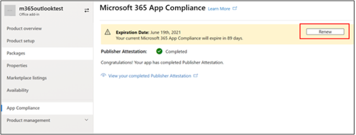

# Guide de l’utilisateur du partenaire pour le Microsoft 365 conformité des applicationsPartner's User Guide for Microsoft 365 App Compliance Program

|||
|---|---|
|Niveau 1Tier 1| Attestation de l’éditeurPublisher Attestation|
|Niveau 2Tier 2| Certification Microsoft 365Microsoft 365 Certification|

## 1. Vue d’ensemble1. Overview
Ce document agit comme un guide utilisateur pas à pas pour nos partenaires, inscrit au programme de conformité des applications Microsoft 365 visant à faire l’objet d’une attestation et d’une certification Publisher par le portail de l’Centre partenaires.This document acts as a step-by-step user guide for our Partners, enrolled for Microsoft 365 App Compliance Program aiming to undergo Publisher Attestation and Certification though Partner Center portal.

## 2. Acronymes & définitions2. Acronyms & Definitions
| | |
|---|----|
|AcronymeAcronym | DéfinitionDefinition |
|PC (Partner Center)PC (Partner Center)|Portail pour tous les partenaires Microsoft.A portal for all Microsoft Partners. Un partenaire se connecte à l’Centre de partenaires et Self-Assessment questionnaire https://partner.microsoft.com/A Partner logs in to Partner Center and submits Self-Assessment Questionnaire https://partner.microsoft.com/|
|ISVISV|Independent Software Vendor A.k.a.Independent Software Vendor A.k.a. Partenaire ou développeurPartner or Developer|
|Source de l’applicationApp Source| Catalogue d’applications (https://appsource.microsoft.com/)Catalog of apps (https://appsource.microsoft.com/)
||Exemple : Désormais, agent virtuel (https://appsource.microsoft.com/en-us/product/office/WA104381816)Example: Now virtual agent (https://appsource.microsoft.com/en-us/product/office/WA104381816)|

## 3. Flux Publisher attestation d’attestation3.   Publisher Attestation Workflow

Page d’accueil : il s’agit de la page d’accueil une fois qu’un partenaire se connecte à l’Partner Center.Home Page: This is the landing page once a partner logs in to Partner Center.

**Étape 1**   : sur le côté gauche de la page, dans la barre de navigation :**Step 1**   : On the left side of the page, in the navigation bar:
1. Sélectionnez Office storeSelect Office store
1. Sélection d’une vue d’ensembleSelect Overview

Lorsque vous sélectionnez « Vue d’ensemble » , le partenaire peut voir la liste des applications envoyées par le biais de l’Partner Center et disponibles pour le programme Microsoft 365 conformité.Upon selecting ‘Overview’, partner can see list of apps submitted through Partner Center and available for the Microsoft 365 Compliance program.

**Étape 2** : sélectionnez une application dans la liste pour commencer le processus Publisher attestation.**Step 2** : Select an app from the list to begin the Publisher Attestation process.

Lors de la sélection d’une application, une autre barre de navigation apparaît avec l’option « Conformité des applications »On selecting an app, another navigation bar will pop up with option ‘App Compliance’

**Étape 3 :** sélectionnez « Conformité des applications »**Step 3**: Select ‘App Compliance’

**Étape 4 :** Remplir le questionnaire Self-Assessment pour l’attestation Publisher de données**Step 4**: Fill out the Self-Assessment Questionnaire for Publisher Attestation

**Remarque**: si vous revenir pour mettre à jour/soumettre à nouveau votre application, cliquez sur la liste de listes pour « Choisir le produit » et sélectionnez l’application, puis cliquez sur « clone ».**Note**:If you are coming back to update/re-submit your application, click dropdown for ‘Choose the product’, select the app and click ‘clone’.

 

Vous pouvez également tirer parti de la Import/Export pour terminer le formulaire hors connexion et l’importer une fois terminé.You can also leverage the Import/Export feature to complete the form offline and import it once completed. 

**Étape 5 :** une fois terminée, cliquez sur « Envoyer ». L’évaluation est désormais « en cours de révision ».**Step 5**: Once completed, click on ‘Submit’, the assessment will now be ‘under review’.

### Scénarios d’approbation/de rejet :Approve/Reject Scenarios:

**Refus d’attestation Publisher A.C.****A.Publisher Attestation Rejection**

En cas de rejet à ce stade, un partenaire peut :In case of rejection at this stage, an partner can:
-   Afficher le rapport d’échec.View failure report.
    - Le partenaire sera averti dans l’Centre de partenaires et par courrier électronique.Partner will be notified in Partner Center and via email.
-   Mettez à jour Self-Assessment réponses.Update Self-Assessment responses.
-   Soumettez de une autre fois l’auto-évaluation.Re-submit Self-Assessment.

**Ré-envoi Publisher attestation B.Publisher****B.Publisher Attestation Re-submission**

**Approbation de l’attestation Publisher C.Publisher****C.Publisher Attestation Approval**

-   Lors de l’approbation, le partenaire peut :Upon approval partner can:
    - Mettre à jour et resoumettre l’attestationUpdate and resubmit attestation
    - Afficher et partager une attestation d’Publisher terminéeView and share completed Publisher Attestation
    - Démarrer le processus de certification M365Start M365 Certification Process

**Approbation de Publisher publication : exemple de lien dans AppSource pour les applications attestées par l’éditeur****Post Publisher Verification Approval: Example of link in AppSource for publisher attested apps**

## 4. Flux de Microsoft 365 certification4. Microsoft 365 Certification Workflow

Une fois que le partenaire clique sur « Envoyer » et envoie tous les documents et preuves pour révision :Once partner clicks on ‘Submit’ and submits all documents and evidence for review: 

### Microsoft 365 Certification : soumiseMicrosoft 365 Certification - Submitted

**Microsoft 365 certification : rejeté****Microsoft 365 certification - Rejected**

**Microsoft 365 Certification - Approuvé****Microsoft 365 Certification - Approved**

**Approbation après certification : exemple de badge Microsoft 365 certification dans AppSource****Post Certification Approval: Example of Microsoft 365 certification badge in AppSource**

## 5. Flux de travail pour les isv existants5. Workflow for Existing ISVs

Si vous êtes un isv existant et que vous souhaitez mettre à jour Publisher attestation.If you are an existing ISV and want to Update Publisher Attestation.

**Étape 1 :** cliquez sur le lien « Mettre à jour et soumettre de Publisher attestation ».**Step 1**: Click on ‘Update and re-submit your Publisher Attestation’ link.

**Remarque :** si vous revenir pour mettre à jour/soumettre à nouveau votre application, cliquez sur la liste de listes pour « Choisir le produit » et sélectionnez l’application, puis cliquez sur « Importer ».**Note:**: If you are coming back to update/re-submit your application, click dropdown for ‘Choose the product’, select the app and click ‘Import’.

**Étape 2 :** mettez à jour votre formulaire et cliquez sur Enregistrer/Envoyer.**Step 2**: Make updates to your form and click Save/Submit.

Une fois envoyé, il est soumis à révision.Once submitted, it will be under review.

## 6. Flux Microsoft 365 Re-Certification de travail :6.   Microsoft 365 Re-Certification Workflow:

**Microsoft 365Publisher de renouvellement de l’attestation et de la certification :****Microsoft 365 Publisher Attestation and Certification Renewal Workflow:** 

Microsoft 365 Le programme de conformité des applications propose désormais un processus de renouvellement annuel.Microsoft 365 App Compliance Program now offers an annual renewal process. Au cours de ce processus, les développeurs d’applications peuvent mettre à jour Publisher questionnaire d’attestation et les documents requis pour Microsoft 365 certification.During this process, app developers can update their existing Publisher Attestation questionnaire and documents required for Microsoft 365 Certification. 

**Avantages :****Benefits:**

- Conservez votre badge de certification dans AppSource pour différencier votre application des autres.Maintain your certification badge in AppSource to differentiate your app from others. 
- Augmentez la confiance des clients à l’aide de votre application certifiée.Increase customer confidence in using your certified app. 
- Aidez les administrateurs informatiques à prendre des décisions éclairées avec des informations de certification mises à jour.Help IT admins make informed decisions with updated certification information. 

**Niveau 1 : renouvellement Publisher attestation d’attestation :****Tier 1: Publisher Attestation Renewal:** 

Les réponses de l’attestation Publisher de l’application doivent être resoumises sur une base annuelle.The app’s Publisher Attestation answers will need to be resubmitted on an annual basis. Lorsque l’attestation approche de la marque d’un an, un rappel par courrier électronique est envoyé pour encourager la resoumission de l’attestation.When the attestation nears 1-year mark, an email reminder will be sent encouraging a resubmission of the attestation. 

**Étape 1 :** **sélectionnez Renouveler** pour renouveler l Publisher attestation.**Step 1**: Select **Renew** to renew the Publisher Attestation. 

**Étape 2 :** examinez les réponses de l’attestation Publisher précédente et mettez à jour les dernières informations selon vos besoins.**Step 2**: Review the previous Publisher Attestation answers and update with the latest information as needed. Soumettez Publisher attestation de renouvellement lorsque vous êtes prêt.Submit Publisher Attestation for renewal when ready. Il sera examiné par un analyste de conformité des applications M365.It will be reviewed by an M365 App Compliance Analyst.

**Publisher attestation expirée :** Les informations de l’application doivent être renouvelés avant la date d’expiration pour conserver la page d’attestation Publisher de l’application dans les documents Microsoft. Le renouvellement opportun garantit également la poursuite du badging et des icônes pour l’application dans AppSource et Team Store.**Publisher Attestation Expired:** The app’s information needs to be renewed before the expiration date to maintain the app’s Publisher Attestation page on the Microsoft docs. Timely renewal will also ensure continued badging and icons for the app in AppSource and Team Store.

Remarque : une fois expirée, Publisher processus de renouvellement de l’attestation d’attestation peuvent être démarrés à tout moment en cliquant sur « Renouveler ».Note: Once expired, Publisher Attestation renewal process can be started anytime by clicking ‘Renew’. 

**Niveau 2 : renouvellement Microsoft 365 certification****Tier 2: Microsoft 365 Certification Renewal** 

Les informations de certification de l’application doivent être resoumises sur une base annuelle.The app’s certification information needs to be resubmitted on an annual basis. Cela nécessitera la revalidation des contrôles dans l’étendue de votre environnement actuel.This will require revalidation of the in-scope controls of your current environment. Lorsque la certification approche de la marque d’un an, une notification par courrier électronique est envoyée pour encourager la resoumission des documents et des preuves.When the Certification nears 1-year mark an email notification will be sent encouraging a resubmission of the documents and evidence. 

**Scénarios d’approbation/de rejet du renouvellement de certification :****Certification Renewal Approve/Reject Scenarios:**

**Scénario 1 :****Scenario 1:** 

Publisher L’attestation est terminée.Publisher Attestation  is complete. Le renouvellement de la certification a démarré et est en cours d’examen.Certification renewal has started and under review. 

**Scénario 1A :****Scenario 1A:**

Rejet du renouvellement de certification : la certification peut être rejetée si :Certification renewal rejection: Certification may be rejected if: 

 - L’application n’a pas les outils, processus ou configurations requis en place et ne peut pas implémenter les modifications requises dans la fenêtre de certification.The app does not have the required tooling, processes, or configurations in place and will not be able to implement required changes within the certification window. 
 - L’application présente des vulnérabilités en suspens et ne peut pas être corrigée dans la fenêtre de certification.The app has outstanding vulnerabilities in place and cannot be fixed within the certification window. 

    
**Scénario 1B :****Scenario 1B:** 

Le renouvellement de la certification est approuvéCertification renewal is approved  

**Expiration de la certification :****Certification Expiration:**

Les informations de l’application doivent être renouvelés avant la date d’expiration pour conserver la page certification de l’application dans les documents Microsoft. Le renouvellement opportun garantit également la poursuite du badging et des icônes pour l’application dans AppSource et Team Store.The app’s information needs to be renewed before the expiration date to maintain app’s Certification page on the Microsoft docs. Timely renewal will also ensure continued badging and icons for the app in AppSource and Team Store. 

    
**Remarque**: une fois expirée, Publisher processus d’attestation et de certification peut être démarré à tout moment en cliquant sur « Renouveler ».**Note**: Once expired, Publisher Attestation and Certification process can be started anytime by clicking ‘Renew’. 

