# Certification Microsoft 365 - Exemple de guide de preuve

## Vue d’ensemble

Ce guide a été créé pour fournir aux éditeurs de logiciels indépendants des exemples de type de preuve et de niveau détaillé requis pour chacun des contrôles de certification Microsoft 365. Les exemples partagés dans ce document ne représentent pas la seule preuve qui puisse être utilisée pour démontrer que les contrôles sont respectés, mais servent uniquement de lignes directrices pour le type de preuve requis. 

Remarque : les interfaces, captures d’écran et documentation utilisées pour répondre aux exigences varient en fonction de l’utilisation du produit, de la configuration du système et des processus internes. En outre, notez que lorsque la documentation de stratégie ou de procédure est requise, l’éditeur de logiciels indépendants doit envoyer les documents RÉELs et non pas les captures d’écran, comme le montre peut-être certains des exemples. 

La certification comporte deux sections qui nécessitent des soumissions :
1. [**Envoi du document initial :**](../docs/initialdocumentsubguide.md) petit ensemble de documents de haut niveau requis pour l’étendue de votre évaluation.
1. Présentation de la **preuve :** ensemble complet de preuves requises pour chaque contrôle dans l’étendue de votre évaluation de certification. 

## Structure 

Ce document correspond directement aux contrôles que vous présenterez lors de votre certification dans l’Espace partenaires. Les conseils fournis dans ce document sont détaillés comme suit :
- Domaine de sécurité : les trois domaines de sécurité dans lequel tous les contrôles sont regroupés : sécurité des applications, sécurité opérationnelle et sécurité des données et confidentialité.
- Contrôles : = Description de l’activité d’évaluation : ces contrôles et numéros associés (non) sont extraits directement de la liste de contrôle de certification Microsoft 365.  
- Intention : = L’intention de la raison pour laquelle le contrôle de sécurité est inclus dans le programme et le risque spécifique qu’il est destiné à atténuer.  L’espoir est que ces informations fourniront aux éditeurs de logiciels indépendants le raisonnement derrière le contrôle pour mieux comprendre les types de preuves qui doivent être collectées et ce que les éditeurs de logiciels indépendants doivent prêter attention et avoir conscience et comprendre dans la production de leurs preuves.
- Exemples de recommandations en matière de preuves : = Données fournies pour aider à guider les tâches de collecte de preuves dans la feuille de calcul Microsoft 365 liste de vérification de certification, cela permet aux éditeurs de logiciels indépendants de voir clairement des exemples de type de preuve qui peuvent être utilisés par l’analyste de certification qui l’utilisera pour déterminer avec certitude qu’un contrôle est en place et maintenu – il n’est en aucun cas exhaustif par nature.
- Exemple de preuve : = Cette section donne des exemples de captures d’écran et d’images de preuves potentielles capturées sur chacun des contrôles de la feuille de calcul Microsoft 365 liste de vérification de certification, en particulier pour les domaines de sécurité opérationnelle et de sécurité des données et de confidentialité (onglets dans la feuille de calcul). Notez toutes les informations avec des flèches rouges et des zones dans les exemples est d’aider à mieux comprendre les exigences nécessaires pour répondre à tout contrôle.

## Domaine de sécurité : Sécurité des applications

**Contrôle 1 - Contrôle 16** :

Les contrôles de domaine Application Security peuvent être satisifés avec un rapport de test d’intrusion publié au cours des 12 derniers mois, indiquant que votre application n’a aucune vulnérabilité en suspens. La seule soumission requise est un rapport propre par une société indépendante de bonne réputation. 

## Domaine de sécurité : Sécurité opérationnelle / Développement sécurisé

Le domaine de sécurité « Sécurité opérationnelle /développement sécurisé » est conçu pour garantir que les éditeurs de logiciels indépendants implémentent un ensemble solide de techniques d’atténuation de la sécurité contre une multitude de menaces rencontrées par les acteurs de la menace.  Il est conçu pour protéger l’environnement d’exploitation et les processus de développement de logiciels afin de créer des environnements sécurisés.

#### Protection contre les programmes malveillants - Antivirus

[Contrôle n° 1](#control-1) : Fournissez une documentation de stratégie qui régit les pratiques et procédures antivirus.

- Intention : l’objectif de ce contrôle est d’évaluer la compréhension par un éditeur de logiciels indépendants des problèmes auxquels ils sont confrontés lors de l’examen de la menace des virus informatiques. En établissant et en utilisant les meilleures pratiques du secteur dans l’élaboration d’une stratégie et de processus antivirus, un éditeur de logiciels indépendants fournit une ressource adaptée à la capacité de son organisation à atténuer les risques liés aux programmes malveillants, répertorie les meilleures pratiques en matière de détection et d’élimination des virus, et fournit des preuves que la stratégie documentée fournit des conseils de sécurité suggérés pour l’organisation et ses employés. En documentant une stratégie et une procédure sur la façon dont l’éditeur de logiciels indépendant déploie des décences anti-programmes malveillants, cela garantit le déploiement et la maintenance cohérents de cette technologie afin de réduire le risque de programmes malveillants dans l’environnement.

- Exemples de recommandations en matière de preuves : fournissez une copie de votre stratégie antivirus/anti-programme malveillant détaillant les processus et procédures implémentés au sein de votre infrastructure pour promouvoir les meilleures pratiques antivirus/programmes malveillants.
Exemple de preuve

- Exemple de preuve :

**Note:** Cette capture d’écran montre un document de stratégie/processus, l’attente est que les éditeurs de logiciels indépendants partagent la documentation de stratégie/procédure de prise en charge réelle et ne fournissent pas simplement une capture d’écran.

[Contrôle n° 2](#control-2) : fournissez des preuves tangibles que des logiciels antivirus s’exécutent sur tous les composants système échantillonnées.

- Intention : Il est important que des logiciels anti-virus (AV) (ou des défenses anti-programme malveillant) s’exécutent dans votre environnement pour vous protéger contre les risques de cybersécurité que vous pouvez ou ne pas connaître, car les attaques potentiellement dommageables augmentent, à la fois en termes de sophistication et de nombres. Le déploiement d’AV sur tous les composants système qui prennent en charge son utilisation permettra d’atténuer certains des risques liés à l’introduction de logiciels anti-programmes malveillants dans l’environnement. Il suffit d’un point de terminaison unique pour être protégé pour fournir potentiellement un vecteur d’attaque pour qu’un acteur de menace prenne pied dans l’environnement. AV doit donc être utilisé comme l’une des plusieurs couches de défense pour se protéger contre ce type de menace.

- Exemples de recommandations en matière de preuves : pour prouver qu’une instance active d’AV est en cours d’exécution dans l’environnement évalué. Fournissez une capture d’écran pour _chaque appareil de l’exemple_ qui prend en charge l’utilisation de l’antivirus qui montre le processus antivirus en cours d’exécution, le logiciel antivirus est actif, ou si vous disposez d’une console de gestion centralisée pour les antivirus, vous pouvez être en mesure de le montrer à partir de cette console de gestion. Si vous utilisez la console de gestion, vérifiez dans une capture d’écran que les appareils échantillonnées sont connectés et fonctionnent.

- Exemple de preuve 1 : la capture d’écran ci-dessous a été extraite de Azure Security Center ; elle montre qu’une extension Antimalware a été déployée sur la machine virtuelle nommée &quot;MSPGPRODAZUR01&quot;.

- Exemple de preuve 2

La capture d’écran ci-dessous a été prise à partir d’un Windows 10 appareils, montrant que &quot;la protection&quot; en temps réel est activée pour le nom &quot;d’hôte CLARANET-SBU-WM&quot;.

[Contrôle n° 3](#control-3) : fournir des preuves démontrant que les signatures antivirus sont à jour dans tous les environnements (dans un délai d’un jour).

- Intention : Des centaines de milliers de nouveaux programmes malveillants et d’applications potentiellement indésirables (PUA) sont identifiés chaque jour. Pour assurer une protection adéquate contre les programmes malveillants nouvellement publiés, les signatures AV doivent être mises à jour régulièrement pour tenir compte des programmes malveillants nouvellement publiés.

- Ce contrôle permet de s’assurer que l’éditeur de logiciels indépendants a pris en compte la sécurité de l’environnement et l’effet que l’av obsolète peut avoir sur la sécurité.

- Exemples de recommandations en matière de preuves : fournissez des fichiers journaux antivirus à partir de chaque appareil échantillonnée, montrant que les mises à jour sont appliquées quotidiennement.

- Exemple de preuve : La capture d’écran suivante montre La mise à jour de Microsoft Defender au moins quotidienne en montrant &#39;'événement 2000, Windows Defender&#39; qui est la mise à jour. Le nom d’hôte s’affiche, indiquant qu’il a été extrait du système &quot;in-scope CLARANET-SBU-WM&quot;.

**Note:** Les preuves fournies doivent inclure une exportation des journaux d’activité pour afficher les mises à jour quotidiennes sur une période plus longue. Certains produits antivirus génèrent des fichiers journaux de mise à jour afin que ces fichiers soient fournis ou exportés à partir de observateur d'événements.

[Contrôle n° 4](#control-4) : fournissez des preuves démontrant que l’antivirus est configuré pour effectuer une analyse d’accès ou une analyse périodique sur tous les composants système échantillonné.

**Note:** Si l’analyse à l’accès n’est pas activée, une analyse quotidienne minimale et alerting_ **DOIVENT** _be activées.

- Intention : L’objectif de ce contrôle est de s’assurer que les programmes malveillants sont rapidement identifiés afin de minimiser l’effet que cela peut avoir sur l’environnement. Lorsque l’analyse de l’accès est effectuée et associée à des programmes malveillants bloquant automatiquement, cela permet d’arrêter les infections de programmes malveillants connues par le logiciel antivirus. Lorsque l’analyse de l’accès n’est&#39;pas souhaitable en raison des risques de faux positifs à l’origine de pannes de service, des mécanismes d’analyse et d’alerte quotidiens appropriés (ou plus) doivent être mis en œuvre pour garantir une réponse en temps opportun aux infections des programmes malveillants afin de minimiser les dommages.

- Exemples de recommandations en matière de preuves : fournissez une capture d’écran pour _chaque appareil_ de l’exemple qui prend en charge l’antivirus, montrant que l’antivirus est en cours d’exécution sur l’appareil et configuré pour l’analyse en temps réel, **ou** fournissez une capture d’écran montrant que l’analyse périodique est activée pour l’analyse quotidienne, que les alertes sont configurées et que la dernière date d’analyse pour _chaque appareil_ de l’exemple est activée.

- Exemple de preuve : la capture d’écran suivante montre que la protection en temps réel est activée pour l’hôte CLARANET-SBU-WM&quot;&quot;.

[Contrôle n° 5](#control-5) : fournissez des preuves démontrant que l’antivirus est configuré pour bloquer automatiquement les programmes malveillants ou la mise en quarantaine et les alertes sur tous les composants système échantillonné.

- Intention: La sophistication des programmes malveillants évolue tout le temps avec les divers degrés de dévastation qu’ils peuvent apporter. L’objectif de ce contrôle est soit d’arrêter l’exécution des programmes malveillants, et donc de l’empêcher d’exécuter sa charge utile potentiellement dévastatrice, soit si le blocage automatique n’est pas une option, en limitant la quantité de temps pendant laquelle les programmes malveillants peuvent causer des ravages en alertant et en répondant immédiatement à l’infection potentielle de programmes malveillants.

- Exemples de recommandations en matière de preuves : fournissez une capture d’écran pour _chaque appareil_ de l’exemple qui prend en charge l’antivirus, montrant que l’antivirus s’exécute sur l’ordinateur et est configuré pour bloquer automatiquement les programmes malveillants, les alertes ou la mise en quarantaine et l’alerte.

- Exemple de preuve 1 : la capture d’écran suivante montre que l’hôte &quot;CLARANET-SBU-WM&quot; est configuré avec une protection en temps réel activée pour Antivirus Microsoft Defender. Comme le dit le paramètre, cela permet de localiser et d’arrêter l’installation ou l’exécution des programmes malveillants sur l’appareil.

[Contrôle n° 6](#control-6) : Fournissez des preuves démontrant que les applications sont approuvées avant d’être déployées.

- Intention : avec le contrôle d’application, l’organisation approuve chaque application/processus autorisé à s’exécuter sur le système d’exploitation. L’objectif de ce contrôle est de s’assurer qu’un processus d’approbation est en place pour autoriser les applications/processus qui peuvent s’exécuter.

- Exemples de recommandations en matière de preuves : des preuves peuvent être fournies montrant que le processus d’approbation est suivi. Cela peut être fourni à l’aide de documents signés, d’un suivi dans les systèmes de contrôle des modifications ou d’un Azure DevOps ou d’JIRA pour suivre ces demandes et autorisations.

- Exemple de preuve : la capture d’écran suivante montre une approbation par la direction que chaque application autorisée à exécuter dans l’environnement suit un processus d’approbation. Il s’agit d’un processus sur papier chez Contoso, mais d’autres mécanismes peuvent être utilisés.

[Contrôle n° 7](#control-7) : Fournissez des preuves démontrant qu’une liste complète des applications approuvées avec justification métier existe et est conservée.

- Intention : Il est important que les organisations tiennent à jour une liste de toutes les applications qui ont été approuvées, ainsi que des informations sur la raison pour laquelle l’application/le processus a été approuvé. Cela permet de s’assurer que la configuration reste à jour et peut être examinée par rapport à une base de référence pour vous assurer que les applications/processus non autorisés ne sont pas configurés.

- Exemples de recommandations en matière de preuves : fournissez la liste documentée des applications/processus approuvés, ainsi que la justification métier.

- Exemple de preuve : la capture d’écran suivante répertorie les applications approuvées avec justification métier.

**Note:** Cette capture d’écran montre un document, l’attente est que les éditeurs de logiciels indépendants partagent le document de prise en charge réel et ne fournissent pas simplement une capture d’écran.

[Contrôle n° 8](#control-8) : fournissez une documentation de prise en charge détaillant que le logiciel de contrôle d’application est configuré pour répondre à des mécanismes de contrôle d’application spécifiques.

- Intention : La configuration de la technologie de contrôle d’application doit être documentée avec un processus de gestion de la technologie, c’est-à-dire l’ajout et la suppression d’applications/processus. Dans le cadre de cette documentation, le type de mécanisme utilisé doit être détaillé pour chaque application/processus. Cela alimentera le contrôle suivant pour vous assurer que la technologie est configurée comme documentée.

- Exemples de recommandations en matière de preuves : fournissez une documentation de prise en charge détaillant comment le contrôle d’application a été configuré et comment chaque application/processus a été configuré au sein de la technologie.

- Exemple de preuve : la capture d’écran suivante répertorie le mécanisme de contrôle utilisé pour implémenter le contrôle d’application. Vous pouvez voir ci-dessous que 1 application utilise des contrôles de certificat et les autres qui utilisent le chemin d’accès au fichier.

**Note:** Cette capture d’écran montre un document, l’attente est que les éditeurs de logiciels indépendants partagent le document de prise en charge réel et ne fournissent pas simplement une capture d’écran.

[Contrôle n° 9](#control-9) : fournissez des preuves démontrant que le contrôle d’application est configuré comme documenté à partir de tous les composants système échantillonné.

- Intention : l’objectif est de vérifier que le contrôle d’application est configuré dans l’exemple conformément à la documentation.

- Exemples de recommandations en matière de preuves : fournissez une capture d’écran pour _chaque appareil_ de l’exemple pour montrer que les contrôles d’application sont configurés et activés. Cela doit afficher les noms des ordinateurs, les groupes auxquels ils appartiennent et les stratégies de contrôle d’application appliquées à ces groupes et machines.

- Exemple de preuve : la capture d’écran suivante montre un objet stratégie de groupe avec les stratégies de restriction logicielle activées.

Cette capture d’écran suivante montre la configuration en ligne avec le contrôle ci-dessus.

Cette capture d’écran suivante montre l’environnement M365 et les ordinateurs inclus dans l’étendue appliquée à cet objet GPO &#39;Paramètres&#39; ordinateur de domaine.

Cette capture d’écran finale montre le serveur &quot;dans l’étendue DBServer1&quot; se trouvant dans l’unité d’organisation dans la capture d’écran ci-dessus.

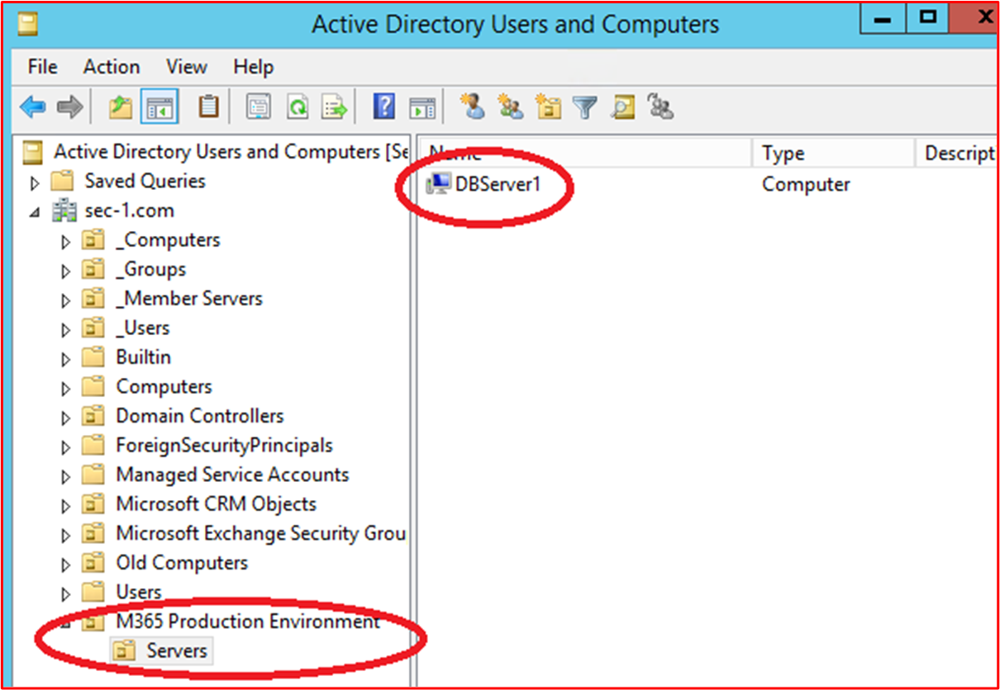

### Gestion des correctifs – Classement des risques

L’identification et la correction rapides des vulnérabilités de sécurité permettent de réduire les risques qu’un acteur de menace compromette l’environnement ou l’application. La gestion des correctifs est divisée en deux sections : classement des risques et mise à jour corrective. Ces trois contrôles couvrent l’identification des vulnérabilités de sécurité et leur classement en fonction du risque qu’elles posent.

Ce groupe de contrôle de sécurité est dans l’étendue des environnements d’hébergement PaaS (Platform-as-a-Service), car les bibliothèques de logiciels et la base de code tiers d’application/complément doivent être corrigés en fonction du classement des risques.

[Contrôle n° 10](#control-10) : Fournissez la documentation de stratégie qui régit la façon dont les nouvelles vulnérabilités de sécurité sont identifiées et affectées à un score de risque.

- Objectif : l’objectif de ce contrôle est de disposer d’une documentation de prise en charge pour garantir que les vulnérabilités de sécurité sont identifiées rapidement afin de réduire la fenêtre d’opportunités que les acteurs des menaces doivent exploiter ces vulnérabilités. Un mécanisme robuste doit être mis en place pour identifier les vulnérabilités couvrant tous les composants système utilisés par les organisations; par exemple, les systèmes d’exploitation (Windows Server, Ubuntu, etc.), les applications (Tomcat, MS Exchange, SolarWinds, etc.), les dépendances de code (AngularJS, jQuery, etc.). Les organisations doivent non seulement s’assurer de l’identification en temps opportun des vulnérabilités au sein du patrimoine, mais également classer toutes les vulnérabilités en conséquence pour s’assurer que la correction est effectuée dans un délai approprié en fonction du risque que présente la vulnérabilité.

**Note** Même si vous exécutez dans un environnement purement platform as a service, vous avez toujours la responsabilité d’identifier les vulnérabilités au sein de votre base de code : c’est-à-dire les bibliothèques tierces.

- Exemples de recommandations en matière de preuves : fournissez la documentation de support (pas les captures d’écran)

- Exemple de preuve : cette capture d’écran montre un extrait de code d’une stratégie de classement des risques.

**Note:** Cette capture d’écran montre un document de stratégie/processus, l’attente est que les éditeurs de logiciels indépendants partagent la documentation de stratégie/procédure de prise en charge réelle et ne fournissent pas simplement une screenshot._

[Contrôle n° 11](#control-11) : fournir des preuves de la façon dont les nouvelles vulnérabilités de sécurité sont identifiées.

- Objectif : l’objectif de ce contrôle est de s’assurer que le processus est suivi et qu’il&#39;suffisamment robuste pour identifier les nouvelles vulnérabilités de sécurité dans l’environnement. Il ne s’agit peut-être pas seulement des systèmes d’exploitation; il peut inclure des applications s’exécutant dans l’environnement et toutes les dépendances de code.

- Exemples de recommandations en matière de preuves : des preuves peuvent être fournies par le biais de l’affichage des abonnements aux listes de diffusion, de la vérification manuelle des sources de sécurité pour les vulnérabilités nouvellement publiées (il faudrait effectuer un suivi adéquat avec les horodatages des activités, c’est-à-dire avec JIRA ou Azure DevOps), des outils qui recherchent des logiciels obsolètes (par exemple, Snyk lorsque vous recherchez des bibliothèques de logiciels obsolètes, ou qui peuvent être utilisés par Nessus  analyses authentifiées qui identifient les logiciels obsolètes.)

**Note** Si vous utilisez Nessus, celui-ci doit être exécuté régulièrement pour identifier rapidement les vulnérabilités. Nous vous recommandons au moins une fois par semaine.

- Exemple de preuve : cette capture d’écran montre qu’un groupe de diffusion est utilisé pour être averti des vulnérabilités de sécurité.

[Contrôle n° 12](#control-12) : Fournir des preuves montrant que toutes les vulnérabilités se voient attribuer un classement des risques une fois identifiées.

- Intention : La mise à jour corrective doit être basée sur le risque, plus la vulnérabilité est risquée, plus vite elle doit être corrigée. Le classement des risques des vulnérabilités identifiées fait partie intégrante de ce processus. L’objectif de ce contrôle est de s’assurer qu’un processus de classement des risques documenté est suivi pour s’assurer que toutes les vulnérabilités identifiées sont correctement classées en fonction du risque. Les organisations utilisent généralement l’évaluation CVSS (Common Vulnerability Scoring System) fournie par les fournisseurs ou les chercheurs en sécurité. Il est recommandé que, si l’organisation s’appuie sur CVSS, un mécanisme de re-classement soit inclus dans le processus pour permettre à l’organisation de modifier le classement en fonction d’une évaluation des risques interne. Parfois, la vulnérabilité peut ne pas être une application en raison de la façon dont l’application a été déployée dans l’environnement. Par exemple, une vulnérabilité Java peut être publiée, ce qui a un impact sur une bibliothèque spécifique qui n’est pas utilisée par l’organisation.

- Exemples de recommandations en matière de preuves : fournissez des preuves par capture d’écran ou par d’autres moyens, par exemple, DevOps/Jira, qui montre que les vulnérabilités passent par le processus de classement des risques et se voient attribuer un classement des risques approprié par l’organisation.

- Exemple de preuve : cette capture d’écran montre le classement des risques qui se produit dans la colonne D et le reclassement dans les colonnes F et G, si l’organisation effectue une évaluation des risques et détermine que le risque peut être rétrogradé. Il faudrait fournir des preuves de redimensionnement des évaluations des risques comme preuves à l’appui

### Gestion des correctifs : mise à jour corrective

Les contrôles ci-dessous concernent l’élément de mise à jour corrective pour la gestion des correctifs. Pour maintenir un environnement d’exploitation sécurisé, les applications/modules complémentaires et les systèmes de prise en charge doivent être correctement corrigés. Un délai approprié entre l’identification (ou la publication publique) et la mise à jour corrective doit être géré pour réduire la fenêtre d’opportunité d’exploitation d’une vulnérabilité par un acteur de menace. La certification Microsoft 365 ne prévoit pas de fenêtre de mise à jour corrective &#39;&#39;, mais les analystes de certification rejetteront les délais qui ne sont pas raisonnables.

Ce groupe de contrôle de sécurité est dans l’étendue des environnements d’hébergement PaaS (Platform-as-a-Service), car les bibliothèques de logiciels et la base de code tiers d’application/complément doivent être corrigés en fonction du classement des risques.

[Contrôle n° 13](#control-13) : Fournissez une documentation de stratégie pour la mise à jour corrective des composants système dans l’étendue qui inclut une période de mise à jour corrective minimale appropriée pour les vulnérabilités critiques, élevées et moyennes ; et la désaffectation de tous les systèmes d’exploitation et logiciels non pris en charge.

- Intention : la gestion des correctifs est requise par de nombreux frameworks de conformité de sécurité, c’est-à-dire, PCI-DSS, ISO 27001, NIST (SP) 800-53. L’importance d’une bonne gestion des correctifs ne peut pas être trop soulignée, car elle peut corriger les problèmes de sécurité et de fonctionnalité dans les logiciels, les microprogrammes et atténuer les vulnérabilités, ce qui contribue à réduire les opportunités d’exploitation. L’objectif de ce contrôle est de réduire la fenêtre d’opportunité qu’un acteur de menace doit exploiter les vulnérabilités qui peuvent exister dans l’environnement dans l’étendue.

- Exemples de recommandations en matière de preuves : fournissez une copie de toutes les stratégies et procédures détaillant le processus de gestion des correctifs. Cela doit inclure une section sur une fenêtre de mise à jour corrective minimale, et que les systèmes d’exploitation et logiciels non pris en charge ne doivent pas être utilisés dans l’environnement.

- Exemple de preuve : voici un exemple de document de stratégie.

**Note:** Cette capture d’écran montre un document de stratégie/processus, l’attente est que les éditeurs de logiciels indépendants partagent la documentation de stratégie/procédure de prise en charge réelle et ne fournissent pas simplement une screenshot._

[Contrôle n° 14](#control-14) : Fournissez des preuves démontrant que tous les composants système échantillonné sont corrigés.

**Note:** Incluez tous les logiciels/bibliothèques tierces.

- Intention : La mise à jour corrective des vulnérabilités garantit que les différents modules qui font partie de l’infrastructure des technologies de l’information (matériel, logiciels et services) sont tenus à jour et exempts des vulnérabilités connues. La mise à jour corrective doit être effectuée dès que possible afin de réduire le potentiel d’un incident de sécurité entre la libération des détails des vulnérabilités et la mise à jour corrective. C’est encore plus critique lorsque l’exploitation des vulnérabilités est connue pour être dans la nature.

- Exemples de recommandations en matière de preuves : fournissez une capture d’écran pour _chaque appareil_ dans l’exemple et les composants logiciels de prise en charge montrant que les correctifs sont installés conformément au processus de mise à jour corrective documenté.

- Exemple de preuve : La capture d’écran suivante montre que le composant &quot;système d’étendue CLARANET-SBU-WM&quot; effectue Windows mises à jour conformément à la stratégie de mise à jour corrective.

**Note:** La mise à jour corrective de tous les composants système dans l’étendue doit être une preuve. Cela inclut des éléments tels que ; Mises à jour du système d’exploitation, mises à jour des applications/composants (i.e__.,_ _Apache Tomcat, OpenSSL, etc.), dépendances logicielles (par exemple, JQuery, AngularJS, etc.), etc._

[Contrôle n° 15](#control-15) : Fournissez des preuves démontrant que tous les systèmes d’exploitation et composants logiciels non pris en charge ne sont pas utilisés dans l’environnement.

- Intention : Les logiciels qui ne sont pas gérés par les fournisseurs souffriront, en heures supplémentaires, de vulnérabilités connues qui ne sont pas corrigées. Par conséquent, l’utilisation de systèmes d’exploitation et de composants logiciels non pris en charge ne doit pas être utilisée dans les environnements de production.

- Exemples de recommandations en matière de preuves : fournissez une capture d’écran pour _chaque appareil_ de l’exemple montrant la version du système d’exploitation en cours d’exécution (y compris le nom du serveur&#39;dans la capture d’écran). En outre, fournissez des preuves que les composants logiciels s’exécutant dans l’environnement exécutent des versions prises en charge. Pour ce faire, vous pouvez fournir la sortie des rapports d’analyse des vulnérabilités internes (l’analyse authentifiée est incluse) et/ou la sortie des outils qui vérifient les bibliothèques tierces, telles que [Snyk](https://snyk.io/), [Trivy](https://github.com/aquasecurity/trivy) ou [audit NPM](https://docs.npmjs.com/cli/v7/commands/npm-audit). S’il s’exécute uniquement dans PaaS, seule la mise à jour corrective de bibliothèque tierce doit être couverte par les groupes de contrôle de mise à jour corrective.

- Exemple de preuve : Les preuves suivantes montrent que le composant système dans l’étendue THOR exécute des logiciels pris en charge par le fournisseur, car Nessus n’a&#39;signalé aucun problème.

**Note:** Le rapport complet doit être partagé avec les analystes de certification.

- Exemple de preuve 2

Cette capture d’écran montre que le composant &quot;système in-scope CLARANET-SBU-WM&quot; s’exécute sur une version Windows prise en charge.

- Exemple de preuve 3

La capture d’écran suivante représente la sortie [Trivy](https://github.com/aquasecurity/trivy) , que le rapport complet ne répertorie&#39;pas d’applications non prises en charge.

**Note:** Le rapport complet doit être partagé avec les analystes de certification.

### Analyse des vulnérabilités

En introduisant des évaluations de vulnérabilités régulières, les organisations peuvent détecter les faiblesses et les insécurités au sein de leurs environnements, ce qui peut fournir un point d’entrée pour qu’un acteur malveillant compromette l’environnement. L’analyse des vulnérabilités peut aider à identifier les correctifs manquants ou les configurations incorrectes au sein de l’environnement. En effectuant régulièrement ces analyses, une organisation peut fournir une correction appropriée pour réduire le risque de compromission en raison de problèmes couramment détectés par ces outils d’analyse des vulnérabilités.

[Contrôle n° 16](#control-16) : Fournissez les rapports d’analyse des vulnérabilités de l’infrastructure trimestrielle et des applications web. L’analyse doit être effectuée sur l’intégralité de l’empreinte publique (adresses IP et URL) et des plages d’adresses IP internes.

**Note:** Cela **DOIT** inclure l’étendue complète de l’environnement.

- Intention : L’analyse des vulnérabilités recherche les faiblesses possibles dans un système informatique, des réseaux et des applications web d’une organisation afin d’identifier les failles susceptibles d’entraîner des violations de la sécurité et l’exposition de données sensibles. L’analyse des vulnérabilités est souvent requise par les normes du secteur et les réglementations gouvernementales, par exemple la norme PCI DSS (Payment Card Industry Data Security Standard).

- Un rapport de La métrique de sécurité intitulé &quot;[2020 Security Metrics Guide to PCI DSS Compliance (Guide des métriques de sécurité pour la conformité](https://info.securitymetrics.com/pci-guide-2020)&quot; PCI DSS) indique que &#39;en moyenne 166 jours se sont écoulés entre le moment où une organisation a été vue comme présentant des vulnérabilités pour qu’une personne malveillante compromette le système. Une fois compromis, les attaquants ont eu accès à des données sensibles pendant une moyenne de 127 jours&#39; par conséquent, ce contrôle vise à identifier les failles de sécurité potentielles au sein de l’environnement dans l’étendue.

- Exemples de recommandations en matière de preuves : fournissez le ou les rapports d’analyse complets pour chaque trimestre&#39;analyses de vulnérabilité effectuées au cours des 12 derniers mois. Les rapports doivent indiquer clairement les cibles pour vérifier que l’empreinte publique complète est incluse et, le cas échéant, chaque sous-réseau interne. Fournissez **TOUS les** rapports d’analyse pour **CHAQUE** trimestre.

- Exemple de preuve : Exemple de preuve : fournir les rapports d’analyse à partir de l’outil d’analyse utilisé. Chaque trimestre&#39;rapports d’analyse doivent être fournis pour révision. L’analyse doit inclure l’ensemble des composants système des environnements. chaque sous-réseau interne et chaque adresse IP/URL publique disponible pour l’environnement.

[Contrôle n° 17](#control-17) : Fournissez des preuves démontrant que la correction des vulnérabilités identifiées lors de l’analyse des vulnérabilités est corrigée conformément à votre période de mise à jour corrective documentée.

- Intention : Le fait de ne pas identifier, gérer et corriger rapidement les vulnérabilités et les erreurs de configuration peut augmenter le risque d’une organisation&#39;d’une compromission pouvant entraîner des violations de données potentielles. L’identification et la correction correctes des problèmes sont considérées comme importantes pour une organisation&#39;la posture et l’environnement de sécurité globaux, conformément aux meilleures pratiques de divers frameworks de sécurité pour ; exemple, iso 27001 et DSS PCI.

- Exemples de recommandations en matière de preuves : fournir des artefacts appropriés (c’est-à-dire des captures d’écran) montrant qu’un échantillon de vulnérabilités découvertes à partir de l’analyse des vulnérabilités est corrigé conformément aux fenêtres de mise à jour corrective déjà fournies dans le contrôle 13 ci-dessus.

- Exemple de preuve : la capture d’écran suivante montre une analyse Nessus de l’environnement dans l’étendue (un seul ordinateur dans cet exemple nommé &quot;THOR&quot;) montrant des vulnérabilités le 2 août 2021.

La capture d’écran suivante montre que les problèmes ont été résolus, 2 jours plus tard, dans la fenêtre de mise à jour corrective définie dans la stratégie de mise à jour corrective.

**Note:** Pour ce contrôle, les analystes de certification doivent voir les rapports d’analyse des vulnérabilités et la correction pour chaque trimestre au cours des douze derniers mois.

### Pare-feu

Les pare-feu fournissent souvent une limite de sécurité entre les environnements approuvés (réseau interne), non approuvés (Internet) et semi-approuvés (DMZ). Il s’agit généralement de la première ligne de défense au sein d’une stratégie de sécurité de défense en profondeur des organisations, conçue pour contrôler les flux de trafic pour les services d’entrée et de sortie et pour bloquer le trafic indésirable. Ces appareils doivent être étroitement contrôlés pour s’assurer qu’ils fonctionnent efficacement et sont exempts de configuration incorrecte qui pourrait mettre l’environnement en danger.

[Contrôle n° 18](#control-18) : Fournissez une documentation de stratégie qui régit les procédures et les pratiques de gestion du pare-feu.

- Intention : Les pare-feu constituent une première ligne de défense importante dans une stratégie de sécurité en couches (défense en profondeur), qui protège les environnements contre les zones réseau moins fiables. Les pare-feu contrôlent généralement les flux de trafic basés sur les adresses IP et les protocoles/ports. Des pare-feu plus riches en fonctionnalités peuvent également fournir des défenses de couche&quot; d’application supplémentaires &quot;en inspectant le trafic des applications afin de se protéger contre les utilisations abusives, les vulnérabilités et les menaces en fonction des applications accessibles. Ces protections sont seulement aussi efficaces que la configuration du pare-feu. Par conséquent, des stratégies de pare-feu et des procédures de support solides doivent être en place pour s’assurer qu’elles sont configurées pour fournir une protection adéquate des ressources internes. Par exemple, un pare-feu avec une règle permettant d’autoriser TOUT le trafic de n’importe quelle source vers une destination ANY agit simplement en tant que routeur.

- Exemples de recommandations en matière de preuves : fournissez la documentation complète de votre stratégie/procédure de pare-feu. Ce document doit couvrir tous les points ci-dessous et toutes les meilleures pratiques supplémentaires applicables à votre environnement.

- Exemple de preuve : voici un exemple du type de document de stratégie de pare-feu dont nous avons besoin (il s’agit d’une démonstration qui n’est peut-être pas complète).

[Contrôle n° 19](#control-19) : Fournissez des preuves tangibles que toutes les informations d’identification d’administration par défaut sont modifiées avant l’installation dans des environnements de production.

- Intention : les organisations doivent tenir compte des informations d’identification d’administration par défaut fournies par le fournisseur qui sont configurées pendant la configuration de l’appareil ou du logiciel. Les informations d’identification par défaut sont souvent disponibles publiquement par les fournisseurs et peuvent fournir à un acteur de menace externe la possibilité de compromettre un environnement. Par exemple, une recherche simple sur Internet des informations d’identification iDrac par défaut (contrôleur d’accès à distance Dell intégré) met en surbrillance _root::calvin_ comme nom d’utilisateur et mot de passe par défaut. Cela permet à une personne d’accéder à distance à la gestion des serveurs distants. L’objectif de ce contrôle est de s’assurer que les environnements ne sont pas susceptibles d’être attaqués par le biais d’informations d’identification de fournisseur par défaut qui n’ont pas été modifiées pendant le renforcement de l’appareil/de l’application.

- Exemples de recommandations en matière de preuves

- Cela peut être démontré par le biais d’une session de partage d’écran où l’analyste de certification peut essayer de s’authentifier auprès des appareils dans l’étendue à l’aide des informations d’identification par défaut.

- Exemple de preuve

La capture d’écran ci-dessous montre ce que l’analyste de certification voit à partir d’un nom d’utilisateur/mot de passe non valide d’un pare-feu WatchGuard.

[Contrôle 20](#control-20) : Fournissez des preuves tangibles que les pare-feu sont installés à la limite de l’environnement dans l’étendue et installés entre le réseau de périmètre (également appelé DMZ, zone démilitarisée et sous-réseau filtré) et les réseaux approuvés internes.

- Intention : Les pare-feu permettent de contrôler le trafic entre différentes zones réseau de différents niveaux de sécurité. Étant donné que tous les environnements sont connectés à Internet, les pare-feu doivent être installés sur la limite, c’est-à-dire entre Internet et l’environnement dans l’étendue. En outre, les pare-feu doivent être installés entre les réseaux DMZ moins approuvés (zone dé-militarisée) et les réseaux approuvés internes. Les DMZ sont généralement utilisées pour servir le trafic à partir d’Internet et sont donc une cible d’attaque. En implémentant une zone DMZ et en utilisant un pare-feu pour contrôler les flux de trafic, une compromission de la DMZ n'&#39;pas nécessairement une compromission des réseaux approuvés internes et des données d’entreprise/client. Une journalisation et des alertes adéquates doivent être mises en place pour aider les organisations à identifier rapidement un compromis afin de minimiser la possibilité pour l’acteur de menace de compromettre davantage les réseaux approuvés internes. L’objectif de ce contrôle est de s’assurer qu’il existe un contrôle adéquat entre les réseaux approuvés et les réseaux moins approuvés.

- Exemples de recommandations en matière de preuves : les preuves doivent être fournies par le moyen de fichiers de configuration de pare-feu ou de captures d’écran montrant qu’une zone DMZ est en place. Cela doit correspondre aux diagrammes architecturaux fournis illustrant les différents réseaux qui prennent en charge l’environnement. Une capture d’écran des interfaces réseau sur le pare-feu, associée au diagramme réseau déjà fourni dans le cadre de la soumission initiale du document, doit fournir cette preuve.

- Exemple de preuve : voici une capture d’écran d’un pare-feu WatchGuard montrant deux zones DMZ, l’une pour les services entrants (nomméS DMZ), l’autre qui sert le jumpbox (hôte Bastian).

[Contrôle 21](#control-21) : Fournir des preuves tangibles que tous les accès publics se terminent dans la zone démilitarisée (DMZ).

- Intention : Les ressources accessibles publiquement sont ouvertes à une multitude d’attaques. Comme indiqué ci-dessus, l’objectif d’une zone DMZ est de segmenter les réseaux moins approuvés à partir de réseaux internes approuvés qui peuvent contenir des données sensibles. Une zone DMZ est considérée comme moins fiable, car il existe un grand risque que les hôtes accessibles publiquement ne soient pas compromis par des acteurs de menace externes. L’accès public doit toujours se terminer dans ces réseaux moins approuvés, qui sont correctement segmentés par le pare-feu pour protéger les ressources et les données internes. L’objectif de ce contrôle est de s’assurer que tous les accès publics se terminent dans ces DMZ moins fiables, comme si les ressources sur les réseaux internes approuvés étaient accessibles au public, une compromission de ces ressources fournit à un acteur de menace un pied d’entrée dans le réseau où les données sensibles sont conservées.

- Exemples de recommandations en matière de preuves

- Les preuves fournies pour cela peuvent être des configurations de pare-feu qui montrent les règles de trafic entrant et où ces règles se terminent, soit en routant les adresses IP publiques vers les ressources, soit en fournissant le NAT (Traduction d’adresses réseau) du trafic entrant.

- Exemple de preuve

Dans la capture d’écran ci-dessous, il y a trois règles entrantes, chacune montrant la NAT aux sous-réseaux 10.0.3.x et 10.0.4.x, qui sont les sous-réseaux DMZ

[Contrôle 22](#control-22) : Fournissez des preuves tangibles que tout le trafic autorisé via le pare-feu passe par un processus d’approbation.

- Intention : Étant donné que les pare-feu constituent une barrière défensive entre le trafic non approuvé et les ressources internes, et entre les réseaux de différents niveaux d’approbation, les pare-feu doivent être configurés en toute sécurité et garantir que seul le trafic nécessaire pour les opérations commerciales est activé. En autorisant un flux de trafic inutile ou un flux de trafic trop permissif, cela peut introduire des faiblesses dans la défense à la limite de ces différentes zones réseau. En établissant un processus d’approbation robuste pour toutes les modifications apportées au pare-feu, le risque d’introduire une règle qui introduit un risque significatif pour l’environnement est réduit. Verizon&#39;[2020 Data Breach Investigation Report](https://enterprise.verizon.com/en-gb/resources/reports/dbir/) souligne que &quot;error&#39;s&quot;, qui inclut des configurations incorrectes, est le seul type d’action qui augmente constamment d’une année à l’autre.

- Exemples de recommandations en matière de preuves : les preuves peuvent se présenter sous la forme d’une documentation montrant qu’une demande de modification de pare-feu est autorisée, qui peut être à quelques minutes d’une réunion CAB (Change Conseiller Board) ou d’un système de contrôle des modifications qui effectue le suivi de toutes les modifications.

- Exemple de preuve : la capture d’écran suivante montre une modification de règle de pare-feu demandée et autorisée à l’aide d’un processus papier. Cela peut être obtenu par le biais de quelque chose comme DevOps ou Jira, par exemple.

[Contrôle 23](#control-23) : Fournissez des preuves tangibles que la base de règles de pare-feu est configurée pour supprimer le trafic qui n’est pas explicitement défini.

- Intention : la plupart des pare-feu traitent les règles dans une approche de haut en bas pour essayer de trouver une règle de correspondance. Si une règle correspond, l’action de cette règle est appliquée et tout le traitement ultérieur des règles s’arrête. Si aucune règle de correspondance n’est trouvée, le trafic est refusé par défaut. L’objectif de ce contrôle est que, si le pare-feu n'&#39;pas par défaut de supprimer le trafic si aucune règle de correspondance n’est trouvée, la base de règles doit inclure une &quot;règle Refuser tout&quot; à la fin des listes de pare-feu **ALL** . Cela permet de s’assurer que le pare-feu n'&#39;pas par défaut dans un état d’autorisation par défaut lors du traitement des règles, autorisant ainsi le trafic qui n’a&#39;pas été défini explicitement.

- Exemples de recommandations de preuve : les preuves peuvent être fournies par le moyen de la configuration du pare-feu, ou par des captures d’écran montrant toutes les règles de pare-feu montrant une &quot;règle Refuser tout&quot; à la fin, ou si le pare-feu supprime le trafic qui ne correspond&#39;pas à une règle par défaut, puis fournissez une capture d’écran de toutes les règles de pare-feu et un lien vers les guides d’administration du fournisseur mettant en évidence que par défaut le pare-feu supprime tout le trafic non mis en correspondance.

- Exemple de preuve : Voici une capture d’écran de la base de règles de pare-feu WatchGuard qui montre qu’aucune règle n’est configurée pour autoriser tout le trafic. Il n’existe aucune règle de refus à la fin, car WatchGuard supprime le trafic qui ne correspond&#39;pas par défaut.

Lien WatchGuard Help Center suivant ; [https://www.watchguard.com/help/docs/help-center/en-US/Content/en-US/Fireware/policies/policies\_about\_c.html](https://www.watchguard.com/help/docs/help-center/en-US/Content/en-US/Fireware/policies/policies_about_c.html) inclut les informations suivantes :

[Contrôle 24](#control-24) : Fournissez des preuves tangibles que le pare-feu prend en charge uniquement le chiffrement fort sur toutes les interfaces d’administration non console.

- Intention : Pour atténuer les attaques de l’intercepteur du trafic administratif, toutes les interfaces d’administration non console doivent prendre en charge uniquement le chiffrement fort. L’objectif principal de ce contrôle est de protéger les informations d’identification d’administration, car la connexion non console est configurée. En outre, cela peut également vous aider à vous protéger contre les écoutes clandestines dans la connexion, en essayant de relire les fonctions d’administration pour reconfigurer l’appareil ou dans le cadre de la reconnaissance.

- Exemples de recommandations en matière de preuves : fournissez la configuration du pare-feu, si la configuration fournit la configuration de chiffrement des interfaces d’administration non console (tous les appareils ne l’incluront pas comme options configurables). Si ce n’est&#39;pas dans la configuration, vous pouvez émettre des commandes sur l’appareil pour afficher ce qui est configuré pour ces connexions. Certains fournisseurs peuvent publier ces informations dans des articles, ce qui peut également être un moyen de prouver ces informations. Enfin, vous devrez peut-être exécuter des outils pour générer le chiffrement pris en charge.

- Exemple de preuve : la capture d’écran ci-dessous montre la sortie de [SSLScan](https://github.com/rbsec/sslscan) par rapport à l’interface d’administration web du pare-feu WatchGuard sur le port TCP 8080. Cela montre TLS 1.2 ou version ultérieure avec un chiffrement de chiffrement minimal de AES-128bit.
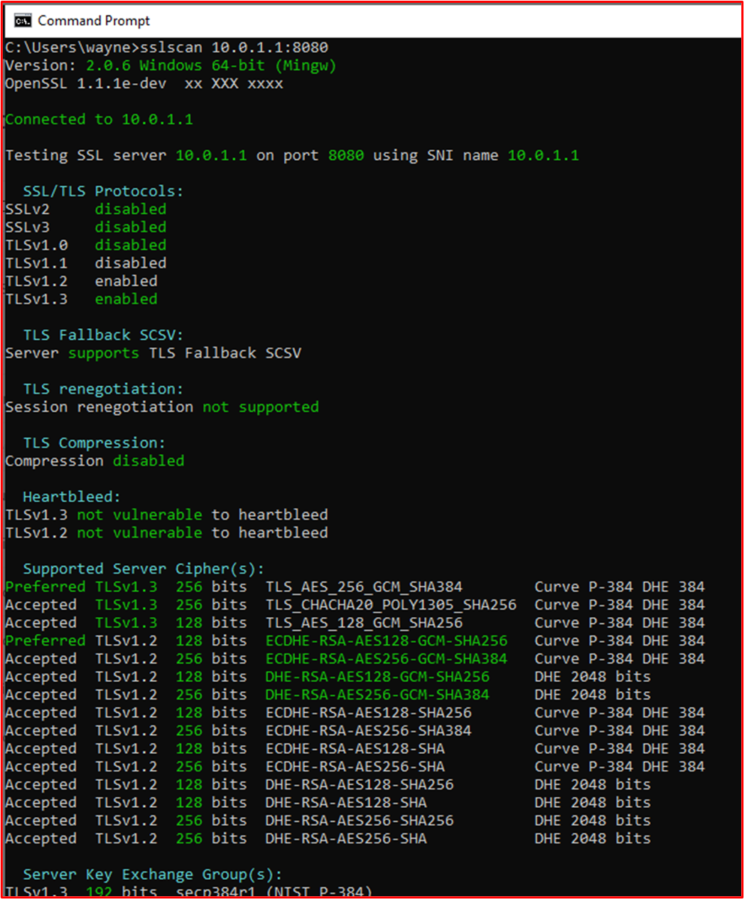

**Remarque** : les pare-feu WatchGuard prennent également en charge les fonctions administratives à l’aide de SSH (port TCP 4118) et de WatchGuard System Manager (ports TCP 4105 &amp; 4117). Il faudrait également fournir des preuves de ces interfaces d’administration non console.

[Contrôle 25](#control-25) : Fournissez des preuves démontrant que vous effectuez des révisions de règles de pare-feu au moins tous les 6 mois.

- Intention : Au fil du temps, il existe un risque de glisser la configuration dans les composants système avec l’environnement dans l’étendue. Cela peut souvent introduire des insécurités ou des configurations incorrectes qui peuvent augmenter le risque de compromission de l’environnement. Le fluage de configuration peut être introduit pour de nombreuses raisons, telles que des modifications temporaires pour faciliter la résolution des problèmes, des modifications temporaires pour les modifications fonctionnelles ad hoc, pour introduire des correctifs rapides aux problèmes qui peuvent parfois être trop permissifs en raison des pressions liées à l’introduction d’un correctif rapide. Par exemple, vous pouvez introduire une règle &quot;de pare-feu temporaire Autoriser tout&quot; résoudre un problème urgent. L’objectif de ce contrôle est double, tout d’abord d’identifier les situations où des configurations incorrectes peuvent introduire des insécurités et, d’autre part, d’aider à identifier les règles de pare-feu qui ne sont plus nécessaires et peuvent donc être supprimées, c’est-à-dire si un service a été mis hors service mais que la règle de pare-feu a été laissée en arrière.

- Exemples de recommandations en matière de preuve : les preuves doivent être en mesure de démontrer que les réunions d’examen ont eu lieu. Pour ce faire, vous pouvez partager les minutes de réunion de l’examen du pare-feu et toute preuve de contrôle des modifications supplémentaire qui montre toutes les actions effectuées à partir de la révision. Assurez-vous que les dates sont présentes car nous&#39;avons besoin de voir au moins deux de ces réunions (c’est-à-dire tous les six mois)

- Exemple de preuve : la capture d’écran suivante montre la preuve d’une révision du pare-feu en janvier 2021.

La capture d’écran suivante montre la preuve d’une révision du pare-feu en juillet 2021.

### Pare-feu – PARE-FEU

Il est facultatif de déployer un Web Application Firewall (WAF) dans la solution. Si un pare-feu d’applications web (WAF) est utilisé, il s’agit de crédits supplémentaires pour la matrice de scoring dans le domaine de sécurité&#39; de sécurité &#39;De sécurité opérationnelle. Les pare-feu d’applications web peuvent inspecter le trafic web pour filtrer et surveiller le trafic web entre Internet et les applications web publiées afin d’identifier les attaques spécifiques aux applications web. Les applications web peuvent souffrir de nombreuses attaques spécifiques aux applications web telles que l’injection de SQL (SQLi), les scripts intersites (XSS), les falsifications de requête intersites (CSRF/XSRF), etc. et les WAFs sont conçues pour se protéger contre ces types de charges utiles malveillantes afin de protéger les applications web contre les attaques et les compromissions potentielles.

[Contrôle 26](#control-26) : Fournissez des preuves démontrant que le Web Application Firewall (WAF) est configuré pour surveiller, alerter et bloquer activement le trafic malveillant.

- Intention : ce contrôle est en place pour confirmer que le pare-feu d’applications web est en place pour toutes les connexions web entrantes et qu’il est configuré pour bloquer ou alerter le trafic malveillant. Pour fournir une couche de défense supplémentaire pour le trafic web, les wafs doivent être configurés pour toutes les connexions web entrantes. Sinon, les acteurs de menace externe pourraient contourner les wafs conçus pour fournir cette couche de protection supplémentaire. Si le waf n’est&#39;pas configuré pour bloquer activement le trafic malveillant, le WAF doit être en mesure de fournir une alerte immédiate au personnel qui peut réagir rapidement au trafic malveillant potentiel pour aider à maintenir la sécurité de l’environnement et à arrêter les attaques.

- Exemples de recommandations en matière de preuves : fournissez une sortie de configuration à partir du pare-feu d’applications web qui met en évidence les connexions web entrantes qui sont traitées et que la configuration bloque activement le trafic malveillant ou surveille et alerte. Vous pouvez également partager des captures d’écran des paramètres spécifiques pour illustrer qu’une organisation répond à ce contrôle.

- Exemple de preuve : Les captures d’écran suivantes montrent que la stratégie WAF contoso Production Azure Application Gateway est activée et qu’elle est configurée pour &#39;mode de prévention&#39;, ce qui supprime activement le trafic malveillant.

La capture d’écran ci-dessous montre la configuration ip front-end

**Note:** Les preuves doivent illustrer toutes les adresses IP publiques utilisées par l’environnement pour garantir que tous les points d’entrée sont couverts. C’est pourquoi cette capture d’écran est également incluse.

La capture d’écran ci-dessous montre les connexions web entrantes à l’aide de ce pare-feu d’applications web.

La capture d’écran suivante montre les contosoAppGWCoreRules\_\_ montrant qu’il s’agit du service api.contoso.com.

[Contrôle 27](#control-27) : Fournir des preuves tangibles que le pare-feu d’applications web prend en charge le déchargement SSL.

- Intention : La possibilité de configurer le pare-feu d’applications web pour prendre en charge le déchargement SSL est importante, sinon le pare-feu d’applications web ne pourra pas inspecter le trafic HTTPS. Étant donné que ces environnements doivent prendre en charge le trafic HTTPS, il s’agit d’une fonction critique pour le pare-feu d’applications web pour s’assurer que les charges utiles malveillantes dans le trafic HTTPS peuvent être identifiées et arrêtées.

- Exemples de recommandations en matière de preuves : fournissez des preuves de configuration via une exportation de configuration ou des captures d’écran qui montrent que le déchargement SSL est pris en charge et configuré.

- Exemple de preuve : dans Azure Application Gateway, configuration d’un déchargement SSL activé par l’écouteur SSL, consultez la [vue d’ensemble de l’arrêt TLS et du protocole TLS de bout en bout avec Application Gateway](/azure/application-gateway/ssl-overview) page de documentation Microsoft. La capture d’écran suivante montre cette configuration pour contoso Production Azure Application Gateway.

[Contrôle 28](#control-28) : « Fournissez des preuves démontrant que le pare-feu d’applications web est protégé contre une partie ou l’ensemble des classes de vulnérabilités suivantes conformément à l’ensemble de règles OWASP Core (3.0 ou 3.1) :
- problèmes de protocole et d’encodage,
- l’injection d’en-tête, la contrebande de demandes et le fractionnement des réponses,
- attaques par parcours de fichiers et de chemins,
- attaques d’inclusion de fichier distant (RFI),
- attaques d’exécution de code à distance,
- Attaques par injection PHP,
- attaques de scripts intersites,
- SQL attaques par injection,
- attaques de fixation de session.

- Intention : les WAF doivent être configurés pour identifier les charges utiles d’attaque pour les classes de vulnérabilités courantes. Ce contrôle vise à garantir une détection adéquate des classes de vulnérabilité en tirant parti de l’ensemble de règles OWASP Core.

- Exemples de recommandations en matière de preuves : fournir des preuves de configuration via une exportation de configuration ou des captures d’écran montrent que la plupart des classes de vulnérabilité identifiées ci-dessus sont couvertes par l’analyse.

- Exemple de preuve : la capture d’écran ci-dessous montre que la stratégie WAF contoso Production Azure Application Gateway est configurée pour l’analyse sur l’ensemble de règles OWASP Core Version 3.2.

### Modifier le contrôle

Un processus de contrôle des modifications établi et compris est essentiel pour s’assurer que toutes les modifications passent par un processus structuré qui est reproductible. En veillant à ce que toutes les modifications passent par un processus structuré, les organisations peuvent s’assurer que les modifications sont gérées efficacement, examinées par les pairs et testées correctement avant d’être signées. Cela permet non seulement de réduire le risque de pannes système, mais également de réduire le risque d’incidents de sécurité potentiels par l’introduction de modifications incorrectes.

[Contrôle 29](#control-29) : Fournissez une documentation de stratégie qui régit les processus de contrôle des modifications.

- Intention : Pour maintenir un environnement sécurisé et une application sécurisée, un processus de contrôle des modifications robuste doit être établi pour garantir que toutes les modifications apportées à l’infrastructure et au code sont effectuées avec une surveillance forte et des processus définis. Cela permet de s’assurer que les modifications sont documentées, que les implications en matière de sécurité sont prises en compte, que la réflexion a été prise en compte sur l’impact de la modification sur la sécurité, etc. L’objectif est de s’assurer que le processus de contrôle des modifications est documenté pour s’assurer qu’une approche sécurisée et cohérente est adoptée pour toutes les modifications apportées à l’environnement et aux pratiques de développement d’applications.

- Exemples de recommandations en matière de preuve : les stratégies/procédures de contrôle des modifications documentées doivent être partagées avec les analystes de certification.

- Exemple de preuve : ci-dessous montre le début d’un exemple de stratégie de gestion des modifications. Veuillez fournir vos stratégies et procédures complètes dans le cadre de l’évaluation.

**Note:** Cette capture d’écran montre un document de stratégie/processus, l’attente est que les éditeurs de logiciels indépendants partagent la documentation de stratégie/procédure de prise en charge réelle et ne fournissent pas simplement une capture d’écran.

[Contrôle 30](#control-30) : Fournir des preuves démontrant que les environnements de développement et de test appliquent la séparation des tâches de l’environnement de production.

- Intention : La plupart des environnements de développement/test de l’organisation&#39;ne sont pas configurés avec la même vigueur que les environnements de production et sont donc moins sécurisés. En outre, les tests ne doivent pas être effectués dans l’environnement de production, car cela peut introduire des problèmes de sécurité ou nuire à la prestation des services pour les clients. En conservant des environnements distincts qui appliquent une séparation des tâches, les organisations peuvent s’assurer que les modifications sont appliquées aux environnements appropriés, réduisant ainsi le risque d’erreurs en implémentant des modifications dans les environnements de production lorsqu’elles étaient destinées à l’environnement de développement/test.

- Exemples de recommandations en matière de preuves : des captures d’écran peuvent être fournies pour illustrer différents environnements utilisés pour les environnements de développement/test et les environnements de production. En règle générale, vous disposez de différentes personnes/équipes ayant accès à chaque environnement, ou lorsque cela n’est pas possible, les environnements utilisent différents services d’autorisation pour s’assurer que les utilisateurs ne peuvent pas se connecter par erreur à l’environnement incorrect pour appliquer des modifications.

- Exemple de preuve : la capture d’écran suivante montre un abonnement Azure pour l’environnement TEST de Contoso&#39;.

Cette capture d’écran suivante montre un abonnement Azure distinct pour l’environnement&#39; &#39;PRODUCTION de Contoso&#39;.

[Contrôle 31](#control-31) : Fournissez des preuves démontrant que les données de production sensibles ne sont pas utilisées dans les environnements de développement ou de test.

- Intention : Comme indiqué ci-dessus, les organisations n’implémentent pas les mesures de sécurité d’un environnement de développement/test avec la même vigueur que l’environnement de production. Par conséquent, en utilisant des données de production sensibles dans ces environnements de développement/test, vous augmentez le risque de compromission et vous devez éviter d’utiliser des données dynamiques/sensibles dans ces environnements de développement/test.

**Note:** Vous pouvez utiliser des données dynamiques dans des environnements de développement/test, à condition que le développement/test soit inclus dans l’étendue de l’évaluation afin que la sécurité puisse être évaluée par rapport aux contrôles de certification Microsoft 365.

- Exemples de recommandations en matière de preuves : les preuves peuvent être fournies en partageant des captures d’écran de la sortie de la même requête SQL sur une base de données de production (rédaction d’informations sensibles) et la base de données de développement/test. La sortie des mêmes commandes doit produire différents jeux de données. Là où les fichiers sont stockés, l’affichage du contenu des dossiers dans les deux environnements doit également illustrer différents jeux de données.

- Exemple de preuve : la capture d’écran suivante montre les 3 premiers enregistrements (pour la soumission de preuves, indiquez les 20 premiers) de la base de données de production.

La capture d’écran suivante montre la même requête de la base de données de développement, montrant différents enregistrements.

Cela montre que les jeux de données sont différents.

[Contrôle 32](#control-32) : Fournir des preuves démontrant que les demandes de modification documentées contiennent l’impact de la modification, les détails des procédures de sauvegarde et des tests à effectuer.

- Intention : l’objectif de ce contrôle est de s’assurer que la réflexion a été prise dans la modification demandée. L’impact du changement sur la sécurité du système/de l’environnement doit être pris en compte et clairement documenté, toutes les procédures de secours doivent être documentées pour faciliter la récupération en cas de problème, et enfin les détails des tests nécessaires pour valider la modification a réussi doivent également être réfléchis et documentés.

- Exemples de recommandations en matière de preuve : les preuves peuvent être fournies en exportant un échantillon de demandes de modification, en fournissant des demandes de modification sur papier ou en fournissant des captures d’écran des demandes de modification montrant ces trois détails contenus dans la demande de modification.

- Exemple de preuve : l’image ci-dessous montre une nouvelle vulnérabilité de script intersite (XSS) affectée et un document pour la demande de modification.

Les tickets ci-dessous montrent les informations qui ont été définies ou ajoutées au ticket lors de sa résolution.

 

Les deux tickets ci-dessous montrent l’impact de la modification du système et des procédures de sauvegarde qui peuvent être nécessaires en cas de problème. Vous pouvez voir l’impact des modifications et des procédures de sauvegarde qui ont fait l’objet d’un processus d’approbation et ont été approuvés pour les tests.

À gauche de l’écran, vous pouvez voir que le test des modifications a été approuvé, à droite vous voyez que les modifications ont été approuvées et testées.

Tout au long du processus, notez que la personne qui effectue le travail, la personne qui en fait rapport et la personne qui approuve le travail à accomplir sont des personnes différentes.

Le ticket ci-dessus montre que les modifications ont été approuvées pour l’implémentation dans l’environnement de production. La zone de droite montre que le test a fonctionné et a réussi et que les modifications ont été implémentées dans Prod Environment.

[Contrôle 33](#control-33) : Fournir des preuves démontrant que les demandes de modification sont soumises à un processus d’autorisation et d’approbation.

- Intention : le processus doit être implémenté, ce qui interdit l’exécution des modifications sans autorisation et déconnexion appropriées. La modification doit être autorisée avant d’être implémentée et la modification doit être signée une fois terminée. Cela garantit que les demandes de modification ont été correctement examinées et qu’une personne en autorité a signé la modification.

- Exemples de recommandations en matière de preuve : vous pouvez fournir des preuves en exportant un échantillon de demandes de modification, en fournissant des demandes de modification sur papier ou en fournissant des captures d’écran des demandes de modification montrant que la modification a été autorisée, avant l’implémentation, et que la modification a été signée une fois terminée.

- Exemple de preuve : la capture d’écran ci-dessous montre un exemple de ticket Jira montrant que la modification doit être autorisée avant d’être implémentée et approuvée par une autre personne que le développeur/demandeur. Vous pouvez voir que les modifications apportées ici sont approuvées par une personne ayant autorité. À droite a été signé par DP une fois terminé.

Dans le ticket ci-dessous, vous pouvez voir que la modification a été signée une fois terminée et affiche le travail terminé et fermé.

### Développement/déploiement de logiciels sécurisés

Les organisations impliquées dans des activités de développement de logiciels sont souvent confrontées à des priorités concurrentes entre la sécurité et les pressions TTM (Time to Market), mais la mise en œuvre d’activités liées à la sécurité tout au long du cycle de vie du développement logiciel (SDLC) peut non seulement faire des économies, mais aussi gagner du temps. Lorsque la sécurité est laissée après coup, les problèmes sont généralement identifiés uniquement pendant la phase de test de la (DSLC), ce qui peut souvent être plus long et coûteux à résoudre. L’objectif de cette section de sécurité est de s’assurer que les pratiques de développement de logiciels sécurisés sont suivies afin de réduire le risque d’introduction de défauts de codage dans le logiciel développé. En outre, cette section cherche à inclure certains contrôles pour faciliter le déploiement sécurisé des logiciels.

[Contrôle 34](#control-34) : Fournissez des stratégies et des procédures qui prennent en charge le développement et le déploiement de logiciels sécurisés, notamment des conseils sur les meilleures pratiques de codage sécurisé pour les classes de vulnérabilité courantes telles que OWASP Top 10 ou SANS Top 25 CWE.

- Intention : Les organisations doivent faire tout ce qui est en leur pouvoir pour s’assurer que les logiciels sont développés en toute sécurité et exempts de vulnérabilités. Pour ce faire, il convient d’établir un cycle de vie de développement logiciel sécurisé (SDLC) et des meilleures pratiques de codage sécurisé pour promouvoir des techniques de codage sécurisées et un développement sécurisé tout au long du processus de développement de logiciels. L’objectif est de réduire le nombre et la gravité des vulnérabilités dans le logiciel.

- Exemples de recommandations en matière de preuves : fournissez la documentation SDLC documentée et/ou la documentation de support qui montre qu’un cycle de vie de développement sécurisé est utilisé et que des conseils sont fournis à tous les développeurs pour promouvoir les meilleures pratiques en matière de codage sécurisé. Jetez un coup d’œil à [OWASP dans SDLC](https://owasp.org/www-project-integration-standards/writeups/owasp_in_sdlc/) et au [modèle de maturité OWASP Software Assurance](https://owaspsamm.org/model/) (SAMM).

- Exemple de preuve : Voici un extrait de la procédure de développement logiciel sécurisé de Contoso&#39;, qui illustre des pratiques de développement et de codage sécurisées.

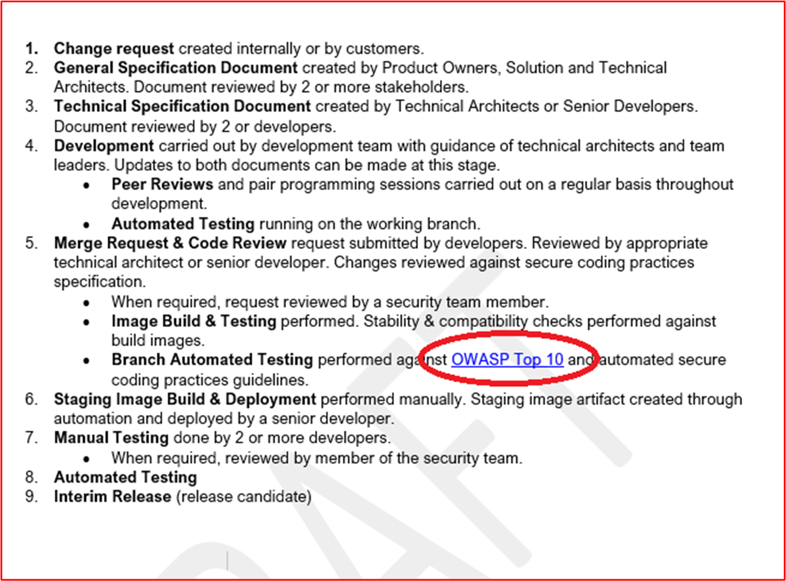

**Note:** Ces captures d’écran montrent le document de développement logiciel sécurisé, l’attente est que les éditeurs de logiciels indépendants partagent la documentation de prise en charge réelle et ne fournissent pas simplement une capture d’écran.

[Contrôle 35](#control-35) : Fournissez des preuves démontrant que les modifications du code font l’objet d’un processus d’examen et d’autorisation par un deuxième réviseur.

- Intention : l’intention de ce contrôle est d’effectuer une révision de code par un autre développeur pour aider à identifier les erreurs de codage susceptibles d’introduire une vulnérabilité dans le logiciel. L’autorisation doit être établie pour s’assurer que les révisions de code sont effectuées, que les tests sont effectués, etc. avant le déploiement. L’étape d’autorisation peut valider que les processus corrects ont été suivis, ce qui sous-tend le SDLC défini ci-dessus.

- Exemples de recommandations en matière de preuves : indiquez que le code fait l’objet d’un examen par les pairs et qu’il doit être autorisé avant de pouvoir être appliqué à l’environnement de production. Cette preuve peut être par le biais d’une exportation de tickets de modification, démontrant que des révisions de code ont été effectuées et les modifications autorisées, ou il peut s’agir de logiciels de révision de code tels que Crucible ([https://www.atlassian.com/software/crucible](https://www.atlassian.com/software/crucible)).

- Exemple de preuve

Vous trouverez ci-dessous un ticket qui montre que les modifications de code font l’objet d’une révision et d’un processus d’autorisation par une autre personne que le développeur d’origine. Il montre qu’une révision du code a été demandée par l’assignateur et qu’elle sera affectée à une autre personne pour la révision du code.

L’image ci-dessous montre que la révision du code a été attribuée à une autre personne que le développeur d’origine, comme illustré par la section mise en surbrillance sur le côté droit de l’image ci-dessous. Sur le côté gauche, vous pouvez voir que le code a été révisé et qu’il a reçu un &#39;PASSED CODE REVIEW&#39;'état par le réviseur de code.

Le ticket doit maintenant obtenir l’approbation d’un responsable avant que les modifications puissent être apportées aux systèmes de production en direct.

 L’image ci-dessus montre que le code examiné a été approuvé pour être implémenté sur les systèmes de production en direct.

 Une fois que les modifications de code ont été effectuées, le travail final obtient la signature comme indiqué dans l’image ci-dessus.

Notez que tout au long du processus, trois personnes sont impliquées, le développeur d’origine du code, le réviseur de code et un responsable pour donner l’approbation et la validation. Pour répondre aux critères de ce contrôle, il serait attendu que vos tickets suivront ce processus. Sur un minimum de trois personnes impliquées dans le processus de contrôle des modifications pour vos révisions de code.

[Contrôle 36](#control-36) : Fournir des preuves démontrant que les développeurs bénéficient d’une formation de développement logiciel sécurisée chaque année.

- Intention : Il existe des meilleures pratiques et techniques de codage pour tous les langages de programmation afin de s’assurer que le code est développé en toute sécurité. Il existe des cours de formation externes qui sont conçus pour enseigner aux développeurs les différents types de classes de vulnérabilités logicielles et les techniques de codage qui peuvent être utilisées pour arrêter d’introduire ces vulnérabilités dans le logiciel. L’objectif de ce contrôle est d’enseigner ces techniques à tous les développeurs et de s’assurer que ces techniques ne sont pas oubliées, ou que des techniques plus récentes sont apprises en procédant ainsi chaque année.

- Exemples de recommandations en matière de preuves : fournissez des preuves au moyen de certificats s’ils sont effectués par une entreprise de formation externe, ou en fournissant des captures d’écran du journal de formation ou d’autres artefacts qui montrent que les développeurs ont assisté à la formation. Si cette formation est effectuée via des ressources internes, fournissez également des preuves du matériel de formation.

- Exemple de preuve : voici l’e-mail demandant au personnel de l’équipe DevOps d’être inscrit à la formation annuelle OWASP Top Ten Training

L’exemple ci-dessous montre que la formation a été demandée avec la justification et l’approbation de l’entreprise. Il est ensuite suivi de captures d’écran de la formation et d’un enregistrement d’achèvement montrant que la personne a terminé la formation annuelle.

[Contrôle 37](#control-37) : Fournir des preuves démontrant que les référentiels de code sont sécurisés avec l’authentification multifacteur (MFA).

- Intention : Si un acteur de menace peut accéder à une base de code de&#39;logiciel et le modifier, il peut introduire des vulnérabilités, des portes dérobées ou du code malveillant dans la base de code et, par conséquent, dans l’application. Il ya eu plusieurs instances de ce déjà, avec probablement le plus médiatisé étant l’attaque de ransomware NotPetya qui est apparemment infecté par une mise à jour compromise de logiciel fiscal ukrainien appelé M.E.Doc (voir [Ce qui est NotPetya](https://www.itpro.co.uk/malware/34381/what-is-notpetya)).

- Exemples de recommandations en matière de preuves : fournissez des preuves par le moyen de captures d’écran du référentiel de code pour lesquelles L’authentification multifacteur est activée pour **tous les** utilisateurs.

- Exemple de preuve : la capture d’écran suivante montre que l’authentification multifacteur est activée sur les 8 utilisateurs GitLab.

[Contrôle 38](#control-38) : Fournissez des preuves démontrant que des contrôles d’accès sont en place pour sécuriser les référentiels de code.

- Intention : à partir du contrôle précédent, les contrôles d’accès doivent être implémentés pour limiter l’accès aux seuls utilisateurs individuels qui travaillent sur des projets particuliers. En limitant l’accès, vous limitez le risque que des modifications non autorisées soient effectuées et introduisez ainsi des modifications de code non sécurisées. Une approche à privilèges minimum doit être adoptée pour protéger le référentiel de code.

- Exemples de recommandations en matière de preuves : fournissez des preuves par le moyen de captures d’écran du référentiel de code indiquant que l’accès est limité aux personnes nécessaires, y compris des privilèges différents.

- Exemple de preuve : la capture d’écran suivante montre les membres du &quot;projet Customers&quot; dans GitLab, qui est le portail&quot; client contoso&quot;. Comme vous pouvez le voir dans la capture d’écran, les utilisateurs ont différents &quot;rôles&quot; pour limiter l’accès au projet.

### Gestion des comptes

Les pratiques de gestion des comptes sécurisées sont importantes, car les comptes d’utilisateur constituent la base de l’autorisation d’accéder aux systèmes d’information, aux environnements système et aux données. Les comptes d’utilisateur doivent être correctement sécurisés en tant que compromission des informations d’identification de l’utilisateur&#39;peuvent fournir non seulement une entrée dans l’environnement et l’accès aux données sensibles, mais peuvent également fournir un contrôle administratif sur l’ensemble de l’environnement ou des systèmes clés si les informations d’identification de l’utilisateur&#39;disposent de privilèges d’administration.

[Contrôle 39](#control-39) : Fournissez une documentation de stratégie qui régit les pratiques et procédures de gestion des comptes.

- Intention : les comptes d’utilisateur continuent d’être ciblés par les acteurs de menace et sont souvent la source d’une compromission des données. En configurant des comptes trop permissifs, les organisations augmentent non seulement le pool de &#39;comptes&#39; privilégiés qui peuvent être exploités par un acteur de menace pour effectuer une violation de données, mais peuvent également augmenter le risque de réussite de l’exploitation d’une vulnérabilité nécessitant des privilèges spécifiques pour réussir.

-  BeyondTrust produit un &quot;rapport&quot; de vulnérabilités Microsoft chaque année qui analyse les vulnérabilités de sécurité Microsoft pour l’année précédente et détaille les pourcentages de ces vulnérabilités qui reposent sur le compte d’utilisateur disposant de droits d’administrateur. Dans un récent billet &quot; de blog[, new Microsoft Vulnerabilities Report Reveals a 48% YoY Increase in Vulnerabilities &amp; How They Could Be Mitigated with Least Privilege](https://www.beyondtrust.com/blog/entry/microsoft-vulnerabilities-report)&quot;, 90% of Critical vulnerabilities in Internet Explorer, 85% of Critical vulnerabilities in Microsoft Edge and 100% of Critical vulnerabilities in Microsoft Outlook would have been mitigated by removing admin rights. Pour prendre en charge la gestion sécurisée des comptes, les organisations doivent s’assurer que les stratégies et procédures de prise en charge qui favorisent les meilleures pratiques de sécurité sont en place et suivies pour atténuer ces menaces.

- Exemples de recommandations en matière de preuves : fournissez les stratégies documentées et les documents de procédure qui couvrent vos pratiques de gestion de compte. Au minimum, les rubriques traitées doivent s’aligner sur les contrôles de la certification Microsoft 365.

- Exemple de preuve : la capture d’écran suivante montre un exemple de stratégie de gestion des comptes pour Contoso.

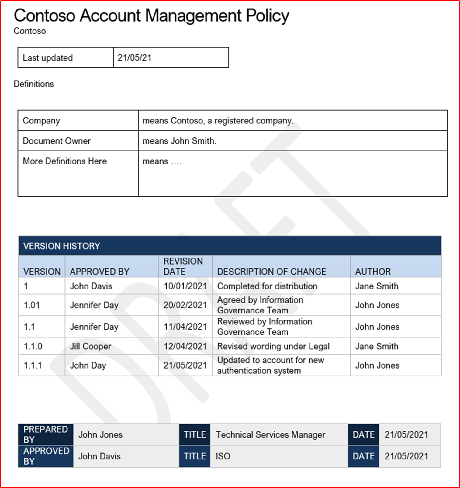

**Note:** Cette capture d’écran montre un document de stratégie/processus, l’attente est que les éditeurs de logiciels indépendants partagent la documentation de stratégie/procédure de prise en charge réelle et ne fournissent pas simplement une capture d’écran.

[Contrôle 40](#control-40) : Fournissez des preuves démontrant que les informations d’identification par défaut sont désactivées, supprimées ou modifiées dans les composants système échantillonnées.

- Intention : bien que cela devienne moins populaire, il existe toujours des cas où les acteurs de menace peuvent tirer parti des informations d’identification utilisateur par défaut et bien documentées pour compromettre les composants du système de production. Un exemple populaire de cela est avec Dell iDRAC (Integrated Dell Remote Access Controller). Ce système peut être utilisé pour gérer à distance un serveur Dell Server, qui peut être exploité par un acteur de menace pour prendre le contrôle du système d’exploitation du serveur&#39;. Les informations d’identification par défaut de root::calvin sont documentées et peuvent souvent être exploitées par les acteurs de menace pour accéder aux systèmes utilisés par les organisations. L’objectif de ce contrôle est de s’assurer que ces informations d’identification par défaut sont désactivées ou supprimées

- Exemples de recommandations en matière de preuves : il existe différentes façons de recueillir des preuves pour appuyer ce contrôle. Les captures d’écran des utilisateurs configurés sur tous les composants système peuvent vous aider, c’est-à-dire des captures d’écran des fichiers Linux /etc/shadow et /etc/passwd, qui vous aideront à démontrer si les comptes ont été désactivés. Notez que le fichier /etc/shadow serait nécessaire pour démontrer que les comptes sont vraiment désactivés en observant que le hachage de mot de passe commence par un caractère non valide tel que &#39;!&#39; indiquant que le mot de passe est inutilisable. Le conseil serait de désactiver seulement quelques caractères du mot de passe a et de répéter le reste. D’autres options seraient pour les sessions de partage d’écran où l’évaluateur a pu essayer manuellement les informations d’identification par défaut. Par exemple, dans la discussion ci-dessus sur Dell iDRAC, l’évaluateur doit essayer de s’authentifier auprès de toutes les interfaces Dell iDRAC à l’aide des informations d’identification par défaut.

- Exemple de preuve : la capture d’écran suivante montre les comptes d’utilisateur configurés pour le composant &quot;système in-scope CLARANET-SBU-WM&quot;. Affiche plusieurs comptes par défaut ; Administrateur, DefaultAccount et Invité, toutefois, les captures d’écran suivantes montrent que ces comptes sont désactivés.

Cette capture d’écran suivante montre que le compte Administrateur est désactivé sur le composant &quot;système in-scope CLARANET-SBU-WM&quot;.

Cette capture d’écran suivante montre que le compte invité est désactivé sur le composant &quot;système in-scope CLARANET-SBU-WM&quot;.

Cette capture d’écran suivante montre que DefaultAccount est désactivé sur le composant &quot;système in-scope CLARANET-SBU-WM&quot;.

[Contrôle 41](#control-41) : Fournir des preuves démontrant que la création, la modification et la suppression d’un compte passent par un processus d’approbation établi.

- Intention : l’objectif est d’avoir un processus établi pour s’assurer que toutes les activités de gestion de compte sont approuvées, en veillant à ce que les privilèges de compte conservent les principes de privilèges minimum et que les activités de gestion de compte puissent être correctement examinées et suivies.

- Exemples de recommandations en matière de preuve : les preuves se présentent généralement sous la forme de tickets de demande de modification, de demandes ITSM (Gestion des services informatiques) ou de documents indiquant que les demandes de comptes à créer, à modifier ou à supprimer ont fait l’objet d’un processus d’approbation.

- Exemple de preuve : les images ci-dessous montrent la création d’un compte pour un nouveau démarrage pour l’équipe DevOps qui doit disposer du paramètre RBAC basé sur les autorisations de l’environnement de production sans accès à l’environnement de développement et à l’accès standard non privilégié à tout le reste.

La création du compte a fait l’objet du processus d’approbation et du processus de déconnexion une fois le compte créé et le ticket fermé.

[Contrôle 42](#control-42) : Fournir des preuves démontrant qu’un processus est en place pour désactiver ou supprimer des comptes non utilisés dans les 3 mois.

- Intention : les comptes inactifs peuvent parfois être compromis, soit parce qu’ils sont ciblés dans des attaques par force brute qui peuvent ne pas être signalées comme l’utilisateur ne tente pas de se connecter aux comptes, soit par le moyen d’une violation de base de données de mot de passe où un utilisateur&#39;mot de passe a été réutilisé et est disponible dans un dump nom d’utilisateur/mot de passe sur Internet. Les comptes inutilisés doivent être désactivés/supprimés pour réduire la surface d’attaque qu’un acteur de menace doit effectuer des activités de compromission de compte. Ces comptes peuvent être dus à un processus de congés qui n’est pas effectué correctement, à un membre du personnel qui est malade à long terme ou à un membre du personnel en congé de maternité/paternité. En implémentant un processus trimestriel pour identifier ces comptes, les organisations peuvent réduire la surface d’attaque.

- Exemples de recommandations en matière de preuves : les preuves doivent être doubles. Tout d’abord, une capture d’écran ou une exportation de fichier montrant la &quot;dernière ouverture&quot; de session de tous les comptes d’utilisateur dans l’environnement dans l’étendue. Il peut s’agir de comptes locaux et de comptes au sein d’un service d’annuaire centralisé, tel qu’AAD (Azure Active Directory). Cela montre qu’aucun compte de plus de 3 mois n’est activé. Deuxièmement, la preuve du processus d’examen trimestriel qui peut être une preuve documentaire de l’achèvement de la tâche au sein d’ADO (Azure DevOps) ou de JIRA tickets, ou par le biais de documents papier qui devraient être signés.

- Exemple de preuve : cette première capture d’écran montre la sortie du script qui est exécuté tous les trimestres pour afficher le dernier attribut d’ouverture de session pour les utilisateurs au sein d’AAD.

Comme vous pouvez le voir dans la capture d’écran ci-dessus, deux utilisateurs montrent qu’ils ne se sont pas connectés depuis un certain temps. Les deux captures d’écran suivantes montrent que ces deux utilisateurs sont désactivés.

[Contrôle 43](#control-43) : Fournissez des preuves démontrant qu’une stratégie de mot de passe forte ou d’autres mesures d’atténuation appropriées pour protéger les informations d’identification de l’utilisateur sont en place.  Les éléments suivants doivent être utilisés comme instructions minimales :
- Longueur minimale du mot de passe de 8 caractères
- Seuil de verrouillage de compte de 10 tentatives au plus
- Historique des mots de passe d’un minimum de 5 mots de passe
- Application de l’utilisation d’un mot de passe fort

- Intention : Comme nous l’avons déjà dit, les informations d’identification de l’utilisateur sont souvent la cible d’attaques par des acteurs de menace qui tentent d’accéder à une organisation&#39;'environnement. L’objectif d’une stratégie de mot de passe forte est d’essayer de forcer les utilisateurs à choisir des mots de passe forts afin d’atténuer les chances que les acteurs de menaces puissent les forcer par force brute. L’intention d’ajouter ou d’autres atténuations appropriées est de reconnaître que les organisations peuvent implémenter d’autres mesures de sécurité pour aider à protéger les informations d’identification des utilisateurs en fonction des développements du secteur tels que &quot; la [publication spéciale NIST 800-63B](https://pages.nist.gov/800-63-3/sp800-63b.html)&quot;.&quot; &quot;

- Exemples de recommandations en matière de preuves : les preuves permettant de démontrer une stratégie de mot de passe forte peuvent se présenter sous la forme d’une capture d’écran d’une organisation stratégie de groupe stratégies de compte de stratégie de sécurité &quot;locale ou d’objet aux paramètres de stratégie de mot de passe&quot; et &quot;de compte à stratégie de verrouillage&quot; de compte. La preuve dépend des technologies utilisées; c’est-à-dire pour Linux, il peut s’agir du fichier de configuration /etc/pam.d/common-password, pour BitBucket la &quot;section Stratégies&quot; d’authentification dans le portail d’administration ([https://support.atlassian.com/security-and-access-policies/docs/manage-your-password-policy/](https://support.atlassian.com/security-and-access-policies/docs/manage-your-password-policy/)), etc.

- Exemple de preuve : Les preuves ci-dessous illustrent la stratégie de mot de passe configurée dans la &quot;stratégie de sécurité&quot; locale du composant &quot;système in-scope CLARANET-SBU-WM&quot;.

La capture d’écran ci-dessous montre les paramètres de verrouillage de compte pour un pare-feu WatchGuard.

Vous trouverez ci-dessous un exemple de longueur de phrase secrète minimale pour le pare-feu WatchGaurd.

[Contrôle 44](#control-44) : Fournissez des preuves démontrant que des comptes d’utilisateur uniques sont émis pour tous les utilisateurs.

- Intention : l’objectif de ce contrôle est la responsabilité. En émettant des utilisateurs avec leurs propres comptes d’utilisateur uniques, les utilisateurs seront responsables de leurs actions, car l’activité utilisateur peut être suivie à un utilisateur individuel.

- Exemples de recommandations en matière de preuves : la preuve consisterait en des captures d’écran montrant des comptes d’utilisateur configurés dans les composants système dans l’étendue, qui peuvent inclure des serveurs, des référentiels de code, des plateformes de gestion cloud, Active Directory, pare-feu, etc.

- Exemple de preuve : la capture d’écran suivante montre les comptes d’utilisateur configurés pour le composant &quot;système in-scope CLARANET-SBU-WM&quot;.

Cette capture d’écran suivante montre que le compte Administrateur est désactivé sur le composant &quot;système in-scope CLARANET-SBU-WM&quot;.

Cette capture d’écran suivante montre que le compte invité est désactivé sur le composant &quot;système in-scope CLARANET-SBU-WM&quot;.

Cette capture d’écran suivante montre que DefaultAccount est désactivé sur le composant &quot;système in-scope CLARANET-SBU-WM&quot;.

[Contrôle 45](#control-45) : Fournissez des preuves démontrant que les principes de privilège minimum sont suivis dans l’environnement.

- Intention : les utilisateurs doivent uniquement disposer des privilèges nécessaires pour remplir leur fonction de travail. Cela permet de limiter le risque qu’un utilisateur accède intentionnellement ou involontairement aux données qu’il ne doit&#39;pas ou qu’il effectue un acte malveillant. En suivant ce principe, il réduit également la surface d’attaque potentielle (c’est-à-dire les comptes privilégiés) qui peut être ciblée par un acteur de menace malveillante.

- Exemples de recommandations en matière de preuves : la plupart des organisations utilisent des groupes pour attribuer des privilèges en fonction des équipes au sein de l’organisation. Il peut s’agir de captures d’écran montrant les différents groupes privilégiés et uniquement les comptes d’utilisateur des équipes qui nécessitent ces privilèges. En règle générale, cela est sauvegardé avec des stratégies/processus de prise en charge définissant chaque groupe défini avec les privilèges requis et une justification métier, et une hiérarchie de membres d’équipe pour valider l’appartenance au groupe est configurée correctement.

- Par exemple : dans Azure, le groupe Propriétaires doit être très limité. Il doit donc être documenté et avoir un nombre limité de personnes affectées à ce groupe. Un autre exemple peut être un nombre limité de membres du personnel ayant la possibilité d’apporter des modifications de code, un groupe peut être configuré avec ce privilège avec les membres du personnel considérés comme ayant besoin de cette autorisation configurée. Cela doit être documenté afin que l’analyste de certification puisse faire une référence croisée au document avec les groupes configurés, etc.

- Exemple de preuve : la capture d’écran suivante montre que l’environnement est configuré avec des groupes attribués en fonction de la fonction de travail.

La capture d’écran suivante montre que les utilisateurs sont alloués à des groupes en fonction de leur fonction de travail.

[Contrôle 46](#control-46) : Fournir des preuves démontrant qu’un processus est en place pour sécuriser ou renforcer les comptes de service et que le processus est suivi.

- Intention : les comptes de service sont souvent ciblés par les acteurs de menace, car ils sont souvent configurés avec des privilèges élevés. Ces comptes peuvent ne pas suivre les stratégies de mot de passe standard, car l’expiration des mots de passe de compte de service interrompt souvent les fonctionnalités. Par conséquent, ils peuvent être configurés avec des mots de passe faibles ou des mots de passe qui sont réutilisés au sein de l’organisation. Un autre problème potentiel, en particulier dans un environnement Windows, peut être que le système d’exploitation met en cache le hachage de mot de passe. Cela peut être un gros problème si : le compte de service est configuré au sein d’un service d’annuaire, étant donné que ce compte peut être utilisé sur plusieurs systèmes avec le niveau de privilèges configuré, ou que le compte de service est local, la probabilité est que le même compte/mot de passe soit utilisé sur plusieurs systèmes au sein de l’environnement. Les problèmes ci-dessus peuvent entraîner l’accès d’un acteur de menace à davantage de systèmes au sein de l’environnement et entraîner une élévation supplémentaire des privilèges et/ou des déplacements latéraux. L’objectif est donc de s’assurer que les comptes de service sont correctement renforcés et sécurisés pour les empêcher d’être repris par un acteur de menace, ou en limitant le risque si l’un de ces comptes de service est compromis.

- Exemples de recommandations en matière de preuves : Il existe de nombreux guides sur Internet pour renforcer les comptes de service. Les preuves peuvent se présenter sous la forme de captures d’écran qui montrent comment l’organisation a implémenté le renforcement sécurisé du compte. Voici quelques exemples (on s’attend à ce que plusieurs techniques soient utilisées) :
- En limitant les comptes à un ensemble d’ordinateurs dans Active Directory,
- Définition du compte de sorte que la connexion interactive n’est&#39;pas autorisée,
- Définition d’un mot de passe extrêmement complexe,
- Pour Active Directory, activez le &quot;compte sensible et ne peut pas être délégué&quot; . Ces techniques sont décrites dans l’article &quot; suivant [Segmentation et Shared Active Directory pour un environnement](https://pciramblings.com/2019/12/13/segmentation-and-shared-active-directory-of-a-cardholder-data-environment/)&quot; de données de titulaire de carte.

- Exemple de preuve : il existe plusieurs façons de renforcer un compte de service, qui dépend de chaque environnement individuel. Les mécanismes adaptés à votre environnement, qui sont utilisés, sont décrits plus haut dans le document de procédure/stratégie de gestion des comptes, ce qui vous aidera à examiner ces preuves. Voici quelques-uns des mécanismes qui peuvent être utilisés :

La capture d’écran suivante montre que le compte &#39;est sensible et que la connexion est déléguée&#39; option est sélectionnée sur le compte &quot;\_de service Prod SQL Compte de&quot; service.

Cette capture d’écran suivante montre que le compte &quot;\_de service Prod SQL Compte&quot; de service est verrouillé sur le SQL Server et ne peut se connecter qu’à ce serveur.

Cette capture d’écran suivante montre que le compte &quot;\_de service Prod SQL Compte&quot; de service est uniquement autorisé à se connecter en tant que service.

[Contrôle 47](#control-47) : Fournissez des preuves démontrant que l’authentification multifacteur est configurée pour toutes les connexions d’accès à distance et toutes les interfaces d’administration non console.

Termes définis comme suit :
- **Accès à distance** : cela fait généralement référence aux technologies utilisées pour accéder à l’environnement de prise en charge. Par exemple, IPSec VPN d’accès à distance, VPN SSL ou Jumpbox/Hôte Bastian.
- **Interfaces d’administration non console :** cela fait généralement référence aux connexions d’administration réseau aux composants système. Il peut s’agir de Bureau à distance, de SSH ou d’une interface web.

- Intention : l’objectif de ce contrôle est de fournir des atténuations contre le forçage brut de comptes privilégiés et de comptes disposant d’un accès sécurisé dans l’environnement. En fournissant l’authentification multifacteur (MFA), un mot de passe compromis doit toujours être protégé contre une connexion réussie, car le mécanisme MFA doit toujours être sécurisé. Cela permet de s’assurer que toutes les actions d’accès et d’administration sont effectuées uniquement par des membres du personnel autorisés et approuvés.

- Exemples de recommandations en matière de preuve : les preuves doivent montrer que l’authentification multifacteur est activée sur toutes les technologies qui s’inscrivent dans les catégories ci-dessus. Il peut s’agir d’une capture d’écran montrant que l’authentification multifacteur est activée au niveau du système. Par niveau système, nous avons besoin de preuves qu’il est activé pour tous les utilisateurs et pas seulement un exemple de compte avec l’authentification multifacteur activée. Lorsque la technologie est sauvegardée dans une solution MFA, nous avons besoin de preuves pour démontrer qu’elle est activée et utilisée. Ce que l’on entend par là, c’est ; lorsque la technologie est configurée pour l’authentification Radius, qui pointe vers un fournisseur MFA, vous devez également prouver que le serveur Radius vers lequel il pointe est une solution MFA et que les comptes sont configurés pour l’utiliser.

- Exemple de preuve 1 : les captures d’écran suivantes montrent les domaines d’authentification configurés sur Pulse Secure, qui est utilisé pour l’accès à distance dans l’environnement. L’authentification est sauvegardée par le service SaaS Duo pour la prise en charge de l’authentification multifacteur.

Cette capture d’écran montre qu’un serveur d’authentification supplémentaire est activé, pointant vers &quot;Duo-LDAP&quot; pour le domaine d’authentification &#39;Duo - Itinéraire par défaut&#39;.

Cette capture d’écran finale montre la configuration du serveur d’authentification Duo-LDAP qui montre qu’il pointe vers le service SaaS Duo pour L’authentification multifacteur.

Exemple de preuve 2 : Les captures d’écran suivantes montrent que l’authentification multifacteur est activée pour tous les utilisateurs Azure.

**Note:** Vous devez fournir des preuves pour toutes les connexions non console afin de démontrer que l’authentification multifacteur est activée pour elles. Ainsi, par exemple, si vous RDP ou SSH sur des serveurs ou d’autres composants système (pare-feu).

[Contrôle 48](#control-48) : Fournissez des preuves démontrant que le chiffrement fort est configuré pour toutes les connexions d’accès à distance et toutes les interfaces d’administration non console, y compris l’accès aux référentiels de code et aux interfaces de gestion cloud.

Termes définis comme suit :
- **Référentiels** de code : la base de code de l’application doit être protégée contre les modifications malveillantes susceptibles d’introduire des programmes malveillants dans l’application. L’authentification multifacteur doit être configurée sur le référentiel de code.
- **Interfaces de gestion cloud** : lorsque tout ou partie de l’environnement est hébergé dans le fournisseur de services cloud (fournisseur de solutions Cloud), l’interface d’administration pour la gestion cloud est incluse ici.

- Intention : L’objectif de ce contrôle est de s’assurer que tout le trafic administratif est correctement chiffré pour se protéger contre les attaques de l’intercepteur.

- Exemples de recommandations en matière de preuves : les preuves peuvent être fournies par des captures d’écran montrant les paramètres de chiffrement pour les technologies d’accès à distance, les interfaces RDP, SSH et Web Admin. Pour les interfaces d’administration web, le scanneur Qualys SSL Labs (s’il est accessible publiquement, c’est-à-dire les interfaces de gestion cloud, les référentiels de code SaaS ou les connexions VPN SSL) peut être utilisé.

- Exemple de preuve : la preuve ci-dessous montre que le niveau de chiffrement RDP sur &quot;Webserver01&quot; est configuré avec un paramètre de &#39;niveau&quot; élevé. Comme le montre le texte d’aide, il s’agit d’un chiffrement 128 bits fort (qui est le niveau le plus élevé pour Microsoft Windows RDP.

Les preuves ci-dessous montrent également que la sécurité de transport RDP est configurée pour utiliser TLS 1.0 sur &quot;Webserver01&quot; (qui est la plus élevée pour Windows Server).

[Contrôle 49](#control-49) : Fournissez des preuves démontrant que l’authentification multifacteur est utilisée pour protéger le portail d’administration que vous utilisez pour gérer et gérer tous les enregistrements DNS (Public Domain Name Service).

- Intention : Si un acteur de menace malveillante peut accéder aux enregistrements DNS publics, il existe un risque qu’il soit en mesure de modifier les URL utilisées par l’application, ou lorsque le fichier manifeste pointe pour introduire du code malveillant ou diriger le trafic utilisateur vers un point de terminaison sous le contrôle des acteurs. Cela peut entraîner une perte de données utilisateur ou des infections de programmes malveillants/ransomware dans la base d’utilisateurs de l’application.

- Exemples de recommandations en matière de preuves : fournissez des preuves qui montrent que les portails d’administration DNS publics sont protégés par l’authentification multifacteur. Même si le DNS public est hébergé sur des serveurs au sein de l’environnement dans l’étendue (c’est-à-dire, le contrôle et l’exploitation par l’organisation), il peut toujours y avoir un portail d’administration où le nom de domaine a été inscrit, et les enregistrements DNS ont été &#39;&#39; managés pour pointer les serveurs DNS vers votre propre infrastructure. Dans ce cas, l’authentification multifacteur doit être activée sur l’interface administrative du bureau d’enregistrement de domaines si les enregistrements DNS des domaines peuvent être modifiés. Une capture d’écran doit être fournie montrant que l’interface d’administration est activée pour l’authentification multifacteur au niveau du système (c’est-à-dire tous les comptes privilégiés).

- Exemple de preuve : la capture d’écran suivante montre l’contoso.com DNS est géré dans Microsoft Azure pour Contoso Corporation.

**Note:** Les adresses IP sont des adresses RFC 1918 privées et non routées publiquement. Ce n’est qu’à des fins de démonstration.

Les captures d’écran suivantes montrent que l’authentification multifacteur est activée pour tous les utilisateurs Azure.

### Détection et prévention des intrusions (facultatif)

Les systèmes de détection et de prévention des intrusions (IDPS) sur la passerelle peuvent fournir une couche supplémentaire de protection contre une multitude de menaces internes et basées sur Internet. Ces systèmes peuvent aider à empêcher la réussite de ces menaces et peuvent fournir des fonctionnalités d’alerte cruciales pour alerter les organisations de tentatives de compromission dynamiques afin de permettre aux organisations d’implémenter des stratégies défensives supplémentaires pour protéger davantage l’environnement contre ces menaces actives.

**Cette section est destinée aux crédits supplémentaires et est donc facultative. Il ne s’agit pas d’une exigence, mais si vous effectuez cette évaluation, votre évaluation affichera une image plus complète de votre environnement, ainsi que des contrôles et des normes que vous avez mis en place.**

[Contrôle 50](#control-50) : Fournissez des preuves démontrant que les systèmes de détection et de prévention des intrusions (IDPS) sont déployés dans le périmètre des environnements dans l’étendue.

- Intention : Bien que certaines sources décrivent les menaces internes comme dépassant désormais les menaces par les acteurs de menace externe, les menaces internes incluent également la négligence, avec l’erreur humaine augmentant en pourcentage d’année en année. L’objectif de l’installation d’IDPS sur le périmètre du ou des environnements dans l’étendue est que les menaces externes peuvent souvent être détectées par le biais de mécanismes IDPS en raison de la nature et des techniques utilisées par ces types de menaces.

- Exemples de recommandations en matière de preuves : des preuves doivent être fournies qui montrent que le protocole IDPS est installé au niveau du périmètre, qu’il peut s’agir directement du pare-feu en cas d’exécution d’un pare-feu NextGen ou de capteurs IDPS de déploiement configurés sur les ports de commutateur miroir pour s’assurer que tout le trafic est visible par les capteurs déployés. Si des capteurs IDPS sont utilisés, des preuves supplémentaires peuvent être nécessaires pour démontrer que les capteurs peuvent voir tous les flux de trafic externe.

- Exemple de preuve : la capture d’écran ci-dessous montre que la fonctionnalité IDPS est activée sur le pare-feu WatchGuard.

La capture d’écran supplémentaire ci-dessous montre que le protocole IDPS est activé sur toutes les règles du pare-feu WatchGuard&#39;configuration.

[Contrôle 51](#control-51) : Fournir des preuves démontrant que les signatures IDPS sont conservées à jour (dans les 24 heures).

- Intention : Il existe plusieurs modes d’opération pour IDPS. Le plus courant consiste à utiliser des signatures pour identifier le trafic d’attaque. À mesure que les attaques évoluent et que de nouvelles vulnérabilités sont identifiées, il est important que les signatures IDPS soient à jour pour fournir une protection adéquate. L’objectif de ce contrôle est de s’assurer que le fournisseur d’identité est maintenu.

- Exemples de recommandations en matière de preuves : les preuves seront probablement au moyen d’une capture d’écran montrant que le fournisseur d’identité est configuré pour mettre à jour les signatures au moins quotidiennement et montrant la dernière mise à jour.

- Exemple de preuve : bien que cette capture d’écran ne montre&#39;pas que les signatures IDPS ont été mises à jour au cours des dernières 24 heures, elle montre que la dernière version est installée, qui date d’il y a une semaine (_preuves collectées le 18__th_ _mai_). Ceci, combiné à la capture d’écran qui suit, montre que les signatures seront à jour dans un délai de 24 heures.

[Contrôle 52](#control-52) : Fournissez des preuves démontrant que le protocole IDPS est configuré pour prendre en charge l’inspection TLS de tout le trafic web entrant.

- Intention : Étant donné que IDPS s’appuie sur des signatures, il doit être en mesure d’inspecter tous les flux de trafic pour identifier le trafic d’attaque. Le trafic TLS est chiffré et IDPS ne peut donc pas inspecter correctement le trafic. Ceci est essentiel pour le trafic HTTPS, car il existe une multitude de menaces communes aux services web. L’objectif de ce contrôle est de s’assurer que les flux de trafic chiffré peuvent également être inspectés pour le fournisseur d’identité.

- Exemples de recommandations en matière de preuve : des preuves doivent être fournies par le moyen de captures d’écran, ce qui montre que le trafic TLS chiffré est également inspecté par la solution IDPS.

- Exemple de preuve : cette capture d’écran montre les règles HTTPS sur le pare-feu

Cette capture d’écran suivante montre que le protocole IDPS est activé sur ces règles.

La capture d’écran suivante montre qu’une &quot;action&quot; de proxy est appliquée à la règle de&#39; &#39;InboundBotTraffic\_\_, qui est utilisée pour activer l’inspection du contenu.

La capture d’écran suivante montre que l’inspection du contenu est activée.

[Contrôle 53](#control-53) : Fournissez des preuves démontrant que le protocole IDPS est configuré pour surveiller tous les flux de trafic entrant.

- Intention : Comme nous l’avons déjà dit, il est important que tous les flux de trafic entrant soient surveillés par le fournisseur d’identité pour identifier toute forme de trafic d’attaque.

- Exemples de recommandations en matière de preuves : des preuves au moyen de captures d’écran doivent être fournies pour démontrer que tous les flux de trafic entrant sont surveillés. Cela peut être à l’aide du pare-feu NextGen, montrant que toutes les règles entrantes sont activées pour IDPS, ou il peut s’agir d’utiliser des capteurs IDPS et de démontrer que tout le trafic est configuré pour atteindre le capteur IDPS.

- Exemple de preuve : cette capture d’écran montre que IDPS est configuré sur toutes les règles (stratégies) du pare-feu WatchGuard&#39;.

[Contrôle 54](#control-54) : Fournissez des preuves démontrant que le fournisseur d’identité est configuré pour surveiller tous les flux de trafic sortant.

- Intention : Comme nous l’avons déjà dit, il est important que tous les flux de trafic sortant soient surveillés par le fournisseur d’identité pour identifier toute forme de trafic d’attaque. Certains systèmes IDPS peuvent également identifier les violations internes potentielles en surveillant tout le trafic sortant. Pour ce faire, vous pouvez identifier le trafic destiné aux points de terminaison &#39;Command and Control&#39;.

- Exemples de recommandations en matière de preuves : des preuves au moyen de captures d’écran doivent être fournies pour montrer que tous les flux de trafic sortant sont surveillés. Cela peut être à l’aide du pare-feu NextGen, montrant que toutes les règles sortantes sont activées pour IDPS, ou il peut s’agir d’utiliser des capteurs IDPS et de démontrer que tout le trafic est configuré pour atteindre le capteur IDPS.

- Exemple de preuve : cette capture d’écran montre que IDPS est configuré sur toutes les règles (stratégies) du pare-feu WatchGuard&#39;.

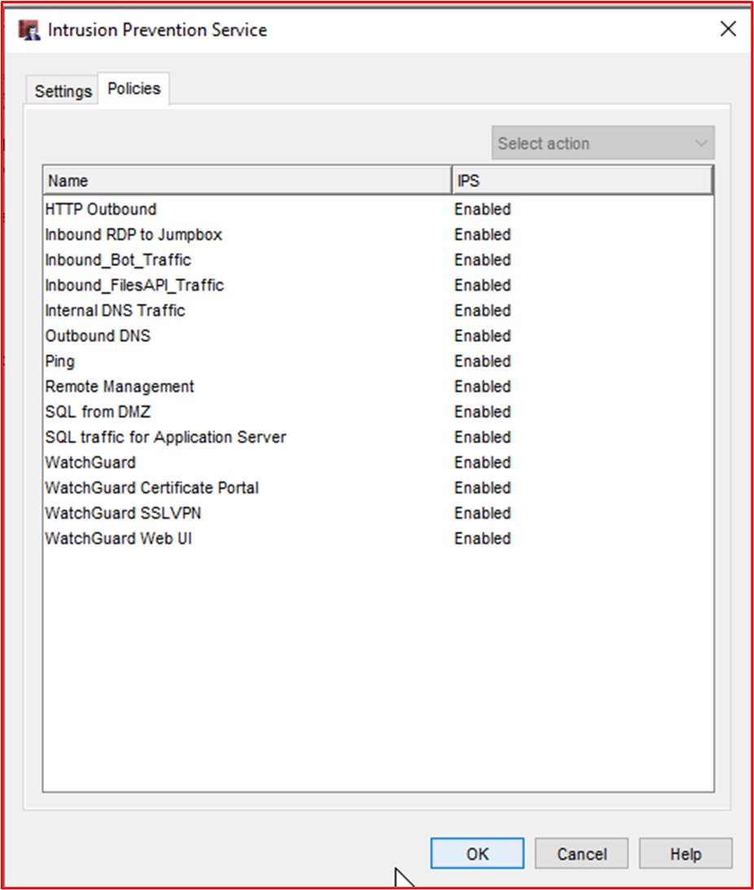

- Exemple de preuve 2 : Azure offre des IDPS via des applications tierces. Dans l’exemple ci-dessous, la capture de paquets Netwatcher a été utilisée pour capturer des paquets et utilisée avec Suricata, qui est un outil IDS Open-Source.

En combinant la capture de paquets fournie par Network Watcher et les outils IDS open source tels que Suricata, vous pouvez effectuer la détection des intrusions réseau pour un large éventail de menaces. L’image ci-dessous montre l’interface Suricata.

Les signatures sont utilisées pour déclencher des alertes, qui peuvent être installées et mises à jour facilement. L’image ci-dessous montre un instantané de certaines signatures.

L’image ci-dessous montre comment surveiller votre configuration IDPS de logiciels tiers Netwatcher et Suricata à l’aide de Sentinel SIEM/SOAR.

- Exemple de preuve 3 : l’image ci-dessous montre comment ajouter une signature d’intrusion de remplacement ou une règle de contournement pour la détection d’intrusion à l’aide de l’interface CLI

L’image ci-dessous montre comment répertorier toutes les configurations de détection d’intrusion à l’aide de l’interface CLI

- Exemple de preuve 4 : Azure a récemment commencé à proposer des IDPS nommés Pare-feu Azure Premium qui permettront la configuration de TLS, Threat Intelligence, IDPS via des stratégies. Toutefois, notez que vous devrez toujours utiliser Front Door ou application Gateway pour le déchargement SSL du trafic entrant en tant que Pare-feu Azure Premium  ne prend pas en charge IDPS sur les connexions SSL entrantes.

Dans l’exemple ci-dessous, les paramètres Premium par défaut ont été utilisés pour la configuration des règles de stratégie et l’inspection TLS, le mode IDPS, Threat Intelligence ont tous été activés avec la protection du réseau virtuel.

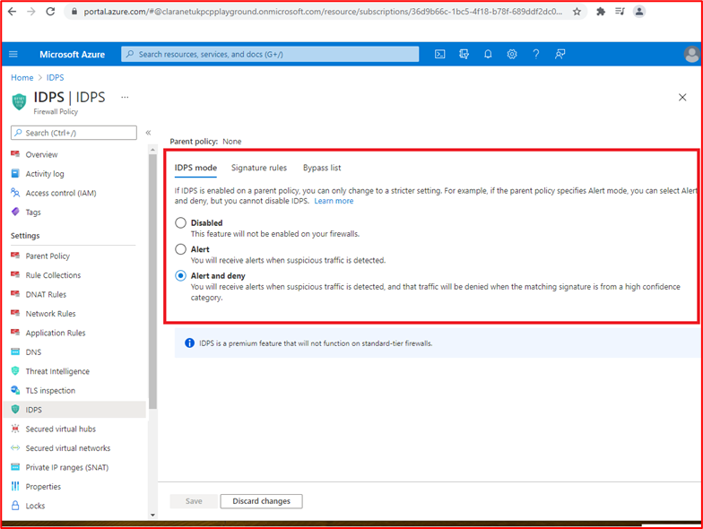

### Journalisation des événements de sécurité

La journalisation des événements de sécurité fait partie intégrante d’une organisation&#39;programme de sécurité. Une journalisation adéquate des événements de sécurité, associée à des processus d’alerte et d’examen paramétrés, permet aux organisations d’identifier les violations ou tentatives de violations qui peuvent être utilisées par l’organisation pour améliorer la sécurité et les stratégies de sécurité défensives. En outre, une journalisation adéquate sera utile pour une capacité de réponse aux incidents des organisations qui peut alimenter d’autres activités, telles que la possibilité d’identifier avec précision ce que et qui&#39;données ont été compromises, la période de compromission, fournir des rapports d’analyse détaillés aux organismes gouvernementaux, etc.

[Contrôle 55](#control-55) : Fournissez une documentation de stratégie pour les meilleures pratiques et procédures qui régissent la journalisation des événements de sécurité.

- Intention : la journalisation des événements de sécurité est une fonction importante de toute organisation&#39;programme de sécurité. Des stratégies et des procédures doivent être mises en place pour fournir clarté et cohérence afin de garantir que les organisations implémentent des contrôles de journalisation conformément aux pratiques recommandées par le fournisseur et l’industrie. Cela permet de s’assurer que les journaux pertinents et détaillés sont consommés, qui sont non seulement utiles pour identifier les événements de sécurité potentiels ou réels, mais ils peuvent également aider une activité de réponse aux incidents à identifier l’étendue d’une violation de sécurité.

- Exemples de recommandations en matière de preuves : fournissez aux organisations des documents de stratégie et de procédure documentés couvrant les meilleures pratiques en matière de journalisation des événements de sécurité.

- Exemple de preuve : voici un extrait de la stratégie/procédure de journalisation.

**Note:** Cette capture d’écran montre un document de stratégie/processus, l’attente est que les éditeurs de logiciels indépendants partagent la documentation de stratégie/procédure de prise en charge réelle et ne fournissent pas simplement une capture d’écran.

[Contrôle 56](#control-56) : Fournissez des preuves démontrant que la journalisation des événements de sécurité est configurée sur tous les composants système échantillonnées pour journaliser les événements suivants :
- Accès utilisateur aux composants système et à l’application
- Toutes les actions effectuées par un utilisateur à privilèges élevés
- Tentatives d’accès logique non valides
- Création ou modification de compte privilégié
- Falsification du journal des événements
- Désactivation des outils de sécurité, tels que les logiciels anti-programme malveillant ou la journalisation des événements
- Journalisation anti-programme malveillant, comme les mises à jour, la détection des programmes malveillants et les échecs d’analyse
- Événements IDPS et WAF, s’ils sont configurés

- Intention : Pour identifier les tentatives et les violations réelles, il est important que les journaux des événements de sécurité adéquats soient collectés par tous les systèmes qui composent l’environnement. L’objectif de ce contrôle est de s’assurer que les types corrects d’événements de sécurité sont capturés, ce qui peut ensuite alimenter les processus d’examen et d’alerte pour aider à identifier et à répondre à ces événements.

- Exemples de recommandations en matière de preuves : des preuves à l’aide de captures d’écran ou de paramètres de configuration doivent être fournies sur tous les appareils échantillonné et tous les composants système pertinents pour montrer comment la journalisation est configurée pour garantir que ces types d’événements de sécurité sont capturés.

- Exemple de preuve 1 : la capture d’écran suivante montre les paramètres de configuration de l’un des appareils échantillonnées appelés &quot;VICTIM1-WINDOWS&quot;. Les paramètres affichent différents paramètres d’audit activés dans les paramètres &#39;Stratégie de sécurité locale Stratégies locales Stratégie d’audit&#39;.

Cette capture d’écran suivante montre un événement dans lequel un utilisateur a effacé un journal des événements de l’un des appareils échantillonnés appelé &quot;VICTIM1-WINDOWS&quot;.

Cette capture d’écran finale montre que le message de journal s’affiche dans la solution de journalisation centralisée.

**Remarque** : des captures d’écran sont requises pour tous les composants système échantillonnées **ET** **DOIVENT** indiquer tous les événements de sécurité détaillés ci-dessus.

[Contrôle 57](#control-57) : Fournir des preuves démontrant que les événements de sécurité consignés contiennent les informations minimales suivantes :
- Utilisateur
- Type d’événement
- Date et heure
- Indicateurs de réussite ou d’échec
- Étiquette qui identifie le système affecté

- Intention : les événements de sécurité consignés doivent fournir suffisamment d’informations pour aider à déterminer si le trafic d’attaque a réussi, quelles informations ont été consultées, à quel niveau, qui était responsable, d’où il provient, etc.

- Exemples de recommandations en matière de preuves : les preuves doivent montrer des exemples de journaux de tous les composants système montrant ces types d’événements de sécurité. Les journaux d’activité doivent inclure toutes les informations répertoriées ci-dessus.

- Exemple de preuve : la capture d’écran suivante montre les informations des événements de sécurité dans Windows observateur d'événements du composant &quot;système dans l’étendue SEGSVR02&quot;.

**Remarque** : des captures d’écran sont requises pour tous les composants système échantillonnées **ET DOIVENT** indiquer tous les événements de sécurité détaillés dans le contrôle ci-dessus. Il est probable que les preuves recueillies pour le contrôle ci-dessus satisfont également à ce contrôle, en fournissant des détails adéquats sur les renseignements relatifs à la journalisation.

[Contrôle 58](#control-58) : Fournissez des preuves démontrant que tous les composants système échantillonné sont synchronisés dans le temps avec les mêmes serveurs principaux et secondaires.

- Intention : Un composant essentiel de la journalisation est de s’assurer que les journaux d’activité de tous les systèmes ont des horloges système qui sont toutes synchronisées. Cela est important lorsqu’une enquête est nécessaire pour effectuer le suivi d’une compromission et/ou d’une violation de données. Le suivi des événements via différents systèmes peut devenir presque impossible si les journaux ont des degrés variables d’horodatage, car des journaux importants peuvent être manqués et il sera difficile de les suivre.

- Exemples de recommandations en matière de preuve : Dans l’idéal, une topologie de synchronisation de l’heure doit être conservée, qui montre comment l’heure est synchronisée dans l’ensemble du patrimoine. Les preuves peuvent ensuite être fournies par le moyen de captures d’écran des paramètres de synchronisation de l’heure entre les composants système échantillonnées. Cela doit montrer que toute synchronisation de temps se fait sur le même serveur principal (ou s’il est sur place secondaire).

- Exemple de preuve : ce diagramme montre la topologie de synchronisation de l’heure utilisée.

La capture d’écran suivante montre WatchGuard configuré en tant que serveur NTP et pointant vers time.windows.com car il&#39;source d’heure.

Cette capture d’écran finale montre le composant système in-scope, &quot;CLARANET-SBU-WM&quot; est configuré pour que NTP pointe vers le serveur principal, qui est le pare-feu WatchGuard (10.0.1.1).

[Contrôle 59](#control-59) : Fournissez des preuves tangibles lorsque des systèmes publics sont en cours d’utilisation que les journaux des événements de sécurité sont envoyés à une solution de journalisation centralisée qui n’est pas dans le réseau de périmètre.

- Intention : l’objectif de ce contrôle est de garantir une séparation logique ou physique entre la DMZ et le point de terminaison de journalisation. La DMZ étant publique, elle est exposée aux acteurs de menace externes et donc plus à risque que d’autres composants au sein de l’environnement. Si un composant DMZ est compromis, l’intégrité des données de journalisation doit être maintenue pour non seulement empêcher l’acteur de menace de falsifier les journaux pour masquer la compromission, mais aussi pour faciliter tout travail d’investigation légale qui peut être nécessaire. En se connectant à des systèmes en dehors de la DMZ, les contrôles de sécurité utilisés pour restreindre le trafic de la DMZ vers ces systèmes de sécurité devraient aider à les protéger contre les activités malveillantes et les tentatives de falsification.

- Exemples de recommandations en matière de preuve : les preuves doivent être fournies au moyen de captures d’écran ou de paramètres de configuration, ce qui montre que les journaux d’activité sont configurés pour être envoyés immédiatement (ou presque immédiatement) à une solution de journalisation centralisée en dehors de la DMZ. Nous sommes à la recherche d’expédition presque immédiate des journaux, car plus il faut de temps pour que les journaux d’activité soient expédiés à la solution de journalisation centralisée, plus un acteur de traitement devrait falsifier les journaux locaux avant l’expédition se produit.

- Exemple de preuve : les systèmes DMZ Contoso utilisent NXLog pour l’expédition de fichiers journaux. La capture d’écran suivante montre le service &#39;nxlog&#39; s’exécutant sur la &quot;jumpbox DMZ DESKTOP-7S65PN&quot; utilisée pour gérer tous les serveurs DMZ.

La capture d’écran suivante montre un extrait du fichier nxlog.conf, montrant que la destination est un collecteur de journaux interne dans le sous-réseau d’application sur 10.0.1.250, qui est utilisé pour l’expédition à AlienVault.

L’URL suivante pour NXLog ([https://nxlog.co/documentation/nxlog-user-guide/modes.html](https://nxlog.co/documentation/nxlog-user-guide/modes.html)) montre que la copie des journaux de transaction est en temps réel via l’extrait suivant :

[Contrôle 60](#control-60) : Fournissez des preuves vérifiables pour montrer que la solution de journalisation centralisée est protégée contre toute falsification non autorisée des données de journalisation.

- Intention : Bien que la séparation logique/physique soit souvent en place entre les appareils de journalisation et la solution de journalisation centralisée, il existe toujours un risque qu’une personne tente de falsifier les journaux pour masquer ses activités. L’objectif de ce contrôle est de s’assurer que des mécanismes d’autorisation adéquats sont en place pour limiter le nombre d’utilisateurs pouvant effectuer des actions administratives sur la solution de journalisation centralisée.

- Exemples de recommandations en matière de preuve : les preuves sont généralement au moyen de captures d’écran montrant la configuration de l’autorisation et de l’authentification de la solution de journalisation centralisée, ce qui montre que les utilisateurs sont limités à ceux qui sont requis pour leur rôle/fonction de travail.

- Exemple de preuve : Le SOC externalisé contoso utilise AlienVault comme outils SIEM centralisés. AlienVault a été racheté par ATT&amp; en 2018 et va maintenant par USM Anywhere. La page web suivante ([https://cybersecurity.att.com/documentation/usm-anywhere/deployment-guide/admin/usm-anywhere-data-security.htm](https://cybersecurity.att.com/documentation/usm-anywhere/deployment-guide/admin/usm-anywhere-data-security.htm)) explique comment USM Anywhere protège les données contre toute falsification non autorisée. Le lien suivant ([https://cybersecurity.att.com/documentation/usm-appliance/raw-logs/raw-log-management.htm](https://cybersecurity.att.com/documentation/usm-appliance/raw-logs/raw-log-management.htm)) montre comment le produit USM Anywhere garantit également l’intégrité des journaux archivés.

**Note:** Si le SIEM est interne, des preuves doivent être fournies pour démontrer que l’accès aux données de journalisation est limité à un certain nombre d’utilisateurs en fonction de leurs besoins en matière de travail et que la plateforme elle-même est protégée contre la falsification (la plupart des solutions l’intégreront dans les fonctionnalités de la solution de journalisation).

[Contrôle 61](#control-61) : Fournissez des preuves tangibles qu’un minimum de 30 jours de données de journalisation des événements de sécurité est immédiatement disponible, avec 90 jours de journaux des événements de sécurité conservés.

- Intention : Il existe parfois une différence de temps entre un événement de compromission ou de sécurité et une organisation qui l’identifie. L’objectif de ce contrôle est de s’assurer que l’organisation a accès aux données d’événement historique pour faciliter la réponse aux incidents et tout travail d’investigation judiciaire qui peut être nécessaire.

- Exemples de recommandations en matière de preuves : la preuve consiste généralement à afficher la solution de journalisation centralisée&#39;paramètres de configuration indiquant la durée de conservation des données. Les données de journalisation des événements de sécurité d’une valeur de 30 jours doivent être immédiatement disponibles dans la solution. Toutefois, lorsque les données sont archivées, cette nécessité doit démontrer que la valeur de 90 jours est disponible. Cela peut être en affichant des dossiers d’archive avec des dates de données exportées.

- Exemple de preuve 1 : Les captures d’écran suivantes montrent que des journaux d’activité d’une valeur de 30 jours sont disponibles dans AlienVault.

**Remarque** : étant donné qu’il s’agit d’un document public, le numéro de série du pare-feu a été supprimé. Toutefois, nous n’envisageons&#39;pas les éditeurs de logiciels indépendants de prendre en charge les captures d’écran expurgées, sauf s’il contient des informations d’identification personnelle.

Cette capture d’écran suivante montre que les journaux d’activité sont disponibles en affichant un extrait de journal remontant à 5 mois.

**Remarque** : étant donné qu’il s’agit d’un document public, les adresses IP publiques ont été rédigées. Toutefois, nous n’envisagerions&#39;pas les éditeurs de logiciels indépendants de prendre en charge les captures d’écran expurgées, sauf s’il contient des informations d’identification personnelle.

- Exemple de preuve 2 : La capture d’écran suivante montre que les événements de journal sont conservés pendant 30 jours disponibles en direct et 90 jours dans le stockage froid dans Azure.

### Examen (données de journalisation des événements de sécurité)

L’examen des journaux de sécurité est une fonction importante pour aider les organisations à identifier les événements de sécurité qui peuvent indiquer une violation de la sécurité ou des activités de reconnaissance susceptibles d’indiquer quelque chose à venir. Cette opération peut être effectuée par le biais d’un processus manuel quotidien ou par l’utilisation d’une solution SIEM (Security Information and Event Management) qui permet d’analyser les journaux d’audit, de rechercher des corrélations et des anomalies qui peuvent être signalées pour une inspection manuelle.

[Contrôle 62](#control-62) : Fournissez une documentation de stratégie qui régit les pratiques et procédures de révision des journaux.

- Intention : Un rapport d’IBM intitulé &quot;[Cost of a data breach Report 2020](https://www.ibm.com/security/digital-assets/cost-data-breach-report/#/)&quot; met en évidence que le temps moyen d’identification et de contenu d’une violation de données peut prendre 280 jours, ce qui est plus important lorsque la violation est effectuée par un acteur de menace malveillante signalé comme étant de 315 jours. Étant donné que le coût moyen d’une violation de données est estimé à des millions de dollars, il est essentiel que ce cycle de vie de violation des données soit réduit non seulement pour réduire la fenêtre d’exposition aux données, mais aussi pour réduire la durée pendant laquelle un acteur de menace doit exfiltrer des données de l’environnement. En réduisant cette fenêtre, les organisations peuvent réduire le coût global d’une violation de données.

- En implémentant un processus robuste d’examen et d’alerte, les organisations sont beaucoup mieux outillées pour identifier les violations beaucoup plus tôt dans le cycle de vie des violations de données afin de réduire son impact sur l’organisation. En outre, un processus fort peut aider à identifier les tentatives de violation, ce qui permet aux organisations de renforcer les mécanismes de défense de la sécurité afin d’atténuer cette menace accrue afin de réduire davantage les chances de compromission par la campagne d’attaque.

- Exemples de recommandations en matière de preuves : fournissez aux organisations des documents de stratégie et de procédure documentés couvrant les meilleures pratiques en matière d’examen des journaux.

- Exemple de preuve : voici un extrait de la stratégie/procédure de révision de journal.

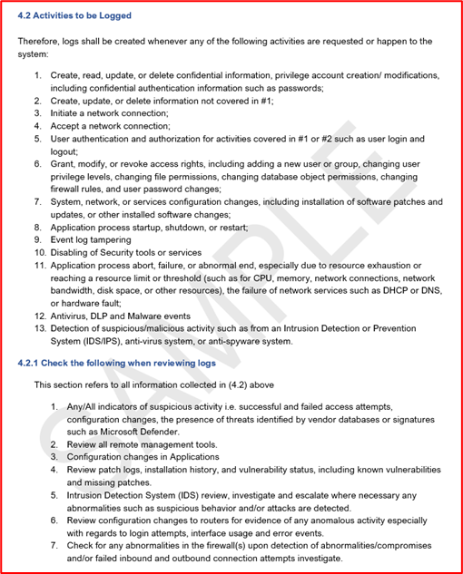

**Note:** Cette capture d’écran montre un document de stratégie/processus, l’attente est que les éditeurs de logiciels indépendants partagent la documentation de stratégie/procédure de prise en charge réelle et ne fournissent pas simplement une capture d’écran.

[Contrôle 63](#control-63) : Fournir des preuves tangibles que les journaux sont examinés quotidiennement par un outil humain ou automatisé pour identifier les événements de sécurité potentiels.

- Objectif : l’objectif de ce contrôle est de s’assurer que les examens quotidiens des journaux sont effectués. Il est important d’identifier les anomalies qui peuvent ne pas être récupérées par les scripts/requêtes d’alerte configurés pour fournir des alertes d’événement de sécurité.

- Exemples de recommandations en matière de preuve : les preuves sont généralement fournies par capture d’écran ou partage d’écran, ce qui montre que des examens des journaux sont effectués. Il peut s’agir de formulaires qui sont remplis chaque jour, ou d’un JIRA ou d’un ticket de DevOps avec des commentaires pertinents affichés pour montrer que cette opération est effectuée quotidiennement. Par exemple, un ticket de JIRA hebdomadaire peut être créé &quot;le 26 juin 2021&quot;, jour après jour, quelqu’un publie les résultats de la révision quotidienne des journaux. Si des anomalies sont signalées, cela peut être documenté dans ce même ticket pour illustrer le contrôle suivant dans un même JIRA.

- Si des outils automatisés sont utilisés, des preuves de capture d’écran peuvent être fournies pour illustrer l’automatisation configurée et fournir des preuves supplémentaires pour montrer que l’automatisation est en cours d’exécution et que quelqu’un examine la sortie automatisée.

- Exemple de preuve : Contoso utilise un fournisseur SOC tiers, Claranet Cyber Security, pour la corrélation des journaux et les révisions. AlienVault est utilisé par le fournisseur SOC qui a les capacités de fournir une analyse automatisée des journaux pour les journaux anormaux et les événements chaînés susceptibles de mettre en évidence un événement de sécurité potentiel. Les trois captures d’écran suivantes montrent les règles de corrélation dans AlienVault.

Cette première capture d’écran identifie l’emplacement où un utilisateur a été ajouté au groupe &#39;Domain Admins&#39;.

Cette capture d’écran suivante identifie l’endroit où plusieurs tentatives d’ouverture de session ayant échoué sont suivies d’une connexion réussie qui peut mettre en évidence une attaque par force brute réussie.

Cette capture d’écran finale identifie l’endroit où une modification de stratégie de mot de passe s’est produite lors de la définition de la stratégie, de sorte que les mots de passe de compte n’expirent&#39;pas.

Cette capture d’écran suivante montre qu’un ticket est automatiquement déclenché dans l’outil ServiceNow soC&#39;, déclenchant la règle ci-dessus.

[Contrôle 64](#control-64) : Fournir des preuves vérifiables que les événements et anomalies de sécurité potentiels sont examinés et corrigés.

- Intention : L’intention est que toutes les anomalies identifiées au cours du processus d’examen quotidien des journaux soient examinées et que des corrections ou actions appropriées soient effectuées. Cela implique généralement un processus de triage pour déterminer si les anomalies nécessitent une action, puis pour appeler le processus de réponse aux incidents.

- Exemples de recommandations en matière de preuve : les preuves doivent être fournies au moyen d’une capture d’écran qui montre que les anomalies identifiées dans le cadre de l’examen quotidien des journaux sont suivies. Comme nous l’avons déjà dit plus haut, il peut s’agir d’JIRA tickets montrant une anomalie signalée, puis en détaillant les activités qui ont été effectuées par la suite. Cela peut inviter un ticket de JIRA spécifique à être déclenché pour suivre toutes les activités en cours, ou il peut simplement être documenté dans le ticket d’examen quotidien des journaux. Si une action de réponse aux incidents est nécessaire, cela doit être documenté dans le cadre du processus de réponse aux incidents et des preuves doivent être fournies pour le démontrer.

- Exemple de preuve : l’exemple de capture d’écran suivant montre une alerte de sécurité suivie dans ServiceNow par le SOC Claranet Cyber Security MDR (Managed Detection and Response).

Cette capture d’écran suivante montre la confirmation que cela a été résolu par David Ashton @ Contoso via une mise à jour dans le portail client ServiceNow.

### Alertes d’événements de sécurité

Les événements de sécurité critiques doivent être immédiatement examinés pour réduire l’impact sur les données et l’environnement opérationnel. Les alertes permettent de mettre immédiatement en évidence les violations de sécurité potentielles au personnel afin de garantir une réponse en temps opportun afin que l’organisation puisse contenir l’événement de sécurité aussi rapidement que possible. En veillant à ce que les alertes fonctionnent efficacement, les organisations peuvent réduire l’impact d’une violation de sécurité, réduisant ainsi le risque d’une violation grave qui pourrait endommager la marque des organisations et imposer des pertes financières par le biais d’amendes et de dommages à la réputation.

[Contrôle 65](#control-65) : Fournissez une documentation de stratégie qui régit les procédures et les pratiques d’alerte d’événement de sécurité.

- Intention : les alertes doivent être utilisées pour les événements de sécurité clés qui nécessitent une réponse immédiate d’une organisation, car l’événement est susceptible d’indiquer une violation d’environnement et/ou une violation de données. Un processus fort autour du processus d’alerte doit être documenté pour s’assurer qu’il est effectué de manière cohérente et reproductible. Cela permettra, espérons-le, de réduire la chronologie du &quot;cycle de vie des violations&quot; de données.

- Exemples de recommandations en matière de preuves : fournissez aux organisations des documents de stratégie et de procédure documentés couvrant les bonnes pratiques en matière d’alertes d’événements de sécurité.

- Exemple de preuve : voici un extrait de la stratégie/procédure d’alerte d’événement de sécurité. Veuillez fournir les documents de stratégie et de procédure complets pour prendre en charge votre évaluation.

**Note:** Cette capture d’écran montre un document de stratégie/processus, l’attente est que les éditeurs de logiciels indépendants partagent la documentation de stratégie/procédure de prise en charge réelle et ne fournissent pas simplement une capture d’écran.

[Contrôle 66](#control-66) : Fournissez des preuves tangibles que des alertes sont déclenchées pour le triage immédiat des types d’événements de sécurité suivants :
- Création ou modification de compte privilégié
- Événements de virus ou de programmes malveillants
- Falsification du journal des événements
- Événements IDPS ou WAF, s’ils sont configurés

- Intention : Voici une liste de certains types d’événements de sécurité qui peuvent mettre en évidence un événement de sécurité qui peut pointer vers une violation d’environnement et/ou une violation de données.

- Exemples de recommandations en matière de preuves : les preuves doivent être fournies au moyen de captures d’écran de la configuration de l’alerte **et** de la preuve des alertes reçues. Les captures d’écran de configuration doivent afficher la logique qui déclenche les alertes et la façon dont les alertes sont envoyées. Les alertes peuvent être envoyées via SMS, e-mail, canaux Teams, canaux Slack, etc.

- Exemple de preuve : Contoso utilise un SOC tiers fourni par [Claranet Cyber Security](https://www.claranet.co.uk/services/cybersecurity/managed-detection-and-response). L’exemple suivant montre que les alertes dans AlienVault, utilisées par le SOC, sont configurées pour envoyer une alerte à un membre de l’équipe SOC, Dan Turner chez Claranet Cyber Security.

Cette capture d’écran suivante montre une alerte reçue par Dan.

[Contrôle 67](#control-67) : Fournir des preuves tangibles montrant que le personnel est toujours disponible, toute la journée, tous les jours, pour répondre aux alertes de sécurité.

- Intention : Il est important que les alertes de sécurité soient triées dès que possible pour limiter l’exposition à l’environnement et/ou aux données. Le personnel doit toujours être disponible pour répondre aux alertes et fournir un travail d’enquête critique si une violation est identifiée. Plus ce processus démarre rapidement, plus l’incident de sécurité peut être contenu pour protéger les données ou limiter l’impact de la violation.

- Exemples de recommandations en matière de preuves : Des preuves doivent être fournies qui montrent que les membres du personnel sont disponibles 24 heures sur 24 pour répondre aux alertes de sécurité. Il peut s’agir d’un rota de garde.

- Exemple de preuve : la capture d’écran suivante montre une rota sur appel pour décembre 2020 pour Contoso. L’équipe soc de la cybersécurité Claranet alerte les membres de l’équipe d’appel de Contoso.

### Gestion des risques liés à la sécurité des informations

La gestion des risques liés à la sécurité de l’information est une activité importante que toutes les organisations doivent effectuer au moins une fois par an. Les organisations doivent comprendre leurs menaces et leurs risques pour atténuer efficacement ces menaces. Sans une gestion efficace des risques, les organisations peuvent implémenter des meilleures pratiques de sécurité dans des domaines qu’elles jugent importants et, par conséquent, investir des ressources, du temps et de l’argent dans ces domaines, lorsque d’autres menaces sont beaucoup plus probables et devraient donc être atténuées. Une gestion efficace des risques aidera les organisations à se concentrer sur les risques qui représentent le plus de menaces pour l’entreprise. Cette opération doit être effectuée chaque année, à mesure que le paysage de la sécurité change constamment et que les menaces et les risques peuvent donc changer les heures supplémentaires. Un bon exemple de cela peut être vu avec COVID-19 qui a vu une augmentation massive des attaques par hameçonnage et le déploiement massif (et rapide) du travail à distance pour des centaines ou des milliers de travailleurs.

[Contrôle 68](#control-68) : Fournir des preuves démontrant qu’un processus formel de gestion des risques liés à la sécurité de l’information est établi.

- Intention : Comme nous l’avons vu plus haut, un processus robuste de gestion des risques liés à la sécurité des informations est important pour aider les organisations à gérer efficacement les risques. Cela aidera les organisations à planifier des atténuations efficaces contre les menaces pesant sur l’environnement.

**Il est important que l’évaluation des risques comprenne les risques liés à la sécurité de l’information et pas seulement les risques généraux &quot;pour l’entreprise&quot; .**

- Exemples de recommandations en matière de preuve : le processus de gestion de l’évaluation des risques officiellement documenté doit être fourni.

- Exemple de preuve : La preuve suivante est une capture d’écran d’une partie du processus d’évaluation des risques de Contoso&#39;.

**Note:** Cette capture d’écran montre un document de stratégie/processus, l’attente est que les éditeurs de logiciels indépendants partagent la documentation de stratégie/procédure de prise en charge réelle et ne fournissent pas simplement une capture d’écran.

[Contrôle 69](#control-69) : Fournir des preuves tangibles qu’une évaluation formelle des risques a lieu chaque année, au minimum.

- Intention : les menaces de sécurité changent constamment en fonction des modifications apportées à l’environnement, des modifications apportées aux services offerts, des influences externes, de l’évolution du paysage des menaces de sécurité, etc. Les organisations doivent suivre ce processus au moins une fois par an. Il est recommandé d’effectuer ce processus en cas de modifications importantes, car les menaces peuvent changer.

- Exemples de recommandations en matière de preuve : les preuves peuvent être fournies à l’issue d’un suivi de version ou d’une preuve datée. Des preuves doivent être fournies qui montrent la sortie de l’évaluation des risques de sécurité des informations et des dates **NOT** sur le processus d’évaluation des risques de sécurité de l’information lui-même.

- Exemple de preuve : cette capture d’écran montre une réunion d’évaluation des risques planifiée tous les six mois.

Ces deux captures d’écran montrent les minutes de réunion de deux réunions d’évaluation des risques.

[Contrôle 70](#control-70) : Fournissez des preuves tangibles que l’évaluation des risques de sécurité des informations inclut des menaces, des vulnérabilités ou l’équivalent.

- Intention : Les évaluations des risques liés à la sécurité des informations doivent être effectuées contre les menaces pesant sur l’environnement et les données, et contre les vulnérabilités possibles qui peuvent être présentes. Cela aidera les organisations à identifier la multitude de menaces/vulnérabilités qui peuvent poser un risque significatif.

- Exemples de recommandations en matière de preuves : les preuves doivent être fournies non seulement par le processus d’évaluation des risques relatifs à la sécurité de l’information déjà fourni, mais également par la sortie de l’évaluation des risques (par le moyen d’un registre des risques/d’un plan de traitement des risques) qui doit inclure les risques et les vulnérabilités.

- Exemple de preuve : la capture d’écran suivante montre le registre des risques qui illustre les menaces et les vulnérabilités incluses.

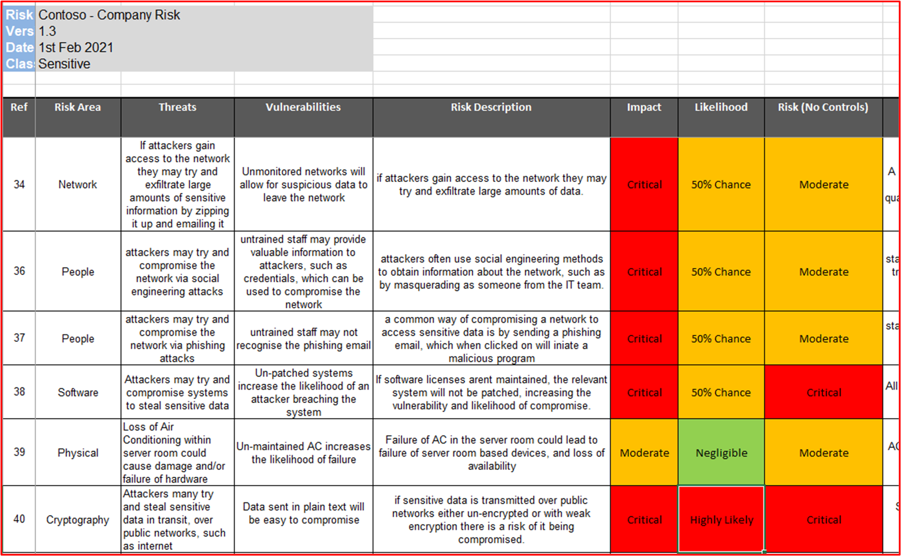

**Note:** La documentation complète de l’évaluation des risques doit être fournie au lieu d’une capture d’écran.

[Contrôle 71](#control-71) : Fournir des preuves tangibles que l’évaluation des risques de sécurité des informations inclut l’impact, la matrice de risque de probabilité ou l’équivalent.

- Intention : les évaluations des risques liés à la sécurité des informations doivent documenter les évaluations de l’impact et de la probabilité. Ces matrices sont généralement utilisées pour aider à identifier une valeur de risque qui peut être utilisée par l’organisation pour hiérarchiser le traitement des risques afin de réduire la valeur du risque.

- Exemples de recommandations en matière de preuves : les preuves doivent être fournies non seulement par le processus d’évaluation des risques relatifs à la sécurité de l’information déjà fourni, mais aussi par la sortie de l’évaluation des risques (par le moyen d’un registre des risques/d’un plan de traitement des risques) qui doit inclure les évaluations de l’impact et de la probabilité.

- Exemple de preuve : la capture d’écran suivante montre le registre des risques qui illustre l’impact et les probabilités inclus.

**Note:** Le assessment_ _document__ation de risque complet doit être fourni au lieu d’une capture d’écran.

[Contrôle 72](#control-72) : Fournir des preuves tangibles que l’évaluation des risques liés à la sécurité de l’information comprend un registre des risques et un plan de traitement.

- Intention : Les organisations doivent gérer les risques efficacement. Cela doit être correctement suivi pour fournir un enregistrement de l’un des quatre traitements à risque appliqués. Les traitements à risque sont les suivants :

- **Éviter/arrêter** : l’entreprise peut déterminer que le coût de la gestion du risque est supérieur au chiffre d’affaires généré par le service. L’entreprise peut donc choisir d’arrêter d’exécuter le service.
- **Transfert/partage** : l’entreprise peut choisir de transférer le risque à un tiers en déplaçant le traitement vers un tiers.
- **Accepter/Tolérer/Conserver** : l’entreprise peut décider que le risque est acceptable. Cela dépend beaucoup de l’appétit pour le risque des entreprises et peut varier en fonction de l’organisation.
- **Traiter/atténuer/modifier** : l’entreprise décide d’implémenter des contrôles d’atténuation pour réduire le risque à un niveau acceptable.

- L’objectif de ce contrôle est d’obtenir l’assurance que l’organisation effectue l’évaluation des risques et agit en conséquence.

- Exemples de recommandations en matière de preuves : Le plan de traitement des risques /registre des risques (ou quelque chose d’équivalent) doit être fourni pour démontrer que le processus d’évaluation des risques est correctement exécuté.

- Exemple de preuve : voici un registre des risques pour Contoso.

**Note:** La documentation complète de l’évaluation des risques doit être fournie au lieu d’une capture d’écran.

La capture d’écran suivante illustre un plan de traitement des risques.

### Réponse aux incidents de sécurité

Une réponse aux incidents de sécurité est importante pour toutes les organisations, car cela peut réduire le temps passé par une organisation à contenir un incident de sécurité et limiter le niveau d’exposition des organisations à l’exfiltration des données. En développant un plan complet et détaillé de réponse aux incidents de sécurité, cette exposition peut être considérablement réduite entre le moment de l’identification et le moment de l’endiguement.

Un rapport d’IBM intitulé &quot;[Cost of a data breach Report 2020](https://www.ibm.com/security/digital-assets/cost-data-breach-report/#/)&quot; souligne qu’en moyenne, le temps nécessaire pour contenir une violation était de 73 jours. En outre, le même rapport identifie le plus grand économiseur de coûts pour les organisations qui ont subi une violation, a été la préparation aux réponses aux incidents, offrant une économie moyenne de 2 000 000 $.

Les organisations doivent suivre les meilleures pratiques en matière de conformité à la sécurité à l’aide d’infrastructures standard telles que ISO 27001, NIST, SOC 2, PCI DSS, etc.

[Contrôle 73](#control-73) : Fournir le plan de réponse aux incidents de sécurité (IRP).

- Intention : Comme nous l’avons déjà dit, l’objectif de ce contrôle est d’exiger un plan de réponse aux incidents officiellement documenté. Cela permet de gérer une réponse aux incidents de sécurité plus efficace, ce qui peut limiter l’exposition aux pertes de données des organisations et réduire les coûts de la compromission.

- Exemples de recommandations en matière de preuves : fournissez la version complète du plan/procédure de réponse aux incidents. Cela doit inclure un processus de communication documenté qui est abordé dans le contrôle suivant.

- Exemple de preuve : la capture d’écran ci-dessous montre le début du plan de réponse aux incidents de Contoso&#39;. Dans le cadre de votre soumission de preuves, vous devez fournir l’intégralité du plan de réponse aux incidents.

**Note:** Cette capture d’écran montre un document de stratégie/processus, l’attente est que les éditeurs de logiciels indépendants partagent la documentation de stratégie/procédure de prise en charge réelle et ne fournissent pas simplement une capture d’écran.

[Contrôle 74](#control-74) : Fournir des preuves tangibles que l’IRP de sécurité comprend un processus de communication documenté pour assurer une notification en temps opportun aux parties prenantes clés, telles que les marques de paiement et les acheteurs, les organismes de réglementation, les autorités de surveillance, les administrateurs et les clients.

- Intention : Les organisations peuvent avoir des obligations de notification de violation en fonction du pays ou des pays dans lesquels elles opèrent (par exemple, le Règlement général sur la protection des données; RGPD) ou en fonction des fonctionnalités proposées (par exemple, PCI DSS si les données de paiement sont gérées). L’échec d’une notification en temps opportun peut donc avoir de graves conséquences pour s’assurer que les obligations de notification sont respectées, les plans de réponse aux incidents doivent inclure un processus de communication incluant la communication avec toutes les parties prenantes, les processus de communication des médias et les personnes qui peuvent et ne peuvent pas parler aux médias.

- Exemples de recommandations en matière de preuves : fournissez la version complète du plan/procédure de réponse aux incidents qui doit inclure une section couvrant le processus de communication.

- Exemple de preuve : la capture d’écran suivante montre un extrait du plan de réponse aux incidents montrant le processus de communication.

[Contrôle 75](#control-75) : Fournir des preuves tangibles que tous les membres de l’équipe d’intervention en cas d’incident ont suivi une formation annuelle ou un exercice de table supérieure.

- Intention : Comme nous l’avons déjà vu précédemment, plus il faut de temps pour qu’une organisation contienne un compromis, plus le risque d’exfiltration des données est élevé, ce qui peut entraîner un plus grand volume de données exfiltrées et plus le coût global de la compromission est élevé. Il est important que les équipes de réponse aux incidents de l’organisation&#39;soient équipées pour répondre aux incidents de sécurité en temps voulu. En effectuant une formation régulière et en effectuant des exercices de table, cela permet à l’équipe de gérer les incidents de sécurité rapidement et efficacement.

- Il est recommandé d’effectuer à la fois une formation interne sur la réponse aux incidents pour l’équipe de réponse aux incidents **et** d’effectuer des exercices réguliers sur table, qui doivent être liés à l’évaluation des risques de sécurité des informations afin d’identifier les incidents de sécurité les plus susceptibles de se produire. De cette façon, l’équipe saura rapidement quelles mesures prendre pour contenir et examiner les incidents de sécurité les plus probables.

- Exemples de recommandations en matière de preuves : des preuves doivent être fournies qui montrent que la formation a été effectuée au moyen du partage du contenu de la formation et des enregistrements indiquant qui ont participé (ce qui doit inclure toute l’équipe de réponse aux incidents). Vous pouvez également, ou aussi, enregistrer des enregistrements indiquant qu’un exercice de table a été effectué. Tout cela doit avoir été effectué dans un délai de 12 mois à partir du moment où la preuve est présentée.

- Exemple de preuve : Contoso a effectué un exercice de table de réponse aux incidents à l’aide d’une société de sécurité externe appelée Claranet Cyber Security. Vous trouverez ci-dessous un exemple du rapport généré dans le cadre de la consultation.

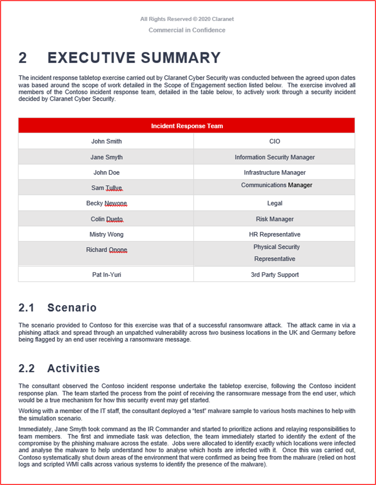

**Note:** Le rapport complet doit être partagé. Cet exercice pourrait également être effectué en interne, car il n’y a pas Microsoft 365 exigence que cette opération soit effectuée par une société tierce.

[Contrôle 76](#control-76) : Fournissez des preuves vérifiables pour montrer que l’IRP de sécurité est mis à jour en fonction des leçons apprises ou des changements organisationnels.

- Intention : Au fil du temps, le plan de réponse aux incidents (IRP) doit évoluer en fonction des changements organisationnels ou en fonction des leçons apprises lors de l’adoption de l’IRP. Les modifications apportées à l’environnement d’exploitation peuvent nécessiter des modifications de l’IRP à mesure que les menaces peuvent changer ou que les exigences réglementaires peuvent changer. En outre, à mesure que des exercices de table et des réponses aux incidents de sécurité réels sont effectués, cela peut souvent identifier les zones de l’IRP qui peuvent être améliorées. Cela doit être intégré au plan et l’objectif de ce contrôle est de s’assurer que ce processus est inclus dans l’IRP.

- Exemples de recommandations en matière de preuves : Cela sera souvent démontré en examinant les résultats des incidents de sécurité ou des exercices de table où les leçons apprises ont été identifiées et ont abouti à une mise à jour du PCI. L’IRP doit tenir à jour un journal des modifications, qui doit également référencer les modifications qui ont été implémentées en fonction des leçons apprises ou des changements organisationnels.

- Exemple de preuve : les captures d’écran suivantes proviennent de l’IRP fourni, qui inclut une section sur la mise à jour de l’IRP en fonction des leçons apprises et/ou des modifications apportées à l’organisation.

Le journal des modifications IRP montre une mise à jour effectuée à l’arrière de l’exercice de table effectué en juillet 2021.

## Domaine de sécurité : gestion des données sécurité et confidentialité

Ce domaine de sécurité est inclus pour s’assurer que toutes les données consommées à partir de M365 sont correctement protégées en transit et au repos. Ce domaine garantit également que les préoccupations des consommateurs (personnes concernées) en matière de confidentialité sont satisfaites par l’ISV, conformément au Règlement général sur la protection des données (RGPD) qui porte sur la confidentialité des citoyens de l’UE.

### Données en transit

En raison des exigences de connectivité des applications/compléments développés par M365, la communication se fera sur les réseaux publics, à savoir Internet. Pour cette raison, les données en transit doivent être correctement protégées. Cette section couvre la protection des communications de données sur Internet.

[Contrôle 1](#control-1b) : fournissez des preuves démontrant que la configuration TLS répond ou dépasse les exigences de chiffrement dans les [exigences de configuration de profil TLS](../docs/certification-submission-guide.md#appendix-a).

- Objectif : l’objectif de ce contrôle est de s’assurer que les données M365 consommées par votre organisation sont transmises en toute sécurité. La configuration du profil TLS définit des exigences spécifiques au protocole TLS pour garantir la sécurité du trafic contre les attaques de l’intercepteur.

- Exemples de recommandations en matière de preuves : le moyen le plus simple de le prouver consiste à exécuter l’outil de [test de serveur SSL Qualys](https://www.ssllabs.com/ssltest/) sur **TOUS les** écouteurs web, y compris ceux qui s’exécutent sur des ports non standard.

- N’oubliez pas de cocher l’option &quot;Ne pas afficher les résultats dans l’option Tableaux&quot; , ce qui empêche l’ajout de l’URL au site web.

- Vous pouvez également fournir des preuves pour illustrer les vérifications individuelles dans les exigences de configuration du profil TLS. Les paramètres de configuration peuvent être utilisés, ainsi que des scripts et des outils logiciels pour fournir des preuves de certains des paramètres spécifiques, c’est-à-dire que la compression TLS est désactivée.

- Exemple de preuve : la capture d’écran ci-dessous montre les résultats de [l’écouteur web www.clara.net:443](http://www.clara.net:443/) .

**Remarque** : les analystes de certification examineront la sortie complète pour confirmer que toutes les exigences de configuration de profil TLS sont remplies (veuillez fournir des captures d’écran de la sortie d’analyse complète). Depending_ _sur_ _what preuve a été fournie, les analystes peuvent exécuter leur propre analyse Qualys.

- Exemple de preuve 2 : la capture d’écran suivante montre que TLS 1.2 est configuré sur le stockage.

**Note:** Cette capture d’écran seule ne serait pas en mesure de répondre à cette exigence.

- Exemple de preuve 3 : Les captures d’écran suivantes montrent que TLS V1.3 est uniquement activé sur le serveur.

Cet exemple utilise les clés de Registre pour désactiver ou activer un protocole en ajustant les valeurs comme suit :

Binaire : 0 - off 1 - on

Hexadécimal : 0x00000000 - off 0xffffffff - on

Remarque : - N’utilisez pas cette méthodologie si vous ne la **comprenez** pas, car nous (Microsoft) ne sommes pas responsables de l’utilisation ou de la suite de cet exemple ou des effets que son utilisation peut avoir sur vos systèmes. Il s’agit ici d’illustrer simplement une autre façon de montrer si TLS est activé ou désactivé.

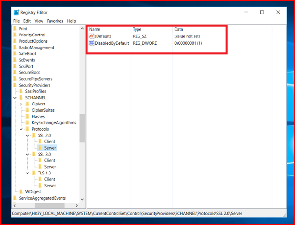

**Remarque** : ces captures d’écran seules ne seraient pas en mesure de répondre à cette exigence.

[Contrôle 2](#control-2b) : Fournissez des preuves démontrant que la compression TLS est désactivée sur tous les services publics qui gèrent les requêtes web.

- Intention : Il existe une vulnérabilité TLS spécifique, CRIME ([CVE-2012-4929](https://nvd.nist.gov/vuln/detail/CVE-2012-4929)), qui affecte la compression TLS. Pour cette raison, les recommandations de l’industrie sont de désactiver cette fonctionnalité.

- Exemples de recommandations en matière de preuves : il peut s’agir de preuves par le biais de l’outil Qualys SSL Labs.

- Exemple de preuve : la capture d’écran suivante le montre via l’outil Qualys SSL Labs.

[Contrôle 3](#control-3b) : Fournir des preuves démontrant que la sécurité de transport http stricte TLS est activée et configurée pour >= 15552000 sur tous les sites.

- Intention : HTTP Strict Transport Security (HSTS) est un mécanisme de sécurité conçu pour protéger les sites web contre les attaques de l’intercepteur en forçant les connexions TLS via un champ d’en-tête de réponse HTTPS nommé &quot;Strict-Transport-Security&quot;.

- Exemples de recommandations en matière de preuves : il peut s’agir de preuves par le biais de l’outil Qualys SSL Labs ou d’autres outils et compléments de navigateur web.

- Exemple de preuve : la capture d’écran suivante le montre via un complément de navigateur web appelé &#39;&#39; Espion d’en-tête HTTP pour le site web [www.microsoft.com](https://www.microsoft.com/) .

### Données au repos

Lorsque les données consommées à partir de la plateforme Microsoft 365 sont stockées par des éditeurs de logiciels indépendants, les données doivent être correctement protégées. Cette section couvre les exigences de protection des données stockées dans les bases de données et les magasins de fichiers.

[Contrôle 4](#control-4b) : Fournissez des preuves démontrant que les données au repos sont chiffrées en ligne avec les exigences de profil de chiffrement, à l’aide d’algorithmes de chiffrement tels qu’AES, Blowfish, TDES et des tailles de clé de chiffrement de 128 bits et 256 bits.

- Intention : Certains algorithmes de chiffrement plus anciens contiennent des faiblesses de chiffrement qui augmentent les chances qu’un acteur de menace puisse déchiffrer les données sans connaître la clé. Pour cette raison, l’objectif de ce contrôle est de s’assurer que seuls les algorithmes de chiffrement acceptés par l’industrie sont utilisés pour protéger les données M365 stockées.

- Exemples de recommandations en matière de preuve : des preuves peuvent être fournies par le moyen de captures d’écran, montrant le chiffrement utilisé pour protéger les données M365 dans les bases de données et d’autres emplacements de stockage. Les preuves doivent démontrer que la configuration du chiffrement est conforme aux [exigences de configuration du profil de chiffrement](../docs/certification-submission-guide.md#appendix-b) de la certification Microsoft 365.

- Exemple de preuve : la capture d’écran suivante montre que TDE (Transparent Data Encryption) est activé sur la base de données Contoso. La deuxième capture d’écran montre la page de documents Microsoft &#39;[chiffrement transparent des données pour SQL Database, SQL Managed Instance et Azure Synapse Analytics](/azure/azure-sql/database/transparent-data-encryption-tde-overview?view=sql-server-ver15&amp;tabs=azure-portal)&#39; montrant que le chiffrement AES 256 est utilisé pour Azure TDE.

- Exemple de preuve 2 : la capture d’écran suivante montre stockage Azure configuré avec le chiffrement pour les objets blob et les fichiers. La capture d’écran suivante montre la page &quot; microsoft docs [stockage Azure chiffrement pour les données au repos](/azure/storage/common/storage-service-encryption)&quot;, montrant que stockage Azure utilise AES-256 pour le chiffrement.

[Contrôle 5](#control-5b) : Fournissez des preuves démontrant que la fonction de hachage ou l’authentification de message (HMAC-SHA1) est utilisée uniquement pour protéger les données au repos en ligne avec les exigences de profil de chiffrement.

- Intention : Comme pour les algorithmes de chiffrement, certaines fonctions de hachage et algorithmes d’authentification des messages sont basées sur des algorithmes présentant des faiblesses de chiffrement. L’objectif de ce contrôle est de s’assurer que les données M365 sont protégées par des fonctions de hachage fortes si le hachage est utilisé comme mécanisme de protection des données. Si cela n’est pas utilisé par l’environnement et/ou l’application, des preuves doivent être fournies qui peuvent corroborer cela.

- Exemples de recommandations en matière de preuves : les preuves peuvent se présenter sous la forme de captures d’écran montrant des extraits de code dans lesquels la fonction de hachage fonctionne.

- Exemple de preuve : Contoso utilise la fonctionnalité de hachage au sein de son application. La capture d’écran ci-dessous montre que SHA256 est utilisé dans le cadre de la fonction de hachage.

[Contrôle 6](#control-6b) : fournissez un inventaire de toutes les données stockées, y compris l’emplacement de stockage et le chiffrement utilisés pour protéger les données.

- Intention : Pour protéger correctement les données, les organisations doivent connaître les données consommées par leur environnement/systèmes et l’emplacement de stockage des données. Une fois que cela est entièrement compris et documenté, les organisations sont en mesure non seulement d’implémenter une protection adéquate des données, mais aussi de consolider l’emplacement où se trouvent les données pour implémenter la protection plus efficacement. En outre, lorsque les données sont regroupées dans le moins d’emplacements possible, il est beaucoup plus facile d’implémenter un RBAC approprié (contrôle d’accès en fonction du rôle) pour limiter l’accès au moins d’employés nécessaire.

- Exemples de recommandations en matière de preuve : les preuves doivent être fournies par le moyen d’un document ou d’une exportation à partir d’un système interne, c’est-à-dire SharePoint ou Confluence, en détaillant toutes les données consommées, tous les emplacements de stockage et le niveau de chiffrement implémenté.

- Exemple de preuve : la capture d’écran suivante montre à quoi peut ressembler un document montrant les types de données.

### Conservation et suppression de données

Lorsque les éditeurs de logiciels indépendants consomment et stockent des données M365, cela risque de compromettre les données si un acteur de menace compromet l’environnement isv. Pour réduire ce risque, les organisations ne doivent conserver que les données dont elles ont besoin pour la prestation des services et non les données susceptibles &quot;&quot; d’être utilisées à l’avenir. En outre, les données ne doivent être conservées que tant que cela est nécessaire pour fournir les services pour lequel les données ont été capturées. La rétention des données doit être définie et communiquée aux utilisateurs. Une fois que les données dépassent la période de rétention définie, elles doivent être supprimées de manière sécurisée afin que les données ne puissent pas être reconstruites ou récupérées.

[Contrôle 7](#control-7b) : Fournir des preuves démontrant qu’une période de conservation des données approuvée et documentée est formellement établie.

- Intention : Une politique de rétention documentée et suivie est importante non seulement pour respecter certaines obligations légales, par exemple la législation sur la confidentialité des données, comme le Règlement général sur la protection des données (RGPD de l’UE) et la Loi sur la protection des données (UK DPA 2018), mais aussi pour limiter les risques pour les organisations. En comprenant les exigences en matière de données des organisations et la durée nécessaire à l’entreprise pour effectuer ses fonctions, les organisations peuvent s’assurer que les données sont correctement supprimées une fois leur utilité expirée. En réduisant les volumes de données stockées, les organisations réduisent la quantité de données qui seraient exposées en cas de compromission des données. Cela limitera l’impact global.

- Souvent, les organisations stockent des données simplement parce qu’il&#39;agréable d’avoir &quot;juste au cas&quot; où, cependant, si l’organisation n’a&#39;pas besoin des données pour effectuer son service ou fonction métier, alors les données ne doivent pas être stockées car cela augmente inutilement les risques des organisations.

- Exemples de recommandations en matière de preuves : fournissez la stratégie de rétention complète des données qui détaille clairement la durée pendant laquelle les données (doivent couvrir tous les types de données) doivent être conservées pour permettre à l’entreprise d’effectuer ses fonctions métier.

- Exemple de preuve : la capture d’écran ci-dessous montre la stratégie de rétention des données de Contoso&#39;.

**Note:** Cette capture d’écran montre un document de stratégie/processus, l’attente est que les éditeurs de logiciels indépendants partagent la documentation de stratégie/procédure de prise en charge réelle et ne fournissent pas simplement une capture d’écran.

[Contrôle 8](#control-8b) : Fournir des preuves démontrant que les données conservées correspondent à une période de rétention définie.

- Objectif : l’objectif de ce contrôle est de simplement vérifier que les périodes de rétention des données définies sont respectées. Comme nous l’avons déjà dit, les organisations peuvent avoir l’obligation légale de s’y conformer, mais aussi de conserver les données nécessaires et, aussi longtemps que nécessaire, de réduire le risque pour l’organisation en cas de violation de données.

- Exemples de recommandations en matière de preuves : fournissez des preuves de capture d’écran (ou par partage d’écran) montrant que les données stockées (dans tous les différents emplacements de données, c’est-à-dire les bases de données, les partages de fichiers, les archives, etc.) ne&#39;pas dépasser la stratégie de rétention des données définie. Il peut s’agir par exemple de captures d’écran d’enregistrements de base de données avec un champ de date, d’une recherche dans l’ordre d’enregistrement le plus ancien et/ou d’emplacements de stockage de fichiers montrant des horodatages qui se trouvent dans la période de rétention.

**Note:** Toutes les données client personnelles/sensibles doivent être supprimées dans la capture d’écran.

- Exemple de preuve : la preuve suivante montre une requête SQL montrant le contenu de la table de base de données classée dans l’ordre croissant sur le champ &#39;DATETRANSACTION\_&#39; pour afficher les enregistrements les plus anciens de la base de données. Ces données doivent avoir deux mois, ce qui ne&#39;pas dépasser la période de rétention définie.

**Note:** Il s’agit d’une base de données de test, il n’y a donc&#39;pas beaucoup de données historiques dans celle-ci.

[Contrôle 9](#control-9b) : Fournir des preuves démontrant que des processus sont en place pour supprimer des données en toute sécurité après sa période de rétention.

- Objectif : l’objectif de ce contrôle est de s’assurer que le mécanisme utilisé pour supprimer des données qui dépassent la période de rétention le fait en toute sécurité. Les données supprimées peuvent parfois être récupérées ; par conséquent, le processus de suppression doit être suffisamment robuste pour garantir que les données ne peuvent pas être récupérées une fois supprimées.

- Exemples de recommandations en matière de preuves : si le processus de suppression est effectué par programmation, fournissez une capture d’écran du script utilisé pour effectuer cette opération. S’il&#39;exécuté selon une planification, fournissez une capture d’écran montrant la planification. Par exemple, un script pour supprimer des fichiers au sein d’un partage de fichiers peut être configuré en tant que travail CRON, capture d’écran du travail CRON montrant la planification et le script qui est exécuté et fournissez le script montrant la commande utilisée.

- Exemple de preuve 1 : il s’agit d’un script simple qui peut être utilisé pour supprimer tous les enregistrements de données conservés en fonction de la date - WHERE DateAdd est de -30 jours, ce qui vide tous les enregistrements conservés plus de 30 jours après la date de rétention des données sélectionnée. Veuillez noter que nous aurons besoin du script, mais aussi de preuves de l’exécution du travail et des résultats.

- Exemple de preuve 2 : Le code ci-dessous a été extrait du plan de rétention des données Contoso du contrôle 7 . Cela montre les procédures utilisées pour la destruction des données.

**Note:** Cette capture d’écran montre un document de stratégie/processus, l’attente est que les éditeurs de logiciels indépendants partagent la documentation de stratégie/procédure de prise en charge réelle et ne fournissent pas simplement une capture d’écran.

- Exemple de preuve 3 : Dans cet exemple, un Runbook a été créé et une planification correspondante dans Azure a été créée pour supprimer en toute sécurité les enregistrements dont la date de fin est créée à partir des 30 jours suivant l’expiration de la stratégie de rétention des enregistrements de données. Ce travail est défini pour s’exécuter tous les mois le dernier jour du mois.

La fenêtre ci-dessous montre que le Runbook a été modifié pour rechercher des enregistrements et que les commandes de suppression ne sont pas affichées comme le script. Notez que l’URL et le nom d’utilisateur complets doivent être affichés pour ces captures d’écran et que les éditeurs de logiciels indépendants&#39;doivent afficher une capture d’écran du nombre d’enregistrements avant suppression et une capture d’écran du nombre d’enregistrements après suppression. Ces captures d’écran sont purement des exemples des différentes façons d’aborder ce problème.

### Gestion de l’accès aux données

L’accès aux données doit être limité à autant de personnes que nécessaire pour réduire les risques de compromission malveillante ou accidentelle des données. L’accès aux données et aux clés de chiffrement doit être limité aux utilisateurs ayant un besoin professionnel légitime d’accès pour remplir leur rôle de travail. Cela doit être bien documenté et un processus bien établi pour demander l’accès doit être implémenté. L’accès aux données et aux clés de chiffrement doit suivre le principe des privilèges minimum.

[Le contrôle 10](#control-10b):P aide une liste de toutes les personnes ayant accès aux données ou aux clés de chiffrement, y compris la justification métier.

- Intention : Les organisations doivent limiter l’accès aux données et aux clés de chiffrement au moins d’employés possible. L’objectif de ce contrôle est de s’assurer que l’accès des employés aux données et/ou aux clés de chiffrement est limité aux employés ayant un besoin commercial clair pour cet accès.

- Exemples de recommandations en matière de preuves : documentation ou captures d’écran de systèmes internes qui documentent tous les employés ayant accès aux données et/ou aux clés de chiffrement, ainsi que la justification métier de la raison pour laquelle ces personnes ont accès doivent être fournies. Cette liste sera utilisée par l’analyste de certification pour échantillonner les utilisateurs pour les contrôles suivants.

- Exemple de preuve : le document suivant montre la liste documentée des utilisateurs ayant accès aux données et la justification métier.

[Contrôle 11](#control-11b) : Fournir des preuves démontrant que les personnes échantillonnées qui ont accès aux données ou aux clés de chiffrement ont été officiellement approuvées, détaillant les privilèges requis pour leur fonction de travail.

- Intention : Le processus d’octroi de l’accès aux données et/ou aux clés de chiffrement doit inclure l’approbation, garantissant ainsi que l’accès d’un&#39;individuel est requis pour sa fonction de travail. Cela garantit que les employés qui n’ont pas de véritable raison d’y accéder ne&#39;pas bénéficier d’un accès inutile.

- Exemples de recommandations en matière de preuve : En règle générale, les preuves fournies pour le contrôle précédent peuvent aider à soutenir ce contrôle. S’il n’y a&#39;pas d’approbation formelle sur la documentation fournie, il se peut qu’une demande de modification soit déclenchée et approuvée pour l’accès à un outil tel que Azure DevOps ou Jira.

- Exemple de preuve : cet ensemble d’images montre des tickets Jira créés et approuvés pour la liste ci-dessus dans Le contrôle 10 pour accorder ou refuser l’accès aux données sensibles et/ou aux clés de chiffrement.

Cette image montre qu’une requête a été créée dans Jira pour obtenir l’approbation sam quotidienne des clés de chiffrement sur l’environnement principal des systèmes. Cette opération est effectuée comme étape suivante pour contrôler 10 ci-dessus où l’autorisation écrite a été obtenue.

Cela montre que la demande de donner à Sam Daily accès a été approuvée par Jon Smith une personne de la direction qui peut être vu dans le contrôle 10. (Veuillez noter que l’approbation doit provenir d’une personne disposant des autorisations suffisantes pour autoriser la demande de modification, elle ne peut pas être un autre développeur).

L’exemple ci-dessus montre un flux de travail dans Jira pour ce processus, notant que rien ne peut être ajouté comme Terminé, sauf si le processus d’approbation qui est automatisé ne peut donc pas être passé.

Le tableau Project ci-dessus montre maintenant que l’approbation a été donnée pour l’accès de Sam Daily&#39;aux clés de chiffrement. Sous le backlog, sam daily&#39;demande d’approbation et la personne affectée pour effectuer le travail.

Pour répondre aux exigences de ce contrôle, vous devez afficher toutes ces captures d’écran ou similaires avec une explication pour démontrer que vous avez satisfait à l’exigence de contrôle.

- Exemple de preuve 2 : Dans l’exemple ci-dessous, l’accès administrateur et les autorisations de contrôle total ont été demandés pour un utilisateur à la base de données de production. La demande a été envoyée pour approbation, comme on peut le voir à droite de l’image et elle a été approuvée comme vous pouvez le voir à gauche.

Ci-dessus, vous pouvez voir que l’accès a été approuvé et signé comme terminé.

[Contrôle 12](#control-12b) : Fournissez des preuves démontrant que les personnes échantillonnées qui ont accès aux données ou aux clés de chiffrement ont uniquement les privilèges inclus dans l’approbation.

- Intention : l’objectif de ce contrôle est de confirmer que l’accès aux données et/ou à la clé de chiffrement est configuré conformément à la documentation.

- Exemples de recommandations en matière de preuve : des preuves peuvent être fournies par le moyen d’une capture d’écran montrant les données et/ou les privilèges d’accès à la clé de chiffrement accordés aux personnes échantillonnées. Les preuves doivent couvrir tous les emplacements de données.

- Exemple de preuve : cette capture d’écran montre les autorisations accordées à l’utilisateur &quot;John Smith&quot; , qui seraient croisées par rapport à la demande d’approbation pour ce même utilisateur, conformément aux preuves du contrôle précédent.

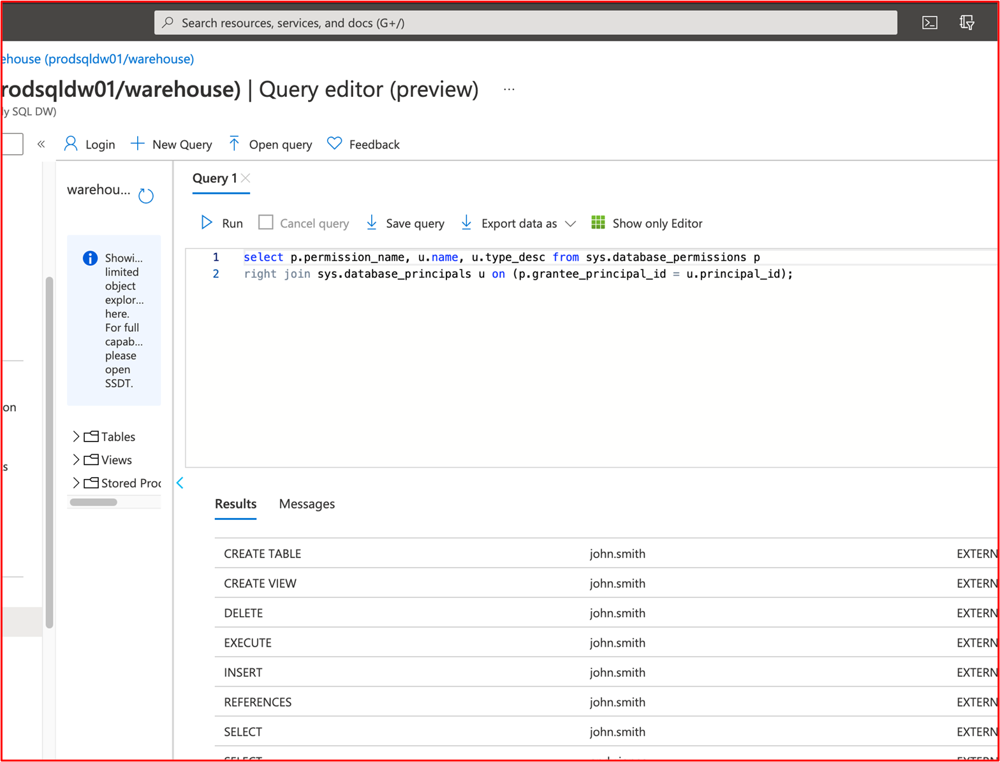

[Contrôle 13](#control-13b) : Fournissez une liste de tous les tiers avec qui les données client sont partagées.

- Intention : lorsque des tiers sont utilisés pour le stockage ou le traitement des données M365, ces entités peuvent présenter un risque significatif. Les organisations doivent développer un bon processus de gestion et de diligence raisonnable tiers pour s’assurer que ces tiers stockent/traitent les données en toute sécurité et pour s’assurer qu’ils respecteront toutes les obligations légales qu’ils peuvent avoir, par exemple en tant que processeur de données dans le cadre du RGPD.

- Les organisations doivent conserver une liste de tous les tiers avec lesquels elles partagent des données avec une partie ou l’ensemble des éléments suivants :

- quels services sont(sont) fournis,
- quelles données sont partagées,
- pourquoi les données sont partagées,
- informations de contact clés (par exemple, contact principal, contact de notification de violation, DPO, etc.),
- renouvellement/expiration du contrat
- obligations légales/de conformité (rGPD, HIPPA, PCI DSS, FedRamp, etc.)

- Exemples de recommandations en matière de preuve : fournissez une documentation détaillant **TOUS les** tiers avec lesquels les données M365 sont partagées.

**Note:** Si des tiers ne sont pas utilisés, cela doit être confirmé par écrit (e-mail) par un membre de l’équipe de direction supérieure.

- Exemple de preuve 1

- Exemple de preuve 2 : cette capture d’écran montre un exemple d’e-mail montrant un membre de l’équipe de direction supérieure confirmant qu’aucun tiers n’est utilisé pour traiter les données M365.

[Contrôle 14](#control-14b) : Fournir des preuves démontrant que tous les tiers qui consomment des données client ont des accords de partage en place.

- Intention : Lorsque les données M365 sont partagées avec des tiers, il est important que les données soient gérées de manière appropriée et sécurisée. Des accords de partage de données doivent être en place pour s’assurer que des tiers traitent les données uniquement en fonction des besoins et qu’ils comprennent leurs obligations de sécurité. La sécurité d’une organisation est seulement aussi forte que le lien le plus faible. L’objectif de ce contrôle est de s’assurer que les tiers ne deviennent pas un maillon faible de l’organisation.

- Exemples de recommandations en matière de preuves : partagez les contrats de partage de données en place avec les tiers.

- Exemple de preuve : la capture d’écran suivante montre un exemple simplifié de contrat de partage de données.

**Note:** Le contrat complet doit être partagé et non une capture d’écran.

### RGPD

La plupart des organisations traitent des données qui sont potentiellement des données de&#39;citoyens européens (personnes concernées). Lorsque des données **d’une** personne concernée sont traitées, les organisations doivent respecter le Règlement général sur la protection des données (RGPD). Cela s’applique aux contrôleurs de données (vous capturez directement ces données) ou aux processeurs de données (vous traitez ces données pour le compte d’un contrôleur de données). Bien que cette section ne couvre&#39;pas l’ensemble de la réglementation, elle traite de certains des éléments clés du RGPD pour vous assurer que l’organisation prend le RGPD au sérieux.

[Contrôle 15](#control-15b) : Fournir un processus de demande d’accès aux sujets documenté et fournir des preuves démontrant que les personnes concernées sont en mesure de déclencher des demandes d’accès aux données.

- Intention : Le RGPD inclut des obligations spécifiques qui doivent être remplies par les organisations qui traitent les personnes concernées&#39; données. L’obligation pour les organisations de gérer les demandes d’accès aux personnes concernées est incluse dans l’article 12 qui, en vertu de l’article 12.3, donne à un contrôleur de données un mois de réception du R.A. pour répondre à la demande. Une prolongation est autorisée pour deux mois supplémentaires si nécessaire. Même si votre organisation agit en tant que processeur de données, cela sera toujours nécessaire pour aider vos clients (le contrôleur de données) à remplir leurs obligations en matière de DSA.

- Exemples de recommandations en matière de preuves : fournissez le processus documenté pour la gestion des demandes de signature d’accès partagé.

- Exemple de preuve : l’exemple suivant montre un processus documenté pour la gestion des signatures d’accès partagé.

**Note:** Cette capture d’écran montre un document de stratégie/processus, l’attente est que les éditeurs de logiciels indépendants partagent la documentation de stratégie/procédure de prise en charge réelle et ne fournissent pas simplement une capture d’écran.

[Contrôle 16](#control-16b) : Fournissez des preuves démontrant que vous êtes en mesure d’identifier tous les emplacements des données des personnes concernées lors de la réponse à un sar.

- Objectif : l’objectif de ce contrôle est de s’assurer que l’organisation dispose d’un mécanisme robuste pour identifier tous les sujets de données&#39; données. Il peut s’agir d’un processus manuel, car tous les stockages de données sont bien documentés, ou d’autres outils peuvent être utilisés pour garantir que toutes les données sont situées dans le cadre du processus de signature d’accès partagé.

- Exemples de recommandations en matière de preuve : des preuves peuvent être fournies par le moyen d’une liste de tous les emplacements de données et d’un processus documenté pour rechercher des données dans tous les emplacements de données. Cela inclut toutes les commandes nécessaires pour rechercher des données, c’est-à-dire, si SQL emplacements sont inclus, des instructions SQL spécifiques sont détaillées pour s’assurer que les données sont trouvées correctement.

- Exemple de preuve : la capture d’écran suivante est un extrait de la procédure sar&#39;ci-dessus qui montre comment les données seront trouvées.

Les quatre images ci-dessous montrent comment les emplacements de données isv dans lesquels l’explorateur a interrogé, puis Stockage utilisé pour explorer les fichiers ou les objets blob qui devaient être supprimés du stockage pour se conformer à la requête SAP.

Cette requête confirme les comptes de stockage utilisés. Vous pouvez interroger et supprimer du stockage, des objets blob et/ou des fichiers à l’aide de Resource Graph Explorer (Kusto) ou PowerShell (voir ci-dessous).

L’image ci-dessus montre les données qui ont été trouvées dans le conteneur d’objets blob pour le client qui doit être supprimé, et ci-dessous montre l’action de suppression ou de suppression réversible des informations dans l’objet blob.

[Contrôle 17](#control-17b) : Fournissez un lien vers l’avis de confidentialité qui doit contenir tous les éléments requis comme suit :

- Détails des sociétés (nom, adresse, etc.).
- Détaille les types de données personnelles en cours de traitement.
- Détaille la légalité du traitement des données personnelles.
- Détails des droits de l’objet de données&#39;:
  - - Droit d’être informé,
  - - Droit d’accès par la personne concernée,
  - - Droit à l’effacement,
  - - Droit à la restriction du traitement,
  - - Droit à la portabilité des données,
  - - Droit à l’objet,
  - - Droits relatifs à la prise de décision automatisée, y compris le profilage.
- Détails sur la durée pendant laquelle les données personnelles seront conservées.

- Intention : l’article 13 du RGPD inclut des informations spécifiques qui doivent être fournies aux personnes concernées au moment de l’obtention des données personnelles. L’objectif de ce contrôle est de s’assurer que l’avis de confidentialité des données des organisations fournit aux personnes concernées certaines des informations clés incluses dans l’article 13.

- Exemples de recommandations en matière de preuve : cela est généralement fourni en fournissant la notification de confidentialité des données. Les analystes de certification examineront ce point pour s’assurer que toutes les informations fournies dans le contrôle sont incluses dans la notification de confidentialité des données.

- Exemple de preuve

Les images d’un avis de confidentialité ci-dessus et adjacent montrent un exemple de politique de confidentialité en ligne avec l’article 13 du RGPD inclus.

Vous trouverez ci-dessous une stratégie de protection des données qui peut être utilisée conjointement avec l’avis de confidentialité indiqué précédemment.

L’image ci-dessus montre comment Azure a été configuré pour répondre aux exigences de conformité du RGPD pour les données stockées dans un environnement principal. La stratégie (_qui peut être personnalisée ou générée à partir d’Azure Blueprints_) permet à l’éditeur de logiciels indépendants de s’assurer que les données du client&#39;sont stockées correctement et qu’elles sont accessibles uniquement par les métriques et les alertes définies pour garantir la conformité et affiche les données non conformes ou l’accès utilisateur sur le tableau de bord du Gestionnaire de conformité.

Livres

2018: Blue Team Handbook: Incident Response Edition: A condensed field guide for the Cyber Security Incident Responder. 2e édition, Publisher : CreateSpace Independent Publishing Platform.

References

- Rapport de cybercriminalité contre les fraudes d’action disponible à l’adresse : [https://www.actionfraud.police.uk/](https://www.actionfraud.police.uk/) (accessible le 02/08/21).
- UE. (2021) Liste de contrôle RGPD pour les contrôleurs de données disponible à l’adresse : [https://gdpr.eu/checklist/](https://gdpr.eu/checklist/) (accessible le 02/01/21).
- Microsoft. (2018) Journalisation des événements (Windows Installer) Disponible à l’adresse : docs.microsoft.com/en-us/windows/win32/msi/event-logging (Accessible : 12/23/20).
- Technologies positives. (2020) Guide pratique pour aborder le développement de logiciels sécurisés disponibles à l’adresse : [https://www.ptsecurity.com/ww-en/analytics/knowledge-base/how-to-approach-secure-software-development/](https://www.ptsecurity.com/ww-en/analytics/knowledge-base/how-to-approach-secure-software-development/)(Accès : 12/21/20).
- Règlement (UE) 2016/679 du Parlement européen et du Conseil du 27 avril 2016 sur la protection des personnes physiques en ce qui concerne le traitement des données personnelles et la libre circulation de ces données, et l’abroge de la directive 95/46/CE (Règlement général sur la protection des données) (texte pertinent pour l’EEE) (2016) Disponible à l’adresse : [https://www.legislation.gov.uk/eur/2016/679/contents](https://www.legislation.gov.uk/eur/2016/679/contents) (Accessible : 11/01/2021).
- Métriques de sécurité. (2020) Guide des métriques de sécurité pour la conformité PCI DSS. Disponible à l’adresse : [https://info.securitymetrics.com/pci-guide-2020](https://info.securitymetrics.com/pci-guide-2020)(Accessible : 06/01/21).
- Williams J. OWASP Risk Ranking Available at: [https://owasp.org/www-community/OWASP\_Risk\_Rating\_Methodology](https://owasp.org/www-community/OWASP_Risk_Rating_Methodology) (Accessed: 08/12/20).
- Qualys. (2014) SSL Labs: New Grades for Trust (T) and Mismatch (M) Issues Available at: [https://blog.qualys.com/product-tech/2014/06/17/ssl-labs-new-grades-for-trust-t-and-mismatch-m-issues](https://blog.qualys.com/product-tech/2014/06/17/ssl-labs-new-grades-for-trust-t-and-mismatch-m-issues) (Accessed: 29/01/21).
- NIST SP800-61r2 : Guide de gestion des incidents de sécurité informatique disponible à l’adresse :[https://csrc.nist.gov/publications/detail/sp/800-61/rev-2/final](https://csrc.nist.gov/publications/detail/sp/800-61/rev-2/final) (accessible le 24/01/21).

**Images extraites de Documents Microsoft**

- [https://www.sans.org/information-security-policy/](https://www.sans.org/information-security-policy/)(Accessible le 18/02/21).
- [https://docs.microsoft.com/cloud-app-security/anomaly-detection-policy](/cloud-app-security/anomaly-detection-policy)(Accessible le 16/02/21).
- [https://docs.microsoft.com/azure/azure-monitor/alerts/alerts-overview](/azure/azure-monitor/alerts/alerts-overview) (Accessible le 17/02/21).
- [https://docs.microsoft.com/cloud-app-security/anomaly-detection-policy](/cloud-app-security/anomaly-detection-policy) (Accessible le 22/02/21).
- [https://docs.microsoft.com/azure/security-center/security-center-managing-and-responding-alerts](/azure/security-center/security-center-managing-and-responding-alerts) (Accessible le 24/02/21).
- [https://docs.microsoft.com/azure/security-center/security-center-managing-and-responding-alerts](/azure/security-center/security-center-managing-and-responding-alerts) (Accessible le 24/02/21).
- [https://microsoft.github.io/AzureTipsAndTricks/blog/tip272.html](https://microsoft.github.io/AzureTipsAndTricks/blog/tip272.html)
- [https://docs.microsoft.com/azure/information-protection/what-is-information-protection](/azure/information-protection/what-is-information-protection)
- [https://docs.microsoft.com/azure/azure-sql/database/transparent-data-encryption-tde-overview?tabs=azure-portal](/azure/azure-sql/database/transparent-data-encryption-tde-overview?tabs=azure-portal)
- [https://docs.microsoft.com/azure/governance/policy/assign-policy-portal](/azure/governance/policy/assign-policy-portal)
- [https://docs.microsoft.com/azure/azure-sql/database/threat-detection-configure](/azure/azure-sql/database/threat-detection-configure)
