# Microsoft 365 Certification - Guide des exemples de preuves

## Vue d’ensemble

Ces instructions ont été créées pour fournir aux isvs une assistance sur le niveau de détail requis pour les contrôles Microsoft 365 certification. En outre, il fournit des instructions sur la façon de structurer l’envoi de preuves, ainsi que des exemples de types de preuves susceptibles d’être utilisés pour satisfaire les contrôles de certification. Les exemples partagés dans ce document ne représentent pas les seules preuves qui peuvent être utilisées pour fournir l’assurance que les contrôles sont satisfaits, mais agissent uniquement comme des indications pour le type d’informations qui peuvent aider à fournir aux analystes de certification les preuves nécessaires pour les aider à faire cette assertion. Veuillez noter : - Les interfaces, captures d’écran et documentation utilisées pour répondre aux exigences varient en fonction de l’utilisation du produit, de la configuration du système et des processus internes. En outre, notez que lorsque la documentation de stratégie ou de procédure est requise, l’isv doit envoyer les documents ACTUAL et non les captures d’écran, comme illustré dans certains exemples. Il est recommandé de suivre ces instructions pour éviter que votre évaluation soit retardée en raison de preuves insuffisantes. 

Il existe deux sections de la certification qui nécessitent des soumissions :
1. [**La soumission initiale de documents**](https://docs.microsoft.com/en-us/microsoft-365-app-certification/docs/initialdocumentsubguide) : un petit ensemble de documents de haut niveau requis pour définir l’échelle de votre évaluation.
1. **La soumission de preuves :** ensemble complet de preuves requises pour chaque contrôle dans l’étendue de votre évaluation de certification. Des exemples de preuves pour chaque contrôle sont présentés ci-dessous.

## Structure 

Cela correspond directement aux catégories données dans le guide en ligne Microsoft 365 soumissions de certification. Veuillez noter qu’il est préférable d’utiliser ce guide directement en même temps que la feuille de calcul de la liste de vérification de certification Microsoft 365 fournie pour éviter de se référer au jeu de contrôles auquel se réfèrent chacun des exemples de cette directive. Les instructions fournies dans ce document sont détaillées comme suit :
- Domaine de sécurité : les trois domaines de sécurité dans qui tous les contrôles sont regroupés : Sécurité des applications, Sécurité opérationnelle et Sécurité des données et Confidentialité.
- Contrôles : = Description de l’activité d’évaluation : ces contrôles et le nombre associé (Non)) sont pris directement à partir de la liste Microsoft 365 de certification.  
- Intention : = l’objectif de la raison pour laquelle le contrôle de sécurité est inclus dans le programme et le risque spécifique qu’il est destiné à atténuer.  L’idée est que ces informations fourniront aux isoeurs le raisonnement sous-fondé du contrôle pour mieux comprendre les types de preuves qui doivent être collectées et ce que les isv doivent être attentifs et connaître et comprendre pour produire leurs preuves.
- Exemples de directives de preuve : = données pour guider les tâches de collecte de preuves sur la feuille de calcul de la liste de vérification de certification Microsoft 365, cela permet aux isv de voir clairement des exemples du type de preuve qui peut être utilisé par l’analyste de certification qui l’utilisera pour déterminer avec certitude qu’un contrôle est en place et maintenu ; il n’est en aucun cas exhaustif par nature.
- Exemple de preuve : = cette section fournit des captures d’écran et des images d’exemples de preuves potentielles capturées sur chacun des contrôles de la feuille de calcul de la liste de vérification de certification Microsoft 365, spécifiquement pour les domaines sécurité opérationnelle et sécurité des données et sécurité de la confidentialité (onglets dans la feuille de calcul). Veuillez noter que les informations contenant des flèches et des cases rouges dans les exemples vous aideront à mieux comprendre les conditions requises pour répondre à n’importe quel contrôle.

## Domaine de sécurité : sécurité des applications

**Contrôle 1 - Contrôle 16**:

Les contrôles de domaine de sécurité des applications peuvent être satisfés avec un rapport de test de pénétration publié au cours des 12 derniers mois indiquant que votre application ne présente aucune vulnérabilité en suspens. La seule soumission requise est un rapport propre par une société indépendante fiable. 

## Domaine de sécurité : sécurité opérationnelle/ développement sécurisé

Le domaine de sécurité « Sécurité opérationnelle/ Développement sécurisé » est conçu pour garantir que les isv implémentent un ensemble solide de techniques de prévention de la sécurité contre un ensemble de menaces rencontrées par les acteurs de menace.  Il est conçu pour protéger l’environnement d’exploitation et les processus de développement logiciel afin de créer des environnements sécurisés.

#### Protection contre les programmes malveillants : antivirus

**Contrôle n 1 :** Fournir une documentation de stratégie qui régit les pratiques et procédures anti-virus.
- Objectif : l’objectif de ce contrôle est d’évaluer la compréhension d’un isv des problèmes qu’il rencontre lorsqu’il considère la menace provenant de virus informatiques. En établissant et en utilisant les meilleures pratiques du secteur dans le développement d’une stratégie et de processus antivirus, un isv fournit une ressource adaptée à la capacité de son organisation à atténuer les risques rencontrés par les programmes malveillants, à répertorier les meilleures pratiques en matière de détection et d’élimination des virus, et prouve que la stratégie documentée fournit des conseils de sécurité suggérés pour l’organisation et ses employés. En documentant une stratégie et une procédure sur la façon dont l’isv déploie les décennances anti-programme malveillant, cela garantit le déploiement et la maintenance cohérents de cette technologie afin de réduire les risques de programmes malveillants pour l’environnement.

- Exemple de directives de preuve : fournissez une copie de votre stratégie antivirus/anti-programme malveillant détaillant les processus et procédures implémentés au sein de votre infrastructure pour promouvoir les meilleures pratiques en matière d’antivirus/programmes malveillants.
Exemple de preuve

- Exemple de preuve :

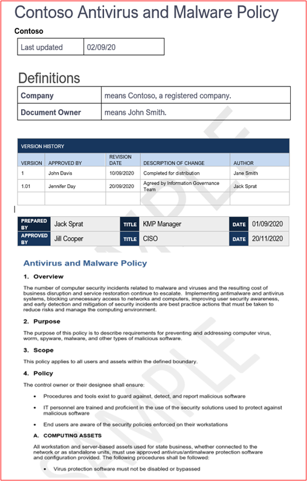

**Remarque :** Cette capture d’écran montre un document de stratégie/processus. Les isoeurs s’attend à partager la documentation de stratégie/procédure de prise en charge réelle et non simplement à fournir une capture d’écran.

**Contrôle n 2 :** Fournissez des preuves crédibles que des logiciels antivirus sont en cours d’exécution sur tous les composants système échantillonés.

- Objectif : il est important que l’antivirus (ou les défenses anti-programme malveillant) soit en cours d’exécution dans votre environnement pour vous protéger contre les risques de cybersécurité que vous pouvez ou non connaître, car les attaques potentiellement dangereuses augmentent, à la fois en matière de technique et de nombre. Le déploiement de l’antivirus sur tous les composants système qui le permettent permet d’atténuer certains risques liés à l’introduction de logiciels anti-programme malveillant dans l’environnement. Il suffit qu’un point de terminaison unique ne soit pas protégé pour fournir potentiellement un vecteur d’attaque pour qu’un acteur de menace prenne pied dans l’environnement. L’antivirus doit donc être utilisé comme l’une des couches de défense pour se protéger contre ce type de menace.

- Exemple de directives de preuve : pour prouver qu’une instance active de l’antivirus est en cours d’exécution dans l’environnement évalué. Fournissez une  capture d’écran pour chaque appareil de l’exemple qui prend en charge l’utilisation d’un antivirus qui montre le processus antivirus en cours d’exécution, le logiciel antivirus est actif, ou si vous avez une console de gestion centralisée pour l’antivirus, vous pourrez peut-être le montrer à partir de cette console de gestion. Si vous utilisez la console de gestion, assurez-vous d’avoir la preuve dans une capture d’écran que les appareils échantillonés sont connectés et fonctionnent.

- Exemple de preuve 1 : la capture d’écran ci-dessous a été prise à partir du Centre de sécurité Azure ; il indique qu’une extension anti-programme malveillant a été déployée sur la VM nommée &quot; MSPGPRODAZUR01 &quot; .

- Exemple de preuve 2

La capture d’écran ci-dessous a été prise à partir d’un Windows 10, montrant que la protection en temps réel est activé pour le nom d’hôte &quot; &quot; &quot; COUPNET-SBU-WM &quot; .

**Contrôle n 3 :** Fournir des preuves montrant que les signatures antivirus sont à jour dans tous les environnements (dans un délai d’un jour).

- Objectif : des centaines de milliers de nouveaux programmes malveillants et applications potentiellement indésirables (PUA) sont identifiés chaque jour. Pour fournir une protection adéquate contre les programmes malveillants nouvellement publiés, les signatures antivirus doivent être mises à jour régulièrement pour tenir compte des programmes malveillants nouvellement publiés.

- Ce contrôle permet de s’assurer que l’isv a pris en compte la sécurité de l’environnement et l’impact qu’un antivirus obsolète peut avoir sur la sécurité.

- Exemple de directives de preuve : fournir des fichiers journaux antivirus à partir de chaque appareil échantilloné, montrant que les mises à jour sont appliquées quotidiennement.

- Exemple de preuve : la capture d’écran suivante montre Microsoft Defender mis à jour au moins quotidiennement en affichant &#39;Event 2000, Windows Defender&#39; qui est la mise à jour. Le nom d’hôte s’affiche, montrant qu’il a été pris à partir du système dans l’étendue &quot; DE LA VIDÉONET-SBU-WM &quot; .

**Remarque :** Les preuves fournies doivent inclure une exportation des journaux pour afficher les mises à jour quotidiennes sur une période plus longue. Certains produits antivirus génèrent des fichiers journaux de mise à jour afin que ces fichiers soient fournis ou exportés à partir de l’Observateur d’événements.

**Contrôle n 4 :** Fournir des preuves montrant que l’antivirus est configuré pour effectuer une analyse à l’accès ou une analyse périodique sur tous les composants système échantillonné.

**Remarque :** Si l’analyse sur accès n’est pas activée, un minimum d’analyse quotidienne et alerting_ **DOIT** _be activée.

- Objectif : l’objectif de ce contrôle est de s’assurer que les programmes malveillants sont rapidement identifiés afin de minimiser les effets que cela peut avoir sur l’environnement. Lorsque l’analyse à l’accès est effectuée et associée au blocage automatique des programmes malveillants, cela permet d’arrêter les infections par les programmes malveillants connues par le logiciel antivirus. Lorsque l’analyse de l’accès n&#39;est pas souhaitable en raison des risques de faux positifs entraînant des pannes de service, des mécanismes d’analyse et d’alerte adaptés (ou plus) quotidiens doivent être implémentés pour garantir une réponse rapide aux infections par des programmes malveillants afin de minimiser les dommages.

- Exemple de recommandations en  matière de preuves : fournissez une capture d’écran pour chaque appareil de l’exemple qui prend en charge l’antivirus, montrant que l’antivirus est en cours d’exécution  sur l’appareil et configuré pour l’analyse en temps **réel,** ou fournissez une capture d’écran montrant que l’analyse périodique est activée pour l’analyse quotidienne, que l’alerte est configurée et que la dernière date d’analyse pour chaque appareil de l’exemple.

- Exemple de preuve : la capture d’écran suivante montre que la protection en temps réel est activée pour l’hôte, &quot; CONTRÔLENET-SBU-WM &quot; .

**Contrôle n 5 :** Fournir des preuves montrant que l’antivirus est configuré pour bloquer automatiquement les programmes malveillants ou la mise en quarantaine et les alertes sur tous les composants système échantillonés.

- Intention : la complexité des programmes malveillants évolue en tout temps avec les différents degrés d’ampleur qu’ils peuvent apporter. L’objectif de ce contrôle est soit d’empêcher les programmes malveillants de s’exécuter, soit de l’empêcher d’exécuter sa charge utile potentiellement utile, ou si le blocage automatique n’est pas une option, de limiter la durée d’exécution des programmes malveillants en alertant et en répondant immédiatement à l’infection potentielle des programmes malveillants.

- Exemple de directives de  preuve : fournissez une capture d’écran pour chaque appareil de l’exemple qui prend en charge l’antivirus, montrant que l’antivirus est en cours d’exécution sur l’ordinateur et qu’il est configuré pour bloquer automatiquement les programmes malveillants, les alertes ou la mise en quarantaine et l’alerte.

- Exemple de preuve 1 : la capture d’écran suivante montre que l’hôte &quot; CONTRÔLENET-SBU-WM est configuré avec une protection en temps réel pour &quot; Antivirus Microsoft Defender. Comme l’indique le paramètre, cela permet de localiser et d’arrêter l’installation ou l’exécution de programmes malveillants sur l’appareil.

**Contrôle n 6 :** Fournir des preuves montrant que les applications sont approuvées avant d’être déployées.

- Intention : avec le contrôle d’application, l’organisation approuve chaque application/processus autorisé à s’exécuter sur le système d’exploitation. L’objectif de ce contrôle est de s’assurer qu’un processus d’approbation est en place pour autoriser les applications/processus qui peuvent s’exécuter.

- Exemple de directives de preuve : des preuves peuvent être fournies indiquant que le processus d’approbation est en cours de suivi. Cela peut être fourni au moyen de documents signés, d’un suivi au sein de systèmes de contrôle des changements ou d’une utilisation telle que Azure DevOps ou JIRA pour suivre ces demandes et autorisations.

- Exemple de preuve : la capture d’écran suivante illustre une approbation par la direction que chaque application autorisée à s’exécuter dans l’environnement suit un processus d’approbation. Il s’agit d’un processus papier chez Contoso, mais d’autres mécanismes peuvent être utilisés.

**Contrôle n 7 :** Fournir des preuves montrant qu’une liste complète d’applications approuvées avec justification professionnelle existe et est conservée.

- Objectif : il est important que les organisations conservent une liste de toutes les applications qui ont été approuvées, ainsi que des informations sur la raison pour laquelle l’application/le processus a été approuvé. Cela permet de s’assurer que la configuration reste à jour et peut être examinée par rapport à une ligne de base pour s’assurer que les applications/processus non autorisés ne sont pas configurés.

- Exemple de directives de preuve : fournir la liste documentée des applications/processus approuvés, ainsi que la justification de l’entreprise.

- Exemple de preuve : la capture d’écran suivante répertorie les applications approuvées avec une justification professionnelle.

**Remarque :** Cette capture d’écran montre un document, l’objectif est que les isoeurs partagent le document de prise en charge réel et ne fournissent pas simplement une capture d’écran.

**Contrôle n 8 :** Fournissez une documentation de prise en charge détaillant la configuration du logiciel de contrôle d’application pour répondre à des mécanismes de contrôle d’application spécifiques.

- Objectif : la configuration de la technologie de contrôle d’application doit être documentée avec un processus de maintenance de la technologie, c’est-à-dire, l’ajout et la suppression d’applications/processus. Dans le cadre de cette documentation, le type de mécanisme utilisé doit être détaillé pour chaque application/processus. Cela se fera au niveau du contrôle suivant pour s’assurer que la technologie est configurée comme documenté.

- Exemple de directives de preuve : fournir une documentation de prise en charge détaillant la configuration du contrôle d’application et la configuration de chaque application/processus au sein de la technologie.

- Exemple de preuve : la capture d’écran suivante répertorie le mécanisme de contrôle utilisé pour implémenter le contrôle d’application. Vous pouvez voir ci-dessous que 1 application utilise des contrôles de certificat et les autres utilisent le chemin d’accès au fichier.

**Remarque :** Cette capture d’écran montre un document, l’objectif est que les isoeurs partagent le document de prise en charge réel et ne fournissent pas simplement une capture d’écran.

**Contrôle n 9 :** Fournissez des preuves montrant que le contrôle d’application est configuré comme documenté à partir de tous les composants système échantillonés.

- Objectif : l’objectif est de valider que le contrôle d’application est configuré dans l’exemple, comme le permet la documentation.

- Exemple de recommandations en  matière de preuve : fournissez une capture d’écran pour chaque appareil de l’exemple pour montrer que des contrôles d’application sont configurés et activés. Cela doit afficher les noms des ordinateurs, les groupes à qui ils appartiennent et les stratégies de contrôle d’application appliquées à ces groupes et ordinateurs.

- Exemple de preuve : la capture d’écran suivante montre un objet de stratégie de groupe avec des stratégies de restriction logicielle activées.

La capture d’écran suivante montre la configuration en ligne avec le contrôle ci-dessus.

La capture d’écran suivante montre l’environnement M365 et les ordinateurs inclus dans l’étendue appliquée à cet objet objet de &#39;domaine Paramètres&#39;.

Cette dernière capture d’écran montre le serveur dans l’étendue DBServer1 se trouve dans l’ou dans la capture &quot; d’écran &quot; ci-dessus.

### Gestion des correctifs : classement des risques

L’identification et la correction rapides des vulnérabilités de sécurité permettent de minimiser les risques d’un acteur de menace qui compromet l’environnement ou l’application. La gestion des correctifs est divisée en deux sections : le classement des risques et la correction. Ces trois contrôles couvrent l’identification des vulnérabilités de sécurité et leur classement en fonction du risque qu’ils présentent.

Ce groupe de contrôle de sécurité est dans l’étendue des environnements d’hébergement PaaS (Platform-as-a-Service), car les bibliothèques de logiciels et la base de code tierces d’application/de add-in doivent être corrigés en fonction du classement des risques.

**Contrôle n. 10 :** Documentation sur la stratégie d’approvisionnement qui régit la façon dont les nouvelles vulnérabilités de sécurité sont identifiées et affectées à un score de risque.

- Objectif : l’objectif de ce contrôle est de fournir une documentation de prise en charge pour s’assurer que les vulnérabilités de sécurité sont identifiées rapidement afin de réduire la fenêtre d’opportunité dont les acteurs de menace ont besoin pour exploiter ces vulnérabilités. Un mécanisme robuste doit être mis en place pour identifier les vulnérabilités couvrant tous les composants système utilisés par les organisations ; par exemple, les systèmes d’exploitation (Windows Server, Ubuntu, etc.), les applications (Tomcat, MS Exchange,CulaireWinds, etc.), les dépendances de code (AngularJS, jQuery, etc.). Les organisations doivent non seulement garantir l’identification en temps voulu des vulnérabilités au sein du patrimoine, mais également classer les vulnérabilités en conséquence pour s’assurer que la correction est effectuée dans un délai approprié en fonction du risque que présente la vulnérabilité.

**Remarque** Même si vous êtes en cours d’exécution dans un environnement purement Platform as a Service, vous avez toujours la responsabilité d’identifier les vulnérabilités au sein de votre base de code : c’est-à-dire, les bibliothèques tierces.

- Exemple de directives de preuve : fournir la documentation de support (pas les captures d’écran)

- Exemple de preuve : cette capture d’écran montre un extrait de code d’une stratégie de classement des risques.

**Remarque :** Cette capture d’écran montre un document de stratégie/processus. Les isoeurs s’attend à partager la documentation de stratégie/procédure de prise en charge réelle et non simplement à fournir une screenshot._

**Contrôle n. 11 :** Fournir des preuves de la façon dont les nouvelles vulnérabilités de sécurité sont identifiées.

- Objectif : l’objectif de ce contrôle est de s’assurer que le processus est suivi et&#39;suffisamment robuste pour identifier les nouvelles vulnérabilités de sécurité au sein de l’environnement. Il ne s’agit peut-être pas seulement des systèmes d’exploitation. il peut inclure les applications en cours d’exécution dans l’environnement et les dépendances de code.

- Exemples de directives de preuve : des preuves peuvent être fournies au moyen d’un affichage des abonnements à des listes de diffusion, d’une révision manuelle des sources de sécurité pour les vulnérabilités nouvellement publiées (doivent faire l’objet d’un suivi adéquat avec des timestamps des activités, c’est-à-dire, avec JIRA ou Azure DevOps), d’outils qui recherchent des logiciels mis à jour (par exemple, peuvent être Snyk lorsque vous recherchez des bibliothèques de logiciels hors date,  ou peut être Nessus à l’aide d’analyses authentifiées qui identifient les logiciels hors date.)

**Remarque** Si vous utilisez Nessus, vous devez l’exécuter régulièrement pour identifier rapidement les vulnérabilités. Nous vous recommandons de le faire au moins une fois par semaine.

- Exemple de preuve : cette capture d’écran montre qu’un groupe de publipostage est utilisé pour être averti des vulnérabilités de sécurité.

**Contrôle n. 12 :** Fournir des preuves montrant que toutes les vulnérabilités sont affectées à un classement des risques une fois identifiées.

- Intention : la correction doit être basée sur le risque, plus la vulnérabilité est risquée, plus vite elle doit être corrigé. Le classement des risques des vulnérabilités identifiées fait partie intégrante de ce processus. L’objectif de ce contrôle est de s’assurer qu’il existe un processus documenté de classement des risques qui est suivi pour s’assurer que toutes les vulnérabilités identifiées sont classées de manière équitable en fonction des risques. Les organisations utilisent généralement la classification CVSS (Common Vulnerability Scoreing System) fournie par les fournisseurs ou les chercheurs en sécurité. Si l’organisation s’appuie sur CVSS, il est recommandé d’inclure un mécanisme de classement dans le processus pour permettre à l’organisation de modifier le classement en fonction d’une évaluation interne des risques. Parfois, la vulnérabilité peut ne pas être une application en raison de la façon dont l’application a été déployée dans l’environnement. Par exemple, une vulnérabilité Java peut être libérée, ce qui a un impact sur une bibliothèque spécifique qui n’est pas utilisée par l’organisation.

- Exemples de directives de preuve : fournir des preuves par capture d’écran ou par d’autres moyens, par exemple DevOps/Jira, qui montre que les vulnérabilités traversent le processus de classement des risques et se voient attribuer un classement des risques approprié par l’organisation.

- Exemple de preuve : cette capture d’écran montre le classement des risques dans la colonne D et le reclassement dans les colonnes F et G, si l’organisation effectue une évaluation des risques et détermine que le risque peut être rétrogradé. Des preuves de re-classement des évaluations des risques doivent être fournies comme preuves à l’appui

### Gestion des correctifs : correction

Les contrôles ci-dessous sont pour l’élément de correction pour la gestion des correctifs. Pour maintenir un environnement d’exploitation sécurisé, les applications/modules et les systèmes de prise en charge doivent être corrigés de manière durable. Une période appropriée entre l’identification (ou la publication publique) et la correction doit être gérée pour réduire la fenêtre d’opportunité d’une vulnérabilité exploitée par un acteur de menace. La certification Microsoft 365 ne prévoit pas de &#39;fenêtre de correction&#39;, mais les analystes de certification rejetteront les délais qui ne sont pas raisonnables.

Ce groupe de contrôle de sécurité est dans l’étendue des environnements d’hébergement PaaS (Platform-as-a-Service), car les bibliothèques de logiciels et la base de code tierces d’application/de add-in doivent être corrigés en fonction du classement des risques.

**Contrôle n. 13 :** Fournir une documentation de stratégie pour la correction des composants système dans l’étendue qui inclut une période de correction minimale appropriée pour les vulnérabilités critiques, élevées et à risque moyen ; et la désaffectation de tous les systèmes d’exploitation et logiciels non pris en charge.

- Objectif : la gestion des correctifs est requise par de nombreuses infrastructure de conformité de sécurité, par exemple, PCI-DSS, ISO 27001, NIST (SP) 800-53. L’importance d’une bonne gestion des correctifs ne peut pas être trop importante, car elle peut corriger les problèmes de sécurité et de fonctionnalité dans les logiciels, les microprogrammes et atténuer les vulnérabilités, ce qui contribue à réduire les opportunités d’exploitation. L’objectif de ce contrôle est de réduire la fenêtre d’opportunité dont dispose un acteur de menace pour exploiter les vulnérabilités qui peuvent exister dans l’environnement dans l’étendue.

- Exemple de directives de preuve : fournissez une copie de toutes les stratégies et procédures détaillant le processus de gestion des correctifs. Cela doit inclure une section sur une fenêtre de correction minimale, et que les systèmes d’exploitation et les logiciels non pris en charge ne doivent pas être utilisés dans l’environnement.

- Exemple de preuve : ci-dessous se trouve un exemple de document de stratégie.

**Remarque :** Cette capture d’écran montre un document de stratégie/processus. Les isoeurs s’attend à partager la documentation de stratégie/procédure de prise en charge réelle et non simplement à fournir une screenshot._

**Contrôle n 14 :** Fournissez des preuves montrant que tous les composants système échantillonés sont en cours de correction.

**Remarque :** Inclure des bibliothèques logicielles/tierces.

- Objectif : la correction des vulnérabilités garantit que les différents modules qui font partie de l’infrastructure des technologies de l’information (matériel, logiciel et services) sont tenus à jour et exempts de vulnérabilités connues. La correction doit être effectuée dès que possible pour réduire le risque d’incident de sécurité entre la publication des détails de la vulnérabilité et la correction. Ceci est encore plus critique lorsque l’exploitation des vulnérabilités connues est dans la nature.

- Exemple de directives de  preuve : fournissez une capture d’écran pour chaque appareil de l’exemple et des composants logiciels de prise en charge montrant que les correctifs sont installés en ligne avec le processus documenté de correction.

- Exemple de preuve : la capture d’écran suivante montre que le composant système DANS l’étendue &quot; DU COMPOSANTSURNET-SBU-WM effectue des mises à jour Windows en ligne avec la stratégie de &quot; correction.

**Remarque :** La correction de tous les composants système dans l’étendue doit être une preuve. Cela inclut des éléments tels que ; Mises à jour du système d’exploitation, mises à jour des applications/composants (i.e__.,_ _Apache Tomcat, OpenSSL, etc.), dépendances logicielles (par exemple, JQuery, AngularJS, etc.), etc._

**Contrôle n. 15 :** Fournir des preuves montrant que les systèmes d’exploitation et composants logiciels non pris en charge ne sont pas utilisés dans l’environnement.

- Intention : les logiciels qui ne sont pas tenus à jour par les fournisseurs subiront, en heures supplémentaires, des vulnérabilités connues qui ne sont pas corrigées. Par conséquent, l’utilisation de systèmes d’exploitation et de composants logiciels non pris en charge ne doit pas être utilisée dans les environnements de production.

- Exemple de recommandations en  matière de preuve : fournissez une capture d’écran pour chaque appareil de l’exemple montrant la version du système d’exploitation en cours d’exécution (y compris le nom du serveur&#39;dans la capture d’écran). En outre, indiquez que les composants logiciels en cours d’exécution dans l’environnement exécutent des versions prise en charge. Pour ce faire, vous pouvez fournir la sortie des rapports d’analyse des vulnérabilités internes (l’analyse authentifiée est incluse) et/ou la sortie d’outils qui vérifient des bibliothèques tierces, telles que [Snyk,](https://snyk.io/) [Trivy](https://github.com/aquasecurity/trivy) ou [NPM Audit](https://docs.npmjs.com/cli/v7/commands/npm-audit). S’il est uniquement en cours d’exécution dans PaaS, seule la correction de bibliothèque tierce doit être couverte par les groupes de contrôle d’application des correctifs.

- Exemple de preuve : les preuves suivantes montrent que le composant système dans l’étendue DU MATÉRIEL exécute un logiciel pris en charge par le fournisseur étant donné que Nessus n'&#39;signalé aucun problème.

**Remarque :** Le rapport complet doit être partagé avec les analystes de certification.

- Exemple de preuve 2

Cette capture d’écran montre que le composant système dans l’étendue &quot; PRINCIPALNET-SBU-WM est en cours d’exécution sur &quot; une version Windows prise en charge.

- Exemple de preuve 3

La capture d’écran suivante présente la sortie [Trivy,](https://github.com/aquasecurity/trivy) dont le rapport complet ne&#39;aucune application non pris en compte.

**Remarque :** Le rapport complet doit être partagé avec les analystes de certification.

### Analyse des vulnérabilités

En introduisant des évaluations régulières des vulnérabilités, les organisations peuvent détecter les faiblesses et les insécurités au sein de leurs environnements, ce qui peut fournir un point d’entrée pour qu’un acteur malveillant compromette l’environnement. L’analyse des vulnérabilités peut aider à identifier les correctifs manquants ou les mauvaises configurations au sein de l’environnement. En mener régulièrement ces analyses, une organisation peut fournir des corrections appropriées pour minimiser les risques de compromission en raison de problèmes couramment pris en compte par ces outils d’analyse des vulnérabilités.

**Contrôle n. 16 :** Fournissez les rapports d’analyse des vulnérabilités des applications web et de l’infrastructure trimestrielle. L’analyse doit être effectuée sur l’intégralité de l’empreinte publique (adresses IP et URL) et des plages d’adresses IP internes.

**Remarque :** Cela **DOIT inclure** l’étendue complète de l’environnement.

- Objectif : l’analyse des vulnérabilités recherche les faiblesses possibles dans le système informatique, les réseaux et les applications web d’une organisation afin d’identifier les trous susceptibles d’entraîner des violations de la sécurité et l’exposition des données sensibles. L’analyse des vulnérabilités est souvent requise par les normes du secteur et les réglementations gouvernementales, par exemple la norme PCI DSS (Payment Card Industry Data Security Standard).

- Un rapport de mesures de sécurité intitulé Guide des mesures de sécurité 2020 sur la conformité PCI DSS indique que les &#39;ont mis en moyenne &quot; 166 jours à partir du moment où une organisation a été considérée comme ayant des [vulnérabilités](https://info.securitymetrics.com/pci-guide-2020) pour qu’une personne malveillante compromette le &quot; système. Une fois compromis, les personnes malveillantes ont eu accès aux données sensibles pendant une moyenne de 127 jours&#39; par conséquent, ce contrôle vise à identifier les faiblesses de sécurité potentielles dans l’environnement au sein de l’étendue.

- Exemple de recommandations en matière de preuves : fournissez les rapports d’analyse complets pour chaque trimestre&#39;les analyses de vulnérabilité qui ont été effectuées au cours des 12 derniers mois. Les rapports doivent clairement faire état des cibles pour vérifier que l’encombrement public complet est inclus et, le cas échéant, chaque sous-réseau interne. Fournissez **TOUS les** rapports d’analyse **pour CHAQUE** trimestre.

- Exemple de preuve : exemple de preuve : fournir les rapports d’analyse à partir de l’outil d’analyse utilisé. Chaque trimestre&#39;rapports d’analyse doivent être fournis pour révision. L’analyse doit inclure l’ensemble des composants système des environnements . chaque sous-réseau interne et chaque adresse IP/URL publique disponible pour l’environnement.

**Contrôle n. 17 :** Fournissez des preuves montrant que la correction des vulnérabilités identifiées au cours de l’analyse des vulnérabilités est corrigé en ligne avec la période de correction documentée.

- Intention : l’échec de l’identification, de la gestion et de la correction rapides des vulnérabilités et des mauvaises configurations peut augmenter le risque d’une&#39;d’une compromission entraînant des violations de données potentielles. L’identification et la correction correctes des problèmes sont considérées comme importantes pour la posture de sécurité globale et l’environnement d’une organisation&#39;qui est conforme aux meilleures pratiques des différents cadres de sécurité pour ; par exemple, ISO 27001 et PCI DSS.

- Exemple de recommandations en matière de preuves : fournissez des artefacts appropriés (par exemple, des captures d’écran) montrant qu’un échantillon de vulnérabilités découvertes de l’analyse des vulnérabilités est corrigé en ligne avec les fenêtres de correction déjà fournies dans le contrôle 13 ci-dessus.

- Exemple de preuve : la capture d’écran suivante montre une analyse Nessus de l’environnement dans l’étendue (un seul ordinateur dans cet exemple nommé « SCANNE ) affichant des vulnérabilités le &quot; &quot; 2 août 2021.

La capture d’écran suivante montre que les problèmes ont été résolus, 2 jours plus tard, dans la fenêtre de correction définie dans la stratégie de correction.

**Remarque :** Pour ce contrôle, les analystes de certification doivent voir des rapports d’analyse des vulnérabilités et des corrections pour chaque trimestre au cours des douze derniers mois.

### Pare-feu

Les pare-feu fournissent souvent une limite de sécurité entre les environnements de confiance (réseau interne), non fiables (Internet) et semi-fiables (DMZ). Il s’agit généralement de la première ligne de défense au sein d’une stratégie de sécurité de défense approfondie des organisations, conçue pour contrôler les flux de trafic pour les services d’entrée et de sortie et pour bloquer le trafic indésirable. Ces appareils doivent être étroitement contrôlés pour s’assurer qu’ils fonctionnent efficacement et qu’ils ne sont pas mal configurés et risquent de mettre l’environnement en danger.

**Contrôle n. 18 :** Fournir une documentation de stratégie qui régit les pratiques et procédures de gestion du pare-feu.

- Intention : les pare-feu sont une première ligne de défense importante dans une stratégie de sécurité en couches (défense en profondeur), protégeant les environnements contre les zones réseau moins fiables. En règle générale, les pare-feu contrôlent les flux de trafic en fonction des adresses IP et des protocoles/ports. Des pare-feux plus riches en fonctionnalités peuvent également fournir des protections de couche d’application supplémentaires en inspectant le trafic des applications pour se protéger contre les utilisations abusives, les vulnérabilités et les menaces en fonction des &quot; &quot; applications accessibles. Ces protections sont aussi bonnes que la configuration du pare-feu. Par conséquent, des stratégies de pare-feu et des procédures de prise en charge fortes doivent être en place pour s’assurer qu’elles sont configurées pour fournir une protection adéquate des ressources internes. Par exemple, un pare-feu avec une règle permettant d’autoriser TOUT le trafic de N’importe quelle source vers n’importe quelle destination agit simplement en tant que routeur.

- Exemple de directives de preuve : fournissez la documentation de prise en charge de votre stratégie/procédure de pare-feu complète. Ce document doit couvrir tous les points ci-dessous et toutes les meilleures pratiques supplémentaires applicables à votre environnement.

- Exemple de preuve : voici un exemple du type de document de stratégie de pare-feu dont nous avons besoin (il s’agit d’une démonstration et peut ne pas être terminée).

**Contrôle n 19 :** Fournissez la preuve que les informations d’identification administratives par défaut sont modifiées avant l’installation dans les environnements de production.

- Intention : les organisations doivent tenir compte des informations d’identification administratives par défaut fournies par le fournisseur qui sont configurées pendant la configuration de l’appareil ou du logiciel. Les informations d’identification par défaut sont souvent accessibles au public par les fournisseurs et peuvent fournir à un acteur de menace externe la possibilité de compromettre un environnement. Par exemple, une recherche simple sur Internet des informations d’identification iDrac par défaut (contrôleur d’accès à distance Dell intégré) met en évidence _root::en tant_ que nom d’utilisateur et mot de passe par défaut. Cela permettra à une personne d’accéder à distance à la gestion des serveurs distants. L’objectif de ce contrôle est de s’assurer que les environnements ne sont pas susceptibles d’être exposés à des attaques par le biais des informations d’identification du fournisseur par défaut qui n’ont pas été modifiées pendant le renforcement de l’appareil/de l’application.

- Exemples de directives de preuve

- Cela peut se faire lors d’une session de partage d’écran dans laquelle l’analyste de certification peut essayer de s’authentifier sur les appareils dans l’étendue à l’aide des informations d’identification par défaut.

- Exemple de preuve

La capture d’écran ci-dessous montre ce que l’analyste de certification voit à partir d’un nom d’utilisateur/mot de passe non valide à partir d’un pare-feu WatchGuard.

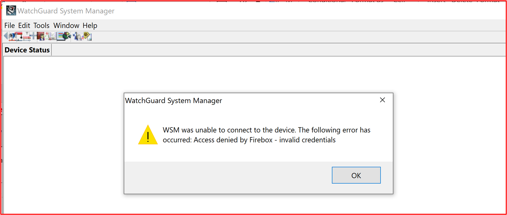

**Contrôle n 20 :** Fournissez la preuve que les pare-feu sont installés à la limite de l’environnement dans l’étendue et installés entre le réseau de périmètre (également appelé DMZ, zone démilitarisée et sous-réseau filtré) et les réseaux de confiance internes.

- Intention : les pare-feu permettent de contrôler le trafic entre différentes zones réseau de différents niveaux de sécurité. Étant donné que tous les environnements sont connectés à Internet, les pare-feu doivent être installés sur la limite, c’est-à-dire entre Internet et l’environnement dans l’étendue. En outre, les pare-feu doivent être installés entre les réseaux DMZ (zone décomisée) moins fiables et les réseaux de confiance internes. Les DMZ sont généralement utilisées pour servir le trafic provenant d’Internet et sont donc la cible d’attaques. En implémentant un DMZ et en utilisant un pare-feu pour contrôler les flux de trafic, une compromission du DMZ&#39;ne signifie pas nécessairement une compromission des réseaux de confiance internes et des données d’entreprise/client. Une journalisation et une alerte adéquates doivent être en place pour aider les organisations à identifier rapidement une compromission afin de minimiser la possibilité pour l’acteur de menace de compromettre davantage les réseaux fiables internes. L’objectif de ce contrôle est de s’assurer qu’il existe un contrôle adéquat entre les réseaux de confiance et les réseaux moins fiables.

- Exemple de directives de preuve : des preuves doivent être fournies par le moyen de fichiers de configuration de pare-feu ou de captures d’écran montrant qu’un DMZ est en place. Cela doit correspondre aux diagrammes architecturaux fournis montrant les différents réseaux de prise en charge de l’environnement. Une capture d’écran des interfaces réseau sur le pare-feu, couplée au diagramme réseau déjà fourni dans le cadre de la soumission initiale du document, doit fournir cette preuve.

- Exemple de preuve : ci-dessous est une capture d’écran d’un pare-feu WatchGuard montrant deux DMZ, l’une pour les services entrants (nommé DMZ), l’autre pour le jumpbox (hôte Bastian).

**Contrôle n 21 :** Fournissez des preuves que tous les accès publics se terminent dans la zone démilitarisée (DMZ).

- Intention : les ressources accessibles au public sont ouvertes à une multitude d’attaques. Comme mentionné ci-dessus, l’objectif d’un DMZ est de segmenter les réseaux moins fiables des réseaux internes de confiance qui peuvent contenir des données sensibles. Une DMZ est considérée comme moins fiable, car il existe un grand risque que les hôtes accessibles au public soient compromis par les acteurs des menaces externes. L’accès public doit toujours s’interrompre dans ces réseaux moins fiables, qui sont segmentés correctement par le pare-feu pour protéger les ressources internes et les données. L’objectif de ce contrôle est de s’assurer que tous les accès publics s’terminent au sein de ces zones DMZ moins fiables comme si les ressources sur les réseaux internes de confiance étaient publiques, une compromission de ces ressources fournit à un acteur de menace une mainmise sur le réseau où les données sensibles sont détenues.

- Exemples de directives de preuve

- Les preuves fournies pour cela peuvent être des configurations de pare-feu qui indiquent les règles entrantes et l’endroit où ces règles sont en cours d’arrêt, soit en routant des adresses IP publiques vers les ressources, soit en fournissant la traduction d’adresses réseau (NAT) du trafic entrant.

- Exemple de preuve

Dans la capture d’écran ci-dessous, il existe trois règles entrantes, chacune affichant la nat pour les sous-réseaux 10.0.3.x et 10.0.4.x, qui sont les sous-réseaux DMZ.

**Contrôle n. 22 :** Fournissez la preuve que tout le trafic autorisé par le pare-feu passe par un processus d’approbation.

- Intention : étant donné que les pare-feu sont un obstacle au trafic non sécurisé et aux ressources internes, et entre les réseaux de différents niveaux de confiance, les pare-feu doivent être configurés en toute sécurité et garantir que seul le trafic nécessaire pour les opérations d’entreprise est activé. En permettant un flux de trafic inutile ou un flux de trafic trop permissif, cela peut introduire des faiblesses au sein de la défense à la limite de ces différentes zones réseau. En établissant un processus d’approbation robuste pour toutes les modifications de pare-feu, le risque d’introduire une règle qui introduit un risque significatif pour l’environnement est réduit. Le rapport d’enquête sur les violations de données de Verizon&#39;[2020](https://enterprise.verizon.com/en-gb/resources/reports/dbir/) souligne que les&#39;d’erreur, qui incluent des &quot; configurations erronées, sont le seul type d’action qui augmente constamment d’une année à &quot; l’autre.

- Exemple de recommandations en matière de preuve : la preuve peut se présenter sous la forme d’une documentation indiquant qu’une demande de modification de pare-feu est autorisée, qui peut être à quelques minutes d’une réunion cab (conseil d’conseiller des modifications) ou d’un système de contrôle des modifications qui suit toutes les modifications.

- Exemple de preuve : la capture d’écran suivante montre une modification de règle de pare-feu demandée et autorisée à l’aide d’un processus papier. Cela peut être obtenu par le biais d’une DevOps ou Jira, par exemple.

**Contrôle n 23 :** Fournissez la preuve que la base de règles de pare-feu est configurée pour abandonner le trafic non explicitement défini.

- Intention : la plupart des pare-feu vont traiter les règles dans une approche de haut en bas pour essayer de trouver une règle correspondante. Si une règle correspond, l’action de cette règle est appliquée et tout autre traitement des règles s’arrête. Si aucune règle correspondante n’est trouvée, le trafic est refusé par défaut. L’objectif de ce contrôle est, si le pare-feu n'&#39;pas par défaut de déposer le trafic si aucune règle correspondante n’est trouvée, la base de règles doit inclure une règle Refuser tout à la fin de toutes les listes de pare-feu. &quot; &quot;  Cela permet de s’assurer que le pare-feu n&#39;pas par défaut dans un état d’autorisation par défaut lors du traitement des règles, ce qui autorise le trafic qui&#39;pas été explicitement défini.

- Exemples de directives de preuve : des preuves peuvent être fournies par le moyen de la configuration du pare-feu ou par des captures d’écran montrant toutes les règles de pare-feu affichant une règle Refuser tout à la fin&#39;, ou si le pare-feu abandonne le trafic qui ne correspond pas à une règle par défaut, puis fournissez une capture d’écran de toutes les règles de pare-feu et un lien vers les guides d’administration du fournisseur indiquant que, par défaut, le pare-feu déposera tout le trafic non mis en &quot; &quot; correspondance.

- Exemple de preuve : voici une capture d’écran de la base de règles de pare-feu WatchGuard qui montre qu’aucune règle n’est configurée pour autoriser tout le trafic. Il n’existe aucune règle de refus à la fin, car watchGuard va abandonner le trafic qui ne&#39;pas correspondre par défaut.

Le lien centre d’aide WatchGuard suivant ; [https://www.watchguard.com/help/docs/help-center/en-US/Content/en-US/Fireware/policies/policies\_about\_c.html](https://www.watchguard.com/help/docs/help-center/en-US/Content/en-US/Fireware/policies/policies_about_c.html) inclut les informations suivantes :

**Contrôle n 24 :** Fournissez la preuve que le pare-feu prend uniquement en charge le chiffrement fort sur toutes les interfaces d’administration non console.

- Intention : pour atténuer les attaques de l’utilisateur au milieu du trafic administratif, toutes les interfaces d’administration non console doivent prendre en charge uniquement le chiffrement fort. L’objectif principal de ce contrôle est de protéger les informations d’identification administratives lorsque la connexion non console est configurée. En outre, cela peut également vous aider à vous protéger contre les écoutes clandestines dans la connexion, en essayant de relire les fonctions d’administration pour reconfigurer l’appareil ou dans le cadre de la reconnaissance.

- Exemple de directives de preuve : fournissez la configuration du pare-feu, si celle-ci fournit la configuration cryptographique des interfaces d’administration non console (tous les appareils ne l’incluront pas comme options configurables). Si ce n&#39;pas dans la configuration, vous pouvez émettre des commandes à l’appareil pour afficher ce qui est configuré pour ces connexions. Certains fournisseurs peuvent publier ces informations dans des articles, ce qui peut également être un moyen de les mettre en évidence. Enfin, vous devrez peut-être exécuter des outils pour la sortie du chiffrement pris en charge.

- Exemple de preuve : la capture d’écran ci-dessous montre la sortie de [SSLScan](https://github.com/rbsec/sslscan) par rapport à l’interface d’administration web du pare-feu WatchGuard sur le port TCP 8080. Cela montre TLS 1.2 ou supérieur avec un chiffrement de chiffrement minimal AES-128bit.

**Remarque**: les pare-feu WatchGuard peuvent également prendre en charge les fonctions d’administration à l’aide de SSH (port TCP 4118) et de WatchGuard System Manager (ports TCP 4105 &amp; 4117). Des preuves de ces interfaces administratives non console doivent également être fournies.

**Contrôle n 25 :** Fournissez des preuves montrant que vous effectuez des révisions de règles de pare-feu au moins tous les 6 mois.

- Objectif : au fil du temps, il existe un risque de configuration complexe dans les composants système avec l’environnement dans l’étendue. Cela peut souvent introduire des insécurités ou des mauvaises configurations qui peuvent augmenter le risque de compromission de l’environnement. La procédure de configuration peut être introduite pour de nombreuses raisons, telles que des modifications temporaires apportées au dépannage, des modifications temporaires pour des modifications fonctionnelles ad hoc, afin d’introduire des correctifs rapides aux problèmes qui peuvent parfois être trop permissifs en raison des pressions liées à l’introduction d’un correctif rapide. Par exemple, vous pouvez introduire une règle de pare-feu temporaire Autoriser tout à surmonter &quot; &quot; un problème urgent. L’objectif de ce contrôle est double, d’abord pour identifier les problèmes de configuration qui peuvent introduire des insécurités, et deuxièmement pour identifier les règles de pare-feu qui ne sont plus nécessaires et qui peuvent par conséquent être supprimées, c’est-à-dire si un service a été retiré mais que la règle de pare-feu a été laissée derrière.

- Exemple de directives de preuve : la preuve doit être en mesure de démontrer que les réunions de révision ont eu lieu. Pour ce faire, vous pouvez partager les minutes de réunion de la révision du pare-feu et toute preuve supplémentaire de contrôle des changements qui indique les actions prises à partir de l’examen. Assurez-vous que les dates sont&#39;nous devons voir au moins deux de ces réunions (c’est-à-dire, tous les six mois)

- Exemple de preuve : la capture d’écran suivante illustre la preuve d’une révision du pare-feu en janvier 2021.

La capture d’écran suivante illustre la preuve d’une révision du pare-feu en juillet 2021.

### Pare-feu : wafs

Il est facultatif de déployer un pare-feu d’application Web (WAF) dans la solution. Si un waf est utilisé, cela compte comme des crédits supplémentaires pour la matrice de notation au sein du domaine de sécurité &#39;operational security&#39;. Les wafs peuvent inspecter le trafic web pour filtrer et surveiller le trafic web entre Internet et les applications web publiées afin d’identifier les attaques spécifiques aux applications web. Les applications Web peuvent subir de nombreuses attaques spécifiques à des applications web telles que l’injection de SQL (SQLi), les scripts entre sites (XSS), la contrefaçon de demande entre sites (CSRF/XSRF), etc. et les FS sont conçues pour se protéger contre ces types de charges utiles malveillantes afin de protéger les applications web contre les attaques et les compromissions potentielles.

**Contrôle n 26 :** Fournissez des preuves montrant que le pare-feu de l’application Web (WAF) est configuré pour surveiller, alerter et bloquer activement le trafic malveillant.

- Intention : ce contrôle est en place pour confirmer que le waf est en place pour toutes les connexions web entrantes et qu’il est configuré pour bloquer ou alerter le trafic malveillant. Pour fournir une couche de défense supplémentaire pour le trafic web, les wafs doivent être configurés pour toutes les connexions web entrantes, sinon, les acteurs des menaces externes pourraient contourner les wafs conçus pour fournir cette couche de protection supplémentaire. Si le waf n'&#39;pas configuré pour bloquer activement le trafic malveillant, il doit être en mesure de fournir une alerte immédiate au personnel qui peut réagir rapidement au trafic malveillant potentiel afin de maintenir la sécurité de l’environnement et d’arrêter les attaques.

- Exemple de recommandations en matière de preuves : fournir une sortie de configuration à partir du point d’accès sans fil qui met en évidence les connexions web entrantes en cours de service et que la configuration bloque activement le trafic malveillant ou surveille et avertit. Sinon, des captures d’écran des paramètres spécifiques peuvent être partagées pour démontrer qu’une organisation est en train de répondre à ce contrôle.

- Exemple de preuve : les captures d’écran suivantes montrent que la stratégie WAF de Contoso Production Azure Application Gateway est activée et qu’elle est configurée pour le mode&#39; de prévention &#39;, ce qui permet de déposer activement le trafic malveillant.

La capture d’écran ci-dessous illustre la configuration IP frontale

**Remarque :** Les preuves doivent démontrer toutes les entrées publiques utilisées par l’environnement pour s’assurer que tous les points d’entrée sont couverts, raison pour laquelle cette capture d’écran est également incluse.

La capture d’écran ci-dessous montre les connexions web entrantes utilisant ce waf.

La capture d’écran suivante montre le CoreRules Contoso AppGW montrant qu’il s’agit de \_ \_ l’application api.contoso.com service.

**Contrôle n 27 :** Fournissez des preuves que le waf prend en charge le déchargement SSL.

- Intention : la possibilité pour le waf d’être configuré pour prendre en charge le déchargement SSL est importante, sinon il ne pourra pas inspecter le trafic HTTPS. Étant donné que ces environnements doivent prendre en charge le trafic HTTPS, il s’agit d’une fonction essentielle pour le waf afin de s’assurer que les charges utiles malveillantes dans le trafic HTTPS peuvent être identifiées et arrêtées.

- Exemple de directives de preuve : fournir des preuves de configuration via une exportation de configuration ou des captures d’écran qui montrent que le déchargement SSL est pris en charge et configuré.

- Exemple de preuve : dans Azure Application Gateway, la configuration d’un port d’écoute SSL activé pour le déchargement SSL, consultez la page Présentation de l’arrêt de TLS et du [TLS](https://docs.microsoft.com/en-us/azure/application-gateway/ssl-overview) de bout en bout avec la documentation Microsoft de la passerelle d’application. La capture d’écran suivante montre cette configuration pour contoso Production Azure Application Gateway.

**Contrôle n 28 :** « Fournir des preuves montrant que le waf est protégé contre une partie ou l’ensemble des classes de vulnérabilités suivantes, selon l’ensemble de règles principales OWASP (3.0 ou 3.1) :
- problèmes de protocole et d’encodage,
- injection d’en-tête, de demande de séparation des demandes et de fractionnement de réponse,
- attaques par traversée de fichier et de chemin d’accès,
- attaques d’inclusion de fichiers distantes (RFI),
- attaques d’exécution de code à distance,
- Attaques par injection php,
- attaques par scripts entre sites,
- SQL attaques par injection,
- attaques par attachement de session.

- Intention : les wafs doivent être configurés pour identifier les charges utiles d’attaque pour les classes courantes de vulnérabilités. Ce contrôle vise à s’assurer que la détection adéquate des classes de vulnérabilité est couverte en tirant parti de l’ensemble de règles principales OWASP.

- Exemple de directives de preuve : fournir des preuves de configuration via une exportation de configuration ou des captures d’écran montrent que la plupart des classes de vulnérabilité identifiées ci-dessus sont couvertes par l’analyse.

- Exemple de preuve : la capture d’écran ci-dessous montre que la stratégie WAF de Contoso Production Azure Application Gateway est configurée pour analyser l’ensemble de règles de base OWASP version 3.2.

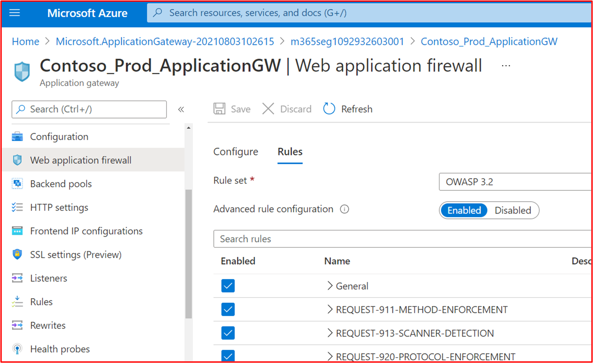

### Contrôle des changements

Un processus de contrôle des modifications établi et compris est essentiel pour s’assurer que toutes les modifications passeront par un processus structuré répétable. En veillant à ce que toutes les modifications soient traitées par le biais d’un processus structuré, les organisations peuvent s’assurer que les modifications sont gérées efficacement, examinées par les homologues et testées correctement avant d’être signées. Cela permet non seulement de réduire le risque de panne du système, mais également de réduire le risque d’incidents de sécurité potentiels par le biais de modifications incorrectes introduites.

**Contrôle n 29 :** Fournir une documentation de stratégie qui régit les processus de contrôle des changements.

- Objectif : pour maintenir un environnement sécurisé et une application sécurisée, un processus de contrôle des modifications robuste doit être établi pour garantir que toutes les modifications d’infrastructure et de code sont effectuées avec une supervision forte et des processus définis. Cela permet de s’assurer que les modifications sont documentées, que les implications en matière de sécurité sont envisagées, que l’impact sur la sécurité aura un impact sur la sécurité, etc. L’objectif est de s’assurer que le processus de contrôle des modifications est documenté pour s’assurer qu’une approche sécurisée et cohérente est prise en compte pour toutes les modifications au sein de l’environnement et des pratiques de développement d’applications.

- Exemple de directives de preuve : les stratégies/procédures de contrôle des changements documentées doivent être partagées avec les analystes de certification.

- Exemple de preuve : ci-dessous montre le début d’un exemple de stratégie de gestion des changements. Veuillez fournir vos stratégies et procédures complètes dans le cadre de l’évaluation.

**Remarque :** Cette capture d’écran montre un document de stratégie/processus. Les isoeurs s’attend à partager la documentation de stratégie/procédure de prise en charge réelle et non simplement à fournir une capture d’écran.

**Contrôle n 30 :** Fournissez des preuves montrant que les environnements de développement et de test appliquent la séparation des tâches de l’environnement de production.

- Objectif : la plupart des&#39;environnements de développement/test de l’organisation ne sont pas configurés avec le même paramétrateur que les environnements de production et sont donc moins sécurisés. En outre, les tests ne doivent pas être effectués dans l’environnement de production, car cela peut introduire des problèmes de sécurité ou nuire à la prestation de services pour les clients. En conservant des environnements distincts qui appliquent une séparation des tâches, les organisations peuvent s’assurer que les modifications sont appliquées aux environnements corrects, ce qui réduit le risque d’erreurs en implémentant des modifications apportées aux environnements de production lorsqu’ils étaient destinés à l’environnement de développement/test.

- Exemples de directives de preuve : des captures d’écran peuvent être fournies, qui montrent les différents environnements utilisés pour les environnements de développement/test et de production. En règle générale, vous avez des personnes/équipes différentes ayant accès à chaque environnement, ou lorsque cela n’est pas possible, les environnements utilisent différents services d’autorisation pour s’assurer que les utilisateurs ne peuvent pas se connecter par erreur à un environnement erroné pour appliquer les modifications.

- Exemple de preuve : la capture d’écran suivante montre un abonnement Azure pour l&#39;test de Contoso.

La capture d’écran suivante montre un abonnement Azure distinct pour l’environnement&#39;contoso &#39;PRODUCTION&#39; production.

**Contrôle n 31 :** Fournir des preuves montrant que les données de production sensibles ne sont pas utilisées dans les environnements de développement ou de test.

- Intention : comme mentionné ci-dessus, les organisations n’implémentent pas les mesures de sécurité d’un environnement de développement/test au même responsable que l’environnement de production. Par conséquent, en utilisant des données de production sensibles dans ces environnements de développement/test, vous augmentez le risque de compromission et vous devez éviter d’utiliser des données dynamiques/sensibles dans ces environnements de développement/test.

**Remarque :** Vous pouvez utiliser des données dynamiques dans des environnements de développement/test, en fournissant que le développement/test est inclus dans la portée de l’évaluation afin que la sécurité puisse être évaluée par rapport aux contrôles de certification Microsoft 365.

- Exemples de directives de preuve : des preuves peuvent être fournies en partageant des captures d’écran de la sortie de la même requête SQL sur une base de données de production (et sur la base de données de développement/test). La sortie des mêmes commandes doit produire différents jeux de données. L’endroit où les fichiers sont stockés, l’affichage du contenu des dossiers dans les deux environnements doit également montrer différents ensembles de données.

- Exemple de preuve : la capture d’écran suivante montre les 3 principaux enregistrements (pour l’envoi de preuves, veuillez fournir les 20 premiers) à partir de la base de données de production.

La capture d’écran suivante montre la même requête de la base de données de développement, montrant différents enregistrements.

Cela montre que les jeux de données sont différents.

**Contrôle n 32 :** Fournir des preuves montrant que les demandes de modification documentées contiennent l’impact de la modification, des détails des procédures de mise hors service et des tests à mettre en place.

- Intention : l’objectif de ce contrôle est de s’assurer que la réflexion a été passée dans la modification demandée. L’impact de la modification sur la sécurité du système/de l’environnement doit être pris en compte et documenté clairement, toutes les procédures de secours doivent être documentées pour faciliter la récupération en cas de problème, et enfin les détails des tests nécessaires pour valider la réussite de la modification doivent également être examinés et documentés.

- Exemple de directives de preuve : des preuves peuvent être fournies en exportant un exemple de demandes de modification, en fournissant des demandes de modification papier ou en fournissant des captures d’écran des demandes de modification montrant ces trois détails dans la demande de modification.

- Exemple de preuve : l’image ci-dessous montre une nouvelle vulnérabilité XSS (Cross Site Scripting Vulnerability) affectée et un document pour demande de modification.

Les tickets ci-dessous indiquent les informations qui ont été définies ou ajoutées au ticket lors de sa résolution.

 

Les deux tickets ci-dessous montrent l’impact de la modification sur le système et les procédures de sortie qui peuvent être nécessaires en cas de problème. Vous pouvez voir l’impact des modifications et des procédures de sortie qui ont été traitées par un processus d’approbation et ont été approuvées pour les tests.

À gauche de l’écran, vous pouvez voir que le test des modifications a été approuvé, à droite, vous voyez que les modifications ont été approuvées et testées.

Tout au long du processus, notez que la personne qui fait le travail, la personne qui en rapporte et la personne qui approuve le travail à faire sont différentes personnes.

 

Le ticket ci-dessus indique que les modifications ont été approuvées pour l’implémentation dans l’environnement de production. La zone de droite indique que le test a fonctionné et a réussi et que les modifications ont été implémentées dans l’environnement Prod.

**Contrôle n 33 :** Fournir des preuves montrant que les demandes de modification font l’objet d’un processus d’autorisation et d’approbation.

- Intention : le processus doit être implémenté, ce qui interdit l’exécution des modifications sans autorisation et la signature appropriée. La modification doit être autorisée avant d’être implémentée et la modification doit être signée une fois terminée. Cela garantit que les demandes de modification ont été correctement examinées et qu’une personne habilitée a signé la modification.

- Exemples de directives de preuve : des preuves peuvent être fournies en exportant un exemple de demandes de modification, en fournissant des demandes de modification papier ou en fournissant des captures d’écran des demandes de modification indiquant que la modification a été autorisée, avant sa mise en œuvre, et que la modification a été signée une fois terminée.

- Exemple de preuve : la capture d’écran ci-dessous montre un exemple de ticket Jira montrant que la modification doit être autorisée avant d’être implémentée et approuvée par une personne autre que le développeur/demandeur. Vous pouvez voir que les modifications sont approuvées par une personne ayant autorité. Sur la droite, une fois terminé, la signature a été signée par le DP.

Dans le ticket ci-dessous, vous pouvez voir que la modification a été signée une fois terminée et indique que le travail est terminé et fermé.

### Sécurisation du développement/déploiement de logiciels

Les organisations impliquées dans les activités de développement de logiciels sont souvent confrontés à des priorités concurrentes entre la sécurité et les pressions TTM (Time to Market), toutefois, l’implémentation des activités liées à la sécurité tout au long du cycle de vie du développement logiciel (SDLC) peut non seulement économiser de l’argent, mais peut également faire gagner du temps. Lorsque la sécurité est laissée comme une solution, les problèmes sont généralement identifiés uniquement lors de la phase de test de la DSLC, qui peut souvent être plus longue et coûteuse à résoudre. L’objectif de cette section de sécurité est de s’assurer que les pratiques de développement de logiciels sécurisées sont respectées afin de réduire le risque d’introduction de failles de codage dans le logiciel développé. En outre, cette section cherche à inclure certains contrôles pour faciliter le déploiement sécurisé des logiciels.

**Contrôle n 34 :** Fournir des stratégies et des procédures qui permettent de sécuriser le développement et le déploiement de logiciels, notamment des conseils sur les meilleures pratiques de codage sécurisé par rapport aux classes de vulnérabilité courantes telles que OWASP Top 10 ou SANS Top 25 CWE.

- Objectif : les organisations doivent faire tout ce qui est en leur pouvoir pour s’assurer que les logiciels sont développés en toute sécurité et exempts de vulnérabilités. Pour y parvenir, un cycle de vie de développement logiciel (SDLC) sécurisé et des meilleures pratiques de codage sécurisés doivent être établis pour promouvoir des techniques de codage sécurisées et un développement sécurisé tout au long du processus de développement logiciel. L’objectif est de réduire le nombre et la gravité des vulnérabilités dans le logiciel.

- Exemple de directives de preuve : fournissez la documentation documentée sur le SDLC et/ou la documentation de support qui montre qu’un cycle de vie de développement sécurisé est en cours d’utilisation et que des instructions sont fournies pour tous les développeurs afin de promouvoir les meilleures pratiques en matière de codage sécurisé. Jetez un œil à [OWASP dans SDLC](https://owasp.org/www-project-integration-standards/writeups/owasp_in_sdlc/) et au modèle SAMM [(Software Assurance Maturity Model) OWASP.](https://owaspsamm.org/model/)

- Exemple de preuve : voici un extrait de la procédure de développement de logiciels sécurisé de Contoso&#39;, qui illustre les pratiques de développement et de codage sécurisées.

**Remarque :** Ces captures d’écran montrent le document de développement logiciel sécurisé, l’objectif est que les éditeurs de logiciels logiciels partagent la documentation de prise en charge réelle et ne fournissent pas simplement une capture d’écran.

**Contrôle n 35 :** Fournir des preuves montrant que les modifications de code font l’objet d’un processus de révision et d’autorisation par un deuxième réviseur.

- Objectif : l’objectif de ce contrôle est d’effectuer une révision du code par un autre développeur afin d’identifier les erreurs de codage qui pourraient introduire une vulnérabilité dans le logiciel. L’autorisation doit être établie pour s’assurer que les révisions de code sont effectuées, que les tests sont effectués, etc. avant le déploiement. L’étape d’autorisation peut valider que les processus corrects ont été suivis, ce qui sous-tend le SDLC défini ci-dessus.

- Exemple de directives de preuve : fournir des preuves que le code fait l’objet d’une révision par un homologue et qu’il doit être autorisé avant de pouvoir être appliqué à l’environnement de production. Cette preuve peut être effectuée par le biais d’une exportation de tickets de modification, montrant que des révisions de code ont été effectuées et que les modifications sont autorisées, ou par le biais de logiciels de révision de code tels que Crucible ( [https://www.atlassian.com/software/crucible](https://www.atlassian.com/software/crucible) ).

- Exemple de preuve

Voici un ticket qui indique que les modifications de code font l’objet d’un processus de révision et d’autorisation par une personne autre que le développeur d’origine. Il indique qu’une révision du code a été demandée par la personne affectée et qu’elle sera affectée à une autre personne pour la révision du code.

L’image ci-dessous montre que la révision du code a été affectée à une personne autre que le développeur d’origine, comme illustré par la section mise en surbrillrillée sur le côté droit de l’image ci-dessous. Sur le côté gauche, vous pouvez voir que le code a été révisé et qu’il a été &#39;l’état&#39; révision du code passé par le réviseur de code.

Le ticket doit maintenant obtenir l’approbation d’un responsable pour que les modifications soient mises sur les systèmes de production en direct.

 L’image ci-dessus montre que le code révisé a été approuvé pour être implémenté sur les systèmes de production en direct.

 Une fois que les modifications de code ont été apportées, le travail final est signé, comme illustré dans l’image ci-dessus.

Notez que tout au long du processus, trois personnes sont impliquées : le développeur d’origine du code, le réviseur de code et un responsable pour approuver et se signer. Pour répondre aux critères de ce contrôle, il est attendu que vos tickets suivent ce processus. Au moins trois personnes impliquées dans le processus de contrôle des changements pour vos révisions de code.

**Contrôle n 36 :** Fournissez des preuves montrant que les développeurs suivent une formation de développement logiciel sécurisée annuellement.

- Objectif : les meilleures pratiques et techniques de codage existent pour tous les langages de programmation afin de s’assurer que le code est développé en toute sécurité. Il existe des cours de formation externes conçus pour enseigner aux développeurs les différents types de classes de vulnérabilités logicielles et les techniques de codage qui peuvent être utilisées pour arrêter d’introduire ces vulnérabilités dans le logiciel. L’objectif de ce contrôle est d’enseigner ces techniques à tous les développeurs et de s’assurer que ces techniques ne sont pas oubliés, ou que des techniques plus nouvelles sont apprises chaque année.

- Exemples de directives de preuve : fournissez des preuves par le moyen de certificats si elles sont effectuées par une société de formation externe ou en fournissant des captures d’écran des formations ou d’autres artefacts qui montrent que les développeurs ont suivi une formation. Si cette formation est effectuée via des ressources internes, fournissez également des preuves du matériel de formation.

- Exemple de preuve : voici le courrier électronique demandant que le personnel de l’équipe DevOps soit inscrit à la formation annuelle de formation OWASP

Les informations ci-dessous montrent que des formations ont été demandées avec justification et approbation de l’entreprise. Il est ensuite suivi de captures d’écran issues de la formation et d’un enregistrement d’achèvement montrant que la personne a terminé la formation annuelle.

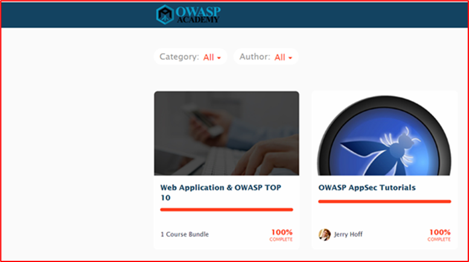

**Contrôle n. 37 :** Fournir des preuves montrant que les référentiels de code sont sécurisés à l’aide de l’authentification multifacteur (MFA).

- Intention : si un acteur de menace peut accéder à la base de code d’une&#39;logicielle et la modifier, il peut introduire des vulnérabilités, des backdoors ou du code malveillant dans la base de code et par conséquent dans l’application. Il y a déjà eu plusieurs instances de ce type, la plus signalée étant probablement l’attaque par ransomware NotPetya qui est probablement infectée par une mise à jour compromise du logiciel fiscal ukrainien appelé M.E.Doc (voir Ce qui n’est [pasPetya](https://www.itpro.co.uk/malware/34381/what-is-notpetya)).

- Exemple de directives de preuve : fournir des  preuves par le moyen de captures d’écran à partir du référentiel de code que tous les utilisateurs ont l’fa MFA activée.

- Exemple de preuve : la capture d’écran suivante montre que l' voit s’activer sur les 8 utilisateurs GitLab.

**Contrôle n. 38 :** Fournir des preuves montrant que des contrôles d’accès sont en place pour sécuriser les référentiels de code.

- Objectif : à partir du contrôle précédent, des contrôles d’accès doivent être implémentés pour limiter l’accès aux utilisateurs individuels qui travaillent sur des projets particuliers. En limitant l’accès, vous limitez le risque d’apporter des modifications non autorisées et donc d’introduire des modifications de code non sécurisées. Une approche moins privilégiée doit être prise pour protéger le référentiel de code.

- Exemple de directives de preuve : fournir des preuves par le moyen de captures d’écran à partir du référentiel de code que l’accès est limité aux personnes nécessaires, y compris à différents privilèges.

- Exemple de preuve : la capture d’écran suivante montre les membres du projet Clients dans GitLab, qui est le portail client &quot; &quot; Contoso. &quot; &quot; Comme le permet la capture d’écran, les utilisateurs ont différents &quot; rôles &quot; pour limiter l’accès au projet.

### Gestion des comptes

Les pratiques de gestion des comptes sécurisés sont importantes car les comptes d’utilisateur constituent la base de l’accès aux systèmes d’information, aux environnements système et aux données. Les comptes d’utilisateur doivent être correctement sécurisés en tant que compromission des informations d’identification de l’utilisateur&#39;peut non seulement fournir une connexion à l’environnement et un accès aux données sensibles, mais également fournir un contrôle administratif sur l’ensemble de l’environnement ou des systèmes clés si les informations d’identification de l’utilisateur&#39;ont des privilèges d’administration.

**Contrôle n 39 :** Fournir une documentation de stratégie qui régit les pratiques et procédures de gestion des comptes.

- Intention : les comptes d’utilisateur continuent d’être ciblés par les acteurs de menace et sont souvent la source d’une compromission de données. En configurant des comptes trop permissifs, les organisations augmentent non seulement le pool de comptes&#39; privilégiés &#39;qui peuvent être exploités par un acteur de menace pour effectuer une violation de données, mais peuvent également augmenter le risque de réussite de l’exploitation d’une vulnérabilité nécessitant des privilèges spécifiques pour réussir.

-  BeyondTrust produit un rapport de vulnérabilités Microsoft chaque année qui analyse les vulnérabilités de sécurité Microsoft de l’année précédente et détaille les pourcentages de ces vulnérabilités qui reposent sur le compte d’utilisateur qui a des droits &quot; &quot; d’administrateur. Dans un billet de blog récent, un nouveau rapport de vulnérabilités Microsoft révèle une augmentation de 48 % du nombre de vulnérabilités yoy par rapport à la façon dont elles pourraient être atténuées avec le moindre privilège , 90 % des vulnérabilités critiques dans Internet Explorer, 85 % des vulnérabilités critiques dans Microsoft Edge et &quot; [ &amp; ](https://www.beyondtrust.com/blog/entry/microsoft-vulnerabilities-report)100 % des vulnérabilités critiques dans Microsoft Outlook auraient été atténuées en supprimant des droits &quot; d’administrateur. Pour prendre en charge la gestion sécurisée des comptes, les organisations doivent s’assurer que les stratégies et procédures de prise en charge qui promeuvent les meilleures pratiques en matière de sécurité sont en place et suivies pour atténuer ces menaces.

- Exemple de directives de preuve : fournissez les stratégies et documents de procédure documentés qui couvrent les pratiques de gestion de vos comptes. Au minimum, les rubriques couvertes doivent s’aligner sur les contrôles au sein de la Microsoft 365 certification.

- Exemple de preuve : la capture d’écran suivante montre un exemple de stratégie de gestion des comptes pour Contoso.

**Remarque :** Cette capture d’écran montre un document de stratégie/processus. Les isoeurs s’attend à partager la documentation de stratégie/procédure de prise en charge réelle et non simplement à fournir une capture d’écran.

**Contrôle n. 40 :** Fournissez des preuves montrant que les informations d’identification par défaut sont désactivées, supprimées ou modifiées dans les composants système échantillonés.

- Intention : bien que cela devienne moins populaire, il existe encore des cas où les acteurs des menaces peuvent tirer parti des informations d’identification utilisateur par défaut et bien documentées pour compromettre les composants du système de production. Dell iDRAC (Integrated Dell Remote Access Controller) en est un exemple populaire. Ce système peut être utilisé pour gérer à distance un serveur Dell Server, qui peut être utilisé par un acteur de menace pour prendre le contrôle du système d’exploitation&#39;server. Les informations d’identification par défaut de root::contrôle sont documentées et peuvent souvent être utilisées par les acteurs des menaces pour accéder aux systèmes utilisés par les organisations. L’objectif de ce contrôle est de s’assurer que ces informations d’identification par défaut sont désactivées ou supprimées

- Exemples de directives de preuve : il existe différentes façons de collecter des preuves pour prendre en charge ce contrôle. Les captures d’écran des utilisateurs configurés sur tous les composants système peuvent vous aider, c’est-à-dire que les captures d’écran des fichiers Linux /etc/shadow et /etc/passwd vous aideront à montrer si les comptes ont été désactivés. Notez que le fichier /etc/shadow serait nécessaire pour démontrer que les comptes sont réellement désactivés en observant que le hachage du mot de passe commence par un caractère non valide tel que &#39;!&#39; indiquant que le mot de passe est inutilisable. Le conseil serait de désactiver uniquement quelques caractères du mot de passe et de redessguer les autres. D’autres options seraient pour les sessions de partage d’écran dans laquelle l’évaluateur a pu essayer manuellement les informations d’identification par défaut, par exemple dans la discussion ci-dessus sur Dell iDRAC, l’évaluateur doit essayer de s’authentifier sur toutes les interfaces Dell iDRAC à l’aide des informations d’identification par défaut.

- Exemple de preuve : la capture d’écran suivante montre les comptes d’utilisateurs configurés pour le composant système DANS L’étendue &quot; DE LA CLÉ DNSNET-SBU-WM &quot; . L’affiche plusieurs comptes par défaut ; Administrateur, DefaultAccount et Invité, toutefois, les captures d’écran suivantes montrent que ces comptes sont désactivés.

La capture d’écran suivante montre que le compte Administrateur est désactivé sur le composant système dans l’étendue &quot; FONCTIONNET-SBU-WM &quot; .

La capture d’écran suivante montre que le compte Invité est désactivé sur le composant système dans l’étendue &quot; FONCTIONNET-SBU-WM &quot; .

La capture d’écran suivante montre que DefaultAccount est désactivé sur le composant système dans l’étendue &quot; FONCTIONNET-SBU-WM &quot; .

**Contrôle n 41 :** Fournir une preuve montrant que la création, la modification et la suppression de compte passe par un processus d’approbation établi.

- Objectif : l’objectif est d’avoir un processus établi pour s’assurer que toutes les activités de gestion des comptes sont approuvées, en veillant à ce que les privilèges de compte conservent les principes de moindre privilège et que les activités de gestion des comptes soient correctement examinées et suivis.

- Exemples de directives de preuve : les preuves se présenteraient généralement sous la forme de tickets de demande de modification, de demandes itsm (it service management) ou de formalités montrant que les demandes de comptes à créer, modifier ou supprimer ont été traitées par un processus d’approbation.

- Exemple de preuve : les images ci-dessous montrent la création d’un compte pour un nouveau démarrage pour l’équipe DevOps qui doit avoir un paramètre RBAC basé sur les autorisations de l’environnement de production sans accès à l’environnement dev et un accès non privilégié standard à tout le reste.

La création du compte a été réalisée via le processus d’approbation et le processus de validation une fois que le compte a été créé et que le ticket a été fermé.

**Contrôle n. 42 :** Fournissez des preuves montrant qu’un processus est en place pour désactiver ou supprimer des comptes qui ne sont pas utilisés dans les 3 mois.

- Intention : les comptes inactifs peuvent parfois être compromis soit parce qu’ils sont ciblés dans des attaques en force brute qui peuvent ne pas être signalées car l’utilisateur ne tentera pas de se connecter aux comptes, ou par une violation de la base de données de mots de passe dans laquelle le mot de passe d’un utilisateur&#39;a été réutilisé et est disponible dans un vidage nom d’utilisateur/mot de passe sur Internet. Les comptes inutilisés doivent être désactivés/supprimés pour réduire la surface d’attaque dont un acteur de menace a besoin pour effectuer des activités de compromission de compte. Ces comptes peuvent être dus à un processus de déversage qui ne s’effectue pas correctement, à un membre du personnel en congé à long terme ou à un membre du personnel qui part en congé de famille ou de paternité. En implémentant un processus trimestrielle pour identifier ces comptes, les organisations peuvent réduire la surface d’attaque.

- Exemples de directives de preuve : la preuve doit être double. Tout d’abord, une capture d’écran ou une exportation de fichier affichant la dernière logon de tous les comptes &quot; d’utilisateur dans l’environnement dans &quot; l’étendue. Il peut s’agit de comptes locaux, ainsi que de comptes au sein d’un service d’annuaire centralisé, tels que AAD (Azure Active Directory). Cela montre qu’aucun compte de plus de 3 mois n’est activé. Deuxièmement, preuve du processus de révision trimestrielle qui peut être la preuve de la tâche en cours d’accomplir dans des tickets ADO (Azure DevOps) ou JIRA, ou par le biais d’enregistrements papier qui doivent être signés.

- Exemple de preuve : cette première capture d’écran montre la sortie du script qui est exécuté tous les trimestres pour afficher le dernier attribut d’accès des utilisateurs dans AAD.

Comme le montre la capture d’écran ci-dessus, deux utilisateurs indiquent qu’ils n’ont pas ouvert de session pendant un certain temps. Les deux captures d’écran suivantes montrent que ces deux utilisateurs sont désactivés.

**Contrôle n 43 :** Fournir des preuves montrant qu’une stratégie de mot de passe forte ou d’autres atténuations appropriées pour protéger les informations d’identification de l’utilisateur sont en place.  Les recommandations suivantes doivent être utilisées comme indication minimale :
- Longueur minimale de mot de passe de 8 caractères
- Seuil de verrouillage du compte de 10 tentatives au plus
- Historique des mots de passe d’un minimum de 5 mots de passe
- Application de l’utilisation d’un mot de passe fort

- Intention : comme nous l’avons déjà vu, les informations d’identification de l’utilisateur sont souvent la cible d’attaques par des acteurs de menace qui tentent d’accéder à une organisation&#39;'environnement. L’objectif d’une stratégie de mot de passe forte est d’essayer de forcer les utilisateurs à choisir des mots de passe forts afin d’atténuer les risques que les acteurs de menace puissent les forcer de force brute. L’objectif de l’ajout de l’ou d’autres atténuations appropriées est de reconnaître que les organisations peuvent implémenter d’autres mesures de sécurité pour protéger les informations d’identification des utilisateurs en fonction des développements du secteur tels que la publication spéciale &quot; &quot; &quot; [800-63B du NIST.](https://pages.nist.gov/800-63-3/sp800-63b.html) &quot;

- Exemple de recommandations en matière de preuve : la preuve d’une stratégie de mot de passe forte peut prendre la forme d’une capture d’écran d’un objet de stratégie de groupe ou de stratégies de compte de sécurité locale à stratégie de mot de passe et stratégies de compte à paramètres de stratégie de verrouillage de &quot; &quot; &quot; &quot; compte. La preuve dépend des technologies utilisées ; C’est-à-dire, pour Linux, il peut s’utiliser comme fichier de config /etc/pam.d/common-password, pour BitBucket, la section Stratégies d’authentification dans le portail d’administration &quot; &quot; ( ), [https://support.atlassian.com/security-and-access-policies/docs/manage-your-password-policy/](https://support.atlassian.com/security-and-access-policies/docs/manage-your-password-policy/) etc.

- Exemple de preuve : les preuves ci-dessous illustrent la stratégie de mot de passe configurée dans la stratégie de sécurité locale du composant système dans l’étendue &quot; &quot; DU CONTRÔLE &quot; DNS-SBU-WM &quot; .

La capture d’écran ci-dessous montre les paramètres de verrouillage de compte pour un pare-feu WatchGuard.

Vous trouverez ci-dessous un exemple de longueur de phrase passphrase minimale pour le pare-feu WatchGaurd.

**Contrôle n 44 :** Fournir des preuves montrant que des comptes d’utilisateur uniques sont émis à tous les utilisateurs.

- Objectif : l’objectif de ce contrôle est la responsabilité. En émettant des utilisateurs avec leurs propres comptes d’utilisateurs uniques, les utilisateurs sont responsables de leurs actions, car l’activité des utilisateurs peut être suivi à un utilisateur individuel.

- Exemples de directives de preuve : des preuves seraient des captures d’écran montrant des comptes d’utilisateur configurés dans les composants système dans l’étendue, qui peuvent inclure des serveurs, des référentiels de code, des plateformes de gestion cloud, Active Directory, des pare-feu, etc.

- Exemple de preuve : la capture d’écran suivante montre les comptes d’utilisateurs configurés pour le composant système DANS L’étendue &quot; DE LA CLÉ DNSNET-SBU-WM &quot; .

La capture d’écran suivante montre que le compte Administrateur est désactivé sur le composant système dans l’étendue &quot; FONCTIONNET-SBU-WM &quot; .

La capture d’écran suivante montre que le compte Invité est désactivé sur le composant système dans l’étendue &quot; FONCTIONNET-SBU-WM &quot; .

La capture d’écran suivante montre que DefaultAccount est désactivé sur le composant système dans l’étendue &quot; FONCTIONNET-SBU-WM &quot; .

**Contrôle n. 45 :** Fournissez des preuves montrant que les principes des privilèges minimum sont respectés au sein de l’environnement.

- Intention : les utilisateurs ne doivent être fournis qu’avec les privilèges nécessaires pour accomplir leur fonction. Il s’agit de limiter le risque qu’un utilisateur accède intentionnellement ou involontairement aux données qu’il&#39;ou qu’il effectue un acte malveillant. En suivant ce principe, elle réduit également la surface d’attaque potentielle (c’est-à-dire, les comptes privilégiés) qui peut être ciblée par un acteur malveillant.

- Exemple de directives de preuve : la plupart des organisations utilisent des groupes pour attribuer des privilèges basés sur les équipes au sein de l’organisation. Il peut s’agit de captures d’écran montrant les différents groupes privilégiés et uniquement les comptes d’utilisateur des équipes qui requièrent ces privilèges. En règle générale, cela est soutenu par des stratégies/processus de prise en charge définissant chaque groupe défini avec les privilèges requis et la justification professionnelle et une hiérarchie de membres d’équipe pour valider l’appartenance au groupe est configurée correctement.

- Par exemple : dans Azure, le groupe Propriétaires doit être très limité, ce qui doit être documenté et doit avoir un nombre limité de personnes affectées à ce groupe. Un autre exemple peut être un nombre limité de membres du personnel ayant la possibilité d’apporter des modifications de code, un groupe peut être configuré avec ce privilège avec les membres du personnel considérés comme ayant besoin de cette autorisation configurée. Cela doit être documenté afin que l’analyste de certification puisse faire référence au document avec les groupes configurés, etc.

- Exemple de preuve : la capture d’écran suivante montre que l’environnement est configuré avec des groupes attribués en fonction de la fonction de travail.

La capture d’écran suivante montre que les utilisateurs sont alloués à des groupes en fonction de leur fonction.

**Contrôle n 46 :** Fournissez des preuves montrant qu’un processus est en place pour sécuriser ou sécuriser les comptes de service et que le processus est suivi.

- Intention : les comptes de service sont souvent ciblés par les acteurs des menaces, car ils sont souvent configurés avec des privilèges élevés. Ces comptes peuvent ne pas suivre les stratégies de mot de passe standard, car l’expiration des mots de passe de compte de service interrompt souvent la fonctionnalité. Par conséquent, ils peuvent être configurés avec des mots de passe faibles ou des mots de passe réutilisés au sein de l’organisation. Un autre problème potentiel, en particulier dans un environnement Windows, peut être que le système d’exploitation met en cache le hachage de mot de passe. Cela peut être un problème important si : le compte de service est configuré au sein d’un service d’annuaire, car ce compte peut être utilisé dans plusieurs systèmes avec le niveau de privilèges configuré, ou le compte de service est local, la probabilité est que le même compte/mot de passe soit utilisé sur plusieurs systèmes au sein de l’environnement. Les problèmes ci-dessus peuvent conduire un acteur de menace à accéder à d’autres systèmes au sein de l’environnement et à une élévation supplémentaire de privilèges et/ou à un mouvement latéral. Par conséquent, l’objectif est de s’assurer que les comptes de service sont correctement renforcés et sécurisés pour les protéger contre la prise en charge par un acteur de menace, ou en limitant le risque en cas de compromissation de l’un de ces comptes de service.

- Exemples de directives de preuve : il existe de nombreux guides sur Internet pour aider à renforcement des comptes de service. Les preuves peuvent prendre la forme de captures d’écran qui montrent comment l’organisation a implémenté un renforcement sécurisé du compte. Voici quelques exemples (on s’attend à ce que plusieurs techniques soient utilisées) :
- Restriction des comptes à un ensemble d’ordinateurs dans Active Directory,
- Définir le compte de sorte qu’il soit interactif n&#39;pas autorisé,
- Définition d’un mot de passe extrêmement complexe
- Pour Active Directory, activez &quot; l’indicateur Compte sensible et ne peut pas être &quot; délégué. Ces techniques sont abordées dans l’article suivant Segmentation et Active Directory partagé pour un environnement de données de &quot; [cardholder.](https://pciramblings.com/2019/12/13/segmentation-and-shared-active-directory-of-a-cardholder-data-environment/) &quot;

- Exemple de preuve : il existe plusieurs façons de renforcement de la sécurité d’un compte de service, qui dépendent de chaque environnement individuel. Les mécanismes appropriés à votre environnement, qui sont utilisés, seraient documentés plus tôt dans le document de stratégie/procédure de gestion des comptes, ce qui vous aidera à examiner ces preuves. Voici quelques-uns des mécanismes qui peuvent être utilisés :

La capture d’écran suivante montre que le compte &#39;est sensible et que la connexion est déléguée&#39; l’option est sélectionnée sur le compte de service &quot; \_ Prod SQL Service. &quot;

La capture d’écran suivante montre que le compte de service Prod SQL Service Est verrouillé sur le SQL Server et ne peut se connecter &quot; \_ &quot; qu’à ce serveur.

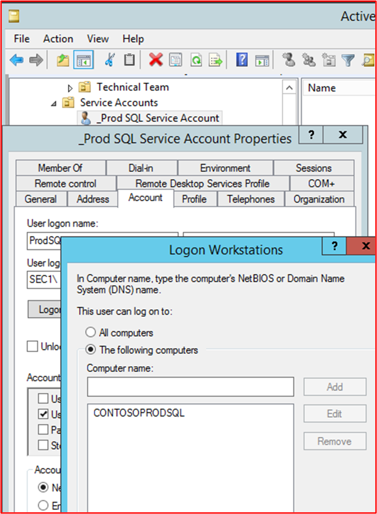

La capture d’écran suivante montre que le compte de service Prod SQL service est uniquement autorisé à se rendre &quot; \_ en tant que &quot; service.

**Contrôle n. 47 :** Fournissez des preuves montrant que l’mf est configurée pour toutes les connexions d’accès à distance et toutes les interfaces d’administration non console.

Termes définis comme :
- **Accès à** distance : en règle générale, il s’agit des technologies utilisées pour accéder à l’environnement de prise en charge. Par exemple, VPN IPSec d’accès à distance, VPN SSL ou Jumpbox/Hôte Bastian.
- **Interfaces administratives** non console : en règle générale, il s’agit des connexions d’administration réseau aux composants système. Il peut s’agit du Bureau à distance, du SSH ou d’une interface web.

- Objectif : l’objectif de ce contrôle est de fournir des atténuations contre le forçage brut des comptes privilégiés et des comptes avec un accès sécurisé à l’environnement. En fournissant l’authentification multifacteur (MFA), un mot de passe compromis doit toujours être protégé contre une connexion réussie, car le mécanisme d’authentification multifacteur doit toujours être sécurisé. Cela permet de s’assurer que toutes les actions d’accès et d’administration sont uniquement effectuées par des membres du personnel autorisés et fiables.

- Exemples de directives de preuve : les preuves doivent montrer que l’mfmf est activé sur toutes les technologies qui s’intègrent dans les catégories ci-dessus. Il peut s’agit d’une capture d’écran montrant que l’mfmf est activée au niveau du système. Par niveau système, nous avons besoin de preuves qu’il est activé pour tous les utilisateurs et pas seulement un exemple de compte avec l’fa mfa activée. Lorsque la technologie est backed off à une solution MFA, nous avons besoin de preuves pour démontrer qu’elle est activée et en cours d’utilisation. Qu’est-ce que cela signifie ? où la technologie est configurée pour l’authentification Radius, qui pointe vers un fournisseur d’authentification multifacteur, vous devez également savoir que le serveur Radius vers lequel il pointe est une solution MFA et que les comptes sont configurés pour l’utiliser.

- Exemple de preuve 1 : les captures d’écran suivantes illustrent les domaines d’authentification configurés sur Pulse Secure, qui est utilisé pour l’accès à distance à l’environnement. L’authentification est prise en charge par le service SaaS Duo pour la prise en charge de l’authentification multifacteur.

Cette capture d’écran montre qu’un serveur d’authentification supplémentaire est activé et pointe vers Duo-LDAP pour le domaine d’authentification &quot; &#39;Duo - Default Route &quot;&#39;.

Cette dernière capture d’écran montre la configuration du serveur d’authentification Duo-LDAP qui montre qu’il pointe vers le service SaaS Duo pour l’authentification multifacteur.

Exemple de preuve 2 : les captures d’écran suivantes montrent que l’fa MFA est activée pour tous les utilisateurs Azure.

**Remarque :** Vous devrez fournir des preuves pour toutes les connexions non-console afin de démontrer que l' mbam est activé pour eux. Ainsi, par exemple, si vous RDP ou SSH vers des serveurs ou d’autres composants système (par exemple, pare-feu).

**Contrôle n 48 :** Fournissez des preuves montrant que le chiffrement fort est configuré pour toutes les connexions d’accès à distance et toutes les interfaces d’administration non console, y compris l’accès aux référentiels de code et aux interfaces de gestion cloud.

Termes définis comme :
- **Référentiels de code** : la base de code de l’application doit être protégée contre les modifications malveillantes qui pourraient introduire un programme malveillant dans l’application. L’mf doit être configurée dans le référentiel de code.
- **Interfaces** de gestion cloud : où tout ou partie de l’environnement est hébergé dans le fournisseur de services Cloud, l’interface d’administration pour la gestion cloud est incluse ici.

- Intention : l’objectif de ce contrôle est de s’assurer que tout le trafic administratif est chiffré de manière à se protéger contre les attaques de l’intermédiaire.

- Exemple de directives de preuve : des preuves peuvent être fournies par des captures d’écran montrant les paramètres de chiffrement pour les technologies d’accès à distance, RDP, SSH et les interfaces d’administration web. Pour les interfaces d’administration web, le scanneur Qualys SSL Labs (s’il est accessible publiquement, c’est-à-dire, les interfaces de gestion cloud, les référentiels de code SaaS ou les connexions VPN SSL) peut être utilisé.

- Exemple de preuve : la preuve ci-dessous montre le niveau de chiffrement RDP sur Webserver01 configuré avec un paramètre &quot; de &#39;niveau élevé &quot; &quot; . Comme le montre le texte d’aide, il s’agit d’un chiffrement 128 bits fort (qui est le niveau le plus élevé pour Microsoft Windows RDP.

Les preuves ci-dessous montrent également que la sécurité de transport RDP est configurée pour utiliser TLS 1.0 sur &quot; Webserver01 (qui est le plus élevé pour &quot; Windows Server).

**Contrôle n. 49 :** Fournissez des preuves montrant que l’ment MFA est utilisé pour protéger le portail d’administration que vous utilisez pour gérer et gérer tous les enregistrements DNS (Public Domain Name Service).

- Intention : si un acteur de menace malveillante peut accéder aux enregistrements DNS publics, il existe un risque qu’il soit en mesure de modifier les URL utilisées par l’application, ou lorsque le fichier manifeste pointe vers l’introduction de code malveillant ou pour diriger le trafic utilisateur vers un point de terminaison sous le contrôle des acteurs. Cela peut entraîner une perte de données utilisateur ou des infections par programme malveillant/ransomware au sein de la base d’utilisateurs de l’application.

- Exemple de directives de preuve : fournir des preuves qui montrent que les portails d’administration DNS publics sont protégés par l’mf. Même si le DNS public est hébergé sur des serveurs au sein de l’environnement dans l’étendue (c’est-à-dire, contrôlé et géré par l’organisation), il peut toujours y avoir un portail d’administration quelque part où le nom de domaine a été enregistré et les enregistrements DNS &#39;été&#39; gérés pour pointer les serveurs DNS vers votre propre infrastructure. Si c’est le cas, l’ateur de compte de domaine doit être activé sur l’interface d’administration du bureau d’enregistrement de domaines si les enregistrements DNS des domaines peuvent être modifiés. Une capture d’écran doit être fournie montrant que l’interface d’administration est activée pour l' pdf au niveau du système (c’est-à-dire, tous les comptes privilégiés).

- Exemple de preuve : la capture d’écran suivante montre contoso.com DNS est géré dans Microsoft Azure pour Contoso Corporation.

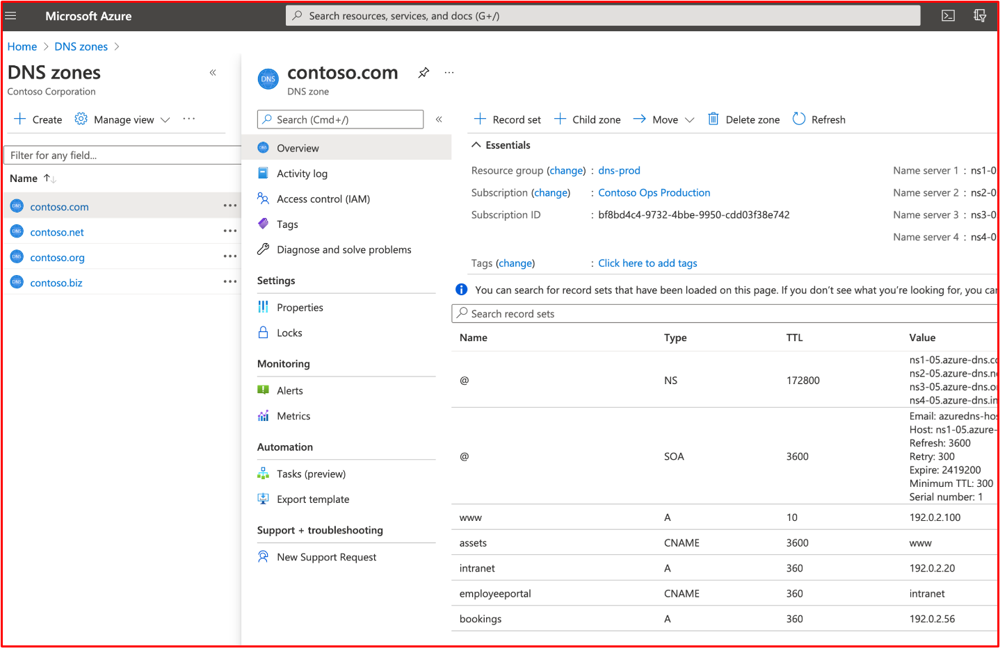

**Remarque :** Les adresses IP sont des adresses RFC 1918 privées et non publiquement acheminées. Il s’agit uniquement à des fins de démonstration.

Les captures d’écran suivantes montrent que tous les utilisateurs Azure ont activé l’mfmf.

### Détection et prévention des intrusions (facultatif)

Les systèmes de détection et de prévention des intrusions (IDPS) de la passerelle peuvent fournir une couche de protection supplémentaire contre une multitude de menaces internes et basées sur Internet. Ces systèmes peuvent contribuer à empêcher la réussite de ces menaces et fournir des fonctionnalités d’alerte cruciales pour alerter les organisations de tentatives de compromission dynamique afin de permettre aux organisations d’implémenter des stratégies de défense supplémentaires pour protéger davantage l’environnement contre ces menaces actives.

**Cette section s’agit d’un crédit supplémentaire et est donc facultative. Il ne s’agit pas d’une condition requise. Toutefois, si vous la terminez, votre évaluation affiche une image plus complète de votre environnement, ainsi que des contrôles et normes que vous avez mis en place.**

**Contrôle n 50 :** Fournissez des preuves montrant que les systèmes de détection et de prévention des intrusions (IDPS) sont déployés sur le périmètre des environnements dans l’étendue.

- Intention : bien que certaines sources décrivent les menaces internes comme dépassant désormais les menaces des acteurs des menaces externes, les menaces internes incluent également la négligence, avec une erreur humaine qui augmente en pourcentage année après année. L’objectif de l’installation d’IDPS sur le périmètre des environnements dans l’étendue est que les menaces externes peuvent souvent être détectées par le biais de mécanismes IDPS en raison de la nature et des techniques utilisées par ces types de menaces.

- Exemple de directives de preuve : des preuves doivent être fournies, qui montrent que le service IDPS est installé sur le périmètre, qu’il peut se trouver directement sur le pare-feu en cas d’exécution d’un pare-feu NextGen ou par des capteurs IDPS de déploiement qui sont configurés sur les ports de commutateur miroir pour garantir que tout le trafic est visible par les capteurs déployés. Si des capteurs IDPS sont utilisés, des preuves supplémentaires devront peut-être être fournies pour démontrer que les capteurs sont en mesure de voir tous les flux de trafic externe.

- Exemple de preuve : la capture d’écran ci-dessous montre que la fonctionnalité IDPS est activée sur le pare-feu WatchGuard.

La capture d’écran supplémentaire ci-dessous montre que le service IDPS est activé sur toutes les règles au sein du pare-feu WatchGuard&#39;la config.

**Contrôle n 51 :** Fournissez des preuves montrant que les signatures IDPS sont conservées à jour (dans les 24 heures).

- Intention : il existe plusieurs modes de fonctionnement pour IDPS, le plus courant consiste à utiliser des signatures pour identifier le trafic d’attaque. À mesure que les attaques évoluent et que des vulnérabilités plus nouvelles sont identifiées, il est important que les signatures IDPS soient à jour pour fournir une protection adéquate. L’objectif de ce contrôle est de s’assurer que les IDPS sont maintenus.

- Exemple de recommandations en matière de preuve : la preuve sera probablement le fait d’une capture d’écran montrant que le système IDPS est configuré pour mettre à jour les signatures au moins quotidiennement et afficher la dernière mise à jour.

- Exemple de preuve : bien que cette capture d’écran ne montre&#39;pas que les signatures IDPS ont été mises à jour au cours des dernières 24 heures, elle démontre que la dernière version est installée, qui date d’une semaine (preuves collectées sur le _18__th_ _mai_). Ceci, combiné à la capture d’écran suivante, montre que les signatures seront à jour dans une période de 24 heures.

**Contrôle n. 52 :** Fournissez des preuves montrant que IDPS est configuré pour prendre en charge l’inspection TLS de tout le trafic web entrant.

- Intention : étant donné que les IDPS s’appuient sur des signatures, il doit être en mesure d’inspecter tous les flux de trafic pour identifier le trafic d’attaque. Le trafic TLS est chiffré et, par conséquent, IDPS ne serait pas en mesure d’inspecter correctement le trafic. Ceci est essentiel pour le trafic HTTPS, car il existe une multitude de menaces communes aux services web. L’objectif de ce contrôle est de s’assurer que les flux de trafic chiffrés peuvent également être inspectés pour les IDPS.

- Exemple de recommandations en matière de preuves : des preuves doivent être fournies au moyen de captures d’écran, montrant que le trafic TLS chiffré est également inspecté par la solution IDPS.

- Exemple de preuve : cette capture d’écran affiche les règles HTTPS sur le pare-feu

La capture d’écran suivante montre que les IDPS sont activés sur ces règles.

La capture d’écran suivante montre qu’une action de proxy est appliquée à la règle &#39;trafic de bot entrant&#39;, qui est utilisée pour activer &quot; &quot; l’inspection du \_ \_ contenu.

La capture d’écran suivante montre que l’inspection du contenu est activée.

**Contrôle n. 53 :** Fournissez des preuves montrant que les services IDPS sont configurés pour surveiller tous les flux de trafic entrant.

- Intention : comme nous l’avons déjà vu, il est important que tous les flux de trafic entrant soient surveillés par les IDPS pour identifier toute forme de trafic d’attaque.

- Exemple de directives de preuve : des preuves par le moyen de captures d’écran doivent être fournies pour démontrer que tous les flux de trafic entrant sont surveillés. Cela peut être à l’aide du pare-feu NextGen, indiquant que toutes les règles entrantes sont activées pour IDPS, ou au moyen de capteurs IDPS et de la démonstration que tout le trafic est configuré pour atteindre le capteur IDPS.

- Exemple de preuve : cette capture d’écran montre que IDPS est configuré sur toutes les règles (stratégies) du pare-feu WatchGuard&#39;de surveillance.

**Contrôle n. 54 :** Fournissez des preuves montrant que les services IDPS sont configurés pour surveiller tous les flux de trafic sortant.

- Intention : comme nous l’avons déjà vu, il est important que tous les flux de trafic sortant soient surveillés par les IDPS pour identifier toute forme de trafic d’attaque. Certains systèmes IDPS peuvent également identifier les violations internes potentielles en surveillant tout le trafic sortant. Pour ce faire, vous pouvez identifier le trafic destiné &#39;des points de terminaison&#39; commande et de contrôle.

- Exemple de directives de preuve : des preuves doivent être fournies par le moyen de captures d’écran pour démontrer que tous les flux de trafic sortant sont surveillés. Cela peut être à l’aide du pare-feu NextGen, indiquant que toutes les règles sortantes sont activées pour IDPS, ou au moyen de capteurs IDPS et de démontrer que tout le trafic est configuré pour atteindre le capteur IDPS.

- Exemple de preuve : cette capture d’écran montre que IDPS est configuré sur toutes les règles (stratégies) du pare-feu WatchGuard&#39;de surveillance.

- Exemple 2 : Azure propose des IDPS via des applications tierces. Dans l’exemple ci-dessous, la capture de paquets Netwatcher a été utilisée pour capturer des paquets et utilisée avec Suricata, qui est un outil Open-Source IDS.

En combinant la capture de paquets fournie par network watcher et les outils open source IDS tels que Suricata, vous pouvez effectuer la détection d’intrusions réseau pour un large éventail de menaces. L’image ci-dessous illustre l’interface Suricata.

Les signatures sont utilisées pour déclencher des alertes, qui peuvent être installées et mises à jour facilement. L’image ci-dessous montre un instantané de certaines signatures.

L’image ci-dessous montre comment surveiller la façon dont vous souhaitez surveiller la mise en place de votre système IDPS de logiciels tiers Netwatcher et Suricata à l’aide de Sentinel SIEM/RESI.

- Exemple de preuve 3 : l’image ci-dessous montre comment ajouter une signature d’intrusion de remplacement ou une règle de contournement pour la détection d’intrusion. Utilisation de l’CLI

L’image ci-dessous montre comment ré lister toutes les configurations de détection d’intrusion à l’aide de l’CLI

- Exemple de preuve 4 : Azure a récemment commencé à proposer des IDPS nommés Azure Firewall Premium qui permettront la configuration de TLS, Threat Intelligence, IDPS via des stratégies. Toutefois, notez que vous devrez toujours utiliser le port d’accès frontal ou la passerelle d’application pour le déchargement SSL du trafic entrant, car Azure Firewall Premium ne prend pas en charge IDPS sur les connexions SSL entrantes.

Dans l’exemple ci-dessous, les paramètres Premium par défaut ont été utilisés pour la configuration des règles de stratégie et l’inspection TLS, le mode IDPS et threat Intelligence ont tous été activés avec la protection du réseau Vnet.

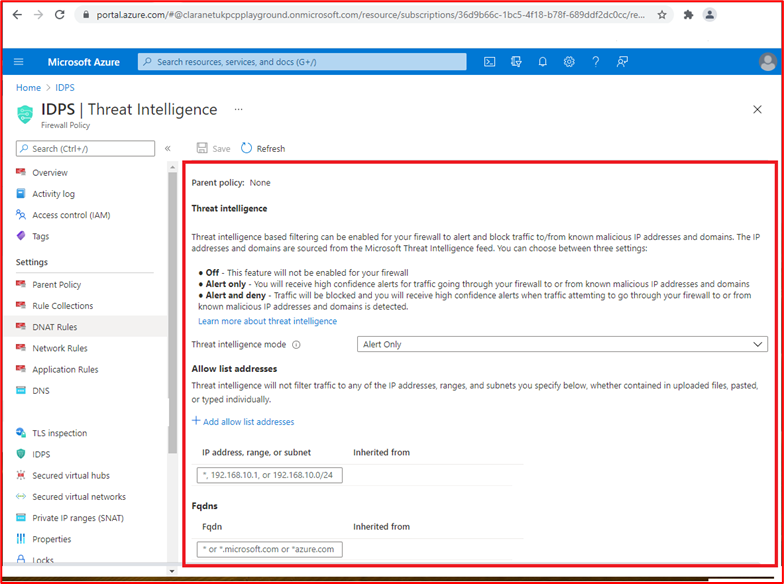

### Journalisation des événements de sécurité

La journalisation des événements de sécurité fait partie intégrante d’une&#39;programme de sécurité. La journalisation adéquate des événements de sécurité associée à des processus d’alerte et de révision adaptés permet aux organisations d’identifier les violations ou les tentatives de violations qui peuvent être utilisées par l’organisation pour améliorer la sécurité et renforcer les stratégies de sécurité. En outre, une journalisation adéquate est adaptée à une fonctionnalité de réponse aux incidents d’organisation qui peut se alimenter dans d’autres activités telles que la possibilité d’identifier avec précision les données de&#39;compromises, la période de compromission, de fournir des rapports d’analyse détaillés aux agences gouvernementales, etc.

**Contrôle n 55 :** Fournir une documentation de stratégie pour les meilleures pratiques et procédures qui régissent la journalisation des événements de sécurité.

- Intention : la journalisation des événements de sécurité est une fonction importante de toute organisation&#39;programme de sécurité. Des stratégies et des procédures doivent être en place pour assurer la clarté et la cohérence afin de garantir que les organisations implémentent des contrôles de journalisation conformes aux pratiques recommandées par les fournisseurs et le secteur. Cela permet de s’assurer que les journaux pertinents et détaillés sont consommés, ce qui n’est pas seulement utile pour identifier les événements de sécurité potentiels ou réels, mais ils peuvent également aider une activité de réponse aux incidents à identifier l’étendue d’une violation de la sécurité.

- Exemple de directives de preuve : fournir aux organisations des documents de stratégie et de procédure documentés couvrant les meilleures pratiques de journalisation des événements de sécurité.

- Exemple de preuve : voici un extrait de la stratégie/procédure de journalisation.

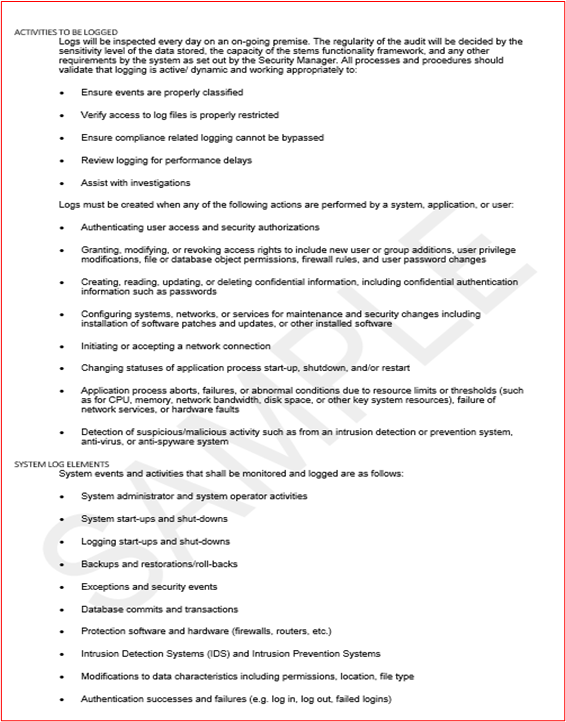

**Remarque :** Cette capture d’écran montre un document de stratégie/processus. Les isoeurs s’attend à partager la documentation de stratégie/procédure de prise en charge réelle et non simplement à fournir une capture d’écran.

**Contrôle n. 56 :** Fournissez des preuves montrant que la journalisation des événements de sécurité est définie sur tous les composants système échantillonés pour consigner les événements suivants :
- Accès utilisateur aux composants système et à l’application
- Toutes les actions entreprises par un utilisateur avec des privilèges élevés
- Tentatives d’accès logique non valides
- Création ou modification de compte privilégié
- Falsification du journal des événements
- Désactivation des outils de sécurité, tels que les logiciels anti-programme malveillant ou la journalisation des événements
- Journalisation du logiciel anti-programme malveillant, telle que les mises à jour, la détection de programmes malveillants et les échecs d’analyse
- Événements IDPS et WAF, s’ils sont configurés

- Objectif : pour identifier les tentatives et les violations réelles, il est important que les journaux des événements de sécurité appropriés soient collectés par tous les systèmes qui font l’environnement. L’objectif de ce contrôle est de s’assurer que les types corrects d’événements de sécurité sont capturés, ce qui peut ensuite alimenter les processus de révision et d’alerte pour vous aider à identifier ces événements et à y répondre.

- Exemple de directives de preuve : des preuves par le moyen de captures d’écran ou de paramètres de configuration doivent être fournies sur tous les appareils échantillonés et tous les composants système de pertinence afin de montrer comment la journalisation est configurée pour garantir que ces types d’événements de sécurité sont capturés.

- Exemple de preuve 1 : la capture d’écran suivante montre les paramètres de configuration à partir de l’un des appareils échantillonés &quot; appelés VICTIM1-WINDOWS &quot; . Les paramètres indiquent différents paramètres d’audit activés dans la stratégie de sécurité &#39;locale « Stratégies locales » . Stratégie d’audit&#39; paramètres.

La capture d’écran suivante montre un événement dans lequel un utilisateur a effacé un journal des événements de l’un des appareils échantillonés &quot; appelés VICTIM1-WINDOWS. &quot;

Cette dernière capture d’écran montre le message du journal qui apparaît dans la solution de journalisation centralisée.

**Remarque**: des captures d’écran sont **requises** pour tous les composants système échantillonés ET **DOIVENT** être des preuves de tous les événements de sécurité détaillés ci-dessus.

**Contrôle n. 57 :** Fournissez des preuves montrant que les événements de sécurité consignés contiennent les informations minimales suivantes :
- Utilisateur
- Type d’événement
- Date et heure
- Indicateurs de réussite ou d’échec
- Étiquette qui identifie le système affecté

- Intention : les événements de sécurité consignés doivent fournir suffisamment d’informations pour vous aider à déterminer si le trafic d’attaque a réussi, quelles informations ont été accédées, à quel niveau, qui était responsable, où il provient, etc.

- Exemple de directives de preuve : les preuves doivent afficher des exemples de journaux de tous les composants système montrant ces types d’événements de sécurité. Les journaux doivent inclure toutes les informations répertoriées ci-dessus.

- Exemple de preuve : la capture d’écran suivante montre les informations des événements de sécurité dans Windows Observateur d’événements à partir du composant système &quot; seGSVR02 &quot; .

**Remarque**: des captures d’écran sont **requises** pour tous les composants système échantillonés ET DOIVENT être des preuves de tous les événements de sécurité détaillés dans le contrôle ci-dessus. Il est probable que les preuves collectées pour le contrôle ci-dessus répondent également à ce contrôle, en fournissant des détails adéquats sur les informations de journalisation fournies.

**Contrôle n. 58 :** Fournissez des preuves montrant que tous les composants système échantillonés sont synchronisés dans le temps sur les mêmes serveurs principaux et secondaires.

- Objectif : un composant essentiel de la journalisation consiste à s’assurer que les journaux de tous les systèmes ont des horloges système synchronisées. Ceci est important lorsqu’un examen est nécessaire pour suivre une compromission et/ou une violation de données. Le suivi des événements via différents systèmes peut devenir presque impossible si les journaux ont des degrés d’horodatage différents, car les journaux importants peuvent être manqués et il sera difficile de le suivre.

- Exemple de recommandations en matière de preuve : dans l’idéal, une topologie de synchronisation de temps doit être conservée, ce qui montre comment l’heure est synchronisée dans l’ensemble du domaine. Les preuves peuvent ensuite être fournies par le moyen de captures d’écran des paramètres de synchronisation de temps entre les composants système échantillonés. Cela doit montrer que la synchronisation à tout moment est sur le même serveur principal (ou sur place secondaire).

- Exemple de preuve : ce diagramme illustre la topologie de synchronisation d’heure en cours d’utilisation.

La capture d’écran suivante montre la WatchGuard configurée en tant que serveur NTP et pointant vers time.windows.com car elle&#39;source de temps.

Cette dernière capture d’écran montre le composant système dans l’étendue, LA FONCTIONNEZNET-SBU-WM est configurée pour que NTP pointe vers le serveur principal qui est le Pare-feu &quot; &quot; WatchGuard (10.0.1.1).

**Contrôle n. 59 :** Fournissez des preuves montrant lorsque des systèmes publics sont en cours d’utilisation que les journaux des événements de sécurité sont envoyés à une solution de journalisation centralisée qui ne se trouve pas dans le réseau de périmètre.

- Intention : l’objectif de ce contrôle est de garantir une séparation logique ou physique entre la DMZ et le point de terminaison de journalisation. La DMZ étant publique, elle est exposée aux acteurs des menaces externes et, par conséquent, plus à risque que les autres composants de l’environnement. Si un composant DMZ est compromis, l’intégrité des données de journalisation doit être conservée non seulement pour empêcher l’acteur de menace de falsifier les journaux pour masquer la compromission, mais également pour faciliter tout travail d’investigation juridique qui peut être requis. En se connectant à des systèmes en dehors de la DMZ, les contrôles de sécurité utilisés pour restreindre le trafic de la DMZ à ces systèmes de sécurité doivent aider à les protéger contre les activités malveillantes et les tentatives de falsification.

- Exemples de recommandations en matière de preuves : les preuves doivent être fournies au moyen de captures d’écran ou de paramètres de configuration, montrant que les journaux sont configurés pour être envoyés immédiatement (ou à proximité immédiatement) à une solution de journalisation centralisée en dehors de la zone DMZ. Nous recherchons la livraison quasi immédiate des journaux, car plus la livraison des journaux vers la solution de journalisation centralisée prend de temps, plus un acteur de traitement doit falsifier les journaux locaux avant que l’envoi ne se produise.

- Exemple de preuve : les systèmes DMZ Contoso utilisent NXLog pour la livraison des fichiers journaux. La capture d’écran suivante montre le service &#39;nxlog&#39; en cours d’exécution sur la boîte de réception &quot; DMZ DESKTOP-7S65PN utilisée pour gérer tous les serveurs &quot; DMZ.

La capture d’écran suivante montre un extrait du fichier nxlog.conf, montrant que la destination est un collecteur de journaux interne au sein du sous-réseau d’application sur 10.0.1.250 qui est utilisé pour la copie à DestinationVault.

L’URL suivante pour NXLog ( ) indique que la livraison des journaux de bord est en temps réel [https://nxlog.co/documentation/nxlog-user-guide/modes.html](https://nxlog.co/documentation/nxlog-user-guide/modes.html) via l’extraction suivante :

**Contrôle n 60 :** Fournissez des preuves crédibles pour montrer que la solution de journalisation centralisée est protégée contre toute falsification non autorisée des données de journalisation.

- Intention : bien que la séparation logique/physique soit souvent en place entre les périphériques de journalisation et la solution de journalisation centralisée, il existe toujours un risque que quelqu’un essaie de falsifier les journaux pour masquer ses activités. L’objectif de ce contrôle est de s’assurer que des mécanismes d’autorisation appropriés sont en place pour limiter le nombre d’utilisateurs qui peuvent effectuer des actions administratives sur la solution de journalisation centralisée.

- Exemples de directives de preuve : les preuves se font généralement au moyen de captures d’écran montrant la configuration de l’autorisation et de l’authentification de la solution de journalisation centralisée, montrant que les utilisateurs sont limités à ceux qui sont requis pour leur rôle/fonction.

- Exemple de preuve : le SOC externalisé par Contoso utilise L’outil SIEM centralisé en tant qu’outils SiEM. En 2018, Il a été acheté par AT T et passe &amp; maintenant par USM Anywhere. La page web suivante ( ) explique comment USM Anywhere protège les données contre toute falsification [https://cybersecurity.att.com/documentation/usm-anywhere/deployment-guide/admin/usm-anywhere-data-security.htm](https://cybersecurity.att.com/documentation/usm-anywhere/deployment-guide/admin/usm-anywhere-data-security.htm) non autorisée. Le lien suivant ( ) met en évidence la façon dont le produit USM Anywhere garantit également l’intégrité [https://cybersecurity.att.com/documentation/usm-appliance/raw-logs/raw-log-management.htm](https://cybersecurity.att.com/documentation/usm-appliance/raw-logs/raw-log-management.htm) des journaux archivés.

**Remarque :** Si le SIEM est interne, des preuves doivent être fournies pour démontrer que l’accès aux données de journalisation est limité à un nombre sélectionné d’utilisateurs en fonction de leurs besoins en fonction de leurs besoins et que la plateforme elle-même est protégée contre la falsification (la plupart des solutions l’utiliseront dans les fonctionnalités de la solution de journalisation).

**Contrôle n 61 :** Fournissez la preuve qu’un minimum de 30 jours de données de journalisation des événements de sécurité sont immédiatement disponibles, avec 90 jours de journaux des événements de sécurité conservés.

- Intention : Il existe parfois une différence de temps entre un événement de compromission ou de sécurité et une organisation qui l’identifie. L’objectif de ce contrôle est de s’assurer que l’organisation a accès aux données d’événement historiques pour faciliter la réponse aux incidents et tout travail d’investigation d’investigation qui peut être requis.

- Exemples de directives de preuve : la preuve consiste généralement à afficher la solution de journalisation centralisée&#39;paramètres de configuration montrant la durée de la durée de la gestion des données. 30 jours de données de journalisation des événements de sécurité doivent être immédiatement disponibles dans la solution. Toutefois, lorsque les données sont archivées, cela doit prouver que la valeur 90days est disponible. Cela peut se faire en affichant des dossiers d’archivage avec des dates de données exportées.

- Exemple de preuve 1 : les captures d’écran suivantes montrent que 30 jours de journaux sont disponibles dans LeVault.

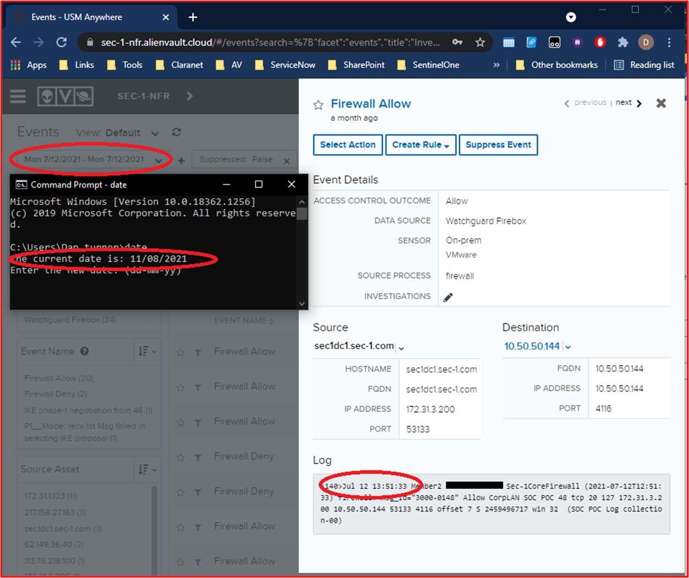

**Remarque**: étant donné qu’il s’agit d’un document public, le numéro de série du pare-feu&#39;été rédigé, mais nous n’envisageons pas les logiciels&#39;prendre en charge les captures d’écran expurgées, sauf s’il contient des informations d’identification personnelle.

La capture d’écran suivante montre que les journaux sont disponibles en affichant un extrait de journal qui remonte à 5 mois.

Remarque : étant donné qu’il s’agit d’un document public, les adresses IP publiques ont été expurgées, toutefois, nous n&#39;envisageons pas les isv pour prendre en charge les captures d’écran expurgées, sauf s’il contient des informations d’identification personnelle.

- Exemple de preuve 2 : la capture d’écran suivante montre que les événements de journal sont conservés pendant 30 jours en direct et 90 jours dans un stockage à froid dans Azure.

### Examen (données de journalisation des événements de sécurité)

La révision des journaux de sécurité est une fonction importante pour aider les organisations à identifier les événements de sécurité qui peuvent indiquer une violation de sécurité ou des activités de reconnaissance qui peuvent être une indication de quelque chose à venir. Cela peut être effectué par le biais d’un processus manuel sur une base quotidienne, ou par l’utilisation d’une solution SIEM (Security Information and Event Management) qui facilite l’analyse des journaux d’audit, en cherchant des corrélations et des anomalies qui peuvent être signalées pour une inspection manuelle.

**Contrôle n 62 :** Fournir une documentation de stratégie qui régit les pratiques et procédures de révision des journaux.

- Intention : un rapport d’IBM intitulé Coût d’un rapport de violation de données &quot; [2020](https://www.ibm.com/security/digital-assets/cost-data-breach-report/#/) souligne que le temps moyen d’identification et de contenu d’une violation de données peut prendre 280 jours, c’est-à-dire plus élevé lorsque la violation est le fait d’un acteur de menace malveillant signalé comme &quot; étant de 315 jours. Étant donné que le coût moyen d’une violation de données est signalé comme étant en millions de dollars, il est essentiel que ce cycle de vie des violations de données soit réduit non seulement pour réduire la fenêtre d’exposition aux données, mais aussi pour réduire la durée pendante pour qu’un acteur de menace exfiltre les données de l’environnement. En réduisant cette fenêtre, les organisations peuvent réduire le coût global d’une violation de données.

- En implémentant un processus de révision et d’alerte robuste, les organisations sont beaucoup mieux dotées pour identifier les violations beaucoup plus rapidement dans le cycle de vie des violations de données afin de minimiser son impact sur l’organisation. En outre, un processus fort peut aider à identifier les tentatives de violation, ce qui permet aux organisations d’empêcher les mécanismes de sécurité d’atténuer cette menace accrue afin de réduire davantage les risques de compromission par la campagne d’attaque.

- Exemple de directives de preuve : fournir aux organisations des documents de stratégie et de procédure documentés couvrant les meilleures pratiques en matière de révision des journaux.

- Exemple de preuve : voici un extrait de la stratégie/procédure de révision du journal.

**Remarque :** Cette capture d’écran montre un document de stratégie/processus. Les isoeurs s’attend à partager la documentation de stratégie/procédure de prise en charge réelle et non simplement à fournir une capture d’écran.

**Contrôle n 63 :** Fournissez des preuves crédibles que les journaux sont examinés quotidiennement par un outil humain ou automatisé pour identifier les événements de sécurité potentiels.

- Objectif : l’objectif de ce contrôle est de s’assurer que les révisions quotidiennes des journaux sont effectuées. Ceci est important pour identifier les anomalies qui peuvent ne pas être détectées par les scripts/requêtes d’alerte configurés pour fournir des alertes d’événements de sécurité.

- Exemples de directives de preuve : les preuves sont généralement fournies par capture d’écran ou partage d’écran, montrant que les révisions du journal sont en cours. Il peut s’agit de formulaires qui sont remplis chaque jour, ou d’un ticket JIRA ou DevOps avec des commentaires pertinents publiés pour montrer qu’ils sont exécutés quotidiennement. Par exemple, un ticket JIRA hebdomadaire peut être créé le 26 juin 2021 pour la révision quotidienne des journaux, chaque jour où quelqu’un publie les résultats de l’examen quotidien du &quot; &quot; journal. Si des anomalies sont signalées, cela peut être documenté dans ce même ticket pour montrer le contrôle suivant dans une seule JIRA.

- Si des outils automatisés sont utilisés, des preuves de capture d’écran peuvent être fournies pour démontrer l’automatisation configurée et fournir des preuves supplémentaires pour montrer que l’automatisation est en cours d’exécution et que quelqu’un examine la sortie automatisée.

- Exemple de preuve : Contoso utilise un fournisseur SOC tiers, Contrôlenet Cyber Security, pour la corrélation de journaux et les avis. Le fournisseur SOC a la possibilité de fournir une analyse automatisée des journaux pour les journaux anormaux et les événements chaînés qui peuvent mettre en évidence un événement de sécurité potentiel. Les trois captures d’écran suivantes montrent les règles de corrélation dans LeVault.

Cette première capture d’écran identifie l’endroit où un utilisateur a été ajouté au groupe &#39;administrateurs&#39; domaine.

La capture d’écran suivante identifie l’endroit où plusieurs tentatives d’ouverture de session qui ont échoué sont ensuite suivies d’une connexion réussie qui peut mettre en évidence une attaque en force brute réussie.

Cette dernière capture d’écran identifie l’endroit où une modification de stratégie de mot de passe s’est produite lors de la définition de la stratégie, de sorte que les mots de passe de compte&#39;pas expirer.

La capture d’écran suivante montre qu’un ticket est automatiquement déclenché dans l’outil SOC&#39;ServiceNow, déclenchant la règle ci-dessus.

**Contrôle n 64 :** Fournir des preuves crédibles que des événements de sécurité potentiels et des anomalies sont examinés et corrigés.

- Intention : l’objectif est que toutes les anomalies identifiées au cours du processus de révision du journal quotidien soient examinées et que la correction ou l’action appropriée soit effectuée. Cela implique généralement un processus de tri pour identifier si les anomalies nécessitent une action, puis appeler le processus de réponse aux incidents.

- Exemple de directives de preuve : des preuves doivent être fournies au moyen d’une capture d’écran qui montre que les anomalies identifiées dans le cadre de la révision quotidienne du journal sont suivies. Comme indiqué ci-dessus, il peut s’agit de tickets JIRA indiquant une anomalie signalée, puis d’informations détaillées sur les activités qui ont été effectuées par la suite. Cela peut inciter un ticket JIRA spécifique à être élevé pour suivre toutes les activités en cours d’utilisation, ou il peut simplement être documenté dans le ticket d’avis quotidien du journal. Si une action de réponse aux incidents est requise, cela doit être documenté dans le cadre du processus de réponse aux incidents et des preuves doivent être fournies pour le démontrer.

- Exemple de preuve : l’exemple de capture d’écran suivant montre une alerte de sécurité faisant l’objet d’un suivi dans ServiceNow par le SOC (Managed Detection and Response).

La capture d’écran suivante montre la confirmation que cela a été résolu par David Ashton @ Contoso via une mise à jour dans le portail client ServiceNow.

### Alertes d’événements de sécurité

Les événements de sécurité critiques doivent être immédiatement examinés pour minimiser l’impact sur les données et l’environnement opérationnel. L’alerte permet de mettre immédiatement en évidence les violations de sécurité potentielles pour le personnel afin de garantir une réponse en temps voulu afin que l’organisation puisse contenir l’événement de sécurité aussi rapidement que possible. En veillant à ce que les alertes fonctionnent efficacement, les organisations peuvent minimiser l’impact d’une violation de la sécurité, réduisant ainsi le risque d’une violation grave qui pourrait endommager la marque de l’organisation et imposer des pertes financières par le biais d’amendes et de dommages de réputation.

**Contrôle n 65 :** Fournir une documentation de stratégie qui régit les procédures et pratiques d’alerte des événements de sécurité.

- Intention : l’alerte doit être utilisée pour les événements de sécurité clés qui nécessitent une réponse immédiate d’une organisation, car il est possible que l’événement indique une violation d’environnement et/ou une violation de données. Un processus fort autour du processus d’alerte doit être documenté pour s’assurer qu’il est exécuté de manière cohérente et répétable. Cela permettra, espérons-le, de réduire la chronologie du cycle de vie des &quot; &quot; violations de données.

- Exemple de directives de preuve : fournir aux organisations des documents de stratégie et de procédure documentés couvrant les meilleures pratiques en matière d’alertes d’événements de sécurité.

- Exemple de preuve : voici un extrait de la stratégie/procédure d’alerte des événements de sécurité. Veuillez fournir les documents de stratégie et de procédure complets pour prendre en charge votre évaluation.

 

**Remarque :** Cette capture d’écran montre un document de stratégie/processus. Les isoeurs s’attend à partager la documentation de stratégie/procédure de prise en charge réelle et non simplement à fournir une capture d’écran.

**Contrôle n 66 :** Fournissez des preuves que des alertes sont déclenchées pour un tri immédiat pour les types d’événements de sécurité suivants :
- Création ou modification de compte privilégié
- Événements de virus ou de programmes malveillants
- Falsification du journal des événements
- Événements IDPS ou WAF, s’ils sont configurés

- Objectif : Voici une liste de certains types d’événements de sécurité qui peuvent mettre en évidence un événement de sécurité qui peut pointer vers une violation d’environnement et/ou une violation de données.

- Exemple de directives de preuve : des preuves doivent être fournies au moyen de captures d’écran de la **configuration** d’alerte ET de preuves des alertes reçues. Les captures d’écran de configuration doivent afficher la logique qui déclenche les alertes et la façon dont les alertes sont envoyées. Les alertes peuvent être envoyées par SMS, courrier électronique, Teams canaux, canaux Slack, etc.

- Exemple de preuve : Contoso utilise un SOC tiers fourni par [La cybersécurité Dunet](https://www.claranet.co.uk/services/cybersecurity/managed-detection-and-response). L’exemple suivant montre que l’alerte dans LeVault, utilisé par le SOC, est configurée pour envoyer une alerte à un membre de l’équipe SOC, Dan Contrôle chez Contrôlenet Cyber Security.

La capture d’écran suivante montre une alerte reçue par Dan.

**Contrôle n. 67 :** Fournissez des preuves montrant que le personnel est toujours disponible, toute la journée, tous les jours, pour répondre aux alertes de sécurité.

- Intention : il est important que les alertes de sécurité soient triés dès que possible pour limiter l’exposition à l’environnement et/ou aux données. Le personnel doit toujours être disponible pour répondre aux alertes et fournir un travail d’investigation critique en cas d’identification d’une violation. Plus ce processus démarre rapidement, plus l’incident de sécurité peut être contenu rapidement pour protéger les données ou limiter l’impact de la violation.

- Exemple de directives de preuve : des preuves doivent être fournies, ce qui montre que les membres du personnel sont disponibles 24 heures sur 24 pour répondre aux alertes de sécurité. Il peut s’agit d’une rota d’appel.

- Exemple de preuve : la capture d’écran suivante montre une rota d’appel pour décembre 2020 pour Contoso. L’équipe SOC cyber-sécurité de Contrôle d’appel alerterait les membres de l’équipe d’appel de Contoso.

### Gestion des risques de sécurité des informations

La gestion des risques de sécurité des informations est une activité importante que toutes les organisations doivent effectuer au moins une fois par an. Les organisations doivent comprendre leurs menaces et leurs risques pour atténuer efficacement ces menaces. Sans une gestion efficace des risques, les organisations peuvent implémenter des meilleures pratiques en matière de sécurité dans des domaines qu’elles considèrent comme importants et par conséquent investir des ressources, du temps et de l’argent dans ces domaines, lorsque d’autres menaces sont beaucoup plus probables et doivent donc être atténuées. Une gestion efficace des risques permettra aux organisations de se concentrer sur les risques les plus dangereux pour l’entreprise. Cette modification doit être effectuée chaque année, car le paysage de sécurité change de plus en plus et que les menaces et les risques peuvent donc changer en heures supplémentaires. Un bon exemple de cela peut être vu avec COVID-19 qui a vu une augmentation massive des attaques par hameçonnage et le déploiement de masse (et rapide) de travail à distance pour des centaines ou des milliers de travailleurs.

**Contrôle n 68 :** Fournir des preuves montrant qu’un processus formel de gestion des risques de sécurité des informations est établi.

- Intention : comme nous l’avons vu plus haut, un processus solide de gestion des risques liés à la sécurité des informations est important pour aider les organisations à gérer efficacement les risques. Cela permettra aux organisations de planifier des atténuations efficaces contre les menaces qui pèsent sur l’environnement.

**Il est important que l’évaluation des risques comprenne les risques liés à la sécurité des informations et pas seulement les &quot; risques &quot; généraux de l’entreprise.**

- Exemple de directives de preuve : le processus de gestion de l’évaluation des risques officiellement documenté doit être fourni.

- Exemple de preuve : la preuve suivante est une capture d’écran d’une partie du processus d&#39;d’évaluation des risques de Contoso.

**Remarque :** Cette capture d’écran montre un document de stratégie/processus. Les isoeurs s’attend à partager la documentation de stratégie/procédure de prise en charge réelle et non simplement à fournir une capture d’écran.

**Contrôle n 69 :** Fournissez des preuves crédibles qu’une évaluation formelle des risques se produit au moins une fois par an, au minimum.

- Objectif : les menaces de sécurité changent constamment en fonction des modifications apportées à l’environnement, des modifications apportées aux services offerts, des influences externes, de l’évolution du paysage des menaces de sécurité, etc. Les organisations doivent passer par ce processus au moins une fois par an. Il est recommandé que ce processus soit également effectué en cas de modifications importantes, car les menaces peuvent changer.

- Exemple de directives de preuve : la preuve peut être par le suivi de version ou des preuves obsolètes. Des preuves doivent être fournies, qui indiquent le résultat de l’évaluation des risques de sécurité des informations et les dates **NOT** sur le processus d’évaluation des risques de sécurité des informations lui-même.

- Exemple de preuve : cette capture d’écran montre une réunion d’évaluation des risques en cours de planification tous les six mois.

Ces deux captures d’écran montrent les minutes de réunion à partir de deux réunions d’évaluation des risques.

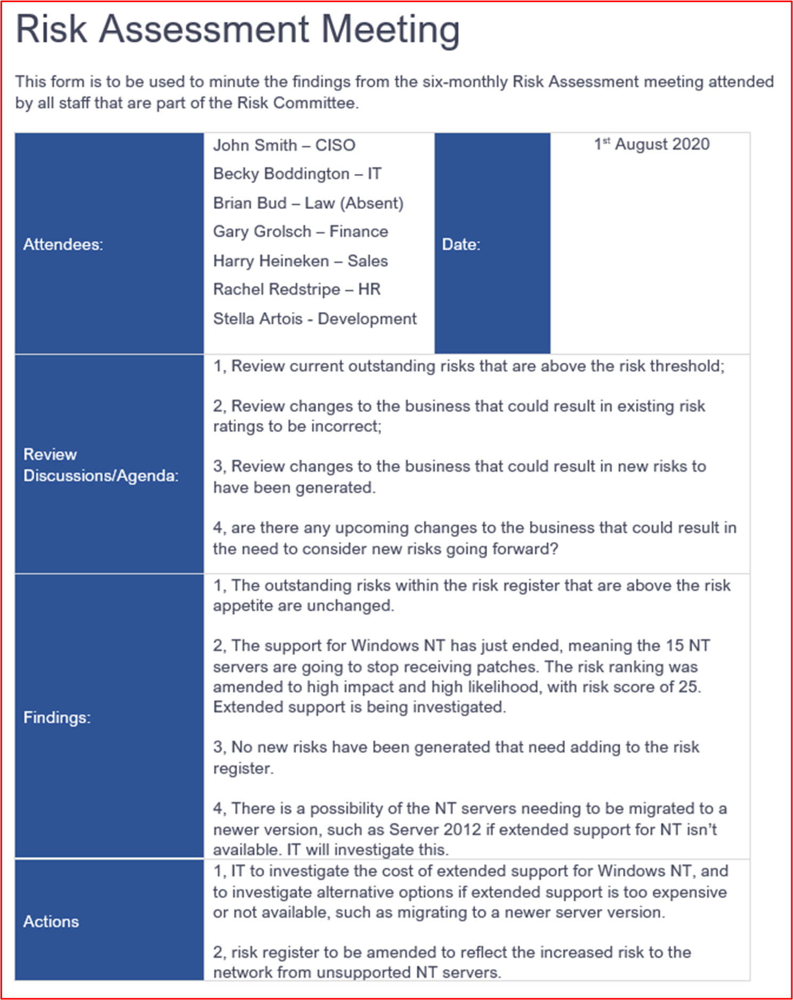

**Contrôle n 70 :** Fournir des preuves crédibles que l’évaluation des risques de sécurité des informations inclut des menaces, des vulnérabilités ou l’équivalent.

- Objectif : des évaluations des risques de sécurité des informations doivent être effectuées contre les menaces contre l’environnement et les données, ainsi que contre les vulnérabilités éventuellement présentes. Cela permettra aux organisations d’identifier les menaces/vulnérabilités qui peuvent poser un risque important.

- Exemples de directives de preuve : les preuves doivent être fournies non seulement par le processus d’évaluation des risques de sécurité des informations déjà fourni, mais aussi par le résultat de l’évaluation des risques (par le moyen d’un registre de risque/plan de traitement des risques) qui doit inclure des risques et des vulnérabilités.

- Exemple de preuve : la capture d’écran suivante montre le registre des risques qui illustre les menaces et les vulnérabilités incluses.

**Remarque :** La documentation complète sur l’évaluation des risques doit être fournie au lieu d’une capture d’écran.

**Contrôle n. 71 :** Fournir des preuves crédibles que l’évaluation des risques de sécurité des informations inclut l’impact, la matrice de risque de probabilité ou l’équivalent.

- Objectif : les évaluations des risques de sécurité des informations doivent documenter les évaluations de l’impact et de la probabilité. Ces matrices sont généralement utilisées pour aider à identifier une valeur de risque qui peut être utilisée par l’organisation pour hiérarchiser le traitement des risques afin de réduire la valeur de risque.

- Exemples de directives de preuve : les preuves doivent être fournies non seulement par le processus d’évaluation des risques de sécurité des informations déjà fourni, mais aussi par le résultat de l’évaluation des risques (par le moyen d’un registre de risque/plan de traitement des risques) qui doit inclure les évaluations de l’impact et de la probabilité.

- Exemple de preuve : la capture d’écran suivante montre le registre des risques qui illustre l’impact et les probabilités incluses.

**Remarque :** Le risque complet assessment_ _document__ation être fourni au lieu d’une capture d’écran.

**Contrôle n. 72 :** Fournir des preuves crédibles que l’évaluation des risques de sécurité des informations inclut un registre de risque et un plan de traitement.

- Objectif : les organisations doivent gérer efficacement les risques. Cela doit être correctement suivi pour fournir un enregistrement de l’un des quatre traitements de risque appliqués. Les traitements des risques sont les :

- **Éviter/mettre fin** : l’entreprise peut déterminer que le coût de traitement du risque est supérieur aux revenus générés par le service. L’entreprise peut donc décider d’arrêter d’effectuer le service.
- **Transfert/partage :** l’entreprise peut décider de transférer le risque à un tiers en déplaçant le traitement vers un tiers.
- **Accepter/Tolérer/Conserver :** l’entreprise peut décider que le risque est acceptable. Cela dépend en grande partie des risques pour les entreprises et peut varier d’une organisation à l’autre.
- **Traiter/atténuer/modifier :** l’entreprise décide d’implémenter des contrôles d’atténuation pour réduire le risque à un niveau acceptable.

- L’objectif de ce contrôle est d’obtenir l’assurance que l’organisation effectue l’évaluation des risques et agit en conséquence.

- Exemple de recommandations en matière de preuves : le plan de traitement des risques/le registre de risque (ou un équivalent) doit être fourni pour démontrer que le processus d’évaluation des risques est exécuté correctement.

- Exemple de preuve : voici un registre de risque pour Contoso.

**Remarque :** La documentation complète sur l’évaluation des risques doit être fournie au lieu d’une capture d’écran.

La capture d’écran suivante illustre un plan de traitement des risques.

### Réponse aux incidents de sécurité

Une réponse aux incidents de sécurité est importante pour toutes les organisations, car cela peut réduire le temps passé par une organisation à contenir un incident de sécurité et à limiter le niveau d’exposition des organisations à l’exfiltration des données. En développant un plan de réponse complet et détaillé aux incidents de sécurité, cette exposition peut être considérablement réduite du moment de l’identification au moment de l’endiguement.

Un rapport d’IBM intitulé Coût d’un rapport de violation de données &quot; [2020](https://www.ibm.com/security/digital-assets/cost-data-breach-report/#/) met en évidence qu’en moyenne, le temps pris pour contenir une violation était &quot; de 73 jours. En outre, le même rapport identifie le principal économiseur de coûts pour les organisations qui ont subi une violation, était la préparation à la réponse aux incidents, ce qui permet d’économiser en moyenne 2 000 000 dollars.

Les organisations doivent suivre les meilleures pratiques en matière de conformité de la sécurité à l’aide d’infrastructure standard telles que ISO 27001, NIST, SOC 2, PCI DSS, etc.

**Contrôle n. 73 :** Fournissez le plan de réponse aux incidents de sécurité (IRP).

- Intention : comme nous l’avons déjà vu, l’objectif de ce contrôle est d’exiger un plan de réponse aux incidents officiellement documenté. Cela permettra de gérer plus efficacement une réponse aux incidents de sécurité, ce qui peut finalement limiter l’exposition aux pertes de données des organisations et réduire les coûts de la compromission.

- Exemple de directives de preuve : fournir la version complète du plan/procédure de réponse aux incidents. Cela doit inclure un processus de communication documenté qui est abordé dans le contrôle suivant.

- Exemple de preuve : la capture d’écran ci-dessous montre le début du plan de réponse&#39;incident de Contoso. Dans le cadre de votre soumission de preuves, vous devez fournir l’intégralité du plan de réponse aux incidents.

**Remarque :** Cette capture d’écran montre un document de stratégie/processus. Les isoeurs s’attend à partager la documentation de stratégie/procédure de prise en charge réelle et non simplement à fournir une capture d’écran.

**Contrôle n 74 :** Fournissez des preuves crédibles que l’IRP de sécurité inclut un processus de communication documenté pour assurer une notification à temps aux principales parties prenantes, telles que les marques de paiement et les acquisitions, les organismes de réglementation, les autorités de surveillance, les directeurs et les clients.

- Intention : les organisations peuvent avoir des obligations de notification de violation en fonction du pays ou des pays où elles opèrent (par exemple, le Règlement général sur la protection des données ; R GDPR) ou en fonction des fonctionnalités proposées (par exemple, PCI DSS si les données de paiement sont gérées). L’échec d’une notification en temps voulu peut avoir de graves conséquences. Par conséquent, pour s’assurer que les obligations de notification sont respectées, les plans de réponse aux incidents doivent inclure un processus de communication incluant la communication avec toutes les parties prenantes, les processus de communication multimédia et les personnes qui peuvent et ne peuvent pas parler aux médias.

- Exemple de recommandations en matière de preuves : fournissez la version complète du plan/procédure de réponse aux incidents, qui doit inclure une section couvrant le processus de communication.

- Exemple de preuve : la capture d’écran suivante montre un extrait du plan de réponse aux incidents montrant le processus de communication

**Contrôle n. 75 :** Fournissez la preuve que tous les membres de l’équipe de réponse aux incidents ont suivi une formation annuelle ou un exercice de tableau.

- Intention : comme nous l’avons déjà mentionné précédemment, plus il faut de temps pour qu’une organisation contienne une compromission, plus le risque d’exfiltration des données est élevé, ce qui peut entraîner un volume plus important de données exfiltrées et plus le coût global de la compromission est élevé. Il est important que les équipes&#39;de réponse aux incidents soient équipés pour répondre aux incidents de sécurité en temps voulu. En suivant une formation régulière et en faisant des exercices de tabletop, cela permet à l’équipe de gérer rapidement et efficacement les incidents de sécurité.

- Il est recommandé d’effectuer à la fois  une formation interne sur la réponse aux incidents pour l’équipe de réponse aux incidents et d’effectuer des exercices réguliers sur le tabletop, qui doivent être associés à l’évaluation des risques de sécurité des informations pour identifier les incidents de sécurité les plus susceptibles de se produire. Ainsi, l’équipe sait rapidement quelles mesures prendre pour contenir et examiner les incidents de sécurité les plus probables.

- Exemples de directives de preuve : des preuves doivent être fournies, qui montrent que la formation a été effectuée au moyen du partage du contenu de la formation et des enregistrements montrant qui a participé (qui doit inclure toute l’équipe de réponse aux incidents). Autrement, ou aussi enregistrements indiquant qu’un exercice de tabletop a été effectué. Tout cela doit avoir été effectué dans un délai de 12 mois à partir du moment où la preuve est envoyée.

- Exemple de preuve : Contoso a effectué un exercice de tabletop de réponse aux incidents à l’aide d’une société de sécurité externe appelée Cyber Security de Contrôlenet. Vous trouverez ci-dessous un exemple du rapport généré dans le cadre du conseil.

**Remarque :** Le rapport complet doit être partagé. Cet exercice peut également être effectué en interne, car il n’y Microsoft 365 aucune condition requise pour que cette opération soit effectuée par une société tierce.

**Contrôle n 76 :** Fournissez des preuves crédibles pour montrer que l’IRP de sécurité est mis à jour en fonction des leçons apprises ou des modifications organisationnelles.

- Objectif : au fil du temps, le plan de réponse aux incidents (IRP) doit évoluer en fonction des modifications apportées à l’organisation ou en fonction des leçons apprises lors de l’adoption de l’IRP. Les modifications apportées à l’environnement d’exploitation peuvent nécessiter des modifications de l’IRP, car les menaces peuvent changer ou les exigences réglementaires peuvent changer. En outre, à mesure que les exercices de tabletop et les réponses aux incidents de sécurité réels sont effectuées, cela permet souvent d’identifier les zones de l’IRP qui peuvent être améliorées. Ce processus doit être intégré au plan et l’objectif de ce contrôle est de s’assurer que ce processus est inclus dans l’IRP.

- Exemples de recommandations en matière de preuves : cela se traduit souvent par l’examen des résultats d’incidents de sécurité ou d’exercices de tabletop où les leçons apprises ont été identifiées et qui ont été tirées dans une mise à jour de l’IRP. L’IRP doit gérer unlog des modifications, qui doit également faire référence aux modifications qui ont été implémentées en fonction des leçons apprises ou des modifications organisationnelles.

- Exemple de preuve : les captures d’écran suivantes sont issues de l’IRP fourni, qui inclut une section sur la mise à jour de l’IRP en fonction des leçons apprises et/ou des modifications de l’organisation.

Le journal des changements IRP affiche une mise à jour effectuée à l’arrière de l’exercice de tabletop effectué en juillet 2021.

## Domaine de sécurité : sécurité et confidentialité de la gestion des données

Ce domaine de sécurité est inclus pour s’assurer que toutes les données consommées à partir de M365 sont correctement protégées en transit et au repos. Ce domaine garantit également que les problèmes de confidentialité des consommateurs (personnes concernées) sont satisfaits par l’isv, en respectant le Règlement général sur la protection des données (R GDPR) qui concerne la confidentialité des citoyens de l’UE.

### Données en transit

En raison des exigences de connectivité des applications/des add-ins développés par M365, les communications se feront via des réseaux publics, à savoir Internet. Pour cette raison, les données en transit doivent être protégées de manière équitable. Cette section couvre la protection des communications de données sur Internet.

**Contrôle n. 1 :** Fournissez des preuves montrant que la configuration TLS répond ou dépasse les exigences de chiffrement dans les exigences de configuration de [profil TLS.](https://docs.microsoft.com/en-us/microsoft-365-app-certification/docs/certification-submission-guide#appendix-a)

- Objectif : l’objectif de ce contrôle est de s’assurer que les données M365 consommées par votre organisation sont transmises en toute sécurité. La configuration de profil TLS définit les exigences spécifiques de TLS pour garantir que le trafic est sécurisé contre les attaques de l’homme au milieu.

- Exemples de recommandations en matière de preuves : le moyen le plus simple de le faire consiste à exécuter l’outil test du serveur [SSL Qualys](https://www.ssllabs.com/ssltest/) sur TOUS les écouteurs **web,** y compris ceux qui s’exécutent sur des ports nonstandards.

- N’oubliez pas de cocher l’option Ne pas afficher les résultats sur les tableaux, ce qui empêche l’ajout de &quot; &quot; l’URL au site web.

- Vous pouvez également fournir des preuves pour démontrer les vérifications individuelles dans les exigences de configuration de profil TLS. Les paramètres de configuration peuvent être utilisés, ainsi que des scripts et des outils logiciels pour vous aider à fournir des preuves de certains paramètres spécifiques, c’est-à-dire que la compression TLS est désactivée.

- Exemple de preuve : la capture d’écran ci-dessous montre les résultats de [l’www.clara.net:443](http://www.clara.net:443/) d’écoute web.

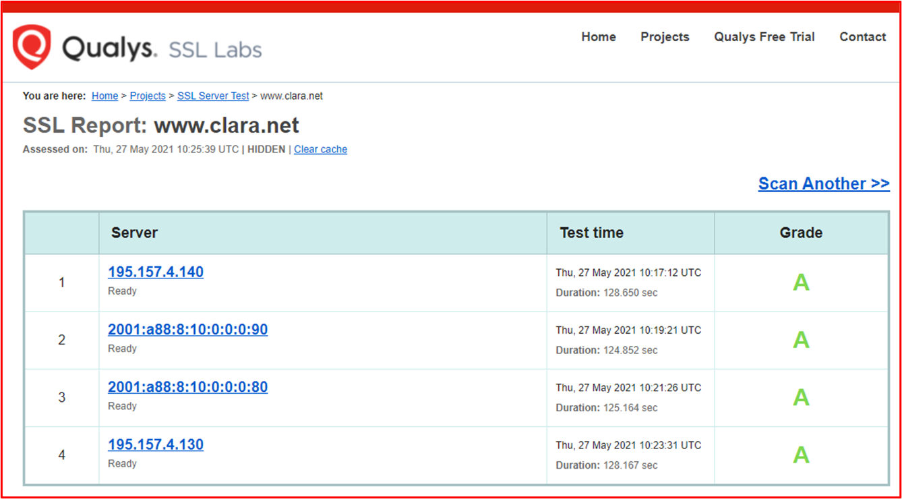

**Remarque**: les analystes de certification examineront le résultat complet pour confirmer que toutes les conditions requises pour la configuration de profil TLS sont remplies (veuillez fournir des captures d’écran de la sortie complète de l’analyse). Depending_ sur __what_ preuve a été fournie, les analystes peuvent exécuter leur propre analyse Qualys.

- Exemple de preuve 2 : la capture d’écran suivante montre que TLS 1.2 est configuré sur le stockage.

**Remarque :** Cette capture d’écran seule ne serait pas en mesure de répondre à cette exigence.

- Exemple de preuve 3 : les captures d’écran suivantes montrent que TLS V1.3 est uniquement activé sur le serveur.

Cet exemple utilise les clés de Registre pour désactiver ou activer un protocole en ajustant les valeurs comme suit :

Binaire : 0 - off 1 - on

Hexadécimal : 0x00000000 - hors 0xffffffff - on

 Remarque : - N’utilisez pas cette méthodologie si vous ne la comprenez pas, car nous (Microsoft) ne sommes pas responsables de l’utilisation ou du suivi de cet exemple ou de tout impact de son utilisation sur vos systèmes. Il s’agit ici d’illustrer simplement une autre façon de montrer si TLS est activé ou désactivé.

**Remarque**: ces captures d’écran ne peuvent pas répondre à cette exigence.

**Contrôle n 2 :** Fournissez des preuves montrant que la compression TLS est désactivée dans tous les services publics qui gèrent les demandes web.

- Intention : il existe une vulnérabilité TLS spécifique,CRIM ([CVE-2012-4929](https://nvd.nist.gov/vuln/detail/CVE-2012-4929)), qui affecte la compression TLS. Pour cette raison, les recommandations du secteur sont de désactiver cette fonctionnalité.

- Exemples de directives de preuve : cela peut être une preuve par le biais de l’outil Qualys SSL Labs.

- Exemple de preuve : la capture d’écran suivante le montre via l’outil Qualys SSL Labs.

**Contrôle n 3 :** Fournissez des preuves montrant que la sécurité de transport HTTP TLS stricte est activée et configurée pour >= 15552000 sur tous les sites.

- Intention : la sécurité de transport HTTP stricte (HSTS) est un mécanisme de sécurité conçu pour protéger les sites web contre les attaques de l’homme au milieu en forçant les connexions TLS à l’intermédiaire d’un champ d’en-tête de réponse HTTPS nommé &quot; Strict-Transport-Security &quot; .

- Exemples de directives de preuve : cela peut être une preuve par le biais de l’outil Qualys SSL Labs ou d’autres outils et d’autres applications de navigateur web.

- Exemple de preuve : la capture d’écran suivante illustre cette situation par le biais d’un &#39;de navigateur web appelé&#39; d’en-tête HTTP&#39; le [site](http://www.microsoft.com/) www.microsoft.com web.

### Données au repos

Lorsque les données consommées à partir de la plateforme Microsoft 365 sont stockées par des isoeurs, les données doivent être protégées de manière convient. Cette section traite des exigences de protection des données stockées dans les bases de données et les magasins de fichiers.

**Contrôle n 4 :** Fournissez des preuves montrant que les données au repos sont chiffrées en ligne avec les exigences de profil de chiffrement, à l’aide d’algorithmes de chiffrement tels qu’AES, Latérienne, TDES et les tailles de clés de chiffrement 128 bits et 256 bits.

- Intention : certains algorithmes de chiffrement plus anciens contiennent des faiblesses de chiffrement, ce qui augmente le risque qu’un acteur de menace puisse déchiffrer les données à l’insu de la clé. Pour cette raison, l’objectif de ce contrôle est de s’assurer que seuls les algorithmes de chiffrement acceptés par le secteur sont utilisés pour protéger les données M365 stockées.

- Exemple de directives de preuve : des preuves peuvent être fournies au moyen de captures d’écran montrant le chiffrement utilisé pour protéger les données M365 dans les bases de données et d’autres emplacements de stockage. Les preuves doivent démontrer que la configuration du chiffrement est conforme aux exigences de [configuration](https://docs.microsoft.com/en-us/microsoft-365-app-certification/docs/certification-submission-guide#appendix-b) du profil de chiffrement de la certification Microsoft 365 de chiffrement.

- Exemple de preuve : la capture d’écran suivante montre que le TDE (Transparent Data Encryption) est activé sur la base de données Contoso. La deuxième capture d’écran montre la page de documents Microsoft &#39;Chiffrement transparent des données pour SQL Database, SQL Managed Instance et [Azure Synapse Analytics](https://docs.microsoft.com/en-us/azure/azure-sql/database/transparent-data-encryption-tde-overview?view=sql-server-ver15&amp;tabs=azure-portal)&#39; montrant que le chiffrement AES 256 est utilisé pour Azure TDE.

- Exemple de preuve 2 : la capture d’écran suivante montre stockage Azure configuré avec le chiffrement pour les blobs et les fichiers. La capture d’écran suivante montre la page documents Microsoft stockage Azure chiffrement des données au repos montrant que &quot;  &quot; stockage Azure utilise AES-256 pour le chiffrement.

**Contrôle n 5 :** Fournissez des preuves montrant que la fonction de hachage ou l’authentification de message (HMAC-SHA1) est utilisée uniquement pour protéger les données au repos en ligne avec les exigences de profil de chiffrement.

- Intention : comme pour les algorithmes de chiffrement, certaines fonctions de hachage et les algorithmes d’authentification des messages sont basés sur des algorithmes avec des faiblesses de chiffrement. L’objectif de ce contrôle est de s’assurer que les données M365 sont protégées par des fonctions de hachage fortes si le hachage est utilisé comme mécanisme de protection des données. Si cela n’est pas utilisé par l’environnement et/ou l’application, des preuves doivent être fournies, ce qui peut corroborer cela.

- Exemple de directives de preuve : la preuve peut se présenter sous la forme de captures d’écran montrant des extraits de code dans lequel la fonction de hachage fonctionne.

- Exemple de preuve : Contoso utilise la fonctionnalité de hachage au sein de son application. La capture d’écran ci-dessous montre que SHA256 est utilisé dans le cadre de la fonction de hachage.

**Contrôle n 6 :** Fournissez un inventaire de toutes les données stockées, y compris l’emplacement de stockage et le chiffrement utilisés pour protéger les données.

- Objectif : pour protéger correctement les données, les organisations doivent connaître les données consommées par leur environnement/systèmes et l’endroit où elles sont stockées. Une fois que cela est entièrement compris et documenté, les organisations peuvent non seulement implémenter une protection adéquate des données, mais également consolider l’emplacement où se trouvent les données afin d’implémenter la protection plus efficacement. En outre, lorsque les données sont consolidées à aussi peu d’endroits que possible, il est beaucoup plus facile d’implémenter un RBAC adéquat (contrôle d’accès basé sur un rôle) pour limiter l’accès à un nombre d’employés aussi limité que nécessaire.

- Exemple de directives de preuve : les preuves doivent être fournies par le moyen d’un document ou d’une exportation à partir d’un système interne, c’est-à-dire, SharePoint ou Contrôle, détaillant toutes les données consommées, tous les emplacements de stockage et le niveau de chiffrement implémenté.

- Exemple de preuve : la capture d’écran suivante montre un exemple de ce à quoi pourrait ressembler un document présentant des types de données.

### Conservation et suppression de données

Lorsque les isv consomment et stockent des données M365, cela risque de compromettre les données si un acteur de menace compromet l’environnement isv. Pour réduire ce risque, les organisations doivent uniquement conserver les données dont elles ont besoin pour la fourniture de services et non les données qui peuvent être utilisés &quot; &quot; à l’avenir. En outre, les données doivent uniquement être conservées aussi longtemps que nécessaire pour fournir les services pour les données capturées. La rétention des données doit être définie et communiquée avec les utilisateurs. Une fois que les données dépassent la période de rétention définie, elles doivent être supprimées en toute sécurité afin que les données ne peuvent pas être reconstruites ou récupérées.

**Contrôle n 7 :** Fournir des preuves montrant qu’une période de rétention des données approuvée et documentée est officiellement établie.

- Objectif : une stratégie de rétention documentée et suivie est importante non seulement pour répondre à certaines obligations légales, telles que la législation sur la confidentialité des données, telle que, mais sans s’y limiter, le Règlement général sur la protection des données (R GDPR de l’UE) et la DPA du Royaume-Uni 2018, mais également pour limiter un risque pour les organisations. En comprenant les besoins en matière de données de l’organisation et la durée pendant combien de temps les données sont nécessaires à l’entreprise pour effectuer ses fonctions, les organisations peuvent s’assurer que les données sont correctement éliminées une fois leur utilité expirée. En réduisant les volumes de données stockées, les organisations réduisent la quantité de données exposées en cas de compromission des données. Cela limite l’impact global.

- Souvent, les organisations stockent des données simplement parce qu’il est bon de l’avoir juste au cas où, toutefois, si l’organisation &quot;&#39;n'&#39;pas besoin des données pour effectuer son service ou sa fonction professionnelle, les données ne doivent pas être stockées, car cela augmente inutilement les risques pour les &quot; organisations.&#39;

- Exemple de directives de preuve : fournissez la stratégie de rétention complète des données qui détaille clairement la durée pendant laquelle les données (qui doivent couvrir tous les types de données) doivent être conservées pour que l’entreprise puisse effectuer ses fonctions professionnelles.

- Exemple de preuve : la capture d’écran ci-dessous montre contoso&#39;de rétention des données.

**Remarque :** Cette capture d’écran montre un document de stratégie/processus. Les isoeurs s’attend à partager la documentation de stratégie/procédure de prise en charge réelle et non simplement à fournir une capture d’écran.

**Contrôle n 8 :** Fournir des preuves montrant que les données conservées correspond à la période de rétention définie.

- Objectif : l’objectif de ce contrôle est simplement de vérifier que les périodes de rétention des données définies sont remplies. Comme nous l’avons déjà vu, les organisations peuvent avoir une obligation légale de respecter cette obligation, mais également en conservant les données qui sont nécessaires et aussi longtemps que nécessaire pour réduire les risques pour l’organisation en cas de violation de données.

- Exemple de directives de preuve : fournir des preuves de capture d’écran (ou via le partage d’écran) montrant que les données stockées (dans tous les différents emplacements de données, c’est-à-dire, bases de données, partages de fichiers, archives, etc.&#39;) ne dépassent pas la stratégie de rétention des données définie. Par exemple, des captures d’écran d’enregistrements de base de données avec un champ de date, des recherches dans l’ordre d’enregistrement le plus ancien et/ou des emplacements de stockage de fichiers affichant des timestamps se trouve dans la période de rétention.

**Remarque :** Toutes les données client personnelles/sensibles doivent être expurgées dans la capture d’écran.

- Exemple de preuve : la preuve suivante montre une requête SQL montrant le contenu de la table de base de données trié dans l’ordre croissant sur le champ &#39;&#39; DATE DATE TRANSACTION&#39; pour afficher les enregistrements les plus anciens dans la base de \_ données. Si les données ont deux mois, cela&#39;pas dépasser la période de rétention définie.

**Remarque :** Il s’agit d’une base de données de test,&#39;contient pas beaucoup de données historiques.

**Contrôle n 9 :** Fournir des preuves montrant que des processus sont en place pour supprimer en toute sécurité des données après sa période de rétention.

- Objectif : l’objectif de ce contrôle est de s’assurer que le mécanisme utilisé pour supprimer des données qui dépasse la période de rétention le fait en toute sécurité. Les données supprimées peuvent parfois être récupérées . Par conséquent, le processus de suppression doit être suffisamment robuste pour garantir que les données ne peuvent pas être récupérées une fois supprimées.

- Exemple de directives de preuve : si le processus de suppression est effectué par programme, fournissez une capture d’écran du script utilisé pour effectuer cette opération. S’il&#39;est exécuté selon une planification, fournissez une capture d’écran montrant la planification. Par exemple, un script pour supprimer des fichiers au sein d’un partage de fichiers peut être configuré en tant que travail CRON, capture d’écran du travail CRON montrant la planification et le script qui est exécuté et fournir le script montrant la commande utilisée.

- Exemple de preuve 1 : il s’agit d’un script simple qui peut être utilisé pour supprimer tous les enregistrements de données conservés en fonction de la date -WHERE DateAdd est -30 jours, ce qui purgera tous les enregistrements conservés plus de 30 jours après la date de rétention des données sélectionnée. Veuillez noter que nous avons besoin du script, mais également de la preuve de l’exécuter et des résultats.

- Exemple de preuve 2 : l’exemple ci-dessous a été tiré du plan de rétention des données Contoso dans le Contrôle 7 : il présente les procédures utilisées pour la destruction des données.

**Remarque :** Cette capture d’écran montre un document de stratégie/processus. Les isoeurs s’attend à partager la documentation de stratégie/procédure de prise en charge réelle et non simplement à fournir une capture d’écran.

- Exemple de preuve 3 : dans cet exemple, un runbook a été créé et une planification correspondante dans Azure pour supprimer en toute sécurité les enregistrements dont la date de fin est créée à partir des 30 jours suivant l’expiration de la stratégie de rétention des enregistrements de données. Ce travail est prêt à s’exécuter tous les mois le dernier jour du mois.

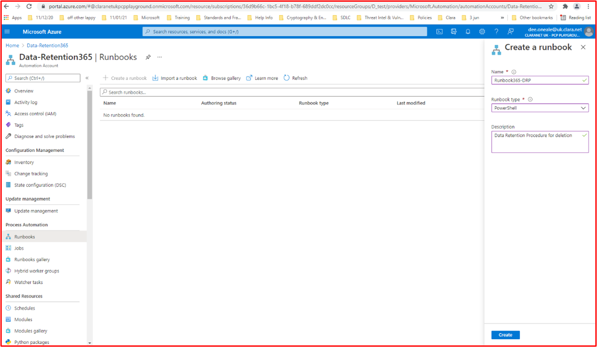

La fenêtre ci-dessous montre que le runbook a été modifié pour rechercher des enregistrements et présente des commandes de suppression qui ne sont pas en vue comme le script. Veuillez noter que l’URL complète et le nom d’utilisateur doivent être en vue pour ces captures d’écran et que les&#39;isv doivent afficher une capture d’écran du nombre d’enregistrement avant la suppression et une capture d’écran du nombre d’enregistrement après la suppression. Ces captures d’écran sont purement des exemples des différentes approches possibles.

### Gestion de l’accès aux données

L’accès aux données doit être limité à aussi peu de personnes que nécessaire pour réduire les risques de compromissation malveillante ou accidentelle des données. L’accès aux données et aux clés de chiffrement doit être limité aux utilisateurs ayant un besoin légitime d’accès à l’entreprise pour remplir leur rôle. Cela doit être bien documenté et un processus bien établi pour demander l’accès doit être implémenté. L’accès aux données et aux clés de chiffrement doit respecter le principe des privilèges minimum.

**Contrôle n. 10 :** Fournissez une liste de toutes les personnes ayant accès aux données ou aux clés de chiffrement, y compris la justification professionnelle.

- Intention : les organisations doivent limiter l’accès aux données et aux clés de chiffrement au plus petit nombre d’employés possible. L’objectif de ce contrôle est de s’assurer que l’accès des employés aux données et/ou aux clés de chiffrement est limité aux employés ayant clairement besoin d’un tel accès.

- Exemple de directives de preuve : documentation ou captures d’écran de systèmes internes qui documentent tous les employés ayant accès aux données et/ou clés de chiffrement, ainsi que la justification professionnelle de la raison pour laquelle ces personnes ont accès doivent être fournies. Cette liste sera utilisée par l’analyste de certification pour échantilloner les utilisateurs des contrôles suivants.

- Exemple de preuve : le document suivant présente la liste documentée des utilisateurs ayant accès aux données et la justification de l’entreprise.

**Contrôle n. 11 :** Fournissez des preuves montrant que les personnes échantillonnables qui ont accès aux données ou aux clés de chiffrement ont été officiellement approuvées, en détaillant les privilèges requis pour leur fonction.

- Intention : le processus d’octroi de l’accès aux données et/ou aux clés de chiffrement doit inclure une approbation, ce qui garantit que l’accès d’une&#39;individuelle est requis pour sa fonction. Cela garantit que les employés sans motif authentique d’accès&#39;ne obtiennent pas d’accès inutile.

- Exemples de directives de preuve : en règle générale, les preuves fournies pour le contrôle précédent peuvent aider à prendre en charge ce contrôle. S’il n'&#39;pas d’approbation formelle sur la documentation fournie, une demande de modification peut être formée et approuvée pour l’accès au sein d’un outil tel que Azure DevOps ou Jira.

- Exemple de preuve : cet ensemble d’images montre des tickets Jira créés et approuvés pour la liste ci-dessus dans le contrôle 10 afin d’accorder ou de refuser l’accès aux données sensibles et/ou aux clés de chiffrement.

Cette image montre qu’une demande a été créée dans Jira pour obtenir l’approbation Sam Daily pour les clés de chiffrement sur l’environnement système. Cette étape est effectuée lors de l’étape suivante pour contrôler les 10 autorisations écrites qui ont été obtenues.

Cela montre que la demande d’accès à Sam Daily a été approuvée par Jon Smith, une personne de la direction qui est visible dans le contrôle 10. (Veuillez noter que l’approbation doit être provenant d’une personne habilitée à autoriser la demande de modification, elle ne peut pas être un autre développeur).

L’exemple ci-dessus montre un flux de travail dans Jira pour ce processus notez que rien ne peut être ajouté comme Terminé, sauf s’il a été par le biais du processus d’approbation qui est automatisé par conséquent ne peut pas être passé.

Le tableau Project ci-dessus montre maintenant que l’approbation de Sam Daily&#39;accès aux clés de chiffrement. En dessous du journal des travaux en souffrance, indique sam Daily&#39;'approbation de la demande et la personne affectée pour faire le travail.

Pour répondre aux exigences de ce contrôle, vous devez afficher toutes ces captures d’écran ou des captures d’écran similaires avec une explication pour démontrer que vous avez satisfait aux exigences de contrôle.

- Exemple de preuve 2 : dans l’exemple ci-dessous, des autorisations d’accès administrateur et de contrôle total ont été demandées pour un utilisateur à la base de données de production. La demande a été envoyée pour approbation, comme vous pouvez le voir à droite de l’image et celle-ci a été approuvée comme vous pouvez le voir sur la gauche.

Vous pouvez voir ci-dessus que l’accès a été approuvé et signé comme terminé.

**Contrôle n. 12 :** Fournissez des preuves montrant que les personnes échantillonnables qui ont accès aux données ou aux clés de chiffrement ont uniquement les privilèges inclus dans l’approbation.

- Objectif : l’objectif de ce contrôle est de confirmer que l’accès aux données et/ou à la clé de chiffrement est configuré selon les documents.

- Exemple de directives de preuve : des preuves peuvent être fournies par capture d’écran qui montre les données et/ou les privilèges d’accès à la clé de chiffrement accordés aux personnes échantillonncés. Les preuves doivent couvrir tous les emplacements de données.

- Exemple de preuve : cette capture d’écran montre les autorisations accordées à l’utilisateur John Smith qui seraient référencés par rapport à la demande d’approbation pour ce même utilisateur, selon la preuve du &quot; &quot; contrôle précédent.

**Contrôle n. 13 :** Fournissez la liste de tous les tiers avec qui les données client sont partagées.

- Intention : lorsque des tiers sont utilisés pour le stockage ou le traitement des données M365, ces entités peuvent présenter un risque important. Les organisations doivent développer un bon processus de gestion et de diligence tiers pour s’assurer que ces tiers stockent/traitent les données en toute sécurité et qu’ils respectent toutes les obligations légales qu’ils peuvent avoir, par exemple en tant que responsable du traitement des données dans le cadre du R GDPR.

- Les organisations doivent tenir à jour une liste de tous les tiers avec lesquels elles partagent des données avec tout ou partie des informations suivantes :

- les services(s) fournis(s) ;
- quelles données sont partagées,
- pourquoi les données sont partagées,
- informations de contact clés (par exemple, contact principal, contact de notification de violation, DPO, etc.),
- renouvellement/expiration du contrat
- obligations légales/de conformité (par exemple, R GDPR, HIPPA, PCI DSS, FedRamp, etc.)

- Exemple de directives de preuve : fournir une documentation détaillant **TOUS** les tiers avec lesquels les données M365 sont partagées.

**Remarque :** Si des tiers ne sont pas utilisés, cela doit être confirmé par écrit (courrier électronique) par un membre de l’équipe de direction.

- Exemple de preuve 1

- Exemple de preuve 2 : cette capture d’écran montre un exemple de message électronique d’un membre de l’équipe de direction senior confirmant qu’aucun tiers n’est utilisé pour traiter les données M365.

**Contrôle n 14 :** Fournir des preuves montrant que tous les tiers qui consomment des données client ont des accords de partage en place.

- Intention : lorsque les données M365 sont partagées avec des tiers, il est important que les données sont gérées de manière appropriée et sécurisée. Des accords de partage de données doivent être en place pour s’assurer que les tiers traitent les données uniquement selon les besoins et qu’ils comprennent leurs obligations de sécurité. Une sécurité d’organisation n’est aussi forte que le lien le plus faible. L’objectif de ce contrôle est de s’assurer que les tiers ne deviennent pas un lien faible d’organisation.

- Exemple de directives de preuve : partager les accords de partage de données en place avec les tiers.

- Exemple de preuve : la capture d’écran suivante montre un exemple de contrat de partage de données simple.

**Remarque :** Le contrat complet doit être partagé et non une capture d’écran.

### RGPD

La plupart des organisations traiteront des données qui sont potentiellement des données de&#39;citoyens européens (sujets de données). Lorsque les données **d’une** personne objet de données sont traitées, les organisations doivent respecter le Règlement général sur la protection des données (R GDPR). Cela s’applique à la fois aux contrôleurs de données (vous capturez directement ces données) ou aux processeurs de données (vous traitez ces données au nom d’un contrôleur de données). Bien que cette section&#39;ne couvre pas l’intégralité de la réglementation, elle aborde certains des éléments clés du R GDPR pour vous aider à vous assurer que l’organisation prend au sérieux le R GDPR.

**Contrôle n. 15 :** Fournir un processus documenté de demande d’accès de l’objet (R.A.S.) et fournir des preuves montrant que les sujets de données sont en mesure de lever des demandes d’accès client.

- Objectif : le R GDPR inclut des obligations spécifiques qui doivent être remplies par les organisations traitant des données&#39; données. L’obligation pour les organisations de gérer les demandes d’accès sujet est incluse dans l’article 12 qui, conformément à l’article 12.3, donne à un contrôleur de données un mois de réception de la sar sar pour répondre à la demande. Une extension est autorisée pendant deux mois supplémentaires, le cas échéant. Même si votre organisation agit en tant que processeur de données, cela sera toujours nécessaire pour aider vos clients (le contrôleur de données) à respecter leurs obligations d’accès client.

- Exemple de directives de preuve : fournir le processus documenté pour la gestion des DSA.

- Exemple de preuve : l’exemple suivant montre un processus documenté pour la gestion des DSA.

**Remarque :** Cette capture d’écran montre un document de stratégie/processus. Les isoeurs s’attend à partager la documentation de stratégie/procédure de prise en charge réelle et non simplement à fournir une capture d’écran.

**Contrôle n. 16 :** Fournissez des preuves montrant que vous êtes en mesure d’identifier tous les emplacements des données des personnes qui répondent à une recherche de détail.

- Objectif : l’objectif de ce contrôle est de s’assurer que l’organisation dispose d’un mécanisme robuste pour identifier toutes les personnes&#39; données. Il peut s’agit d’un processus manuel, car tout le stockage des données est bien documenté, ou d’autres outils peuvent être utilisés pour s’assurer que toutes les données sont situées dans le cadre du processus d’accès aux données d’accès aux données.

- Exemple de directives de preuve : des preuves peuvent être fournies par le moyen d’une liste de tous les emplacements de données et d’un processus documenté pour rechercher des données dans tous les emplacements de données. Cela inclut les commandes nécessaires pour rechercher des données, c’est-à-dire, si des emplacements SQL sont inclus, les instructions SQL spécifiques sont détaillées pour garantir que les données sont trouvées correctement.

- Exemple de preuve : la capture d’écran suivante est un extrait de la procédure de recherche&#39;ci-dessus qui montre comment les données seront trouvées.

Les quatre images ci-dessous montrent comment les emplacements de données de l’isv dans lequel l’explorateur Stockage a été interrogé, puis utilisé pour explorer les fichiers ou les objets blob qui devaient être supprimés du stockage pour se conformer à la demande d’accès client.

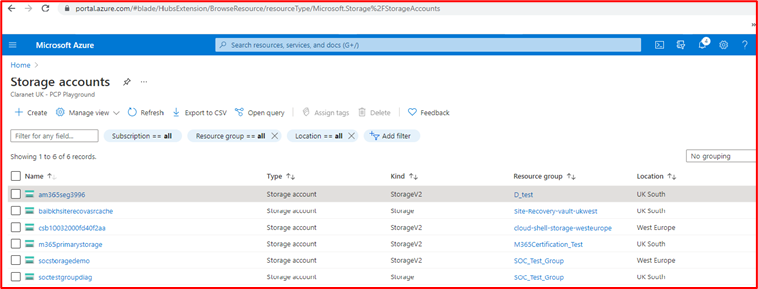

Cette requête confirme les comptes de stockage utilisés. Vous pouvez interroger et supprimer du stockage, des blobs et/ou des fichiers à l’aide de l’Explorateur de ressources Graph (Kusto) ou PowerShell (voir ci-dessous).

L’image ci-dessus montre les données qui ont été trouvées dans le conteneur d’objets blob pour le client qui doit être supprimé et ci-dessous illustre l’action de suppression ou de suppression de l’information dans l’objet blob.

**Contrôle n. 17 :** Fournissez un lien vers la notification de confidentialité qui doit contenir tous les éléments requis comme suit :

- Détails des sociétés (nom, adresse, etc.).
- Détaille les types de données personnelles en cours de traitement.
- Détaille la loi du traitement des données personnelles.
- Détails des droits de la personne&#39;données :
  - - Droit d’être informé,
  - - Droit d’accès par la sujet des données,
  - - Droit à l’effacement,
  - - Droit à la restriction du traitement,
  - - Droit à la portabilité des données,
  - - Droit à l’objet,
  - - Droits en relation avec la prise de décision automatisée, y compris le profilage.
- Détails de la durée de la durée de la gestion des données personnelles.

- Intention : l’article 13 du R GDPR inclut des informations spécifiques qui doivent être fournies aux personnes qui traitent des données au moment où les données personnelles sont obtenues. L’objectif de ce contrôle est de s’assurer que la notification de confidentialité des données des organisations fournit aux personnes présentes certaines des informations clés incluses dans l’article 13.

- Exemple de directives de preuve : cela est généralement fourni en fournissant la notification de confidentialité des données. Les analystes de certification l’examineront pour s’assurer que toutes les informations fournies dans le contrôle sont incluses dans la notification de confidentialité des données.

- Exemple de preuve

Les images d’une notification de confidentialité ci-dessus et adjacente montrent un exemple de politique de confidentialité en ligne avec l’article 13 du R GDPR inclus.

Vous trouverez ci-dessous une stratégie de protection des données qui peut être utilisée conjointement avec la notification de confidentialité indiquée précédemment.

L’image ci-dessus d’Azure montre comment Azure a été configuré pour répondre aux exigences de conformité du R GDPR pour les données stockées dans un environnement back-end. La stratégie (qui peut être personnalisée ou conçue à partir de plans _Azure)_ permet à l’isv de s’assurer que les données de l'&#39;client sont stockées correctement et qu’elles sont accessibles uniquement par les mesures et alertes définies pour garantir la conformité et afficheront les données non conformes ou l’accès des utilisateurs sur le tableau de bord du Gestionnaire de conformité.

Livres

Contrôle D. (2018) Manuel d’équipe bleu : édition Réponse aux incidents : guide de champ condensé pour le répondeur d’incident de cybersécurité. 2nd Edition, Publisher : Plateforme de publication indépendante CreateSpace.

Références

- Signalement des cybercriminels de l’action : [https://www.actionfraud.police.uk/](https://www.actionfraud.police.uk/) (accessible le 21/08/02/21).
- UE. (2021) Liste de vérification R GDPR pour les contrôleurs de données Disponible à l':: [https://gdpr.eu/checklist/](https://gdpr.eu/checklist/) (Accessible le 21/01/02/21).
- Microsoft. (2018) Journalisation des événements (Windows Installer) Disponible à l’docs.microsoft.com/en-us/windows/win32/msi/event-logging (accès : 12/23/20).
- Technologies positives. (2020) Comment aborder le développement de logiciels sécurisé disponible à l':: [https://www.ptsecurity.com/ww-en/analytics/knowledge-base/how-to-approach-secure-software-development/](https://www.ptsecurity.com/ww-en/analytics/knowledge-base/how-to-approach-secure-software-development/) (Accès : 12/21/20).
- Règlement (UE) 2016/679 de l’Union européenne et du Conseil du 27 avril 2016 sur la protection des personnes physiques en ce qui concerne le traitement des données personnelles et sur la libre circulation de ces données, et la directive 95/46/EC (Règlement général sur la protection des données) (texte avec pertinence de l’EEE) (2016) Disponible à l’adresse : (Accès : [https://www.legislation.gov.uk/eur/2016/679/contents](https://www.legislation.gov.uk/eur/2016/679/contents) 11/01/2021).
- Mesures de sécurité. (2020) Guide des mesures de sécurité pour la conformité PCI DSS. Disponible à : [https://info.securitymetrics.com/pci-guide-2020](https://info.securitymetrics.com/pci-guide-2020) (Accès : 06/01/21).
- Williams J. OWASP Risk Ranking Available at: [https://owasp.org/www-community/OWASP\_Risk\_Rating\_Methodology](https://owasp.org/www-community/OWASP_Risk_Rating_Methodology) (Accessed: 12/08/20).
- Qualys. (2014) Ateliers SSL : problèmes de nouvelles notes de confiance (T) et d’insérialisation (M) disponibles dans : [https://blog.qualys.com/product-tech/2014/06/17/ssl-labs-new-grades-for-trust-t-and-mismatch-m-issues](https://blog.qualys.com/product-tech/2014/06/17/ssl-labs-new-grades-for-trust-t-and-mismatch-m-issues) (Accès : 29/01/21).
- NIST SP800-61r2 : Guide de gestion des incidents de sécurité informatique disponible à l':: (accessible le [https://csrc.nist.gov/publications/detail/sp/800-61/rev-2/final](https://csrc.nist.gov/publications/detail/sp/800-61/rev-2/final) 24/01/21).

**Images provenant de documents Microsoft**

- [https://www.sans.org/information-security-policy/](https://www.sans.org/information-security-policy/)(Accessible le 21/18/02/21).
- [https://docs.microsoft.com/en-us/cloud-app-security/anomaly-detection-policy](https://docs.microsoft.com/en-us/cloud-app-security/anomaly-detection-policy)(Accessible le 21/16/02/21).
- [https://docs.microsoft.com/en-us/azure/azure-monitor/alerts/alerts-overview](https://docs.microsoft.com/en-us/azure/azure-monitor/alerts/alerts-overview) (Accessible le 21/17/02/21).
- [https://docs.microsoft.com/en-us/cloud-app-security/anomaly-detection-policy](https://docs.microsoft.com/en-us/cloud-app-security/anomaly-detection-policy) (Accessible le 22/02/21).
- [https://docs.microsoft.com/en-us/azure/security-center/security-center-managing-and-responding-alerts](https://docs.microsoft.com/en-us/azure/security-center/security-center-managing-and-responding-alerts) (Accessible le 24/02/21).
- [https://docs.microsoft.com/en-us/azure/security-center/security-center-managing-and-responding-alerts](https://docs.microsoft.com/en-us/azure/security-center/security-center-managing-and-responding-alerts) (Accessible le 24/02/21).
- [https://microsoft.github.io/AzureTipsAndTricks/blog/tip272.html](https://microsoft.github.io/AzureTipsAndTricks/blog/tip272.html)
- [https://docs.microsoft.com/en-gb/azure/information-protection/what-is-information-protection](https://docs.microsoft.com/en-gb/azure/information-protection/what-is-information-protection)
- [https://docs.microsoft.com/en-us/azure/azure-sql/database/transparent-data-encryption-tde-overview?tabs=azure-portal](https://docs.microsoft.com/en-us/azure/azure-sql/database/transparent-data-encryption-tde-overview?tabs=azure-portal)
- [https://docs.microsoft.com/en-us/azure/governance/policy/assign-policy-portal](https://docs.microsoft.com/en-us/azure/governance/policy/assign-policy-portal)
- [https://docs.microsoft.com/en-us/azure/azure-sql/database/threat-detection-configure](https://docs.microsoft.com/en-us/azure/azure-sql/database/threat-detection-configure)
