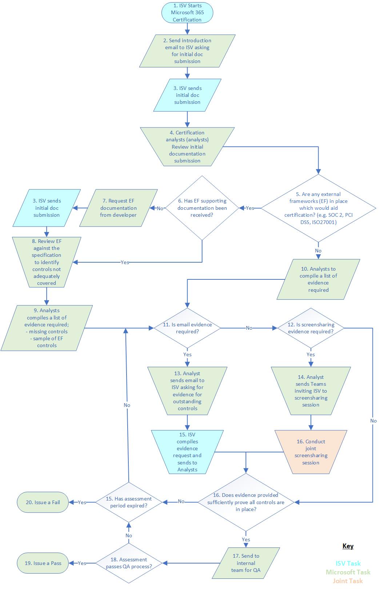

# Microsoft 365 Guide de soumission de certificationMicrosoft 365 Certification Submission Guide

**Dans cet article****In this article:**
- [IntroductionIntroduction](#introduction)
- [Conditions préalablesPrerequisites](#prerequisites) 
- [Microsoft 365 Mises à jour des spécifications de certificationMicrosoft 365 Certification Specification Updates](#microsoft-365-certification-specification-updates)
- [Étendue de certificationCertification Scope](#certification-scope)
- [Processus de certificationCertification Process](#certification-process)
- [Envoi initial du documentInitial Document submission](#initial-document-submission) 
- [Activités de collecte et d’évaluation des preuvesEvidence Collection and Assessment Activities](#evidence-collection-and-assessment-activities)
- [Critères de certificationCertification Criteria](#app-certification-criteria)
- [Sécurité des applicationsApplication Security](#application-security)
- [Sécurité opérationnelleOperational Security](#operational-security) 
- [Sécurité et confidentialité de la gestion des donnéesData Handling Security and Privacy](#data-handling-security-and-privacy)
- [Révision facultative des frameworks de conformité externeOptional External Compliance Frameworks Review](#optional-external-compliance-frameworks-review)
- [Annexe AAppendix A](#appendix-a)
- [Annexe BAppendix B](#appendix-b) 
- [Annexe CAppendix C](#appendix-c) 
- [Annexe DAppendix D](#appendix-d) 
- [Annexe EAppendix E](#appendix-e) 
- [Annexe FAppendix F](#appendix-f) 
- [Annexe G Appendix G ](#appendix-g)
- [En savoir plusLearn more](#learn-more) 
- [GlossaireGlossary](#glossary) 

## IntroductionIntroduction

Dans le cadre du programme de conformité des applications Microsoft 365, la certification Microsoft 365 offre aux organisations d’entreprise la garantie et la confiance que les données et la confidentialité sont correctement sécurisées et protégées lors de l’intégration d’applications/de modules de développement tiers à la plateforme Microsoft 365.Part of the Microsoft 365 App Compliance program, the Microsoft 365 Certification offers assurance and confidence to enterprise organizations that data and privacy are adequately secured and protected when integrating third-party developer apps/add-ins into the Microsoft 365 platform. Les applications et les applications qui passent la validation sont désignées Microsoft 365 **certifiées** dans l’ensemble Microsoft 365 écosystème.Applications and add-ins that pass validation will be designated **Microsoft 365 Certified** throughout the Microsoft 365 ecosystem. 

En participant au programme de certification Microsoft 365, vous acceptez ces conditions supplémentaires et vous respectez toute documentation qui s’applique à votre participation au programme de certification Microsoft 365 avec Microsoft Corporation ( « Microsoft », « nous », « nous » ou « notre »).By participating in the Microsoft 365 Certification  program, you are agreeing to these supplemental terms and to comply with any accompanying documentation that applies to your participation in the Microsoft 365 Certification program with Microsoft Corporation ("Microsoft", "we", "us",  or "our"). Vous nous faites part de l’autorisation d’accepter ces conditions supplémentaires de certification Microsoft 365 au nom de vous-même, d’une société et/ou d’une autre entité, le cas échéant.You represent and warrant to us that you have the authority to accept these Microsoft 365 Certification supplemental terms on behalf of yourself, a company, and/or other entity, as applicable. Nous pouvons modifier, modifier ou mettre fin à ces termes supplémentaires à tout moment.We may change, amend or terminate these supplemental terms at any time. Votre participation continue au programme Microsoft 365 certification après toute modification ou modification signifie que vous acceptez les nouvelles conditions supplémentaires.Your continued participation in the Microsoft 365 Certification program after any change or amendment means you agree to the new supplemental terms. Si vous n’acceptez pas les nouvelles conditions supplémentaires ou si nous résilions ces termes supplémentaires, vous devez arrêter de participer au programme Microsoft 365 certification.If you do not agree to the new supplemental terms or if we terminate these supplemental terms, you must stop participating in the Microsoft 365 Certification program.

Ce document s’adresse aux éditeurs de logiciels indépendants pour fournir des informations sur le processus de certification Microsoft 365, les conditions préalables au démarrage du processus et les détails des contrôles de sécurité spécifiques que les éditeurs de logiciels indépendants doivent mettre en place.This document is aimed at ISVs (Independent Software Vendors) to provide information on the Microsoft 365 Certification process, prerequisites to starting the process and details of specific security controls that ISVs must have in place.  Des informations générales sur le Microsoft 365 conformité des applications sont disponibles sous la page du Microsoft 365 conformité des [applications.](https://docs.microsoft.com/microsoft-365-app-certification/overview)General information of the Microsoft 365 App Compliance program can be found under the Microsoft 365 App Compliance program [page](https://docs.microsoft.com/microsoft-365-app-certification/overview). 

> [!IMPORTANT]
> Actuellement, Microsoft 365 certification est limitée :Currently, Microsoft 365 Certification is limited:
>* Microsoft Teams applications (onglets, bots, etc.) .Microsoft Teams applications (Tabs, Bots, etc.) .
>* Applications/add-ins SharePointSharepoint Apps/Add-ins
>* Office Les add-ins (Word, Excel, PowerPoint, Outlook, Project, OneNote)Office Add-ins (Word, Excel, PowerPoint, Outlook, Project, OneNote)

## Conditions préalablesPrerequisites

### Attestation de l’éditeurPublisher Attestation

Avant d’obtenir le processus Microsoft 365 certification, vous devez avoir terminé Publisher attestation.Before being awarded the Microsoft 365 Certification process you must have completed Publisher Attestation. Toutefois, vous pouvez démarrer le processus Microsoft 365 certification avant de terminer l Publisher attestation.However, you may start the Microsoft 365 Certification process prior to completing Publisher Attestation.  

### Lire les spécifications Microsoft 365 certification de l’Microsoft 365Read the Microsoft 365 Certification Specification

Microsoft recommande à tous les éditeurs de logiciels indépendants (éditeurs de logiciels indépendants) de lire entièrement cette spécification de certification Microsoft 365 pour s’assurer que tous les contrôles applicables sont satisfaits par l’environnement dans l’étendue et l’application/le add-in.Microsoft recommends all ISVs (Independent Software Vendor) to read this Microsoft 365 Certification Specification in its entirety to ensure all applicable controls are being met by the in-scope environment and the app/add-in. Cela permet de garantir un processus d’évaluation fluide.This will help ensure a smooth assessment process.

## Microsoft 365 Mises à jour des spécifications de certificationMicrosoft 365 Certification Specification Updates 

Les mises à jour de la spécification Microsoft 365 certification sont prévues environ tous les six à douze mois.Updates to the Microsoft 365 Certification specification are anticipated approximately every six to twelve months. Ces mises à jour peuvent introduire de nouveaux domaines de sécurité cibles et/ou des contrôles de sécurité.These updates might introduce new target security domains and / or security controls. Les mises à jour seront basées sur les commentaires des développeurs, les modifications apportées au paysage des menaces et pour augmenter la ligne de base de sécurité du programme au cours de sa maturité.Updates will be based on developer feedback, changes to the threat landscape, and to increase the security baseline of the program as it matures. 

Les isvs qui ont déjà démarré l’évaluation de la certification Microsoft 365 peuvent poursuivre l’évaluation avec la version de la spécification de certification Microsoft 365 qui était valide au début de l’évaluation.ISVs that have already started the Microsoft 365 Certification assessment can continue the assessment with the version of the Microsoft 365 Certification Specification that was valid when the assessment was started. Toutes les nouvelles soumissions, y compris la recertification annuelle, doivent être évaluées par rapport à la version publiée.All new submissions, including annual recertification, will be required to be assessed against the version published.

> [!NOTE]
> Vous n’êtes pas obligé de vous conformer à tous les contrôles de cette Microsoft 365 certification pour obtenir une certification.You are not required to comply with all the controls within this Microsoft 365 Certification Specification to be awarded a certification. Toutefois, des seuils de passage (qui ne seront pas divulgués) sont en place pour chacun des domaines de sécurité abordés dans cette Microsoft 365 certification.However, passing thresholds (which will not be disclosed) are in place for each of the security domains discussed within this Microsoft 365 Certification Specification. Certains contrôles seront classésen tant qu’échec en dur, ce qui signifie que l’absence de ces contrôles de sécurité entraîne l’échec de l’évaluation.Some controls will be classed as a ‘**Hard Fail**’ which means the lack of these security controls will result in a failed assessment. 

## Étendue de certificationCertification Scope

L’environnement dans l’étendue est l’environnement qui prend en charge la livraison du code de l’application/du add-in et prend en charge tous les systèmes **back-end** avec qui l’application/le module peut communiquer.The **in-scope environment** is the environment that supports delivery of the app/add-in code and supports any backend systems that the app/add-in may be communicating with. Tous les environnements connectés supplémentaires seront également inclus dans l’étendue, sauf si une segmentation adéquate est en place ET que les environnements connectés ne peuvent pas avoir d’impact sur la sécurité de l’environnement dans l’étendue.Any additional connected-to environments will also be included in scope unless adequate segmentation is in place AND the connected-to environments cannot impact the security of the in-scope environment. Tous les environnements de récupération d’urgence doivent également être inclus dans l’étendue de l’évaluation, car ces environnements seraient requis pour satisfaire au service en cas de problème dans l’environnement principal.Any disaster recovery environments will also need to be included within the scope of the assessment as these environments would be required to fulfil the service should anything happen to the primary environment.  Le terme **composants système dans l’étendue** fait référence à TOUS les appareils et systèmes utilisés dans l’environnement   dans l’étendue. The term  **in-scope system components** reference **ALL** devices and systems that are used within the in-scope environment. Les composants dans l’étendue incluent, sans s’y limiter, les éléments suivants :In-scope components include, but are not limited to:
* Les applications web.The web application(s).
* Serveurs.Servers.
* Pare-feu (ou équivalent).Firewalls (or equivalent).
* Commutateurs.Switches.
* Équilibreurs de charge.Load balancers.
* Infrastructure virtuelle.Virtual infrastructure.
* Portails de gestion web des fournisseurs de cloudCloud provider web management portals 

> [!IMPORTANT]
> L’environnement dans l’étendue doit avoir une DMZ et l’environnement de prise en charge de l’application/du add-in doit être segmenté des systèmes d’entreprise internes et des environnements d’entreprise, limitant ainsi l’étendue des activités d’évaluation aux systèmes dans l’étendue uniquement.The in-scope environment, must have a DMZ and the supporting environment of the app/add-in must be segmented from the internal business systems and corporate environments thus limiting the scope of the assessment activities to the in-scope systems only. Les analystes de certification valideront les techniques de segmentation lors de l’évaluation, ainsi que la révision des rapports de test de pénétration qui auraient dû inclure des tests pour valider l’efficacité de toutes les techniques de segmentation utilisées.Certification analysts will validate segmentation techniques during the assessment along with reviewing penetration testing reports which should have included testing to validate the effectiveness of any segmentation techniques in use.

### Infrastructure as a Service (IaaS), Platform as a Service (PaaS) et Software as a Service (SaaS)Infrastructure as a Service (IaaS), Platform as a Service (PaaS) and Software as a Service (SaaS) 
Lorsque IaaS et/ou PaaS sont utilisés pour prendre en charge l’infrastructure de la remise de code d’application ou de module de module de prise en charge en révision, le fournisseur de plateforme Cloud sera responsable de certains des contrôles de sécurité évalués tout au long du processus de certification.Where IaaS and/or PaaS is used to support the infrastructure of the application or add-in code delivery under review, the Cloud platform provider will be responsible for some of the security controls assessed throughout the certification process. Par conséquent, les analystes de certification doivent être assurés par une vérification externe indépendante des meilleures pratiques en matière de sécurité par le fournisseur de plateforme Cloud par le biais de rapports de conformité externes tels que les rapports [DSS](bookmark://pci-dss)attestation de conformité   (AOC), ISO27001 ou [SOC 2](bookmark://soc-2)   Type II.Therefore, certification analysts will need to be provided with independent external verification of security best practices by the Cloud platform provider through external compliance reports such as [PCI DSS](bookmark://pci-dss) Attestation of Compliance (AOC), ISO27001 or [SOC 2](bookmark://soc-2) Type II reports. 

L’Annexe F fournit des détails sur les contrôles de sécurité qui seront probablement applicables en fonction des types de déploiement suivants et selon que l’application/le add-in exfiltre ou non les données M365 :Appendix F provides details of what security controls will likely be applicable based on the following deployment types and based upon whether the app/add-in exfiltrates M365 data or not: 
* ISV hébergéISV Hosted 
* IaaS hébergéIaaS Hosted 
* PaaS/Serverless HostedPaaS/Serverless Hosted 
* Hybride hébergéHybrid Hosted 
* Shared HostedShared Hosted 

Lorsque IaaS ou PaaS est déployé, vous devez fournir des preuves de l’environnement hébergé dans ces types de déploiement.Where IaaS or PaaS is deployed, you will need to provide evidence of the environment being hosted within these deployment types.

### ÉchantillonnageSampling

Les demandes de preuves à la prise en charge de l’évaluation de certification doivent être basées sur un échantillon des composants système dans l’étendue en considération des différents systèmes d’exploitation, de la fonction principale de l’appareil et des différents types d’appareils.Requests for evidence in support of the certification assessment should be based on a sample of the in-scope system components in consideration of different operating systems, primary function of the device, and different device types. Un exemple approprié est sélectionné au début du processus de certification.A suitable sample will be selected at the start of the certification process. Le tableau suivant doit être utilisé comme guide sur la taille de l’échantillon :The following table should be used as a guide on what the sample size may be:

|Taille de la populationPopulation Size              | ÉchantillonSample                  |
|---------------------------- |-------------------------|
|<5<5|11|
|>5 & <10>5 & <10|22|
|>9 & <25>9 & <25|33|
|>24>24|4 4|

> [!NOTE]
>Si des incohérences sont identifiées entre les appareils inclus dans l’exemple initial, la taille de l’échantillon peut être augmentée au cours de l’évaluation.If discrepancies are identified between devices included within the initial sample, the sample size may be increased during the assessment. 

## Processus de certificationCertification Process

Avant de commencer le processus de certification, vous devez avoir terminé votre attestation d’Publisher.Before starting the certification process, you will need to have successfully scompleted your Publisher Attestation. Vos réponses d’attestation seront utilisées pour prendre en charge le processus Microsoft 365 certification et se déroulent comme suit :Your attestation responses will be used in support of the Microsoft 365 Certification process and proceeds as follows:

1.  Examinez votre documentation Publisher attestation d’attestation pour vous assurer qu’elle est toujours exacte avec votre environnement actuel.Review your Publisher Attestation documentation to ensure it is still accurate with your current environment.
2.  Examinez le guide Microsoft 365 soumission de certification pour vous assurer que vous pouvez répondre à tous les contrôles avant de commencer.Review the Microsoft 365 Certification submission guide to ensure you can meet all the controls prior to starting.
3.  Cliquez sur « Démarrer la certification » dans l’Centre de partenaires et soumettez votre envoi de document initial.Click ‘Start Certification’ in partner center and submit your Initial Document Submission. Vos réponses ici vous aideront à déterminer l’étendue de votre évaluation.Your answers here will help to determine the scope of your assessment.
4.  Une liste complète des contrôles pour lesquels vous devrez fournir des preuves pour votre évaluation vous sera fournie.You will be provided a complete listing of controls for which you will need to provide evidence for your assessment.
5.  Soumettre des preuves qui montrent que tous les contrôles de certification Microsoft 365'étendue ont été satisfaits au cours d’une période de 60 jours.Submit evidence that demonstrates that all in-scope Microsoft 365 Certification controls have been met within a 60-day window.
6.  Vérifiez fréquemment votre soumission pour voir si vous avez des commentaires ou des demandes en suspens qui nécessitent votre attention.Check your submission frequently to see if you have any comments, or outstanding requests that require your attention. Une fois que les preuves ont été approuvées pour chaque contrôle, vous êtes Microsoft 365 certification.Once evidence has been approved for every control you will be awarded a Microsoft 365 Certification. 

> [!IMPORTANT]
> **Période de soumission :** En moyenne, le processus d’évaluation devrait prendre 30 jours, à condition de pouvoir vérifier fréquemment l’état de votre soumission et de répondre aux commentaires et aux demandes de preuve supplémentaires dans un délai raisonnable.**Submission time frame:** It is anticipated that on average the assessment process should take 30 days, provided you are able to check your submission status frequently and respond to comments and supplemental evidence requests within a timely manner. Au démarrage du processus de certification, un maximum de 60 jours est autorisé à effectuer l’évaluation.Upon starting the certification process, a maximum of 60 days is permitted to complete the assessment. Si toutes les soumissions n’ont pas été effectuées au cours de la période de 60 jours, l’envoi échouera et le processus doit recommencer.If all submissions have not been completed within the 60-day time-period, the submission will be issued a failure and the process must start again. Ces résultats ne seront pas publics.These results will not be made public.

## Envoi initial de documentsInitial Document Submission

La soumission de document initiale permet aux analystes de certification d’effectuer une étendue et de déterminer ce qui sera dans l’étendue de votre évaluation.The initial document submission will help certification analysts perform scoping and determine what will be in scope for your assessment. Après quoi, vous serez tenu de soumettre la documentation de prise en charge et les preuves utilisées pour effectuer l’évaluation.After which you will be required to submit supporting documentation and evidence used to carry out the assessment. Votre envoi initial doit inclure les informations spécifiées ci-dessous :Your initial submission must include the information specified below:

| **Vue d’ensemble de &nbsp; la documentation****Documentation&nbsp;Overview**     |   **Détails de la documentation****Documentation Details**  |
| -------------------------| -----------------------------|
|**Description de l’application/du add-in****App/Add-in Description** | Description de l’objectif et des fonctionnalités de l’application/du add-in.A description of the app/add-in’s purpose and functionality. Cela doit fournir à l’analyste de certification une bonne compréhension du fonctionnement de l’application/du add-in et de son utilisation prévue.This should provide the certification analyst with a good understanding of how the app/add-in functions and what it is intended use is
|**Rapport de test de pénétration****Penetration Testing Report** |Un rapport de test de pénétration effectué au cours des 12 derniers mois.A penetration testing report completed within the last 12 months. Ce rapport doit inclure l’environnement qui prend en charge le déploiement de l’application/de l’ajout, ainsi que tout environnement supplémentaire qui prend en charge le fonctionnement de l’application/du complément.This report must include the environment that supports the deployment of the app/add along with any additional environment that supports the operation of the app/add-in. **Remarque :** si vous ne testez pas de pénétration annuelle, vous pouvez les faire passer par le processus de certification.**Note:** if you do not do annual penetration testing, you can elect to have them done through the certification process.|
|**Diagrammes d’architecture****Architecture diagrams**|Diagramme d’architecture logique représentant une vue d’ensemble de l’infrastructure de prise en charge de votre application/de votre application.A logical architecture diagram representing a high-level overview of your app's / add-in’s supporting infrastructure. Cela doit inclure tous **les environnements** d’hébergement et l’infrastructure de prise en charge de l’application/du add-in.This must include **all** hosting environments and supporting infrastructure supporting the app/add-in. Ce diagramme DOIT décrire tous les différents composants système de prise en charge dans l’environnement pour aider les analystes de certification à comprendre les systèmes dans l’étendue et à déterminer l’échantillonnage.This diagram MUST depict all the different supporting system components within the environment to help certification analysts understand systems in scope and help to determine sampling. Indiquez également le type d’environnement d’hébergement utilisé . IsV hébergé, IaaS, PaaS ou hybride.Please also indicate what hosting environment type is used; ISV Hosted, IaaS, PaaS, or Hybrid. **Remarque :** Lorsque SaaS est utilisé, indiquez les différents services SaaS utilisés pour fournir les services de prise en charge dans l’environnement.**Note:** Where SaaS is used, please indicate the various SaaS services that are used to provide the supporting services within the environment.|
|**Encombrement public****Public Footprint** | Détails de **toutes les** adresses IP publiques et URL utilisées par l’infrastructure de prise en charge.Detailing **all** public IP Addresses and URLs used by the supporting infrastructure. Cela doit inclure la plage d’adresses IP routable complète allouée à l’environnement, sauf si une segmentation adéquate a été implémentée pour fractionner la plage en cours d’utilisation (une preuve adéquate de la segmentation sera requise)This must include the full routable IP range allocated to the environment unless adequate segmentation has been implemented to split the range in use (adequate evidence of segmentation will be required)|
|**Diagrammes de flux de données****Data flow diagrams** |Flow diagrammes détaillés suivants :Flow diagrams detailing the following:
||&#x2713; données M365 circulent vers et depuis l’application/le add-in (y compris [EUII](#euii) et [OII](#oii) ).&#x2713; M365 Data flows to and from the App / Add-in (including [EUII](#euii) and [OII](#oii) ).|
||&#x2713; flux de données M365 au sein de l’infrastructure de prise en charge (le cas échéant)&#x2713; M365 Data flows within the supporting infrastructure(where applicable)|
||&#x2713; Diagrammes mettant en évidence où et quelles données sont stockées, comment les données sont transmises à des tiers externes (notamment des détails sur les tiers) et comment les données sont protégées en transit sur des réseaux ouverts/publics et au repos.&#x2713; Diagrams highlighting where and what data is stored, how data is passed to external third parties(including details of what third parties) , and how data is protected in transit over open/public networks and at rest.|
|**Détails du point de terminaison de l’API****API Endpoint Details**| Liste complète de tous les points de terminaison d’API utilisés par votre application.A complete listing of all API Endpoints used by your app. Pour mieux comprendre l’étendue de l’environnement, fournissez des emplacements de point de terminaison d’API dans votre environnement.To help understand the environment scope, provide API endpoint locations within your environment.                                
|**Autorisations de l’API Microsoft****Microsoft API Permissions**| Fournir une documentation détaillant **TOUTES** les API Microsoft utilisées, ainsi que les autorisations demandées pour que l’application/le module fonctionne, ainsi qu’une justification des autorisations demandéesProvide documentation detailing **ALL** the Microsoft APIs that are used along with what permissions are being requested for the app/add-in to function along with a justification for the requested permissions|
|**Types de stockage de données****Data storage types** |Stockage de données et gestion des documents décrivant :Data storage and handling documents describing:|
||&#x2713; dans quelle mesure vos clients M365 Data [EUII](#euii) et [OII](#oii) sont reçus et stockés&#x2713; To what extent is your customers M365 Data [EUII](#euii) and [OII](#oii) is being received and stored|
||&#x2713; période de rétention des données.&#x2713; The data retention period.|
||&#x2713; pourquoi les données M365 du client sont capturées.&#x2713; Why the customer M365 Data is being captured.|
||&#x2713; où les données M365 du client sont stockées (doivent être incluses dans les diagrammes de flux de données fournis ci-dessus).&#x2713; Where customer M365 Data is stored (should be included within data flow diagrams supplied above).|
|**Confirmation de la conformité****Compliance confirmation**|Documentation de prise en charge pour les cadres de sécurité externes inclus dans la soumission Publisher attestation ou à prendre en compte lors de la révision Microsoft 365 contrôles de certification.Supporting documentation for external security frameworks included within the Publisher Attestation submission or to be considered when reviewing Microsoft 365 Certification controls. Actuellement, les trois suivants sont pris en charge :Currently, the following three are supported:|
||&#x2713; attestation [de conformité PCI DSS](#pci-dss) (AOC).&#x2713; [PCI DSS](#pci-dss) Attestation of Compliance (AOC).|
||&#x2713; rapports [SOC 2](#soc-2) Type I/Type II.&#x2713; [SOC 2](#soc-2) Type I/Type II reports.|
||&#x2713; [ISMS](#isms)  /  [IEC](#iec) - 1S0/IEC 27001 Déclaration d’applicabilité et de certification.&#x2713; [ISMS](#isms) / [IEC](#iec) - 1S0/IEC 27001 Statement of Applicability (SoA) and Certification.|
|**Dépendances web****Web Dependencies**|Documentation répertoriant toutes les dépendances utilisées par l’application/le add-in avec les versions en cours d’exécution.Documentation listing all dependencies used by the app / add-in with the current running versions.|
|**Inventaire logiciel****Software Inventory**|Inventaire logiciel à jour qui inclut tous les logiciels utilisés dans l’environnement dans l’étendue, ainsi que les versions.An up-to-date software inventory which includes all software used within the in-scope environment along with the versions.|
|**Inventaire matériel****Hardware Inventory**| Inventaire matériel à jour utilisé par l’infrastructure de prise en charge.An up-to-date hardware inventory used by the supporting infrastructure. Cela sera utilisé pour faciliter l’échantillonnage lors de la phase d’évaluation.This will be used to help with sampling when performing the assessment phase. Si votre environnement inclut PaaS, fournissez des détails sur les services consommés.If your environment includes PaaS provide details of services consumed.|

## Activités de collecte et d’évaluation des preuvesEvidence Collection and Assessment Activities

Les analystes de certification devront examiner les preuves sur tous les composants système au sein de l’ensemble d’exemples défini.Certification analysts will need to review evidence across all system components within the defined sample set. Les types de preuve requis pour prendre en charge le processus d’évaluation sont les suivants :The types of evidence required to support the assessment process include any or all the following:

**Collection de preuves****Evidence Collection**

* Documentation initiale, mise en évidence dans la section Soumission de [documentation](#initial-document-submission) initiale ci-dessusInitial documentation, highlighted within the [Initial Documentation Submission](#initial-document-submission) section above 
* Documents de stratégiePolicy documents 
* Traiter des documentsProcess documents 
* Paramètres de configuration du systèmeSystem configuration settings 
* Modifier les ticketsChange tickets 
* Modifier les enregistrements de contrôleChange control records 
* Rapports systèmeSystem reports

Diverses méthodes seront utilisées pour collecter les preuves nécessaires à la fin du processus d’évaluation.Various methods will be used to collect the evidence necessary to complete the assessment process.  Cette collection de preuves peut prendre la forme des éléments ci-après :This evidence collection may be in the form of: 
* DocumentsDocuments 
* Captures d’écranScreenshots 
* InterviewsInterviews 
* Partage d’écranScreensharing 

Les techniques de collecte de preuves utilisées seront déterminées pendant le processus d’évaluation.The evidence collection techniques used will be determined during the assessment process. 

**Activités d’évaluation****Assessment Activities**

Les analystes de certification examineront les preuves que vous fournissez pour déterminer si vous avez correctement satisfait aux contrôles au sein de cette Microsoft 365 certification.Certification analysts will review evidence you provide to determine if you have adequately met controls within this Microsoft 365 Certification Specification. 

Dans la mesure du possible et pour réduire le temps nécessaire pour effectuer l’évaluation, tout ou partie de la documentation détaillée dans la soumission de [documentation](#initial-document-submission)initiale doit être fournie   à l’avance.Where possible and to reduce the amount of time required to complete the assessment, any or all of the documentation detailed in the [Initial Documentation Submission](#initial-document-submission) should be provided in advance.

Les analystes de certification examineront d’abord les preuves fournies à partir de la soumission initiale de la documentation et des informations d’attestation Publisher pour identifier les lignes de enquête appropriées, la taille d’échantillonnage et la nécessité d’obtenir d’autres preuves, comme indiqué ci-dessus.Certification analysts will first review the evidence provided from the initial documentation submission and the Publisher Attestation information to identify appropriate lines of inquiry, sampling size, and the need for further evidence to be obtained as detailed above.  Les analystes de certification analyseront toutes les informations recueillies pour tirer des conclusions sur la façon dont et si vous êtes en mesure de répondre aux contrôles au sein de cette Microsoft 365 de certification.Certification analysts will analyze all information gathered to draw conclusions as to how and if you are meeting the controls within this Microsoft 365 Certification Specification. 

## Critères de certification des applicationsApp Certification Criteria

Votre application, l’infrastructure de prise en charge et la documentation de prise en charge seront évaluées dans les domaines de sécurité suivants :Your app, supporting infrastructure, and supporting documentation will be assessed across the following security domains:

1. [**Sécurité des applications****Application Security**](#application-security)
1. [**Sécurité opérationnelle /Déploiement sécurisé****Operational Security / Secure Deployment**](#operational-security)
1. [**Sécurité et confidentialité de la gestion des données****Data Handling Security and Privacy**](#data-handling-security-and-privacy)

Chacun de ces domaines de sécurité inclut des contrôles clés spécifiques englobant une ou plusieurs exigences spécifiques qui seront évaluées dans le cadre du processus d’évaluation.Each of these security domains includes specific key controls encompassing one or more specific requirements that will be evaluated as part of the assessment process. Pour vous assurer que la certification Microsoft 365 est inclusive pour les développeurs de toutes tailles, chacun des domaines de sécurité est évalué à l’aide d’un système de notation afin de déterminer un score global de chacun des domaines.To ensure that Microsoft 365 Certification is inclusive to developers of all sizes, each of the security domains is assessed using a scoring system to determine an overall score from each of the domains. Les scores pour chacun des contrôles de certification Microsoft 365 sont alloués entre 1 (faible) et 3 (élevé) en fonction du risque perçu que ce contrôle ne soit pas atteint.Scores for each of the Microsoft 365 Certification controls are allocated between 1 (low) and 3 (high) based upon the perceived risk of that control not being met. Chacun des domaines de sécurité aura une marque de pourcentage minimale pour être considéré comme une passe.Each of the security domains will have a minimum percentage mark to be deemed a pass. Certains éléments de cette spécification incluent certains critères d’échec automatique :Certain elements of this specification include some automatic fail criteria:

- Les autorisations d’API ne suivent pas le principe du moindre privilège (PoLP).API permissions not following the principle of least privilege (PoLP).  
- Aucun rapport de test de pénétration lorsqu’il est nécessaire.No penetration testing report when it is required.
- Aucune protection contre les programmes malveillantsNo anti-malware defenses
- L’authentification multifacteur n’est pas utilisée pour protéger l’accès administratif.Multi-Factor authentication not being used to protect administrative access.  
- Aucun processus de correction.No patching processes.  
- Aucune notification [de confidentialité R GDPR](#gdpr) appropriée.No suitable [GDPR](#gdpr) privacy notice.  

## Sécurité des applicationsApplication Security

Le domaine de sécurité des applications se concentre sur les trois domaines suivants :The application security domain focuses upon the following three areas: 
* Validation des autorisations GraphAPIGraphAPI Permission Validation 
* Vérifications de la connectivité externeExternal Connectivity Checks
* Test de sécurité des applicationsApplication Security Testing 

### Validation des autorisations GraphAPIGraphAPI Permission Validation

La validation des autorisations GraphAPI est effectuée pour valider l’application/le add-in ne demande pas d’autorisations trop permissives.GraphAPI permission validation is carried out to validate the app/add-in does not request overly permissive permissions. Pour ce faire, vérifiez manuellement les autorisations demandées.This is carried out by manually checking what permissions are requested. Les analystes de certification référencent ces vérifications par rapport à la soumission d’attestation Publisher et évaluent le niveau d’accès demandé pour s’assurer que les pratiques de « privilège minimum » sont respectées.Certification analysts will cross reference these checks against the Publisher Attestation submission and evaluate the level of access being requested to ensure ‘least privilege’ practices are being met. Lorsque les analystes de certification pensent que ces pratiques de « moindre privilège » ne sont pas respectées, les analystes de certification auront une discussion ouverte avec vous pour valider la justification commerciale des autorisations demandées.Where certification analysts believe these ‘least privilege’ practices are not being met, certification analysts will have an open discussion with you to validate the business justification for the permissions being requested. Toute incohérence par rapport à votre envoi d’attestation Publisher de données trouvée au cours de cette révision reçoit également des commentaires afin que votre attestation Publisher puisse être mise à jour.Any discrepancies against your Publisher Attestation submission found during this review will also get feedback so your Publisher Attestation can be updated. 

### Vérifications de la connectivité externeExternal Connectivity Checks

Dans le cadre de l’évaluation, un analyste va passer en détail les fonctionnalités des applications pour identifier les connexions en dehors de M365.As part of the assessment, an Analyst will perform a light walk through of the applications functionality to identify connections outside of M365.  Toutes les connexions qui ne sont pas identifiées comme étant Microsoft ou des connexions directes à votre service seront signalées et abordées au cours de l’évaluation.Any connections which are not identified as being Microsoft or direct connections to your service will be flagged and discussed during the assessment.

### Test de sécurité des applicationsApplication Security Testing

Un examen adéquat des risques associés à votre application/votre add-in et à votre environnement de prise en charge est essentiel pour fournir aux clients des garanties sur la sécurité de l’application/du add-in.An adequate review of the risks associated with your app/add-in and supporting environment is essential in providing customers with assurance in the security of the app/add-in. Les tests de sécurité des applications doivent être effectués si votre application dispose d’une connectivité à un service non publié par Microsoft.Application security testing in the form of penetration testing MUST be carried out if your application has any connectivity to any service not published by Microsoft. Si votre application fonctionne de façon autonome sans connectivité à un service ou un système back-end non-Microsoft, aucun test de pénétration n’est requis.If your app operates standalone without connectivity to any non-Microsoft service or backend, then penetration testing is not required.

**Étendue des tests de pénétration****Penetration Testing Scope**

Les activités  de test de pénétration DOIVENT inclure l’environnement qui prend en charge le déploiement de l’application/du complément (par exemple, l’endroit où le code de l’application/du complément est hébergé, qui sera généralement la ressource dans le fichier manifeste), ainsi que tout environnement supplémentaire qui prend en charge le fonctionnement de l’application/du complément (par exemple, si l’application/le complément discute avec d’autres applications web en dehors de Microsoft 365).Penetration testing activities **MUST** include the environment that supports the deployment of the app/add-in (for example; where the app/add-in code is hosted which will typically be the resource within the manifest file) along with any additional environment that supports the operation of the app/add-in (for example; if the app/add-in talks to other web applications outside of Microsoft 365).  Lors de la définition de l’étendue, veillez à vous assurer que tous les systèmes ou environnements « connectés » qui peuvent avoir un impact sur la sécurité de l’environnement dans l’étendue sont également inclus dans toutes les activités de test de pénétration.When defining the scope, care needs to be taken to ensure that any “connected-to” systems or environments that can impact upon the security of the in-scope environment is also included within ALL penetration testing activities. 

Lorsque des techniques sont utilisées pour segmenter les environnements dans l’étendue d’autres environnements, les activités de test de pénétration DOIVENT valider l’efficacité de ces techniques de segmentation.Where techniques are used to segment the in-scope environments from other environments, penetration testing activities MUST validate the effectiveness of said segmentation techniques. Cela doit être détaillé dans le rapport de test de pénétration.This must be detailed within the penetration testing report. 

Les rapports de test de pénétration sont examinés \*\*\*\* pour s’assurer qu’aucune vulnérabilité ne répond aux critères d’échec automatique suivants décrits dans les contrôles ci-dessous.Penetration testing reports will be reviewed to ensure there are no vulnerabilities that meet the following **automatic failure criteria** outlined in the controls below.
 
**Exigences en matière de test de pénétration****Penetration testing Requirements**
||**Contrôles de test de pénétration****Penetration Test Controls**|
| -------------------------|-----------------------------|
|**Critères généraux****General Criteria**| **Controls****Controls**|
|| Les tests de pénétration des applications et **de** l’infrastructure DOIVENT avoir lieu chaque année (tous les 12 mois) et effectués par une société indépendante de confiance.Application and infrastructure penetration testing **MUST** take place annually (every 12 months) and conducted by a reputable independent company. |
|| La correction des vulnérabilités  critiques et à risque élevé identifiées DOIT être effectuée dans un délai d’un mois après la fin du test de pénétration, ou plus tôt en fonction du processus de correction documenté. Remediation of identified critical and high-risk vulnerabilities **MUST** be completed within one month of the conclusion of the penetration testing, or sooner depending on the documented patching process. |
|| L’empreinte externe complète (adresses IP, URL, points de terminaison d’API, etc.) DOIT être inclus dans la portée du test de pénétration et doit être documenté dans le rapport de test de pénétration.The full external footprint (IP Addresses, URLs, API Endpoints, etc.) MUST be included within the scope of penetration testing and must be documented within the penetration testing report. |
|| Le test de pénétration d’application Web DOIT inclure toutes les classes de vulnérabilité ; par exemple, les plus récents OWASP Top 10 ou SANS Top 25 CWE.Web application penetration testing MUST include all vulnerability classes; for example, the most current OWASP Top 10 or SANS Top 25 CWE. |
|| Il n’est pas nécessaire de tester à nouveau les vulnérabilités identifiées par l’entreprise de test de pénétration . Toutefois, une correction et un auto-examen suffisent pour démontrer que des mesures correctives suffisantes doivent être fournies pendant l’évaluation. Retesting of identified vulnerabilities by the penetration testing company is not required — remediation and self-review is sufficient however, adequate evidence to demonstrate sufficient remediation **MUST** be provided during the assessment.|
|**Critères d’échec automatique :****Automatic Failure Criteria:**|**Controls****Controls**|
|| Présence d’un système d’exploitation non pris en charge.Presence of an unsupported operating system. |
|| Présence de comptes d’administration par défaut, éumables ou devinables.Presence of default, enumerable, or guessable administrative accounts.|
|| Présence de SQL d’injection.Presence of SQL injection risks.|
|| Présence de scripts entre sites.Presence of cross-site scripting.|
|| Présence de vulnérabilités de traversée d’annuaire (chemin d’accès au fichier).Presence of directory traversal (file path) vulnerabilities.|
|| Présence de vulnérabilités HTTP, par exemple, fractionnement de la réponse d’en-tête, demandes de habilitation et attaques de desync.Presence of HTTP vulnerabilities, e.g., Header response splitting, Request smuggling, and Desync attacks.|
|| Présence de la divulgation de code source (y compris [LFI](#lfi)).Presence of source code disclosure (including [LFI](#lfi)).|
|| Tout score critique ou élevé défini par les instructions de gestion des correctifs CVSS.Any critical or high score as defined by the CVSS patch management guidelines.|
|| Toute vulnérabilité technique significative qui peut être facilement exploitée pour compromettre une grande quantité d’EUII ou d’OUI.Any significant technical vulnerability which can be readily exploited to compromise a large amount of EUII or OUI.|

> [!IMPORTANT]
>Les rapports doivent être en mesure de fournir suffisamment d’assurance que tout ce qui est détaillé dans la section Spécification du test de sécurité des applications peut être démontré.Reports must be able to provide enough assurance that everything detailed within the Application Security Test Specification section can be demonstrated.

**Exigences et coût des tests de pénétration****Penetration Testing Requirements and Cost**

Pour les isv qui ne s’engagent actuellement pas dans le test de pénétration, le test de pénétration est inclus dans la certification Microsoft 365.For ISVs that currently do not engage in penetration testing, penetration testing is included under the Microsoft 365 Certification. Microsoft organise et couvre le coût d’un test de pénétration pendant 12 jours de test manuel.Microsoft will arrange and cover the cost of a penetration test for up to 12 days of manual testing. Les coûts des tests de pénétration sont calculés en fonction du nombre de jours nécessaires pour tester l’environnement.Penetration tests costs are calculated based on the number of days required to test the environment. Toute dépense dépassant 12 jours de test sera la responsabilité de l’isv.Any expenses exceeding 12 days of testing will be the responsibility of the ISV. L’isv est également chargé de démontrer que les vulnérabilités identifiées dans le test de pénétration ont été corrigés avant l’octroi d’une certification, mais qu’il n’est pas nécessaire de produire un rapport propre.The ISV will also be responsible for demonstrating that vulnerabilities identified in the penetration test have been remediated prior to a certification being awarded, but do not need to produce a clean report.

Une fois qu’un test de pénétration est organisé, l’isv est responsable des frais associés à la planification et aux annulations comme suit :Once a penetration test is arranged, the ISV is responsible for fees associated with rescheduling and cancellations as follows:

| **Rescheduling Fee Timescale****Rescheduling Fee Timescale** | **Proportion Due****Proportion Payable** |
|------------------|------------------------|
| Re-planifier la demande reçue plus de 30 jours avant la date de début prévue.Re-schedule request received more than 30 days prior to scheduled start date. | 0 % due0% Payable |
| Retentez la demande reçue 8 à 30 jours avant la date de début prévue.Re-schedule request received 8 to 30 days prior to scheduled start date. | 25 % Due25% Payable |
| Re-planifier la demande reçue dans un délai de 2 à 7 jours avant la date de début prévue avec une date de réservation ferme.Re-schedule request received within 2 to 7 days prior to scheduled start date with a firm re-booking date.| 50 % Due50% Payable |
| Re-planifier la demande reçue moins de 2 jours avant la date de début.Re-schedule request received less than 2 days before the start date. | 100 % Due100% Payable |

| **Échelle de temps des frais d’annulation****Cancellation Fee Timescale** | **Proportion Due****Proportion Payable** |
|------------------|------------------------|
| La demande d’annulation a été reçue plus de 30 jours avant la date de début prévue.Cancellation request received more than 30 days prior to scheduled start date. | 25 % Due25% Payable |
| Demande d’annulation reçue 8 à 30 jours avant la date de début prévue.Cancellation request received 8 to 30 days days prior to scheduled start date. | 50 % Due50% Payable |
| Demande d’annulation reçue dans les 7 jours avant la date de début prévue.Cancellation request received within 7 days prior to scheduled start date. | 90 % Due90% Payable |

## Sécurité opérationnelleOperational Security

Ce domaine mesure l’alignement des processus d’infrastructure et de déploiement de votre application avec les meilleures pratiques en matière de sécurité.This domain measures the alignment of your app's supporting infrastructure and deployment processes with security best practices.

### ContrôlesControls

|**Famille de contrôles****Control Family**| **Controls****Controls**|
| ------------------------|------------------------------ |
| **Protection contre les programmes malveillants****Malware Protection**|Fournir une documentation de stratégie qui régit les pratiques et procédures anti-virus.Provide policy documentation that governs anti-virus practices and procedures.|
||Fournissez des preuves montrant que des logiciels antivirus sont en cours d’exécution sur tous les composants système échantillonés.Provide demonstratable evidence that anti-virus software is running across all sampled system components.|
||Fournir des preuves montrant que les signatures antivirus sont à jour dans tous les environnements (dans un délai d’un jour).Provide demonstratable evidence that anti-virus signatures are up-to-date across all environments (within 1 day).|
||Fournir des preuves montrant que l’antivirus est configuré pour effectuer une analyse à l’accès ou une analyse périodique sur tous les composants système échantillonné.Provide demonstratable evidence that anti-virus is configured  to perform on-access scanning or periodic scan across all sampled system components. Remarque : si l’analyse sur accès n’est pas activée, un minimum d’analyse et d’alerte quotidiennes doit être activé.Note: If on-access scanning is not enabled, then a minimum of daily scanning and alerting MUST be enabled.|
||Fournir des preuves montrant que l’antivirus est configuré pour bloquer automatiquement les programmes malveillants ou la mise en quarantaine et les alertes sur tous les composants système échantillonés.Provide demonstratable evidence that anti-virus is configured to automatically block malware or quarantine and alert across all sampled system components.|
|**Contrôles d’application**: uniquement requis si la protection anti-programme malveillant classique n’est pas utilisée**Application Controls**: ONLY required if traditional anti-malware is not used|Fournir des preuves montrant que les applications sont approuvées avant d’être déployées.Provide demonstratable evidence that applications are approved prior to being deployed.|
||Fournir des preuves montrant qu’une liste complète d’applications approuvées avec justification professionnelle existe et est conservée.Provide demonstratable evidence that a complete list of approved applications with business justification exists and is maintained.|
||Fournissez une documentation de prise en charge détaillant la configuration du logiciel de contrôle d’application pour répondre à des mécanismes de contrôle d’application spécifiques.Provide supporting documentation detailing that application control software is configured to meet specific application control mechanisms. (Exemple : Liste autorisée : exemple1, exemple3, signature de code)(Example:  Allowed listing: sample1, sample3, code signing)|
||Fournissez des preuves montrant que le contrôle d’application est configuré comme documenté à partir de tous les composants système échantillonés.Provide demonstratable evidence that application control is configured as documented from all sampled system components.|
|**Gestion des correctifs : classement des risques****Patch Management - Risk Ranking**| Documentation sur la stratégie d’approvisionnement qui régit la façon dont les nouvelles vulnérabilités de sécurité sont identifiées et affectées à un score de risque.Supply policy documentation that governs how new security vulnerabilities are identified and assigned a risk score.|
||Fournir des preuves de la façon dont les nouvelles vulnérabilités de sécurité sont identifiées.Provide evidence of how new security vulnerabilities are identified.|
||Fournir des preuves montrant que toutes les vulnérabilités sont affectées à un classement des risques une fois identifiées.Provide evidence demonstrating that all vulnerabilities are assigned a risk ranking once identified.|
|**Patch Managmeent - Patching****Patch Managmeent - Patching**|Fournir une documentation de stratégie pour la correction des composants système dans l’étendue qui inclut une période de correction minimale appropriée pour les vulnérabilités critiques, élevées et à risque moyen ; et la désaffectation de tous les systèmes d’exploitation et logiciels non pris en charge.Provide policy documentation for patching of in-scope system components that includes suitable minimal patching timeframe for critical, high, and medium risk vulnerabilities; and decommissioning of any unsupported operating systems and software.|
||Fournissez des preuves montrant que tous les composants système échantillonés sont en cours de correction.Provide demonstratable evidence that all sampled system components are being patched.|
||Fournir des preuves montrant que les systèmes d’exploitation et composants logiciels non pris en charge ne sont pas utilisés dans l’environnement.Provide demonstratable evidence that any unsupported operating systems and software components aren't used within the environment.|
|**Analyse des vulnérabilités****Vulnerability scanning**|Fournissez les rapports d’analyse des vulnérabilités des applications web et de l’infrastructure trimestrielle.Provide the quarterly infrastructure and web application vulnerability scanning reports. L’analyse doit être effectuée sur l’intégralité de l’empreinte publique (adresses IP et URL) et des plages d’adresses IP internes.Scanning needs to be carried out against the entire public footprint (IP addresses and URLs) and internal IP ranges.|
||Fournissez des preuves montrant que la correction des vulnérabilités identifiées au cours de l’analyse des vulnérabilités est corrigé en ligne avec la période de correction documentée.Provide demonstratable evidence that remediation of vulnerabilities identified during vulnerability scanning are patched in line with your documented patching timeframe.|
|**Pare-feu****Firewalls**|Fournir une documentation de stratégie qui régit les pratiques et procédures de gestion du pare-feu.Provide policy documentation that governs firewall management practices and procedures.|
||Fournissez la preuve que les informations d’identification administratives par défaut sont modifiées avant l’installation dans les environnements de production.Provide demonstrable evidence that any default administrative credentials are changed prior to installation into production environments.|
||Fournissez la preuve que les pare-feu sont installés à la limite de l’environnement dans l’étendue et installés entre le réseau de périmètre (également appelé DMZ, zone démilitarisée et sous-réseau filtré) et les réseaux de confiance internes.Provide demonstrable evidence that firewalls are installed on the boundary of the in-scope environment, and installed between the perimeter network (also known as DMZ, demilitarized zone, and screened subnet) and internal trusted networks.|
||Fournissez des preuves que tous les accès publics se terminent dans la zone démilitarisée (DMZ).Provide demonstrable evidence that all public access terminates in the demilitarized zone (DMZ).|
||Fournissez la preuve que tout le trafic autorisé par le pare-feu passe par un processus d’approbation.Provide demonstrable evidence that all traffic permitted through the firewall goes through an approval process.|
||Fournissez la preuve que la base de règles de pare-feu est configurée pour abandonner le trafic non explicitement défini.Provide demonstrable evidence that the firewall rule base is configured to drop traffic not explicitly defined.|
||Fournissez la preuve que le pare-feu prend uniquement en charge le chiffrement fort sur toutes les interfaces d’administration non console.Provide demonstrable evidence that the firewall supports only strong cryptography on all non-console administrative interfaces.|
||Fournissez des preuves montrant que vous effectuez des révisions de règles de pare-feu au moins tous les 6 mois.Provide demonstratable evidence that you are performing firewall rule reviews at least every 6 months.|
|**Pare-feu d’application web (WAF) (FACULTATIF)**: un crédit supplémentaire sera crédité pour satisfaire les contrôles suivants.**Web Application Firewall (WAF) (OPTIONAL)**: Additional credit will be rewarded for satisfying the following controls.|Fournissez des preuves montrant que le pare-feu de l’application Web (WAF) est configuré pour surveiller, alerter et bloquer activement le trafic malveillant.Provide demonstratable evidence that the Web Application Firewall (WAF) is configured to actively monitor, alert, and block malicious traffic.|
||Fournissez des preuves que le waf prend en charge le déchargement SSL.Provide demonstrable evidence that the WAF supports SSL offloading.|
||Fournir des preuves montrant que le waf est protégé contre une partie ou l’ensemble des classes de vulnérabilités suivantes, selon l’ensemble de règles principales OWASP (3.0 ou 3.1)Provide demonstratable evidence that the WAF is protects against some, or all of the following classes of vulnerabilities as per the OWASP Core Rule Set (3.0 or 3.1) |
|**Contrôle des changements****Change Control**|Fournir une documentation de stratégie qui régit les processus de contrôle des changements.Provide policy documentation that governs change control processes.|
||Fournissez des preuves montrant que les environnements de développement et de test appliquent la séparation des tâches de l’environnement de production.Provide demonstratable evidence that development and test environments enforce separation of duties from the production environment.|
||Fournir des preuves montrant que les données de production sensibles ne sont pas utilisées dans les environnements de développement ou de test.Provide demonstratable evidence that sensitive production data is not used within the development or test environments.|
||Fournir des preuves montrant que les demandes de modification documentées contiennent l’impact de la modification, des détails des procédures de mise hors service et des tests à mettre en place.Provide demonstratable evidence that documented change requests contain impact of the change, details of back-out procedures and of testing to be carried out.|
||Fournir des preuves montrant que les demandes de modification font l’objet d’un processus d’autorisation et d’approbation.Provide demonstratable evidence that change requests undergo an authorization and signoff process.|
|**Sécurisation du développement/déploiement de logiciels****Secure Software Development/Deployment**| Fournir des stratégies et des procédures qui permettent de sécuriser le développement et le déploiement de logiciels, notamment des conseils sur les meilleures pratiques de codage sécurisé par rapport aux classes de vulnérabilité courantes telles que OWASP Top 10 ou SANS Top 25 CWE.Provide policies and procedures that support secure software development and deployment, including secure coding best practice guidance against common vulnerability classes such as, OWASP Top 10 or SANS Top 25 CWE.|
|| Fournir des preuves montrant que les modifications de code font l’objet d’un processus de révision et d’autorisation par un deuxième réviseur.Provide demonstratable evidence that code changes undergo a review and authorization process by a second reviewer.|
|| Fournissez des preuves montrant que les développeurs suivent une formation de développement logiciel sécurisée annuellement.Provide demonstratable evidence that developers undergo secure software development training annually.|
|| Fournir des preuves montrant que les référentiels de code sont sécurisés à l’aide de l’authentification multifacteur (MFA).Provide demonstratable evidence that code repositories are secured with multi-factor authentication (MFA).|
|| Fournir des preuves montrant que des contrôles d’accès sont en place pour sécuriser les référentiels de code.Provide demonstratable evidence that access controls are in place to secure code repositories.
|**Gestion des comptes****Account Management**| Fournir une documentation de stratégie qui régit les pratiques et procédures de gestion des comptes.Provide policy documentation that governs account management practices and procedures.
||Fournissez des preuves montrant que les informations d’identification par défaut sont désactivées, supprimées ou modifiées dans les composants système échantillonés.Provide demonstratable evidence that default credentials are either disabled, removed, or changed across the sampled system components.|
||Fournir une preuve montrant que la création, la modification et la suppression de compte passe par un processus d’approbation établi.Provide demonstratable evidence that account creation, modification and deletion goes through an established approval process.|
||Fournissez des preuves montrant qu’un processus est en place pour désactiver ou supprimer des comptes qui ne sont pas utilisés dans les 3 mois.Provide demonstratable evidence that a process is in place to either disable or delete accounts not used within 3 months.|
||Fournir des preuves montrant qu’une stratégie de mot de passe forte ou d’autres atténuations appropriées pour protéger les informations d’identification de l’utilisateur sont en place.Provide demonstratable evidence that a strong password policy or other suitable mitigations to protect user credentials are in place.  Les recommandations suivantes doivent être utilisées comme consigne minimale : longueur minimale du mot de passe de 8 caractères, seuil de verrouillage du compte de 10 tentatives maximum, historique des mots de passe d’un minimum de 5 mots de passe, application de l’utilisation d’un mot de passe fortThe following should be used as a minimum guideline: minimum password length of 8 character, account lockout threshold of no more than 10 attempts, password history of a minimum of 5 passwords, enforcement of the use of strong password|
|**Détection et prévention des intrusions (FACULTATIF) :** Un crédit supplémentaire sera crédité pour satisfaire les contrôles suivants**Intrusion Detection and Prevention (OPTIONAL):** Additional credit will be rewarded for satisfying the following controls|Fournissez des preuves montrant que les systèmes de détection et de prévention des intrusions (IDPS) sont déployés sur le périmètre des environnements dans l’étendue.Provide demonstratable evidence that Intrusion Detection and Prevention Systems (IDPS) is deployed at the perimeter of the in-scope environments.|
||Fournissez des preuves montrant que les signatures IDPS sont conservées à jour (dans les 24 heures).Provide demonstratable evidence that IDPS signatures are kept current (within 24 hours).|
||Fournissez des preuves montrant que IDPS est configuré pour prendre en charge l’inspection TLS de tout le trafic web entrant.Provide demonstratable evidence that IDPS is configured to support TLS inspection of all incoming web traffic.|
||Fournissez des preuves montrant que les services IDPS sont configurés pour surveiller tous les flux de trafic entrant.Provide demonstratable evidence that IDPS is configured to monitor all inbound traffic flows.|
||Fournissez des preuves montrant que les services IDPS sont configurés pour surveiller tous les flux de trafic sortant.Provide demonstratable evidence that IDPS is configured to monitor all outbound traffic flows.|
|**Journalisation des événements de sécurité****Security Event Logging** |Fournir une documentation de stratégie pour les meilleures pratiques et procédures qui régissent la journalisation des événements de sécurité.Provide policy documentation for best practices and procedures that governs security event logging.|
|| Fournir des preuves montrant que la journalisation des événements de sécurité est définie dans tous les composants système échantillonés pour consigner les événements suivants : accès utilisateur aux composants système et à l’application, toutes les actions entreprises par un utilisateur à privilèges élevés, accès logique non valide tente de créer ou de modifier un compte privilégié, falsification du journal des événements, Désactivation des outils de sécurité (par exemple, anti-programme malveillant ou journalisation des événements) , journalisation anti-programme malveillant (telle que les mises à jour, la détection des programmes malveillants et les échecs d’analyse)., événements IDPS et WAF, s’ils sont configurésProvide demonstratable evidence that shows security event logging is set up across all sampled system components to log the following events: User access to system components and the application, All actions taken by a high-privileged user, Invalid logical access attempts Privileged account creation or modification, Event log tampering, Disabling of security tools (such as antimalware or event logging), Antimalware logging (such as updates, malware detection, and scan failures).,IDPS and WAF events, if configured|
||Fournir des preuves montrant que les événements de sécurité consignés contiennent les informations minimales suivantes : Utilisateur, Type d’événement, Date et heure, Indicateurs de réussite ou d’échec, Étiquette qui identifie le système concernéProvide demonstratable evidence that logged security events contain the following minimum information: User, Type of event, Date and time, Success or failure indicators, Label that identifies the affected system|
||Fournissez des preuves montrant que tous les composants système échantillonés sont synchronisés dans le temps sur les mêmes serveurs principaux et secondaires.Provide demonstratable evidence that all sampled system components are time-synchronized to the same primary and secondary servers.|
||Fournissez des preuves montrant lorsque des systèmes publics sont en cours d’utilisation que les journaux des événements de sécurité sont envoyés à une solution de journalisation centralisée qui ne se trouve pas dans le réseau de périmètre.Provide demonstratable evidence when public facing systems are in use that security event logs are being sent to a centralized logging solution not within the perimeter network.|
||Fournissez des preuves crédibles pour montrer que la solution de journalisation centralisée est protégée contre toute falsification non autorisée des données de journalisation.Provide demonstrable evidence to show that the centralized logging solution is protected against unauthorized tampering of logging data.|
||Fournissez la preuve qu’un minimum de 30 jours de données de journalisation des événements de sécurité sont immédiatement disponibles, avec 90 jours de journaux des événements de sécurité conservés.Provide demonstrable evidence that a minimum of 30 days of security event logging data is immediately available, with 90 days of security event logs being retained.|
|**Révision (données du journal)****Reviewing (Log Data)** |Fournir une documentation de stratégie qui régit les pratiques et procédures de révision des journaux.Provide policy documentation that governs log review practices and procedures.|
||Fournissez des preuves crédibles que les journaux sont examinés quotidiennement par un outil humain ou automatisé pour identifier les événements de sécurité potentiels.Provide demonstrable evidence that logs are reviewed on a daily basis by a human or automated tooling to identify potential security events.|
||Fournir des preuves crédibles que des événements de sécurité potentiels et des anomalies sont examinés et corrigés.Provide demonstrable evidence that potential security events and anomalies are investigated and remediated.|
|**Alerte****Alerting** | Fournir une documentation de stratégie qui régit les procédures et pratiques d’alerte des événements de sécurité.Provide policy documentation that governs security event alerting practices and procedures.|
|| Fournir des preuves crédibles que des alertes sont déclenchées pour un tri immédiat pour les types d’événements de sécurité suivants : création ou modification de compte privilégié, événements de virus ou de programmes malveillants, falsification du journal des événements, événements IDPS ou WAFProvide demonstrable evidence that alerts are triggered for immediate triage for the following types of security events: Privileged account creation or modifications, Virus or malware events, Event log tampering, IDPS or WAF events
|**Gestion des risques****Risk management**|Fournir des preuves montrant qu’un processus formel de gestion des risques de sécurité des informations est établi.Provide demonstratable evidence that a formal information security risk management process is established.|
||Fournissez des preuves crédibles qu’une évaluation formelle des risques se produit au moins une fois par an, au minimum.Provide demonstrable evidence that a formal risk assessment occurs annually, at a minimum.|
||Fournir des preuves crédibles que l’évaluation des risques de sécurité des informations inclut des menaces, des vulnérabilités ou l’équivalent.Provide demonstrable evidence that the information security risk assessment includes threats, vulnerabilities, or the equivalent.|
||Fournir des preuves crédibles que l’évaluation des risques de sécurité des informations inclut l’impact, la matrice de risque de probabilité ou l’équivalent.Provide demonstrable evidence that the information security  risk assessment includes impact, likelihood risk matrix, or the equivalent.|
||Fournir des preuves crédibles que l’évaluation des risques de sécurité des informations inclut un registre de risque et un plan de traitement.Provide demonstrable evidence that the information security risk assessment includes a risk register and treatment plan.|
|**Réponse aux incidents****Incident response**|Fournissez le plan de réponse aux incidents de sécurité (IRP).Provide the security incident response plan (IRP).|
||Fournissez des preuves crédibles que l’IRP de sécurité inclut un processus de communication documenté pour assurer une notification à temps aux principales parties prenantes, telles que les marques de paiement et les acquisitions, les organismes de réglementation, les autorités de surveillance, les directeurs et les clients.Provide demonstrable evidence that the security IRP includes a documented communication process to ensure timely notification to key stakeholders, such as payment brands and acquirers, regulatory bodies, supervisory authorities, directors, and customers.|
||Fournissez la preuve que tous les membres de l’équipe de réponse aux incidents ont suivi une formation annuelle ou un exercice de tableau.Provide demonstrable evidence that all member of the incident response team have completed annual training or a table top exercise.|
||Fournissez des preuves crédibles pour montrer que l’IRP de sécurité est mis à jour en fonction des leçons apprises ou des modifications organisationnelles.Provide demonstrable evidence to show the security IRP is updated based on lessons learned or organizational changes.|

## Sécurité et confidentialité de la gestion des donnéesData Handling Security and Privacy

Les données en transit entre l’utilisateur de l’application, les services intermédiaires et les systèmes isv doivent être protégées par chiffrement via une connexion TLS qui permet de prendre en charge un minimum de TLS v1.1. *Voir* [**l’annexe A**](#appendix-a).Data in transit between the application user, intermediary services, and ISV’s systems will be required to be protected by encryption through a TLS connection supporting a minimum of TLS v1.1.*See* [**Appendix A**](#appendix-a).

Lorsque votre application récupère et stocke des données M365, vous devez implémenter un schéma de chiffrement de stockage de données qui suit la spécification définie dans [**l’Annexe B**](#appendix-a).Where your application retrieves and stores M365 data you will be required to implement a data storage encryption scheme that follows the specification as defined in [**Appendix B**](#appendix-a).

### ContrôlesControls

|**Famille de contrôles****Control Family**| **Controls****Controls** |
| -----------------------|-------------------------------- |
|**Données en transit****Data in Transit**| Fournir des preuves montrant que la configuration TLS répond ou dépasse les exigences de chiffrement dans le cadre des exigences de configuration de [profil TLS](https://docs.microsoft.com/microsoft-365-app-certification/docs/certification-submission-guide#appendix-a)Provide demonstratable evidence that TLS configuration meets or exceeds the encryption requirements within the [TLS profile configuration requirements](https://docs.microsoft.com/microsoft-365-app-certification/docs/certification-submission-guide#appendix-a)|
||Fournissez des preuves montrant que la compression TLS est désactivée dans tous les services publics qui gèrent les demandes web.Provide demonstratable evidence that TLS compression is disabled across all public-facing services that handle web requests.|
||Fournissez des preuves montrant que la sécurité de transport HTTP TLS stricte est activée et configurée pour >= 15552000 sur tous les sites.Provide demonstratable evidence that TLS HTTP strict transport security is enabled and configured to >= 15552000 across all sites.|
|**Données au repos****Data at Rest**| Fournissez des preuves montrant que les données au repos sont chiffrées en ligne avec les exigences de profil de chiffrement, à l’aide d’algorithmes de chiffrement tels qu’AES, Latérienne, TDES et les tailles de clés de chiffrement 128 bits et 256 bits.Provide demonstratable evidence that data at rest is encrypted inline with the encryption profile requirements, using encryption algorithms such as AES, Blowfish, TDES and encryption key sizes of 128-bit, and 256-bit.|
||Fournissez des preuves montrant que la fonction de hachage ou l’authentification de message (HMAC-SHA1) est utilisée uniquement pour protéger les données au repos en ligne avec les exigences de profil de chiffrement.Provide demonstratable evidence that hash function or message authentication (HMAC-SHA1) is only used to protect data at rest inline with encryption profile requirements.|
||Fournissez un inventaire montrant toutes les données stockées, y compris l’emplacement de stockage et le chiffrement utilisés pour protéger les données.Provide an inventory showing all stored data, including storage location and encryption used to protect the data.|
|**Conservation et suppression de données****Data Retention and Disposal**|Fournir des preuves montrant qu’une période de rétention des données approuvée et documentée est officiellement établie.Provide demonstratable evidence that an approved and documented data retention period is formally established.|
||Fournir des preuves montrant que les données conservées correspond à la période de rétention définie.Provide demonstratable evidence that retained data matches defined retention period.|
||Fournir des preuves montrant que des processus sont en place pour supprimer en toute sécurité des données après sa période de rétention.Provide demonstratable evidence that processes are in place to securely delete data after its retention period.|
|**Gestion de l’accès aux données****Data Access Management**|Fournissez une liste de toutes les personnes ayant accès aux données ou aux clés de chiffrement, y compris la justification professionnelle.Provide a list of all individuals with access to data or encryption keys, including the business justification.|
||Fournissez des preuves montrant que les personnes échantillonnables qui ont accès aux données ou aux clés de chiffrement ont été officiellement approuvées, en détaillant les privilèges requis pour leur fonction.Provide demonstratable evidence that the sampled individuals who have access to data or encryption keys were formally approved, detailing privileges required for their job function.|
||Fournissez des preuves montrant que les personnes échantillonnables qui ont accès aux données ou aux clés de chiffrement ont uniquement les privilèges inclus dans l’approbation.Provide demonstratable evidence that the sampled individuals who have access to data or encryption keys only have the privileges included in the approval.|
||Fournissez la liste de tous les tiers avec qui les données client sont partagées.Provide a list of all third-parties that customer data is shared with.|
||Fournir des preuves montrant que tous les tiers qui consomment des données client ont des accords de partage en place.Provide demonstratable evidence that all third-parties consuming customer data have sharing agreements in place.|
|**R GDPR** (le cas échéant)**GDPR** (If Applicable)| Fournir un processus documenté de demande d’accès de l’objet (R.A.S.) et fournir des preuves montrant que les sujets de données sont en mesure de lever des demandes d’accès client.Provide a documented subject access request (SAR) process and provide evidence demonstrating that data subjects are able to raise SARs.|
||Fournissez des preuves montrant que vous êtes en mesure d’identifier tous les emplacements des données des personnes qui répondent à une recherche de détail.Provide demonstratable evidence that you are able to identify all locations of data subjects' data when responding to a SAR.|
||Vous conservez une notification de confidentialité qui doit contenir les détails de la société (nom, adresse, etc.).You maintain a privacy notice which should contain the companies details (Name, Address, etc..).|
||Vous conservez une notification de confidentialité qui doit expliquer les types de données personnelles en cours de traitement.You maintain a privacy notice which should explain the types of personal data being processed.|
||Vous conservez une notification de confidentialité qui doit expliquer la loi du traitement des données personnellesYou maintain a privacy notice which should explain the lawfulness of processing personal data|
||Vous conservez une notification de confidentialité qui explique en détail les droits de la personne objet de données : Droit d’être informé, Droit d’accès par la personne objet de données, Droit d’effacement, Droit à une restriction de traitement, Droit à la portabilité des données, Droit à l’objet, Droits en relation avec la prise de décision automatisée, y compris le profilage.You maintain a privacy notice which explains in details the data subject's rights: Right to be informed, Right of access by the data subject, Right to erasure, Right to restriction of processing, Right to data portability, Right to object, Rights in relation to automated decision-making, including profiling.|
|| Vous conservez une notification de confidentialité qui doit expliquer la durée pendant laquelle les données personnelles seront conservées.You maintain a privacy notice which should explain how long personal data will be kept for.|

## Révision facultative des frameworks de conformité externeOptional External Compliance Frameworks Review

Bien que cela ne soit pas obligatoire, si vous êtes actuellement en conformité avec la norme ISO 27001, PCI DSS ou SOC2, vous pouvez utiliser ces certifications pour satisfaire certains contrôles de certification Microsoft 365.Although it is not required, if you are currently in compliance with ISO 27001, PCI DSS, or SOC2, you can elect to use these certifications to satisfy some of the Microsoft 365 Certification controls. Les analystes de certification essaieront d’aligner les infrastructure de sécurité externes existantes sur la Microsoft 365 certification.Certification analysts will try to align existing external security frameworks to the Microsoft 365 Certification specification. Toutefois, si la documentation de prise en charge ne peut pas garantir que les contrôles de certification Microsoft 365 ont été évalués dans le cadre de l’audit/l’évaluation des cadres de sécurité externes, vous devrez fournir des preuves supplémentaires des contrôles en place.However, if supporting documentation is unable to provide assurance that Microsoft 365 Certification controls were assessed as part of the external security frameworks audit/assessment you will need to provide additional evidence of the said controls being in place.

La documentation doit démontrer de manière adéquate que l’environnement dans l’étendue de la certification Microsoft 365 a été inclus dans l’étendue de ces cadres de sécurité externes.Documentation must adequately demonstrate that the in-scope environment for the Microsoft 365 Certification was included within the scope of these external security frameworks. La validation de ces cadres de sécurité sera effectuée en acceptant les preuves de certifications valides effectuées par des sociétés tierces dignes de confiance.Validation of these security frameworks will be fulfilled by accepting evidence of valid certifications conducted by reputable external third-party companies. Ces sociétés fiables doivent être membres d’organismes d’accréditation internationaux pour les programmes de conformité pertinents.These reputable companies must be members of international accreditation bodies for relevant compliance programs. Voir normes de certification iso et de conformité pour ISO 27001 et évaluateurs de sécurité qualifiés (QSA) pour PCI DSS.See ISO Certification and Conformity Standards for ISO 27001 and Qualified Security Assessors (QSA) for PCI DSS.

Le tableau suivant met en évidence les cadres externes et la documentation requises par les analystes de certification dans le cadre de ce processus de validation :The following table highlights the external frameworks and documentation required by certification analysts as part of this validation process:

| **Standard****Standard** | **Configuration requise****Requirements** |
| ----- | ----- |
| **[ISO 27001](#iso-27001)****[ISO 27001](#iso-27001)** | Une version publique  de la déclaration d’applicabilité (SOA) et une copie du certificat ISO 27001 émis seront requises.A public facing version of the **Statement of Applicability** (SOA) and a copy of the ISO 27001 certificate issued will be required.  Le soa récapitule votre position sur chacun des 114 contrôles de sécurité des informations et sera utilisé pour identifier si une exclusion de contrôles qui ne sont pas détaillées de manière satisfaisante dans le certificat ISO 27001.The SOA summarizes your position on each of the 114 information security controls and  will be used to identify if any exclusion of controls that are not satisfactorily detailed in the ISO 27001 certificate. Si cela ne peut pas être déterminé par la révision de la version publique du soa, l’analyste peut avoir besoin d’accéder à l’intégralité de l’SOA si ISO 27001 est utilisé pour valider certains contrôles de spécification de certification Microsoft 365.If this can't be determined by reviewing the public facing version of the SOA, the analyst might need access to the full SOA if ISO 27001 will be used to validate some of the Microsoft 365 Certification Specification controls.  Outre la validation de l’étendue des activités d’évaluation ISO 27001, les analystes confirmeront également la validité de la société d’audit comme décrit ci-dessus.In addition to validating the scope of the ISO 27001 assessment activities, the analysts will also confirm the validity of the audit company as described above.|
|**[PCI DSS](#pci-dss)****[PCI DSS](#pci-dss)**| Un document AOC (Attestation de conformité de niveau **1)** valide doit être fourni pour identifier clairement l’application et les composants système dans l’étendue.A valid **Level 1 Attestation of Compliance** (AOC) document must be provided clearly identifying the in-scope application and system components.  Un AOC d’auto-évaluation **ne sera** pas accepté comme preuve de la réunion des meilleures pratiques en matière de sécurité.A self-assessment AOC **will not** be accepted as evidence of meeting security best practices. L’AOC sera utilisé pour déterminer quels contrôles des spécifications de certification Microsoft 365 ont été évalués et confirmés dans le cadre de l’évaluation PCI DSS.The AOC will be used to determine which of the Microsoft 365 Certification Specification controls have been evaluated and confirmed as part of the PCI DSS assessment.|
|**[SOC 2](#soc-2)****[SOC 2](#soc-2)**|Le rapport **SOC 2 (Type I** ou Type II) doit être à jour (émis au cours des 15 derniers mois et la période déclarée démarrée au cours des 27 derniers mois) à utiliser comme preuve de conformité avec l’un des contrôles d’évaluation dans cette spécification de certification Microsoft 365.The **SOC 2 (Type I or Type II)** report must be current (issued within the last 15 months and the declared time period started within the last 27 months) to be used as evidence of conformity with any of the assessment controls within this Microsoft 365 Certification Specification.|

Si des frameworks de sécurité externes ont été inclus dans l’attestation Publisher, les analystes de certification devront vérifier la validité de ces frameworks de conformité de sécurité dans le cadre de l’évaluation de la certification Microsoft 365.If external security frameworks have been included within the Publisher Attestation, certification analysts will need to check the validity of those security compliance frameworks as part of the Microsoft 365 Certification assessment.

|**Infrastructure****Framework** | **Considérations supplémentaires****Additional considerations** |
|-------------- | --------------------|
|ISO 27001ISO 27001| [**Annexe C**](#appendix-c): Collecte de preuves – Deltas pour la norme ISO 27001.[**Appendix C**](#appendix-c): Evidence Collection – Deltas for ISO 27001.|
|PCI DSSPCI DSS | [**Annexe D**](#appendix-d): Collecte de preuves – Deltas pour PCI DSS.[**Appendix D**](#appendix-d): Evidence Collection – Deltas for PCI DSS.|
|SOC 2SOC 2| [**Annexe E**](#appendix-e): Collecte de preuves – Deltas pour SOC 2.[**Appendix E**](#appendix-e): Evidence Collection – Deltas for SOC 2.|

> [!NOTE]
> Bien que les normes/frameworks de sécurité externes mentionnés ci-dessus peuvent être soumis comme preuves pour répondre à certains contrôles de certification Microsoft 365, le fait de passer la certification Microsoft 365 ne signifie pas que vous réussirez à passer un audit de ces normes/frameworks.Although the above-mentioned external security standards/frameworks can be submitted as evidence to meet some of the Microsoft 365 Certification controls, passing the Microsoft 365 Certification doesn't mean that you will successfully pass an audit against those standards/frameworks. La Microsoft 365 certification de l’entreprise n’est qu’un petit sous-ensemble de ces normes/frameworks de sécurité qui permet à Microsoft d’obtenir un niveau d’assurance en référence à votre posture de sécurité.The Microsoft 365 Certification Specification is only a small subset of those security standards/frameworks that allows Microsoft to gain a level of assurance in reference to your security posture.

### Exigences relatives à l’utilisation d’infrastructure de conformité externeRequirements to use external compliance frameworks

&#x2713; l’environnement de prise en  charge des  applications/des applications et des applications et tout processus d’entreprise de prise en charge DOIVENT être inclus dans l’étendue de toute infrastructure de conformité de sécurité externe prise en charge et doivent être clairement indiqués dans la documentation fournie.&#x2713; The App/Add-in supporting environment **AND** any supporting business processes **MUST** be included within the scope of any supported external security compliance frameworks and must be clearly indicated in supplied documentation.

&#x2713; Les **frameworks** de conformité de sécurité externe pris en charge DOIVENT être à jour, c’est-à-dire au cours des 12 derniers mois (ou dans les 15 derniers mois si la réévaluation est en cours d’évaluation et que des preuves peuvent être fournies).&#x2713; Supported external security compliance frameworks **MUST** be current, i.e. within the past 12 months (or within 15months if the re-assessment is currently being carried out and evidence can be provided).

&#x2713; les cadres de conformité de sécurité externe pris en charge **DOIVENT** être exécutés par une société agréée indépendante.&#x2713; Supported external security compliance frameworks **MUST** be carried out by an independent accredited company.

## Annexe AAppendix A

### Configuration requise pour le profil TLSTLS Profile configuration requirements

Tout le trafic réseau, qu’il s’agit d’un réseau virtuel, d’un service cloud ou d’un centre de données, doit être protégé avec un minimum de TLS v1.1 (TLS v1.2+ est recommandé) ou tout autre protocole applicable.All network traffic, whether within a virtual network, cloud service, or a data center, must be protected with a minimum of TLS v1.1 (TLS v1.2+ is recommended) or other applicable protocol. Les exceptions à cette exigence sont :Exceptions to this requirement are:

* **Redirection HTTP vers HTTPS.****HTTP-to-HTTPS redirect**. Votre application peut répondre sur HTTP pour rediriger les clients vers HTTPS, mais la réponse ne doit pas contenir de données sensibles (cookies, en-têtes, contenu).Your app can respond over HTTP to redirect clients to HTTPS, but the response must not contain any sensitive data (cookies, headers, content). Aucune autre réponse HTTP autre que les redirections vers HTTPS et la réponse aux sondes d’état sont autorisées.No other HTTP responses other than redirects to HTTPS and responding to health probes are allowed. Voir ci-dessous.See below.
* **Sondes d’état d’santé.****Health probes**. Votre application peut répondre aux sondes d’état sur **HTTP** uniquement si les sondes d’état HTTPS ne sont pas pris en charge par la partie cochante.Your app can respond to health probes over HTTP **only if** HTTPS health probes are not supported by the checking party.
* **Accès au certificat.****Certificate access**. L’accès aux points de terminaison CRL, OCSP et AIA à des fins de validation de certificat et de vérification de révocation est autorisé sur HTTP.Access to CRL, OCSP, and AIA endpoints for the purposes of certificate validation and revocation checking is allowed over HTTP.
* **Communications locales**.**Local communications**. Votre application peut utiliser le protocole HTTP (ou d’autres protocoles non protégés) pour les communications qui ne quittent pas le système d’exploitation, e.Your app can use HTTP (or other non-protected protocols) for communications that do not leave the operating system, e. g.g. connexion à un point de terminaison de serveur web exposé sur localhost.connecting to a web server endpoint exposed on localhost.

La compression TLS **DOIT** être désactivée.TLS Compression **MUST** be disabled.

## Annexe BAppendix B

### Conditions requises pour la configuration du profil de chiffrementEncryption Profile Configuration Requirements

Seuls les paramètres et primitives de chiffrement sont autorisés comme suit :Only cryptographic primitives and parameters are permitted as follows:

### Chiffrement symétriqueSymmetric cryptography

**Chiffrement****Encryption**

&emsp;&#x2713; seuls AES, BitLocker, Erdonne ou TDES sont autorisés.&emsp;&#x2713; Only AES, BitLocker, Blowfish or TDES are allowed. Toutes les longueurs de clé >=128 sont autorisées (128, 192 et 256 bits) et peuvent être utilisées (les clés 256 bits sont recommandées).Any of the supported key lengths >=128 are allowed (128, 192, and 256 bits) and may be used (256-bit keys are recommended).

&emsp;&#x2713; seul le mode CBC est autorisé.&emsp;&#x2713; Only CBC mode is allowed. Chaque opération de chiffrement doit utiliser un nouveau vecteur d’initialisation généré de manière aléatoire (IV).Every encryption operation must use a fresh, randomly generated initialization vector (IV).

&emsp;&#x2713;'utilisation de chiffrements de flux, tels que RC4, **N’est PAS autorisée.**&emsp;&#x2713; Use of stream ciphers, such as RC4, **IS NOT** allowed.

**Fonctions de hachage****Hash functions**

&emsp;&#x2713; tout nouveau code doit utiliser SHA-256, SHA-384 ou SHA-512 (collectivement appelé SHA-2).&emsp;&#x2713; All new code must use SHA-256, SHA-384, or SHA-512 (collectively referred to as SHA-2). La sortie peut être tronquée sur au moins 128 bitsOutput may be truncated to no less than 128 bits

&emsp;&#x2713; SHA-1 ne peut être utilisé que pour des raisons de compatibilité.&emsp;&#x2713; SHA-1 may only be used for compatibility reasons.

&emsp;&#x2713;'utilisation de MD5, MD4, MD2 et autres fonctions de hachage n’est PAS autorisée, même pour les applications non cryptographiques.&emsp;&#x2713; Use of MD5, MD4, MD2 and other hash functions IS NOT allowed, even for non-cryptographic applications.

**Authentification des messages****Message authentication**

&emsp;&#x2713; tout nouveau code DOIT utiliser HMAC avec l’une des fonctions de hachage approuvées.&emsp;&#x2713; All new code MUST use HMAC with one of the approved hash functions. La sortie de HMAC peut être tronquée sur au moins 128 bits.Output of HMAC may be truncated to no less than 128 bits.

&emsp;&#x2713; HMAC-SHA1 ne peut être utilisé que pour des raisons de compatibilité.&emsp;&#x2713; HMAC-SHA1 may only be used for compatibility reasons.

&emsp;&#x2713; clé HMAC doit être d’au moins 128 bits.&emsp;&#x2713; HMAC key MUST be at least 128 bits. Les clés 256 bits sont recommandées.256-bit keys are recommended.

### Algorithmes asymétriquesAsymmetric algorithms

**Chiffrement****Encryption**

&emsp;&#x2713; RSA est autorisé.&emsp;&#x2713; RSA is allowed. La **clé DOIT** être d’au moins 2 048 bits et le remplissage OAEP doit être utilisé.Key **MUST** be at least 2048 bits and OAEP padding must be used. Utilisation du remplissage PKCS uniquement autorisée pour des raisons de compatibilité.Use of PKCS padding only allowed for compatibility reasons.

**Signatures****Signatures**

&emsp;&#x2713; RSA est autorisé.&emsp;&#x2713; RSA is allowed. La **clé DOIT** être d’au moins 2 048 bits et le remplissage PSS doit être utilisé.Key **MUST** be at least 2048 bits and PSS padding must be used. Utilisation du remplissage PKCS uniquement autorisée pour des raisons de compatibilité.Use of PKCS padding only allowed for compatibility reasons.

&emsp;&#x2713;'ECDSA est autorisé.&emsp;&#x2713;ECDSA is allowed. La **clé DOIT** être d’au moins 256 bits.Key **MUST** be at least 256 bits. La courbe NIST P-256, P-384 ou P-521 doit être utilisée.NIST P-256, P-384 or P-521 curve must be used.

**Clé Exchange****Key Exchange**

&emsp;&#x2713; ECDH est autorisé.&emsp;&#x2713; ECDH is allowed. La **clé DOIT** être d’au moins 256 bits.Key **MUST** be at least 256 bits. La courbe NIST P-256, P-384 ou P-521 doit être utilisée.NIST P-256, P-384 or P-521 curve must be used.

&emsp;&#x2713; ECDH est autorisé.&emsp;&#x2713; ECDH is allowed. La **clé DOIT** être d’au moins 256 bits.Key **MUST** be at least 256 bits. La courbe NIST P-256, P-384 ou P-521 doit être utilisée.NIST P-256, P-384 or P-521 curve must be used.

## Annexe CAppendix C

### Collecte de preuves – Delta pour ISO 27001Evidence Collection – Delta for ISO 27001

Lorsque vous avez déjà atteint la conformité ISO27001, les deltas suivants (lacunes) non entièrement couverts par la norme ISO 27001 devront au minimum être examinés dans le cadre de cette certification Microsoft 365.Where you have already attained ISO27001 compliance, the following delta’s (gaps) not wholly covered by ISO 27001 will, at a minimum, need to be reviewed as part of this Microsoft 365 Certification.

> [!NOTE]
> Dans le cadre de votre évaluation de certification Microsoft 365, l’analyste de certification détermine si l’un des contrôles ISO 27001 mappés n’a pas été inclus dans le cadre de l’évaluation ISO 27001 et peut également décider d’échantilloner des contrôles qui ont été trouvés pour être inclus pour fournir une garantie supplémentaire.As part of your Microsoft 365 Certification assessment, the certification analyst will determine if any of the mapped ISO 27001 controls were not included as part of the ISO 27001 assessment and may also decide to sample controls that were found to be included to provide further assurance. Toutes les exigences manquantes dans la norme ISO 27001 doivent être incluses dans vos activités d’évaluation Microsoft 365 certification.Any requirements missing from the ISO 27001 will need to be included within your Microsoft 365 Certification assessment activities.

**Protection contre les programmes malveillants – Antivirus****Malware Protection – Anti Virus**

Si la protection contre les programmes malveillants est en place à l’aide du contrôle d’application et est attestée dans le rapport ISO 27001, aucune investigation supplémentaire n’est nécessaire.If malware protection is in place using application control and is attested to within ISO 27001 Report no further investigation is necessary. Si aucun contrôle d’application n’est en place, les analystes de certification doivent identifier et évaluer les preuves des mécanismes de contrôle des applications pour empêcher la détonation de programmes malveillants dans l’environnement.If no application control is in place, certification analysts will need to identify and assess evidence of application control mechanisms to prevent detonation of malware within the environment. Pour ce faire, vous devez :This will require you to:

* Démontrez que les logiciels antivirus s’exécutent sur tous les composants système échantillonés.Demonstrate that anti-virus software is running across all sampled system components.

* Démontrez que l’antivirus est configuré sur tous les composants système échantillonés pour bloquer automatiquement les programmes malveillants, mettre en quarantaine & alerte ou pour alerter.Demonstrate that anti-virus is configured across all sampled system components to either automatically block malware, to quarantine & alert or to alert.

* Les logiciels antivirus **DOIVENT être** configurés pour enregistrer toutes les activités.Anti-virus software **MUST** be configured to log all activities.

**Gestion des correctifs : correction****Patch Management – Patching**

Comme les audits ISO 27001 n’évaluent pas spécifiquement cette catégorie, vous devez :As ISO 27001 audits do not specifically assess this category, this will require you to:

* Les composants logiciels et les  systèmes d’exploitation ne sont plus pris en charge par le fournisseur.Software components and operating systems no longer supported by the vendor **MUST** not be used within the environment. Des stratégies de prise en charge DOIVENT être en place pour garantir que les composants logiciels/systèmes d’exploitation non pris en charge seront supprimés de l’environnement et qu’un processus permettant d’identifier la fin de vie des composants logiciels doit être en placeSupporting policies MUST be in place to ensure unsupported software components / operating systems will be removed from the environment and a process to identify when software components go end-of-life must be in place

**Analyse des vulnérabilités****Vulnerability Scanning**  

Comme les audits ISO 27001 n’évaluent pas spécifiquement cette catégorie, vous devez :As ISO 27001 audits do not specifically assess this category, this will require you to:

* Démontrer que l’analyse trimestrielle des vulnérabilités internes et externes est effectuée.Demonstrate that quarterly internal and external vulnerability scanning is conducted.

* Confirmez que la documentation de prise en charge est en place pour la correction des vulnérabilités en fonction du classement des risques et conforme aux spécifications suivantes :Confirm supporting documentation is in place for vulnerability remediation based on risk ranking and in line with the specification as follows:
 
 &#x2713; résoudre tous les problèmes critiques et à risque élevé en ligne avec le classement des risques pour l’analyse interne.&#x2713; Fix all Critical and Highs risk issues in-line with the risk ranking for Internal scanning.
 
 &#x2713; résoudre tous les problèmes critiques, élevés et à risque moyen en ligne avec le classement des risques pour l’analyse externe.&#x2713; Fix all Critical, Highs and Medium risk issues in-line with the risk ranking for external scanning.
 
 &#x2713; démontrer que la correction est effectuée en ligne avec la stratégie de correction des vulnérabilités documentée.&#x2713; Demonstrate that remediation is conducted in-line with the documented vulnerability remediation policy.

**Pare-feu : pare-feu (ou technologies équivalentes)****Firewall – Firewalls (or equivalent technologies)**

Comme les audits ISO 27001 n’évaluent pas spécifiquement cette catégorie, vous devez :As ISO 27001 audits do not specifically assess this category, this will require you to:

* Démontrez que les pare-feu sont installés à la limite de l’environnement dans l’étendue.Demonstrate that firewalls are installed on the boundary of the in-scope environment.

* Démontrez que les pare-feu sont installés entre la zone DMZ et les réseaux de confiance.Demonstrate that firewalls are installed between the DMZ and trusted networks.

*   Démontrez que tous les accès publics se terminent dans la DMZ.Demonstrate that all public access terminates in the DMZ.

*   Démontrez que les informations d’identification administratives par défaut sont modifiées avant l’installation dans l’environnement en direct.Demonstrate that default administrative credentials are changed prior to installation into the live environment.

*   Démontrez que tout le trafic autorisé via le ou les pare-feu passe par un processus d’autorisation qui entraîne la documentation de tout le trafic avec une justification professionnelle.Demonstrate that all permitted traffic through the firewall(s) goes through an authorization process which results in the documentation of all traffic with a business justification.

*   Démontrez que tous les pare-feu sont configurés pour abandonner le trafic non explicitement défini.Demonstrate that all firewalls are configured to drop traffic not explicitly defined.

*   Démontrez que les pare-feu ne supportent que le chiffrement fort sur toutes les interfaces d’administration non console.Demonstrate that firewalls support only strong cryptography on all non-console administrative interfaces.

*   Démontrez que les interfaces d’administration non-console du pare-feu exposées à Internet la prise en charge de l' mba.Demonstrate that firewall's non-console administrative interfaces exposed to the Internet support MFA.

*   Démontrer que les révisions des règles de pare-feu sont effectuées au moins tous les 6 moisDemonstrate that firewall rule reviews are conducted at least every 6 months

**Pare-feu – Pare-feu d’application web (WAF)****Firewall – Web Application Firewalls (WAF)**  

Un crédit supplémentaire est fourni si un waf est déployé pour vous protéger contre les menaces et les vulnérabilités des applications web qui peuvent être exposées à l’application.Additional credit will be provided if a WAF is deployed to help protect against the myriad of web application threats and vulnerabilities that the application can be exposed to. Lorsqu’un waf ou similaire est présent, vous devez :When a WAF or similar is present, this will require you to:

* Démontrez que le waf est configuré en mode de défense active ou surveillez-le davantage avec des alertes.Demonstrate the WAF is configured in active defense mode or monitoring more with alerting.

* Démontrez que le waf est configuré pour prendre en charge le déchargement SSL.Demonstrate the WAF is configured to support SSL Offloading.

* Est configuré selon l’ensemble de règles principales OWASP (3.0 ou 3.1) pour se protéger contre la plupart des types d’attaques suivants :Is configured as per the OWASP Core Rule Set (3.0 or 3.1) to protect against most of the following attack types:

&#x2713; protocole et les problèmes de codage.&#x2713; Protocol and encoding issues.

&#x2713; l’injection d’en-tête, la demande de séparation des demandes et le fractionnement de réponse.&#x2713; Header injection, request smuggling, and response splitting.

&#x2713; attaques par traversée de fichier et de chemin d’accès.&#x2713; File and path traversal attacks.

&#x2713;'inclusion de fichiers distantes (RFI).&#x2713; Remote file inclusion (RFI) attacks.

&#x2713;'exécution de code à distance.&#x2713; Remote code execution attacks.

&#x2713; attaques par injection php.&#x2713; PHP-injection attacks.

&#x2713; attaques par scripts entre sites.&#x2713; Cross-site scripting attacks.

&#x2713; SQL d’injection.&#x2713; SQL-injection attacks.

&#x2713; attaques par attachement de session.&#x2713; Session-fixation attacks.

**Contrôle des changements****Change Control**

Comme les audits ISO 27001 n’évaluent pas spécifiquement certains éléments des processus de demande de modification, vous devez :As ISO 27001 audits do not specifically assess some elements of Change Request processes, this will require you to:

* Démontrez que les demandes de modification ont les détails suivants :Demonstrate that change requests have the following details:

&#x2713; impact documenté.&#x2713; Documented impact.

&#x2713; détails sur les tests de fonctionnalités à effectuer.&#x2713; Details of what functionality testing is to be conducted.

&#x2713; détails des procédures de back-out.&#x2713; Details of any back-out procedures.

* Démontrez que le test des fonctionnalités est effectué une fois les modifications terminées.Demonstrate that functionality testing is conducted after changes are completed.

* Démontrez que les demandes de modification sont signées une fois les tests de fonctionnalités effectués.Demonstrate that change requests are signed off after functionality testing is conducted.

**Gestion des comptes****Account Management**

Comme les audits ISO 27001 n’évaluent pas spécifiquement certains éléments des processus de gestion des comptes, vous devez :As ISO 27001 audits do not specifically assess some elements of account management processes, this will require you to:

*   Montrer comment les &#x2713;sont implémentées pour atténuer les attaques par relecture (par exemple, MFA, Kerberos).Demonstrate how &#x2713;s are implemented to mitigate replay attacks (e.g. MFA, Kerberos).
*   Expliquer comment les comptes qui n’ont pas été utilisés depuis 3 mois sont désactivés ou supprimés.Demonstrate how accounts that have not been used in 3 months are either disabled or deleted.
*   &#x2713; ou d’autres atténuations appropriées doivent être configurées pour protéger les informations d’identification de l’utilisateur.&#x2713;  or other suitable mitigations must be configured to protect user credentials. La stratégie de mot de passe minimale suivante doit être utilisée à titre indicatif :The following minimum password policy should be used as a guideline:

&#x2713; mot de passe minimal de 8 caractères.&#x2713; Minimum password length of 8 characters.

&#x2713; seuil de verrouillage du compte ne peut pas être supérieur à 10 tentatives.&#x2713; Account lockout threshold of no more than 10 attempts.
 
&#x2713;'historique des mots de passe d’au moins cinq mots de passe.&#x2713; Password history of a minimum of five passwords.
 
&#x2713; l’utilisation de mots de passe forts.&#x2713; Enforcement of the use of strong passwords.
 
*   Démontrez que l’mf est configurée pour toutes les solutions d’accès à distance.Demonstrate that MFA is configured for all remote access solutions.

*   Démontrez que le chiffrement fort est configuré sur toutes les solutions d’accès à distance.Demonstrate that strong encryption is configured on all remote access solutions.

*   Lorsque la gestion du DNS public se trouve en dehors de l’environnement dans l’étendue, tous les comptes d’utilisateurs en mesure d’apporter des modifications DNS DOIVENT être configurés pour utiliser l' usage de l' usage de l’mf.Where the management of Public DNS is outside of the in-scope environment, all user accounts able to make DNS modifications MUST be configured to use MFA.

**Détection et prévention des intrusions (FACULTATIF)****Intrusion Detection and Prevention (OPTIONAL)**

Comme les audits ISO 27001 n’évaluent pas spécifiquement certains éléments des processus IDPS (Intrusion Detection and Prevention Services), vous devez :As ISO 27001 audits do not specifically assess some elements of Intrusion Detection and Prevention Services (IDPS) processes, this will require you to:

*   Les IDPS **doivent** être déployés sur le périmètre de l’environnement de prise en charge.IDPS **SHOULD** be deployed at the perimeter of the supporting environment.

*   Les signatures IDPS **doivent** être tenues à jour au cours du dernier jour.IDPS signatures **SHOULD** be kept current, within the past day.

*   IDPS **doit être** configuré pour l’inspection TLS.IDPS **SHOULD** be configured for TLS inspection.

*   IDPS **DOIT être** configuré pour TOUT le trafic entrant et sortant.IDPS **SHOULD** be configured for ALL inbound and outbound traffic.

*   Les IDPS **doivent** être configurés pour les alertes.IDPS **SHOULD** be configured for alerting.

**Journalisation des événements****Event Logging**

Comme les audits ISO 27001 n’évaluent pas spécifiquement certains éléments des processus de journalisation des événements de sécurité, vous devez :As ISO 27001 audits do not specifically assess some elements of security event logging processes, this will require you to:

* Démontrez que les systèmes publics se connectent à une solution de journalisation centralisée qui ne se trouve pas dans le DMZ.Demonstrate that public facing systems are logging to a centralized logging solution which isn't within the DMZ.

* Démontrez comment un minimum de 30 jours de données de journalisation est immédiatement disponible, avec 90 jours conservés.Demonstrate how a minimum of 30 days’ worth of logging data is immediately available, with 90 days being retained.

**Révision (journalisation des données)****Reviewing (Logging Data)**

Comme les audits ISO 27001 n’évaluent pas spécifiquement certains éléments de cette catégorie, vous devez :As ISO 27001 audits do not specifically assess some elements of this category, this will require you to:

*   Démontrez comment les révisions quotidiennes des journaux sont effectuées et comment les exceptions et anomalies sont identifiées, montrant comment elles sont gérées.Demonstrate how daily log reviews are conducted and how exceptions and anomalies are identified showing how these are handled.

**Alerte****Alerting**

Comme les audits ISO 27001 n’évaluent pas spécifiquement certains éléments de cette catégorie, vous devez :As ISO 27001 audits do not specifically assess some elements of this category, this will require you to:

* Montrer comment les événements de sécurité sont configurés pour déclencher des alertes pour un tri immédiat.Demonstrate how security events are configured to trigger alerts for immediate triage.

* Montrer comment le personnel est disponible 24h/24 et 7 j/7 pour répondre aux alertes de sécurité.Demonstrate how staff are available 24/7 to respond to security alerts.

**Gestion des risques****Risk Management**

Comme les audits ISO 27001 n’évaluent pas spécifiquement certains éléments des processus d’évaluation des risques, vous devez :As ISO 27001 audits do not specifically assess some elements of risk assessment processes, this will require you to:

* Démontrer qu’un processus formel de gestion des risques est établi.Demonstrate that a formal risk management process is established.

**Réponse aux incidents****Incident Response**

Comme les audits ISO 27001 n’évaluent pas spécifiquement certains éléments des stratégies et des processus de réponse aux incidents, vous devez :As ISO 27001 audits do not specifically assess some elements of incident response policies and processes, this will require you to:

*   Démontrez que le plan/procédure de réponse aux incidents inclut :Demonstrate that the incident response plan/procedure includes:

&#x2713; procédures de réponse spécifiques pour les modèles de menace attendus.&#x2713; Specific response procedures for expected threat models.

&#x2713; fonctionnalités de gestion des incidents alignées sur NIST Cybersecurity Framework (identifier, protéger, détecter, répondre, récupérer).&#x2713; Incident handling capabilities aligning to NIST Cybersecurity Framework (Identify, Protect, Detect, Respond, Recover).
 
&#x2713; IRP couvre les systèmes dans l’étendue.&#x2713; The IRP covers the in-scope systems.
 
&#x2713; formation annuelle pour l’équipe de réponse aux incidents.&#x2713; Annual training for the incident response team.

## Annexe DAppendix D

### Collecte de preuves : deltas pour PCI DSSEvidence Collection – Deltas for PCI DSS

Lorsque vous avez déjà atteint la conformité PCI DSS, les deltas suivants (lacunes) qui ne sont pas entièrement couverts par PCI DSS devront au minimum être examinés dans le cadre de cette certification Microsoft 365.Where you have already attained PCI DSS compliance, the following delta’s (gaps) not wholly covered by PCI DSS will, at a minimum, need to be reviewed as part of this Microsoft 365 Certification.

> [!NOTE]
> Dans le cadre de l’évaluation de la certification Microsoft 365, l’analyste de certification détermine si l’un des contrôles PCI DSS mappés n’a pas été inclus dans le cadre de l’évaluation PCI DSS et peut également décider d’exemples de contrôles qui ont été trouvés pour être inclus pour fournir une garantie supplémentaire.As part of the Microsoft 365 Certification assessment, the certification analyst will determine if any of the mapped PCI DSS controls were not included as part of the PCI DSS assessment and may also decide to sample controls that were found to be included to provide further assurance. Toutes les exigences manquantes dans le DSS PCI doivent être incluses dans les activités d’évaluation Microsoft 365 certification.Any requirements missing from the PCI DSS will need to be included into the Microsoft 365 Certification assessment activities.

**Protection contre les programmes malveillants : contrôle des applications****Malware Protection - Application Control**

Si la protection contre les programmes malveillants est en place par le biais de l’utilisation d’antivirus et est attestée dans le rapport PCI DSS, aucune investigation supplémentaire n’est nécessaire.If malware protection is in place through use of anti-virus and is attested to within PCI DSS Report no further investigation is necessary. Si aucun antivirus n’est en place, les analystes de certification doivent identifier et évaluer les preuves des mécanismes de contrôle des applications pour empêcher la détonation de programmes malveillants dans l’environnement.If no anti-virus is in place, certification analysts will need to identify and assess evidence of application control mechanisms to prevent detonation of malware within the environment. Pour ce faire, vous devez :This will require you to: 

*   Démontrez comment l’approbation de l’application est effectuée et confirmez que cette opération est terminée.Demonstrate how the application approval is conducted and confirm that this is completed.

*   Démontrez qu’il existe une liste complète d’applications approuvées avec justification professionnelle.Demonstrate that a complete list of approved applications with business justification exists.

*   Fournir ou faire une démonstration de la documentation de prise en charge est en place détaillant la façon dont le logiciel de contrôle d’application est configuré pour répondre à des mécanismes de contrôle d’application spécifiques (c’est-à-dire, mise en liste blanche, signature de code, etc.).Provide or demonstrate supporting documentation is in place detailing how application control software is configured to meet specific application control mechanisms (i.e. whitelisting, code signing, etc.).

*   Démontrez que dans tous les composants système échantillonés, le contrôle d’application est configuré comme documenté.Demonstrate that across all sampled system components, application control is configured as documented.

**Gestion des correctifs : classement des risques****Patch Management – Risk Ranking**

Comme les audits PCI DSS n’évaluent pas spécifiquement cette catégorie, vous devez :As PCI DSS audits do not specifically assess this category, this will require you to:

* Montrer comment le classement des vulnérabilités par risque est effectué.Demonstrate how risk ranking of vulnerabilities is conducted.

**Analyse des vulnérabilités****Vulnerability Scanning**

Comme les audits PCI DSS n’évaluent pas spécifiquement cette catégorie, vous devez :As PCI DSS audits do not specifically assess this category, this will require you to:

* Démontrer que la correction est effectuée en ligne avec la stratégie de correction des vulnérabilités documentée.Demonstrate that remediation is conducted in-line with the documented vulnerability remediation policy.

**Pare-feu : pare-feu (ou technologies équivalentes)****Firewall – Firewalls (or equivalent technologies)**

Comme les audits PCI DSS n’évaluent pas spécifiquement cette catégorie, vous devez :As PCI DSS audits do not specifically assess this category, this will require you to:

* Démontrez que les pare-feu ne supportent que le chiffrement fort sur toutes les interfaces d’administration non console.Demonstrate that firewalls support only strong cryptography on all non-console administrative interfaces.

* Démontrez que les interfaces d’administration non-console du pare-feu exposées à Internet la prise en charge de l' mba.Demonstrate that firewall's non-console administrative interfaces exposed to the Internet support MFA.

Un crédit supplémentaire est fourni si un pare-feu d’application web (WAF) est déployé pour vous protéger contre les menaces et vulnérabilités des applications web qui peuvent être exposées à l’application.Additional credit will be provided if a Web Application Firewall (WAF) s deployed to help protect against the myriad of web application threats and vulnerabilities that the application can be exposed to. Lorsqu’un waf ou similaire est présent, vous devez :When a WAF or similar is present, this will require you to:

* Démontrez que le waf est configuré en mode de défense active ou surveillez-le davantage avec des alertes.Demonstrate the WAF is configured in active defense mode or monitoring more with alerting.

* Démontrez que le waf est configuré pour prendre en charge le déchargement SSL.Demonstrate the WAF is configured to support SSL offloading.

* Est configuré selon l’ensemble de règles principales OWASP (3.0 ou 3.1) pour se protéger contre la plupart des types d’attaques suivants :Is configured as per the OWASP Core Rule Set (3.0 or 3.1) to protect against most of the following attack types:

&#x2713; protocole et les problèmes de codage.&#x2713; Protocol and encoding issues.

&#x2713; l’injection d’en-tête, la demande de séparation des demandes et le fractionnement de réponse.&#x2713; Header injection, request smuggling, and response splitting.

&#x2713; attaques par traversée de fichier et de chemin d’accès.&#x2713; File and path traversal attacks.

&#x2713;'inclusion de fichiers distantes (RFI).&#x2713; Remote file inclusion (RFI) attacks.

&#x2713;'exécution de code à distance.&#x2713; Remote code execution attacks.

&#x2713; attaques par injection php.&#x2713; PHP-injection attacks.

&#x2713; attaques par scripts entre sites.&#x2713; Cross-site scripting attacks.

&#x2713; SQL d’injection.&#x2713; SQL-injection attacks.

&#x2713; attaques par attachement de session.&#x2713; Session-fixation attacks.

**Contrôle des changements****Change Control**

Comme les audits PCI DSS n’évaluent pas spécifiquement certains éléments des processus de demande de modification, vous devez :As PCI DSS audits do not specifically assess some elements of Change Request processes, this will require you to:

* Démontrez que les demandes de modification sont formulées avant d’être réalisées dans des environnements de production.Demonstrate that change requests are raised before being made in production environments.

* Démontrez que les modifications sont autorisées avant de passer en production.Demonstrate that changes are authorized before going into production.

* Démontrez que le test des fonctionnalités est effectué une fois les modifications terminées.Demonstrate that functionality testing is conducted after changes are completed.

* Démontrez que les demandes de modification sont signées une fois les tests de fonctionnalités effectués.Demonstrate that change requests are signed off after functionality testing is conducted.

**Sécurisation du développement/déploiement de logiciels****Secure Software Development/Deployment**

Comme les audits PCI DSS n’accèdent pas spécifiquement à certains éléments de processus de déploiement et de développement logiciels sécurisés ; Cela vous sera nécessaire :As PCI DSS audits do not specifically access some elements of secure software development and deployment processes; this will require to you:

* Les référentiels de code DOIVENT être sécurisés par l’fa MFA.Code repositories MUST be secured by MFA.

*   Des contrôles d’accès appropriés DOIVENT être en place pour protéger les référentiels de code contre les modifications de code malveillantes.Adequate access controls MUST be in place to protect code repositories against malicious code modifications.

**Gestion des comptes****Account Management**

Comme les audits PCI DSS n’évaluent pas spécifiquement certains éléments des processus de gestion des comptes, vous devez :As PCI DSS audits do not specifically assess some elements of account management processes, this will require you to:

* Montrer comment les mécanismes d’autorisation sont implémentés pour atténuer les attaques par relecture (par exemple, MFA, Kerberos).Demonstrate how the authorization mechanisms are implemented to mitigate replay attacks (e.g. MFA, Kerberos).

* Des stratégies de mot de passe fortes ou d’autres atténuations appropriées doivent être configurées pour protéger les informations d’identification de l’utilisateur.Strong password policies or other suitable mitigations must be configured to protect user credentials. La stratégie de mot de passe minimale suivante doit être utilisée à titre indicatif :The following minimum password policy should be used as a guideline: 

&#x2713; mot de passe minimal de 8 caractères.&#x2713; Minimum password length of 8 characters.

&#x2713; seuil de verrouillage du compte ne peut pas être supérieur à 10 tentatives.&#x2713; Account lockout threshold of no more than 10 attempts.

&#x2713;'historique des mots de passe d’au moins cinq mots de passe.&#x2713; Password history of a minimum of five passwords.

&#x2713; l’utilisation de mots de passe forts.&#x2713; Enforcement of the use of strong passwords.

* Démontrez que le chiffrement fort est configuré sur toutes les solutions d’accès à distance.Demonstrate that strong encryption is configured on all remote access solutions.

* Lorsque la gestion du DNS public se trouve en dehors de l’environnement dans l’étendue, tous les comptes d’utilisateurs en mesure d’apporter des modifications DNS DOIVENT être configurés pour utiliser l' usage de l' usage de l’mf.Where the management of Public DNS is outside of the in-scope environment, all user accounts able to make DNS modifications MUST be configured to use MFA.

**Détection et prévention des intrusions (FACULTATIF)****Intrusion Detection and Prevention (OPTIONAL)**

Comme les audits PCI DSS n’évaluent pas spécifiquement certains éléments des processus IDPS (Intrusion Detection and Prevention Services), vous devez :As PCI DSS audits do not specifically assess some elements of Intrusion Detection and Prevention Services (IDPS) processes, this will require you to:

* IDPS doit être configuré pour l’inspection TLS.IDPS SHOULD be configured for TLS inspection.

*   IDPS DOIT être configuré pour TOUT le trafic entrant et sortant.IDPS SHOULD be configured for ALL inbound and outbound traffic.

**Gestion des risques****Risk Management**

Comme les audits PCI DSS n’évaluent pas spécifiquement certains éléments des processus d’évaluation des risques, vous devez :As PCI DSS audits do not specifically assess some elements of risk assessment processes, this will require you to:

* Démontrer que l’évaluation des risques inclut des matrices d’impact et de probabilité.Demonstrate the risk assessment includes impact and likelihood matrices.

**Réponse aux incidents****Incident Response**

Comme les audits PCI DSS n’évaluent pas spécifiquement certains éléments des stratégies et des processus de réponse aux incidents, le développeur devra :As PCI DSS audits don't specifically assess some elements of incident response policies and processes, this will require the developer to:

* Faire la démonstration des fonctionnalités de gestion des incidents alignées sur NIST Cybersecurity Framework (identifier, protéger, détecter, répondre, récupérer).Demonstrate Incident handling capabilities align to NIST Cybersecurity Framework (Identify, Protect, Detect, Respond, Recover).

## Annexe EAppendix E

### Collecte de preuves - Deltas pour SOC 2Evidence Collection - Deltas for SOC 2

Lorsque vous avez déjà atteint la conformité SOC 2, les deltas suivants (lacunes) non entièrement couverts par SOC 2 devront être examinés dans le cadre de cette certification Microsoft 365.Where you have already attained SOC 2 compliance, the following delta’s (gaps) not wholly covered by SOC 2 will need to be reviewed as part of this Microsoft 365 Certification.

> [!NOTE]
> Dans le cadre de l’évaluation de la certification Microsoft 365, l’analyste de certification détermine si l’un des contrôles SOC 2 mappés n’a pas été inclus dans le cadre de votre évaluation SOC 2 et peut également décider d’exemples de contrôles qui ont été trouvés pour être inclus pour fournir une garantie supplémentaire.As part of the Microsoft 365 Certification assessment, the certification analyst will determine if any of the mapped SOC 2 controls were not included as part of your SOC 2 assessment and may also decide to sample controls that were found to be included to provide further assurance. Toutes les exigences manquantes dans votre évaluation SOC 2 doivent être incluses dans le cadre des activités d’Microsoft 365 certification.Any requirements missing from your SOC 2 assessment will need to be included as part of the Microsoft 365 Certification assessment activities.

**Protection contre les programmes malveillants : contrôle des applications****Malware Protection - Application Control**

Si la protection contre les programmes malveillants est en place par le biais de l’utilisation d’antivirus et est attestée dans votre rapport SOC 2, aucune investigation supplémentaire n’est nécessaire.If malware protection is in place through use of anti-virus and is attested to within your SOC 2 report no further investigation is necessary. Si aucun antivirus n’est en place, les analystes de certification doivent identifier et évaluer les preuves des mécanismes de contrôle des applications pour empêcher la détonation de programmes malveillants dans l’environnement.If no anti-virus is in place, certification analysts will need to identify and assess evidence of application control mechanisms to prevent detonation of malware within the environment. Pour ce faire, vous devez :This will require you to:

* Fournir ou faire une démonstration de la documentation de prise en charge est en place détaillant la façon dont le logiciel de contrôle d’application est configuré pour répondre à des mécanismes de contrôle d’application spécifiques (c’est-à-dire, mise en liste blanche, signature de code, etc.).Provide or demonstrate supporting documentation is in place detailing how application control software is configured to meet specific application control mechanisms (i.e. whitelisting, code signing, etc.).

* Démontrez comment l’approbation de l’application est effectuée et confirmez que cette opération est terminée.Demonstrate how the application approval is conducted and confirm that this is completed.

*   Démontrez qu’il existe une liste complète d’applications approuvées avec justification professionnelle.Demonstrate that a complete list of approved applications with business justification exists.

*   Démontrez que dans tous les composants système échantillonés, le contrôle d’application est configuré comme documenté.Demonstrate that across all sampled system components, application control is configured as documented.

**Gestion des correctifs : correction****Patch Management – Patching**

Comme les audits SOC 2 n’évaluent pas spécifiquement cette catégorie, vous devez :As SOC 2 audits do not specifically assess this category, this will require you to:

*   Tout problème faible, moyen, élevé ou critique doit être corrigé dans les fenêtres d’activité de correction normales.Any Low, Medium, High, or Critical issue must be patched within normal patching activity windows.

*   Les composants logiciels et les systèmes d’exploitation ne sont plus pris en charge par le fournisseur.Software components and operating systems no longer supported by the vendor MUST not be used within the environment. Des stratégies de prise en charge DOIVENT être en place pour garantir que les composants logiciels/systèmes d’exploitation non pris en charge seront supprimés de l’environnement et qu’un processus permettant d’identifier la fin de vie des composants logiciels doit être en place.Supporting policies MUST be in place to ensure unsupported software components / operating systems will be removed from the environment and a process to identify when software components go end-of-life must be in place.

**Pare-feu : pare-feu****Firewall – Firewalls**

Comme les audits SOC 2 n’évaluent pas spécifiquement les contrôles de modification des listes de contrôle d’accès au pare-feu, vous devez :As SOC 2 audits do not specifically assess change controls to firewall access control lists, this will require you to:

* Démontrez que tout le trafic autorisé via le ou les pare-feu passe par un processus d’autorisation qui entraîne la documentation de tout le trafic avec une justification professionnelle.Demonstrate that all permitted traffic through the firewall(s) goes through an authorization process which results in the documentation of all traffic with a business justification.

* Démontrez que les révisions des règles de pare-feu sont effectuées au moins tous les six mois.Demonstrate that firewall rule reviews are conducted at least every six months.

Un crédit supplémentaire est fourni si un pare-feu d’application web (WAF) ou similaire est déployé pour vous protéger contre les menaces et vulnérabilités des applications web qui peuvent être exposées à l’application.Additional credit will be provided if a Web Application Firewall (WAF) or similar is deployed to help protect against the myriad of web application threats and vulnerabilities that the application can be exposed to. Lorsqu’un waf ou similaire est présent, vous devez :When a WAF or similar is present, this will require you to:

* Démontrez que le waf est configuré en mode de défense active ou surveillez-le davantage avec des alertes.Demonstrate the WAF is configured in active defense mode or monitoring more with alerting.

* Démontrez que le waf est configuré pour prendre en charge le déchargement SSL.Demonstrate the WAF is configured to support SSL offloading.

* Est configuré selon l’ensemble de règles principales OWASP ((3.0 ou 3.1) pour se protéger contre la majorité des types d’attaques suivants :Is configured as per the OWASP Core Rule Set ((3.0 or 3.1) to protect against the majority of the following attack types:

&emsp;&#x2713; protocole et les problèmes de codage.&emsp;&#x2713; Protocol and encoding issues.

&emsp;&#x2713; l’injection d’en-tête, la demande de séparation des demandes et le fractionnement de réponse.&emsp;&#x2713; Header injection, request smuggling, and response splitting.

&emsp;&#x2713; attaques par traversée de fichier et de chemin d’accès.&emsp;&#x2713; File and path traversal attacks.

&emsp;&#x2713;'inclusion de fichiers distantes (RFI).&emsp;&#x2713; Remote file inclusion (RFI) attacks.

&emsp;&#x2713; attaques d’exécution de code à distance.&emsp;&#x2713; Remote code execution attacks.

&emsp;&#x2713; attaques par injection PHP.&emsp;&#x2713; PHP-injection attacks.

&emsp;&#x2713; attaques par scripts entre sites.&emsp;&#x2713; Cross-site scripting attacks.

&emsp;&#x2713; SQL attaques par injection.&emsp;&#x2713; SQL-injection attacks.

&emsp;&#x2713; attaques par attachement de session.&emsp;&#x2713; Session-fixation attacks.

**Contrôle des changements****Change Control**

Comme les audits SOC 2 n’évaluent pas spécifiquement certains éléments des processus de demande de modification, le développeur devra :As SOC 2 audits don't specifically assess some elements of Change Request processes, this will require the developer to:

* Montrer comment les environnements de développement/test sont distincts de l’environnement de production qui applique la séparation des tâches.Demonstrate how development / test environments are separate from the production environment enforcing separation of duties.

* Démontrez comment les données dynamiques ne sont pas utilisées dans les environnements de développement/test.Demonstrate how live data isn't used within the development / test environments.

* Démontrez que le test des fonctionnalités est effectué une fois les modifications terminées.Demonstrate that functionality testing is conducted after changes are completed.

* Démontrez que les demandes de modification sont signées une fois les tests de fonctionnalités effectués.Demonstrate that change requests are signed off after functionality testing is conducted.

**Sécurisation du développement/déploiement de logiciels****Secure Software Development/Deployment**

Comme les audits SOC 2 n’accèdent pas spécifiquement à certains éléments de processus de déploiement et de développement logiciels sécurisés ; Cela vous sera nécessaire :As SOC 2 audits do not specifically access some elements of secure software development and deployment processes; this will require to you:

*   Vous DEVEZ avoir un processus de développement de logiciels établi et documenté couvrant l’intégralité du cycle de vie du développement logiciel.You MUST have an established and documented software development process covering the entire software-development lifecycle.

*   Les développeurs DOIVENT suivre une formation en programmation logicielle sécurisée au moins une fois par an.Developers MUST undergo secure software coding training at least annually.

*   Les référentiels de code DOIVENT être sécurisés par l’fa MFA.Code repositories MUST be secured by MFA.

*   Des contrôles d’accès appropriés DOIVENT être en place pour protéger les référentiels de code contre les modifications de code malveillantes.Adequate access controls MUST be in place to protect code repositories against malicious code modifications.

**Gestion des comptes****Account Management**

Comme les audits SOC2 n’évaluent pas spécifiquement certains éléments des processus de gestion des comptes, vous devez :As SOC2 audits do not specifically assess some elements of account management processes, this will require you to:

*   Montrer comment les mécanismes d’autorisation sont implémentés pour atténuer les attaques par relecture (par exemple, MFA, Kerberos).Demonstrate how the authorization mechanisms are implemented to mitigate replay attacks (e.g. MFA, Kerberos).

*   Expliquer comment les comptes qui n’ont pas été utilisés depuis 3 mois sont désactivés ou supprimés.Demonstrate how accounts that have not been used in 3 months are either disabled or deleted.

*   Des stratégies de mot de passe fortes ou d’autres atténuations appropriées doivent être configurées pour protéger les informations d’identification de l’utilisateur.Strong password policies or other suitable mitigations must be configured to protect user credentials. La stratégie de mot de passe minimale suivante doit être utilisée à titre indicatif :The following minimum password policy should be used as a guideline:

&emsp;&#x2713; mot de passe minimal de 8 caractères.&emsp;&#x2713; Minimum password length of 8 characters.

&emsp;&#x2713; seuil de verrouillage du compte ne peut pas être supérieur à 10 tentatives.&emsp;&#x2713; Account lockout threshold of no more than 10 attempts.

&emsp;&#x2713;'historique des mots de passe d’un minimum de 5 mots de passe.&emsp;&#x2713; Password history of a minimum of 5 passwords.

&emsp;&#x2713; l’application de l’utilisation de mots de passe forts&emsp;&#x2713; Enforcement of the use of strong passwords

*   Démontrez que des comptes d’utilisateur uniques sont émis pour tous les utilisateurs.Demonstrate that unique user accounts are issued to all users.

*   Lorsque la gestion du DNS public se trouve en dehors de l’environnement dans l’étendue, tous les comptes d’utilisateurs en mesure d’apporter des modifications DNS DOIVENT être configurés pour utiliser l' usage de l' usage de l’mf.Where the management of Public DNS is outside of the in-scope environment, all user accounts able to make DNS modifications MUST be configured to use MFA.

**Détection et prévention des intrusions (FACULTATIF).****Intrusion Detection and Prevention (OPTIONAL).**

Comme les audits SOC 2 n’évaluent pas spécifiquement certains éléments des processus IDPS (Intrusion Detection and Prevention Services), vous devez :As SOC 2 audits do not specifically assess some elements of Intrusion Detection and Prevention Services (IDPS) processes, this will require you to:

*   Les signatures IDPS doivent rester à jour au cours du dernier jourIDPS signatures SHOULD be kept current, within the past day

*   IDPS DOIT être configuré pour l’inspection TLSIDPS SHOULD be configured for TLS inspection

*   IDPS DOIT être configuré pour TOUT le trafic entrant et sortantIDPS SHOULD be configured for ALL inbound and outbound traffic

**Journalisation des événements****Event Logging**

Comme les audits SOC 2 n’évaluent pas spécifiquement certains éléments des processus de journalisation des événements de sécurité, vous devez :As SOC 2 audits do not specifically assess some elements of security event logging processes, this will require you to:

* Démontrez comment, sur tous les composants système au sein de l’exemple de jeu, le système suivant est configuré pour enregistrer les événements suivantsDemonstrate how, on all system components within the sample set the following system are configured to log the following events

&emsp;&#x2713; utilisateur aux composants système et aux applications.&emsp;&#x2713; User access to system components and the application(s).

&emsp;&#x2713; toutes les actions entreprises par un utilisateur avec des privilèges élevés.&emsp;&#x2713; All actions taken by a high privileged user.

&emsp;&#x2713; tentatives d’accès logique non valides.&emsp;&#x2713; Invalid logical access attempts.

Démontrer que les événements enregistrés contiennent ; Au minimum, les informations suivantes :Demonstrate that logged events contain; at a minimum, the following information:

&emsp;&#x2713; utilisateur.&emsp;&#x2713; User.

&emsp;&#x2713; type d’événement.&emsp;&#x2713; Type of Event.

&emsp;&#x2713; date et heure.&emsp;&#x2713; Date and Time.

&emsp;&#x2713; de réussite/d’échec.&emsp;&#x2713; Success/Failure indicator.

&emsp;&#x2713; étiquette pour identifier le système concerné.&emsp;&#x2713; Label to identify the affected system.

*   Démontrez que tous les composants système au sein de l’ensemble d’exemples sont configurés pour utiliser la synchronisation de temps et qu’ils sont identiques aux serveurs de temps principaux/secondaires.Demonstrate that all system components within the sample set are configured to utilize time-synchronization and that these are the same as the primary/secondary time servers.

* Démontrez que les systèmes publics se connectent à une solution de journalisation centralisée qui ne se trouve pas dans le DMZ.Demonstrate that public facing systems are logging to a centralized logging solution which isn't within the DMZ.

*   Démontrez que les systèmes publics se connectent à une solution de journalisation centralisée qui ne se trouve pas dans le DMZ.Demonstrate that public facing systems are logging to a centralized logging solution which isn't within the DMZ.

* Démontrez comment la solution de journalisation centralisée est protégée contre toute falsification non autorisée des données de journalisation.Demonstrate how the centralized logging solution is protected from unauthorized tampering of logging data.

* Démontrez comment un minimum de 30 jours de données de journalisation est immédiatement disponible, avec au moins 90 jours conservés.Demonstrate how a minimum of 30 days’ worth of logging data is immediately available, with 90 days’ or more being retained.

**Gestion des risques****Risk Management**

Comme les audits SOC2 n’évaluent pas spécifiquement certains éléments des processus d’évaluation des risques, vous devez :As SOC2 audits do not specifically assess some elements of risk assessment processes, this will require you to:

* Démontrer qu’une évaluation formelle des risques est effectuée au moins une fois par an.Demonstrate that a formal risk assessment is conducted at least annually.

*Réponse aux incidents.**Incident Response.*

Comme les audits SOC2 n’évaluent pas spécifiquement certains éléments des stratégies et des processus de réponse aux incidents, vous devez :As SOC2 audits do not specifically assess some elements of incident response policies and processes, this will require you to:

* Démontrez que le plan/procédure de réponse aux incidents inclut :Demonstrate that the incident response plan/procedure includes:

&emsp;&#x2713; procédures de réponse spécifiques pour les modèles de menace attendus.&emsp;&#x2713; Specific response procedures for expected threat models.

&emsp;&#x2713; processus de communication documenté pour assurer une notification en temps opportun des principales parties prenantes (marques de paiement/acquisitions, organismes de réglementation, autorités de surveillance, directeurs, clients, etc.).&emsp;&#x2713; Documented communications process to ensure timely notification of key stakeholders (payment brands/acquirers, regulatory bodies, supervisory authorities, directors, customers, etc.

## Annexe FAppendix F

### Types de déploiement d’hébergementHosting Deployment Types

Microsoft reconnaît que vous allez déployer des applications et stocker du code d’application/de add-in dans différents environnements d’hébergement.Microsoft acknowledges you will deploy applications and store app/add-in code within different hosting environments. Les responsabilités globales de certains contrôles de sécurité au sein de la certification Microsoft 365 dépendent de l’environnement d’hébergement utilisé.The overall responsibilities of some of the security controls within the Microsoft 365 Certification will depend on the hosting environment being used. L’Annexe F examine les types de déploiement courants et les mapite avec les contrôles de sécurité évalués dans le cadre du processus d’évaluation.Appendix F looks at common deployment types and maps these against the security controls that are evaluated as part of the assessment process. Les types de déploiement d’hébergement suivants ont été identifiés :The following hosting deployment types have been identified:

|Types d’hébergementHosting Types  |DescriptionDescription  |
|-----|------|
|**ISV hébergé****ISV Hosted**|Les types hébergés par un isv peuvent être définis comme l’endroit où vous êtes responsable de l’infrastructure utilisée pour prendre en charge l’environnement d’application/de add-in.ISV hosted types can be defined as where you are responsible for the infrastructure used to support the app/add-in environment. Il peut être physiquement situé dans vos propres centres de données ou centres de données tiers avec un service de colocalisation.This can be physically located within your own data centers or third-party data centers with a co-location service. En fin de compte, vous avez la propriété totale et le contrôle administratif sur l’infrastructure de prise en charge et l’environnement d’exploitation.Ultimately, you have full ownership and administrative control over the supporting infrastructure and operating environment.|
|**Infrastructure as a Service (IaaS)** (https://azure.microsoft.com/en-gb/overview/what-is-iaas/)**Infrastructure as a Service (IaaS)** (https://azure.microsoft.com/en-gb/overview/what-is-iaas/)|L’infrastructure en tant que service est un service fourni par le fournisseur de services cloud (CSP) qui gère et gère l’infrastructure de prise en charge physique en son nom.Infrastructure as a Service is a service that is provided whereby the physical supporting infrastructure is managed and maintained on their behalf by the cloud service provider (CSP). En règle générale, la mise en réseau, le stockage, les serveurs physiques et l’infrastructure de virtualisation incombent entièrement au CSP.Typically, networking, storage, physical servers, and the virtualization infrastructure is all the responsibility of the CSP. Le système d’exploitation, l’intermédiaire, l’runtime, les données et les applications sont vos responsabilités.The Operating System, Middleware, Runtime, Data and Applications are the responsibilities of you. Les fonctionnalités de pare-feu sont également gérées et gérées par le tiers, mais la maintenance de la base de règles de pare-feu reste généralement la responsabilité des consommateurs.Firewalling capabilities would also be managed and maintained by the third-party, however maintenance of the firewall rule base would usually be still the consumers responsibility.|
|**Platform as a Service/Serverless (PaaS)** (https://azure.microsoft.com/en-gb/overview/what-is-paas/)**Platform as a Service/Serverless (PaaS)** (https://azure.microsoft.com/en-gb/overview/what-is-paas/)| La plateforme en tant que service vous permet de mettre en service une plateforme gérée présentant un service qui peut être consommé.With Platform as a Service, you are provisioned with a managed platform presenting a service that can be consumed. Il n’est pas nécessaire d’effectuer des fonctions sysadmin, car le système d’exploitation et l’infrastructure de prise en charge sont gérés par le CSP.You do not need to perform sysadmin functions as the operating system and supporting infrastructure is managed by the CSP. Cette fonction est généralement utilisée lorsque les organisations ne souhaitent pas se préoccuper de la présentation d’un service web et peuvent se concentrer sur la création du code source de l’application web et la publication de l’application web sur les services web gérés dans le cloud.This would typically be used when organizations do not want to be concerned with presenting a web service and instead can concentrate on creating the web application source code and publishing the web application on the cloud managed web services.  Un autre exemple peut être un service de base de données dans lequel la connectivité est donnée à une base de données, mais l’infrastructure de prise en charge et l’application de base de données sont abstraites du consommateur.Another example may be a database service where connectivity is given to a database, however the supporting infrastructure and database application is abstracted from the consumer.   **Remarque : serverless et PaaS sont similaires afin que les valeurs Serverless et PasS du type de déploiement d’hébergement de certification Microsoft 365 soient considérées comme identiques.****Note: Serverless and PaaS are similar so for the purpose of the Microsoft 365 Certification Hosting Deployment Type's Serverless and PasS are deemed the same**|
|**Hybride hébergé****Hybrid Hosted**|Avec le type hébergé hybride, vous pouvez utiliser plusieurs types hébergés pour prendre en charge différentes parties de l’environnement de prise en charge.With the hybrid hosted type, you may utilize multiple hosted types to support various parts of the supporting environment. C’est peut-être davantage le cas lorsque les applications/les modules sont utilisés dans plusieurs piles M365.This may be more the case where apps/add-ins are utilized across multiple M365 stacks. Bien que la certification Microsoft 365 soit prise en charge lorsque des applications/modules sont développées dans plusieurs services M365, une évaluation de l’ensemble de l’environnement de prise en charge (entre les applications/les applications) doit être évaluée en fonction de chacun des « mappages de types hébergés » applicables.Although the Microsoft 365 Certification will support where apps/add-ons across multiple M365 services are developed, an assessment of the entire (across app/add-ins) supporting environment would need to be assessed in line with each of the applicable "Hosted Type Mappings". Parfois, vous pouvez utiliser différents types hébergés pour un seul et même application. Dans ce cas, l’applicabilité des critères devra toujours suivre les critères « Mappages de types hébergés » sur les différents types hébergés.Occasionally, you may utilize different hosted types for a single add-in, where this is being carried out, applicability of criteria will need to still follow the "Hosted Type Mappings" criteria across the various hosted types.|
|**Hébergement partagé****Shared Hosting**|L’hébergement partagé est l’endroit où vous hébergez l’environnement au sein d’une plateforme partagée par plusieurs consommateurs individuels.Shared hosting is where you are hosting the environment within a platform that shared by multiple individual consumers. La Microsoft 365 certification de l’utilisateur n’a pas été écrite pour tenir compte de ce problème en raison de l’adoption du cloud, l’hébergement partagé n’est pas courant.The Microsoft 365 Certification Specification was not written to account for this due to the adoption of cloud, shared hosting is not common. Si vous pensez que cela est utilisé, contactez Microsoft car des exigences supplémentaires devront être créées pour tenir compte des risques supplémentaires liés à ce type d’hébergement.If you believe this is being used please contact Microsoft as additional requirements will need to be created to account for the additional risks under this type of hosting type.|

## Annexe GAppendix G

### Microsoft 365 Flux de travail de processus de certificationMicrosoft 365 Certification Process Workflow

## En savoir plusLearn more

[Microsoft 365 Vue d’ensemble du programme de conformité des applicationsMicrosoft 365 App Compliance Program Overview](~/overview.md)  
[Qu’est-ce Microsoft 365 attestation d’Publisher’application ?What is Microsoft 365 App Publisher Attestation?](~/docs/attestation.md)  
[Qu’est-ce Microsoft 365 certification ?What is Microsoft 365 Certification?](~/docs/enterprise-app-certification-guide.md)

## GlossaireGlossary

### AIAAIA

\*L’accès aux informations d’autorité est un descripteur d’emplacement de service utilisé pour rechercher le certificat de l’autorité de certification émettrice.\*Authority Information Access is a service location descriptor used to find the certificate of the issuing certificate authority.

### CRLCRL

\*La liste de révocation de certificats permet à un point de terminaison SSL (Secure Sockets Layer) de vérifier qu’un certificat reçu d’un hôte distant est valide et fiable.\*Certificate Revocation List provide a means for a Secure Sockets Layer (SSL) endpoint to verify that a certificate received from a remote host is valid and trustworthy.

### Score CVSSCVSS score

\*Common Vulnerability Scoreing System est une norme publiée qui mesure la vulnérabilité et calcule un score numérique en fonction de sa gravité.\*Common Vulnerability Scoring System is a published standard that measures vulnerability and calculates a numerical score based on its severity.

### Recommandations en matière de gestion des correctifs CVSSCVSS patch management guidelines

* Critique (9.0 - 10.0)Critical (9.0 - 10.0)
* Élevé (7.0 - 8.9)High (7.0 - 8.9)
* Moyenne (4,0 - 6,9)Medium (4.0 - 6.9)
* Faible (0,0 - 3,9)Low (0.0 - 3.9)

### DMZDMZ

\*La zone démilitarisée est un réseau intermédiaire physique ou logique qui interagit directement avec des réseaux externes ou non propriétaires tout en maintenant le réseau interne, privé et isolé de l’hôte.\*Demilitarized zone is a physical or logical intermediate network that interacts directly external or non-propriety networks while keeping the host's internal, private network separate and isolated.

### EUIIEUII

*Informations d’identification de l’utilisateur final.**End-user identifiable information*.

### RGPDGDPR

\*Le règlement général sur la protection des données est une réglementation de l’Union européenne en matière de confidentialité et de protection des données pour toutes les données des citoyens de l’UE, quel que soit l’emplacement de votre site d’application.\*General Data Protection Regulation is a European Union (EU) privacy and data protection regulation for all EU citizens’ data regardless of where your application site is located.

### HSTSHSTS

\*Http Strict Transport Security utilise un en-tête de réponse HTTP qui demande au navigateur web d’accéder uniquement au contenu sur HTTPS.\*HTTP Strict Transport Security utilizes a HTTP response header instructing the web browser to only access content over HTTPS.  Il est conçu pour se protéger contre les attaques de rétrogradation et les attaques par cookie.This is designed to protect against downgrade attacks and cookie hijacking.

### IECIEC

\*Commissiontechnique internationale.\*International Electrotechnical Commission.

### ISMSISMS

\*Système de gestion de la sécurité des informations.\*Information Security Management System.

### ISVISV

Les fournisseurs de sécurité indépendants sont des individus et des organisations qui développent, vendent et vendent des logiciels qui s’exécutent sur des plateformes logicielles et matérielles tierces.Independent Security Vendors are individuals and organizations who develop, market and sell software that runs on third-party software and hardware platforms.

### ISO 27001ISO 27001

Infrastructure de spécification du système de gestion de la sécurité des informations pour tous les contrôles techniques dans les processus de procédure et les stratégies de gestion des risques d’une organisation.An information security management system specification framework for all technical controls in an organizations risk management policies and procedures processes.

### LFILFI

*L’inclusion de* fichiers locale permet à un attaquant d’inclure des fichiers sur un serveur via le navigateur web.*Local File Inclusion* allows an attacker to include files on a server through the web browser.

### NISTNIST

Le *National Institute of Standards* (NIST), une agence non réglementaire du département du Commerce des États-Unis, fournit des conseils aux organisations du secteur privé aux États-Unis pour évaluer et approuver leur capacité à prévenir, détecter et répondre aux cyberattaques.The *National Institute of Standards* (NIST), a non-regulatory agency of the U.S. Department of Commerce  provides guidance for private sector organizations in the US to assess and approve their ability to prevent, detect, and respond to cyber attacks.

### Modifications non significativesNon-Significant changes

* Résolutions de bogues mineures.Minor Bug fixes.
* Améliorations mineures en matière de performances.Minor performance improvements.
* Systèmes d’exploitation/bibliothèques/correctifs d’application client et serveur.Operating systems/libraries/client and server application patches.

### OCSPOCSP

*Le protocole d’état des* certificats en ligne permet de vérifier l’état de révocation des certificats numériques X.509.*Online Certificate Status Protocol* is used to check the revocation status of X.509 digital certificates.

### OIIOII

*Informations d’identification organisationnelle*.*Organizational identifiable information*.

### OWASPOWASP

*Ouvrez le Project* de sécurité des applications web.*Open Web Application Security Project*.

### PCI DSSPCI DSS

*Standard de sécurité des données de* l’industrie des cartes de paiement, une organisation qui maintient des normes pour la sécurité des données des titulaires de carte dans le monde entier.*Payment Card Industry Data Security Standard*, an organization that maintains standards for the safety of cardholder data worldwide.

### Test du styletPen testing

*Le test de* pénétration est une méthode de test d’une application web en simulant des attaques malveillantes pour rechercher les vulnérabilités de sécurité qu’une personne malveillante pourrait exploiter.*Penetration testing* is a method of testing a web app by simulating malicious attacks to find security vulnerabilities that an attacker could exploit.

### SAMLSAML

*Security Assertion Markup Language* est une norme ouverte pour l’échange de données d’authentification et d’autorisation entre l’utilisateur, le fournisseur d’identité et le fournisseur de services.*Security Assertion Markup Language* is s an open standard for exchanging authentication and authorization data between the user, the identity provider and the service provider.

### Données sensiblesSensitive Data

* Données de contrôle d’accès.Access control data.
* Contenu client.Customer content.
* Informations d’identité de l’utilisateur final.End-user identity information.
* Données de prise en charge.Support data.
* Données personnelles publiques.Public personal data.
* Informations pseudonymes de l’utilisateur final.End-user pseudonymous information.

### Modifications importantesSignificant changes

* Déplacement de l’environnement d’hébergement.Relocation of the hosting environment.
* Mises à niveau majeures de l’infrastructure de prise en charge ; par exemple, l’implémentation d’un nouveau pare-feu, les mises à niveau majeures vers les services frontaux, etc.Major upgrades to the supporting infrastructure; for example, implementation of a new firewall, major upgrades to front facing services, etc.
* Ajout de fonctionnalités et /ou d’extensions à votre application.Addition of capabilities and /or extensions to your app.
* Mises à jour de votre application qui capturent des données sensibles supplémentaires.Updates to your app that capture additional sensitive Data.
* Modifications apportées aux flux de données ou aux modèles d’autorisation de votre applicationChanges to your app's data flows or authorization models
* Ajout de points de terminaison d’API ou de fonctions de point de terminaison d’API.Addition of API endpoints or API endpoint functions.

### SOC 2SOC 2

*Service Organization Control 2*, une procédure d’audit technique constituée de cinq principes de service de confiance pour s’assurer que les fournisseurs de services gèrent en toute sécurité les données et la confidentialité des clients d’une organisation.*Service Organization Control 2*, a technical auditing procedure comprised of five Trust Service Principles to ensure that service providers securely manage the data and privacy for an organization's clients.

### SSLSSL

*Secure Sockets Layer*.*Secure Sockets Layer*.

### TLSTLS

*Transport Layer Security*.*Transport Layer Security*.
