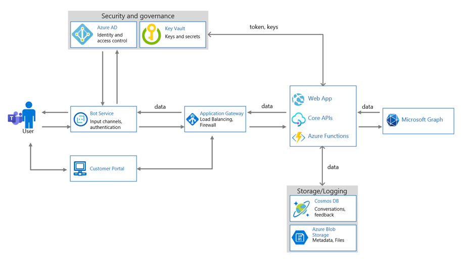

# Microsoft 365 Critification - Guide de soumission de document initial

La soumission initiale du document fait partie de la phase de pré-évaluation de la certification. Les informations fournies donnent aux analystes de certification l’arrière-plan nécessaire pour identifier les contrôles et les composants système qui seront dans l’étendue de votre évaluation. Ce document est destiné à servir uniquement d’exemple de ce qui est attendu de votre envoi initial de document. La documentation que vous fournissez varie en fonction de l’architecture, de l’implémenter et de la gestion de votre solution.

## Rapport de test de pénétration

Veuillez inclure le rapport de test de pénétration complète avec les dates qui indiquent qu’il a été terminé au cours des 12 derniers mois. 
-   Ce rapport doit être produit à partir de tests de pénétration manuels, il ne peut pas être la sortie d’un outil d’analyse/test automatisé.
-   Ce rapport doit inclure l’environnement qui prend en charge le déploiement de l’application/de l’ajout, ainsi que tout environnement supplémentaire qui prend en charge le fonctionnement de l’application/des compléments.

## Inventaire logiciel

Inventaire logiciel à jour qui inclut tous les logiciels utilisés dans l’environnement dans l’étendue, ainsi que les versions.

**Exemple :**

|Logiciels|  Éditeur|  Version|     Objectif|
|-|-|-|-|
|Windows Server|    Microsoft 2016 | Build 14393| Système d’exploitation serveur pour l’environnement de production|.
|Linux Ubuntu|  N/A|    16.04 (Xenial)| Système d’exploitation serveur utilisé dans la DMZ.|
|ESXi|  VMWare| 6.5.0 (Build 13004031)| Utilisé pour prendre en charge les serveurs virtuels.|
|Mysql (Windows)|   N/A|    8.0.2.1|    Serveur de base de données pour stocker l’historique des conversation.|
|Tomcat|        Apache| 7.0.92| Portail client.|
|Services Internet (IIS)|   Microsoft|  10.0|   Prend en charge les API.|

## Inventaire matériel

Inventaire matériel à jour utilisé par l’infrastructure de prise en charge. Cela sera utilisé pour faciliter l’échantillonnage lors de la phase d’évaluation. Si votre environnement inclut PaaS, il serait utile si vous pouvez fournir des détails sur tous les services PaaS consommés.

**Remarque :** IaaS/PaaS n’aurait pas de matériel qui serait sous le contrôle des isvs.  

**Exemple :**

|Nom de l’actif|    Type de bien| Description|    Fabricant|   Modèle|
|-|-|-|-|-|
|D212|  Windows  Ordinateur|   Virtual Machine|    N/A| N/A|
|LT101| Ordinateur portable| Station de travail|    Microsoft|  Surface 3|
|C2938| Commutateur| Commutateur|N/A|N/A|     
|LXM2|  Linux Machine|  Ordinateur de test|N/A|N/A|       

## Dépendances web

Documentation répertoriant toutes les dépendances utilisées par l’application/le add-in avec les versions en cours d’exécution.

**Exemple :**

|Dépendances web|  Version actuelle en cours d’utilisation|
|-|-|
|JQuery|    3.5.1|
|React| 16.13.1|
|Bootstrap| 4.5.2|
|Express|   4.17.1|
|Angle|   10.0.14|
|AngularJS| 1.8.0|

## Adresses IP publiques

Détails de toutes les adresses IP publiques et URL utilisées par l’infrastructure de prise en charge. Cela doit inclure la plage d’adresses IP routable complète allouée à l’environnement, sauf si une segmentation adéquate a été implémentée pour fractionner la plage en cours d’utilisation (une preuve adéquate de segmentation sera requise).

**Exemple :**

|URL|  Adresse IP|
|-|-|
|https://portal.contoso.com |40.113.200.201 |
|https://filesapi.contoso.com|  40.113.200.201|
|https://customerapi.contoso.com|   40.113.200.202|
|https://bot.contoso.com|   40.113.200.202|
|N/A (Jump Server)| 40.113.200.200|

## Points de terminaison des ressources

API Nom du point de terminaison Adresse du client Contoso API    https://customerapi.contoso.com Contoso Bot Service https://bot.contoso.com Contoso Files API   https://filesapi.contoso.com

Liste complète de tous les points de terminaison d’API utilisés par votre application, y compris les points de terminaison de ressources externes et développés en interne. Pour mieux comprendre l’étendue de l’environnement, fournissez des emplacements de point de terminaison d’API dans votre environnement.

**Exemple :**

|Nom de l’API|  Adresse du point de terminaison|
|-|-|
|API client Contoso|  https://customerapi.contoso.com|
|Contoso Bot Service|   https://bot.contoso.com|
|API de fichiers Contoso| https://filesapi.contoso.com|
|Microsoft Graph| https://graph.microsoft.com/v1.0/|

## Diagramme d’architecture

Diagramme d’architecture logique représentant une vue d’ensemble de l’infrastructure de prise en charge de votre application/de votre application. Cela doit inclure tous les environnements d’hébergement et l’infrastructure de prise en charge de l’application/du add-in. Ce diagramme DOIT décrire tous les différents composants système de prise en charge dans l’environnement pour aider les analystes de certification à comprendre les systèmes dans l’étendue et à déterminer l’échantillonnage. Indiquez également le type d’environnement d’hébergement utilisé . IsV hébergé, IaaS, PaaS ou hybride. Lorsque PaaS est utilisé, indiquez les différents services PaaS utilisés pour fournir les services de prise en charge dans l’environnement.

## Diagramme des Flow données

Flow diagrammes détaillés suivants :
-   Flux de données vers et à partir de l’application/du add-in (y compris les données client).
-   Flux de données dans l’infrastructure de prise en charge (le cas échéant)
-   Diagrammes mettant en évidence où et quelles données sont stockées, comment les données sont transmises à des tiers externes (notamment des détails sur les tiers) et comment les données sont protégées en transit sur des réseaux ouverts/publics et au repos.

