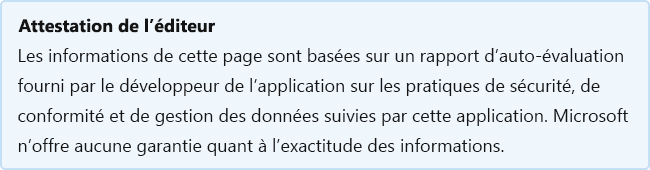

# Ajout starleaf pour OutlookStarLeaf add-in for Outlook

Dernière mise à jour par le développeur sur: Août 24, 2020Last updated by the developer on: August 24, 2020

* <a href="https://appsource.microsoft.com/product/office/WA104381343" target="_blank">Voir dans AppSource</a><a href="https://appsource.microsoft.com/product/office/WA104381343" target="_blank">View in AppSource</a>

::: zone pivot="general"

### Informations généralesGeneral information

Informations fournies par StarLeaf à Microsoft :Information provided by StarLeaf to Microsoft:

| **Information****Information** | **Réponse****Response** |
|:----------------|:-------------|
| Nom de l'applicationApp name | Ajout starleaf pour OutlookStarLeaf add-in for Outlook |
| IDID | WA104381343WA104381343 |
| Office 365 clients soutenusOffice 365 clients supported | Outlook 2013 ou plus tard sur Windows, Outlook 2016 ou plus tard sur Mac, Outlook sur le webOutlook 2013 or later on Windows, Outlook 2016 or later on Mac, Outlook on the web |
| Nom de l’entreprise partenairePartner company name | StarLeafStarLeaf |
| URL du site web partenaireURL of partner website | [https://www.starleaf.com/](https://www.starleaf.com/) |
| URL de la politique de confidentialitéURL of Privacy Policy | [https://www.starleaf.com/privacy-policy](https://www.starleaf.com/privacy-policy) |
| URL des conditions d’utilisationURL of Terms of Use | [ https://support.starleaf.com/legal-information/end-user-lic...https://support.starleaf.com/legal-information/end-user-lic...](https://support.starleaf.com/legal-information/end-user-license-agreement-for-starleaf-applications) |

 [!INCLUDE [Corrections or suggestions contact information](../includes/corrections-or-suggestions.md)]

::: zone-end

::: zone pivot="data"

### Comment l’application gère les donnéesHow the app handles data

Ces informations ont été fournies par StarLeaf sur la façon dont cette application recueille et stocke les données organisationnelles et le contrôle que votre organisation aura sur les données collectées par l’application.This information has been provided by StarLeaf about how this app collects and stores organizational data and the control that your organization will have over the data the app collects.

#### Accès aux données à l’aide de Microsoft GraphData access using Microsoft Graph

Énumérez [toutes les autorisations microsoft Graph que](https://docs.microsoft.com/graph/permissions-reference) cette application nécessite.List any [Microsoft Graph permissions](https://docs.microsoft.com/graph/permissions-reference) this app requires.

>| **Permission****Permission**  | **Type d’autorisation (Délégué/Demande)****Type of permission (Delegated/Application)** | **Les données sont-elles collectées? Justification pour le recueillir?****Is data collected? Justification for collecting it?** | **Les données sont-elles stockées ? Justification pour le stocker?****Is data stored? Justification for storing it?** | **Id d’application AD Azure****Azure AD App ID** |
>|:----------------|:--------------------|:---------------------------------------------------|:--------------------------|:--------------------------|
>| Calendars.ReadWriteCalendars.ReadWrite | applicationapplication | nous stockons l’iCalUId des réunions, l’heure/date de la réunion, les adresses e-mail des participants et une propriété étendue à valeur unique que nous lisons et écrivons sur la réunion en utilisant l’interface de propriétés personnalisées Office.js.we store the iCalUId of meetings, time/date of the meeting, attendee email addresses, and a Single-Value-Extended-Property that we read and write on the meeting using the Office.js custom properties interface. L’iCalUId est utilisé pour corréler la réunion dans le calendrier de perspectives d&#8217;utilisateur avec la réunion vidéo sur notre service.The iCalUId is used to correlate the meeting in a user&#8217;s outlook calendar with the video meeting on our service. L’heure/la date et les participants sont utilisés pour fournir une réunion vidéo au bon moment aux bonnes personnes sur notre service.The time/date and attendees are used to provide a video meeting at the right time to the right people on our service. SVEP sont habitués à notre addin O365 pour fournir une interface pour les utilisateurs de définir des détails sur la réunion vidéo sur notre service tels que l’enregistrement.SVEP are used to with our O365 addin to provide an interface for users to set details about the video meeting on our service such as recording. | utilisé pour s’abonner aux notifications webhook pour suivre les modifications apportées par les utilisateurs aux événements de leurs calendriers et mettre à jour notre service pour le garder cohérent.used to subscribe to webhook notifications to track user changes to events in their calendars and update our service to keep it consistent. Il est également utilisé pour créer des événements dans leur calendrier lorsqu’un utilisateur interagit avec notre application Teams et planifie une réunion sur notre service.It is also used to create events in their calendar when a user interacts with our Teams app and schedules a meeting on our service. | 6e86b349-768f-4953-ac2e-fb03f92db4be6e86b349-768f-4953-ac2e-fb03f92db4be |
>| User.ReadUser.Read | applicationapplication | nous stockons le jeton de rafraîchissement oauth pour être en mesure de se connecter.we store the oauth refresh token to be able to login. Nous stockons l’id de profil des utilisateurs pour être en mesure de comparer avec les tentatives futures OAuth de cet utilisateur et nous nous assurons que nous ne&#8217;pas stocker leurs coordonnées deux fois.We store the users profile id to be able to compare with future OAuth attempts from that user and ensure we don&#8217;t store their details twice.  | permettre aux utilisateurs de se connecter à l’application et permet à notre application d’obtenir l’adresse e-mail de l’utilisateur&#8217;de corréler leur connexion avec un compte sur notre service.allow users to sign into the app and allows our app to get the user&#8217;s email address to correlate their login with an account on our service.  | 6e86b349-768f-4953-ac2e-fb03f92db4be6e86b349-768f-4953-ac2e-fb03f92db4be |

#### Non-services Microsoft utiliséNon-Microsoft services used

Si l’application transfère ou partage des données organisationnelles avec un service non Microsoft, énumérez le service non Microsoft utilisé par l’application, quelles données sont transférées et justifiez pourquoi l’application doit transférer ces informations.If the app transfers or shares organizational data with non-Microsoft service, list the non-Microsoft service the app uses, what data is transferred, and include a justification for why the app needs to transfer this information.

>| **Tous les services Microsoft OII non services Microsoft sont transférés à****All non-Microsoft services OII is transferred to** |  **Quel OII est transféré?****What OII is transferred?** | **Justification du transfert d’OII?****Justification for transferring OII?** |
>|:-------------------|:--------------------------|:--------------------------|
>| Si des problèmes de support technique surviennent, les données organisationnelles peuvent être transférées à SalesForce pour la gestion de cas.If technical support issues arise then organisational data may be transferred to SalesForce for case management. Si l’utilisateur utilise la fonction de connexion PSTN, l’appel passe par Twilio, Plivo ou VoxboneIf the user makes use of the PSTN dial-in feature then the call will flow through Twilio, Plivo or Voxbone |  | N/AN/A |

#### Données de télémétrieTelemetry data

Des informations organisationnelles identifiables (OII) ou des informations identifiables de l’utilisateur final (EUII) apparaissent-elles dans la télémétrie ou les journaux de cette application ?Does any organizational identifiable information (OII) or end-user identifiable information (EUII) appear in this application's telemetry or logs? Si oui, décrivez quelles données sont stockées et quelles sont les stratégies de conservation et de suppression ?If yes, describe what data is stored and what are the retention and removal policies?

>Oui.Yes. Les journaux incluent les noms d’utilisateur, les adresses IP, les enregistrements de détails d’appel, les informations sur la qualité de connexion (perte de paquets, débit), le type d’appareil, les progrès des appels.Logs include usernames, IP addresses, call-detail-records, information about connection quality (packet loss, bitrate), device type, call progress. L’information est à la disposition de l’équipe de soutien technique et des développeurs principaux pour diagnostiquer les problèmes de service.The information is available to the technical support team and senior developers for diagnosing service issues. Les données sont anonymisées après 90 jours.The data is anonymised after 90 days. Les contrôles de protection de ces données sont vérifiés dans le cadre de notre certification ISO/IEC 27001.Controls to protect this data are audited under our ISO/IEC 27001 certification.

#### Contrôles organisationnels des données stockées par partenaireOrganizational controls for data stored by partner

Décrire comment les administrateurs de l’organisation peuvent contrôler leurs informations dans les systèmes partenaires ? par exemple la suppression, la conservation, la vérification, l’archivage, la politique de l’utilisateur final, etc.Describe how organization's administrators can control their information in partner systems? e.g. deletion, retention, auditing, archiving, end-user policy, etc.

>Les données sont stockées sur les serveurs journaux de StarLeaf&#8217;dans le centre de données dans lequel se trouve le compte de l’utilisateur&#8217;, et sauvegardées vers un ou plusieurs centres de données dans la même juridiction.The data is stored on StarLeaf&#8217;s own log servers in the data centre in which the user&#8217;s account is located, and backed up to one or more data centres within the same jurisdiction. L’accès aux données se fait par compte utilisateur individuel à l’aide de mots de passe par utilisateur qui sont vérifiés en force.Access to the data is by individual user account using per-user passwords which are strength-checked. Les comptes d&#8217;utilisateurs de service starLeaf sont vérifiés automatiquement par rapport aux systèmes RH et aux groupes d’annuaires actifs de l’entreprise pour alerter l’équipe sécurité et conformité en cas d’anomalies.StarLeaf&#8217;s service user accounts are audited automatically against the HR systems and the corporate Active Directory groups to alert the Security and Compliance team if anomalies are found.

#### Examen humain de l’information organisationnelleHuman review of organizational information

Les humains participent-ils à l’examen ou à l’analyse des données d’information organisationnelle identifiables (OII) qui sont recueillies ou stockées par cette application?Are humans involved in reviewing or analyzing any organizational identifiable information (OII) data that is collected or stored by this app?

>OuiYes

[!INCLUDE [Corrections or suggestions contact information](../includes/corrections-or-suggestions.md)]

::: zone-end

::: zone pivot="mcas"

Les informations du catalogue [Microsoft Cloud App Security apparaissent](https://www.microsoft.com/enterprise-mobility-security/cloud-app-security) ci-dessous.Information from the [Microsoft Cloud App Security](https://www.microsoft.com/enterprise-mobility-security/cloud-app-security) catalog appears below.

<iframe height='1020' title='Microsoft Cloud App Security informationMicrosoft Cloud App Security Information' src='https://appmcasinfoprod.azurewebsites.net/#/dashboard/35997' frameborder='no' style='width: 100%;'></iframe>

<a href="https://appmcasinfoprod.azurewebsites.net/#/dashboard/35997" target="_blank">Afficher dans un nouvel onglet</a>

<a href="https://appmcasinfoprod.azurewebsites.net/#/dashboard/35997" target="_blank">View in a new tab</a>

[!INCLUDE [Corrections or suggestions contact information](../includes/corrections-or-suggestions.md)]

::: zone-end

