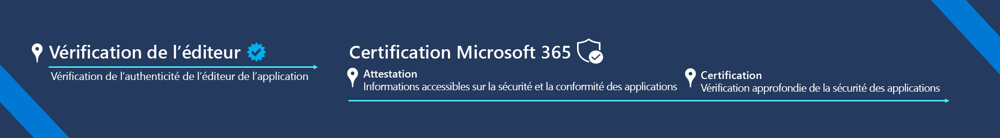

# Programme de conformité de l’application Microsoft 365

Le programme de conformité des applications Microsoft 365 est une approche en deux étapes de la sécurité et de la conformité des applications, qui inclut la vérification de l’éditeur et la certification Microsoft 365. Chaque niveau se crée sur le suivant, offrant un programme en couche pour offrir aux utilisateurs la confiance dont ils ont besoin lors de l’utilisation des applications de l’écosystème Microsoft 365.  

Notre mission : offrir aux clients Microsoft un moyen de faire entièrement confiance aux applications qui exécutent leurs organisations.

## Vérification de l’éditeur

La [Vérification de l’éditeur](/azure/active-directory/develop/publisher-verification-overview) permet aux administrateurs et aux utilisateurs de comprendre l’authenticité de l’application que les développeurs intègrent avec la plateforme d’identité Microsoft. Lorsqu’une application est marquée comme vérifiée par l’éditeur, cela signifie que celui-ci a vérifié son identité à l’aide d’un compte Microsoft Partner Network qui a effectué un processus de vérification et a associé ce compte Microsoft Partner Network à son inscription d’application.
La vérification de l’éditeur s’applique aux applications répondant aux conditions suivantes :  
- Utilisation d’OAuth 2.0 et d’OpenID Connect pour connecter les utilisateurs et demander un accès aux données à l’aide des API côté service telles que Microsoft Graph. 
- Inscription dans Azure AD en tant que multi-locataire.  

> [!IMPORTANT]
> La vérification de l’éditeur n’empêche pas un développeur d’applications de commencer ou achever une Attestation d’éditeur ou une Certification Microsoft 365. Si cela ne s’applique pas à l’application, la vérification peut être ignorée et l’attestation peut démarrer.

## Certification Microsoft 365
Le processus de certification Microsoft 365 comporte deux phases : **attestation** et **certification**.
1.  **attestation** implique de répondre à un questionnaire sur les attributs de sécurité, de gestion des données et de conformité d’une application qui sont les plus importants pour les clients. Toutes les informations sont ensuite publiées au même endroit et dans un format cohérent et facile à lire. L’objectif est d’accélérer le processus d’adoption des applications tout en garantissant aux clients que les applications qu’ils utilisent dans leurs locataires respectent les normes de leur organisation.
1.  La **certification** implique un audit approfondi d’une application par rapport à un ensemble de contrôles dérivés de frameworks standard de pointe. Les éditeurs de logiciels indépendants sont invités à fournir des preuves pour démontrer qu’ils respectent chaque contrôle avant d’obtenir une certification. L’objectif est de donner aux clients l’assurance qu’ils peuvent faire confiance à l’application que les applications qui ont reçu une certification Microsoft 365 ont des pratiques de sécurité et de conformité fortes pour protéger la sécurité et la confidentialité de leurs données.

La certification Microsoft 365 s'applique à toutes les applications qui s'intègrent aux produits Microsoft suivants :
-   Teams
-   Word
-   Excel
-   PowerPoint 
-   Outlook
- SharePoint
- Project
- OneNote
- **Webapps** (les applications SaaS publiées via la place de marché commerciale dans Espace partenaires sont actuellement en préversion privée, si vous souhaitez participer, veuillez remplir ce [formulaire](https://forms.microsoft.com/Pages/ResponsePage.aspx?id=v4j5cvGGr0GRqy180BHbR3Om82jEdWlAkFiVJRhmM_xUQkY0SjVVOVVLR0RUN0RYNlRWMDRTSjVQRy4u).

### Prise en main
- [Comment effectuer la vérification du serveur de publication](/azure/active-directory/develop/mark-app-as-publisher-verified)
- [Comment effectuer le](/microsoft-365-app-certification/docs/certification) de certification Microsoft 365

