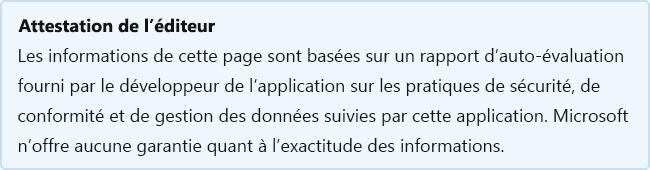

# RSpaceRSpace

Last updated by the developer on: December 16, 2019Last updated by the developer on: December 16, 2019

* <a href="https://teams.microsoft.com/l/app/f2cc0584-bb0c-448f-a175-2c9725f0bb87" target="_blank">Afficher dans Teams store</a><a href="https://teams.microsoft.com/l/app/f2cc0584-bb0c-448f-a175-2c9725f0bb87" target="_blank">View in Teams store</a>
* <a href="https://appsource.microsoft.com/product/office/WA104381671" target="_blank">Afficher dans AppSource</a><a href="https://appsource.microsoft.com/product/office/WA104381671" target="_blank">View in AppSource</a>

::: zone pivot="general"

### Informations généralesGeneral information

Informations fournies par ResearchSpace à Microsoft :Information provided by ResearchSpace to Microsoft:

| **Information****Information** | **Réponse****Response** |
|:----------------|:-------------|
| Nom de l'applicationApp name | RSpaceRSpace |
| IDID | WA104381671WA104381671 |
| Office 365 clients pris en chargeOffice 365 clients supported | Microsoft TeamsMicrosoft Teams |
| Nom de la société partenairePartner company name | ResearchSpaceResearchSpace |
| URL du site web partenaireURL of partner website | [https://www.researchspace.com](https://www.researchspace.com) |
| URL de la Teams d’informations sur l’applicationURL of Teams application info page | [ https://www.researchspace.com/enterprise/help-and-support-r...https://www.researchspace.com/enterprise/help-and-support-r...](https://www.researchspace.com/enterprise/help-and-support-resources-enterprise/) |
| URL de la politique de confidentialitéURL of Privacy Policy | [https://www.researchspace.com/terms-conditions/#privacy](https://www.researchspace.com/terms-conditions/#privacy) |
| URL des conditions d’utilisationURL of Terms of Use | [https://www.researchspace.com/terms-conditions](https://www.researchspace.com/terms-conditions) |

 [!INCLUDE [Corrections or suggestions contact information](../includes/corrections-or-suggestions.md)]

::: zone-end

::: zone pivot="data"

### Gestion des données par l’applicationHow the app handles data

Ces informations ont été fournies par ResearchSpace sur la façon dont cette application collecte et stocke les données organisationnelles et le contrôle que votre organisation aura sur les données collectées par l’application.This information has been provided by ResearchSpace about how this app collects and stores organizational data and the control that your organization will have over the data the app collects.

#### Accès aux données à l’aide de Microsoft GraphData access using Microsoft Graph

List any [Microsoft Graph permissions](https://docs.microsoft.com/graph/permissions-reference) this app requires.List any [Microsoft Graph permissions](https://docs.microsoft.com/graph/permissions-reference) this app requires.

>Cette application n’utilise pas Microsoft Graph.This application does not use Microsoft Graph.

#### Non utilisé services MicrosoftNon-Microsoft services used

Si l’application transfère ou partage des données organisationnelles avec un service non-Microsoft, indiquez le service non-Microsoft utilisé par l’application, quelles données sont transférées et incluez une justification pour la raison pour laquelle l’application doit transférer ces informations.If the app transfers or shares organizational data with non-Microsoft service, list the non-Microsoft service the app uses, what data is transferred, and include a justification for why the app needs to transfer this information.

>Les éléments services Microsoft ne sont pas utilisés.Non-Microsoft services are not used.

#### Accès aux données via des botsData access via bots

Si cette application contient un bot ou une extension de messagerie, elle peut accéder aux informations d’identification de l’utilisateur final (EUII) : la liste (prénom, nom, nom d’affichage, adresse e-mail) d’un membre d’une équipe ou d’une conversation à qui elle est ajoutée.If this app contains a bot or a messaging extension, it can access end-user identifiable information (EUII): the roster (first name, last name, display name, email address) of any team member in a team or chat it's added to. Cette application utilise-t-elle cette fonctionnalité ?Does this app make use of this capability?

>Aucun EUII n’est accessible.No EUII is accessed.

#### Données de télémétrieTelemetry data

Les informations d’identification organisationnelle (OII) ou d’identification de l’utilisateur final (EUII) apparaissent-elles dans la télémétrie ou les journaux de cette application ?Does any organizational identifiable information (OII) or end-user identifiable information (EUII) appear in this application's telemetry or logs? Si oui, décrivez quelles données sont stockées et quelles sont les stratégies de rétention et de suppression ?If yes, describe what data is stored and what are the retention and removal policies?

>Le nom d’utilisateur apparaît dans les journaux.Username appears in logs. L’accès aux journaux est limité au personnel nomméAccess to logs is restricted to named staff

#### Contrôles organisationnels pour les données stockées par le partenaireOrganizational controls for data stored by partner

Décrire comment les administrateurs de l’organisation peuvent contrôler leurs informations dans les systèmes partenaires ? par exemple, la suppression, la rétention, l’audit, l’archivage, la stratégie de l’utilisateur final, etc.Describe how organization's administrators can control their information in partner systems? e.g. deletion, retention, auditing, archiving, end-user policy, etc.

>Les administrateurs peuvent supprimer ou conserver des données selon leur bon sens et conformément aux stratégies de protection des données locales ou organisationnelles.Admins can delete or retain data as they see fit and in accordance with local or organisational data protection policies.

[!INCLUDE [Corrections or suggestions contact information](../includes/corrections-or-suggestions.md)]

::: zone-end

::: zone pivot="mcas"

Les informations du catalogue [de Microsoft Cloud App Security](https://www.microsoft.com/enterprise-mobility-security/cloud-app-security) apparaissent ci-dessous.Information from the [Microsoft Cloud App Security](https://www.microsoft.com/enterprise-mobility-security/cloud-app-security) catalog appears below.

<iframe height='1020' title='Microsoft Cloud App Security InformationsMicrosoft Cloud App Security Information' src='https://appmcasinfoprod.azurewebsites.net/#/dashboard/35671' frameborder='no' style='width: 100%;'></iframe>

<a href="https://appmcasinfoprod.azurewebsites.net/#/dashboard/35671" target="_blank">Afficher dans un nouvel onglet</a>

<a href="https://appmcasinfoprod.azurewebsites.net/#/dashboard/35671" target="_blank">View in a new tab</a>

[!INCLUDE [Corrections or suggestions contact information](../includes/corrections-or-suggestions.md)]

::: zone-end

